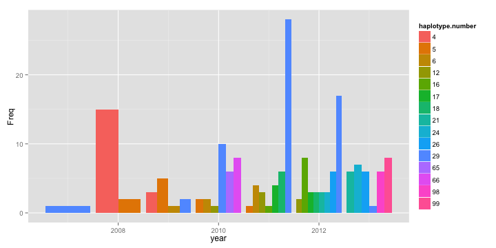
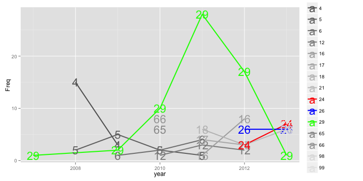
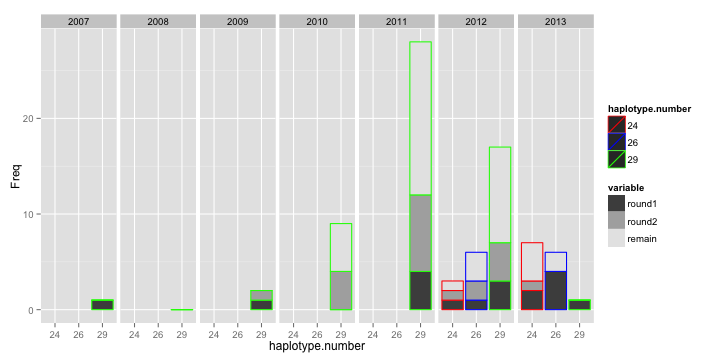

library(ggplot2)
library(reshape2)
library(knitr)

```r
opts_chunk$set(fig.width=10, fig.height=5)
opts_chunk$set(dev=c('png'))
```


```r
meta <- read.table("daniels.thies.CA.txt",sep="\t",header=T)
haployears <- table(meta[,c("haplotype.number","year")])
haployears <- as.data.frame(haployears)


hcounts <- aggregate(haployears$Freq,list(haployears$haplotype.number),FUN=sum)
multi <- hcounts$Group.1[hcounts$x > 5]
haplomulti <- haployears[haployears$haplotype.number %in% multi,]
haplomulti <- subset(haplomulti,Freq>0)
haplomulti$disco = haplomulti$haplotype.number %in% c(24,26,29)
haplomulti$year <- as.numeric(as.character(haplomulti$year))
```


```r
seq <- read.table("newSequencing.txt",sep="\t",header=T)
seq$remain <- seq$total - (seq$round1+seq$round2)
seq <- melt(seq,id.vars = c("haplotype.number","year","total"))
colnames(seq)[[5]] <- "Freq"
seq$haplotype.number <- factor(seq$haplotype.number)
seq <- subset(seq,variable != "total")
```


```r
ggplot(haplomulti,aes(x=year,y=Freq,group=haplotype.number,fill=haplotype.number)) + 
  geom_bar(stat="identity",position="dodge")
```

 

```r
cols <- gray.colors(length(unique(haplomulti$haplotype.number)))
names(cols) <- unique(haplomulti$haplotype.number)
cols[c("24","26","29")] <- c("red","blue","green")

ggplot(haplomulti,aes(x=year,y=Freq,group=haplotype.number,colour=haplotype.number,label=haplotype.number)) + 
  geom_line(size=1) + geom_text(size=8) + 
  scale_colour_manual(values = cols)
```

 

```r
round <- grey.colors(3)
names(round) <- c("round1","round2","remain")
ggplot(seq,aes(x=haplotype.number,y=Freq,group=variable,colour=haplotype.number)) + 
  geom_bar(stat="identity",position="stack",aes(fill=variable,group=haplotype.number)) + facet_grid(. ~ year) +
  scale_fill_manual(values=round) + scale_colour_manual(values=cols)
```

 
