library(ggplot2)
library(knitr)


```r
#150626 - indel stats, but no STR/mreps stats
#nuccfs <- read.table("pairwise_nucmer_discovar_cfs_150626.txt",sep="\t",stringsAsFactors = F)
#150629 - indel stats and STR/mreps stats
nuccfs <- read.table("pairwise_nucmer_discovar_cfs_150629.txt",sep="\t",stringsAsFactors = F)
colnames(nuccfs) <- c("prog","ref1","ref2","chr","pos","type","concordance","quality","length","alleles","complexity",
                      "STR","period","exponent","STRlength",
                      "STRcomplexity","Apc","Tpc","Cpc","Gpc" )
```


```r
nuccfs$polyA = (nuccfs$Apc==1 | nuccfs$Tpc==1)
nuccfs$TA = (nuccfs$Apc==0.5 & nuccfs$Tpc==0.5)
nuccfs$STRtype=""
nuccfs[nuccfs$TA,]$STRtype = "TA"
nuccfs[nuccfs$polyA,]$STRtype = "polyA"

nuccfs$set = "MATCH"
nuccfs[which(nuccfs$prog=="NUC" & nuccfs$concordance=="PRIVATE"),"set"] <- "TYPE2"
nuccfs[which(nuccfs$prog=="DISC" & nuccfs$concordance=="PRIVATE"),"set"] <- "TYPE1"
nuccfs[which(nuccfs$concordance=="MISMATCH"),"set"] <- "MISMATCH"
#remove nucmer matches to prevent double counting (leave discovar matches untouched)
nuccfs <- nuccfs[!(nuccfs$prog=="NUC" & nuccfs$concordance=="MATCH"),]

nuccfs$quality <- as.numeric(nuccfs$quality)
```

```
## Warning: NAs introduced by coercion
```

```r
#nuccfs[is.na(as.numeric(nuccfs$quality)),]
#REMOVE MISMATCHES (messy/infrequent)
nuccfs <- nuccfs[which(nuccfs$concordance!="MISMATCH"),]
```

#indel/snp based metrics
##discovar quality scores
Nb: type 2 errors (nucmer private) have no qual score

```r
 qscoreI <- ggplot(subset(nuccfs,type=="INDEL"),aes(y=quality,x=set, colour=set)) + 
            geom_boxplot() + facet_grid(ref1 ~ type + ref2)
 qscoreS <- ggplot(subset(nuccfs,type=="SNP"),aes(y=quality,x=set, colour=set)) + 
            geom_boxplot() + facet_grid(ref1 ~ type + ref2)
 qscoreI
```

```
## Warning in loop_apply(n, do.ply): Removed 3 rows containing non-finite
## values (stat_boxplot).
```

```
## Warning in loop_apply(n, do.ply): Removed 2 rows containing non-finite
## values (stat_boxplot).
```

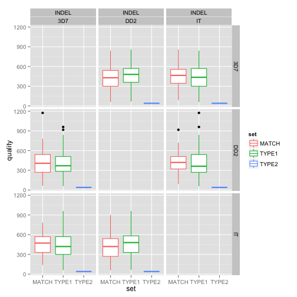 

```r
 qscoreS
```

```
## Warning in loop_apply(n, do.ply): Removed 16 rows containing non-finite
## values (stat_boxplot).
```

```
## Warning in loop_apply(n, do.ply): Removed 16 rows containing non-finite
## values (stat_boxplot).
```

```
## Warning in loop_apply(n, do.ply): Removed 7 rows containing non-finite
## values (stat_boxplot).
```

```
## Warning in loop_apply(n, do.ply): Removed 8 rows containing non-finite
## values (stat_boxplot).
```

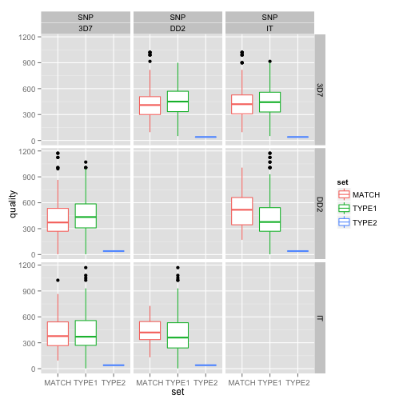 

#indel metrics
##length

```r
indel_length <- ggplot(subset(nuccfs,type=="INDEL"),aes(y=length,x=set, colour=quality)) + 
  geom_jitter() + facet_grid(ref1 ~ type + ref2) + geom_hline(y=50,linetype=2) + scale_y_log10()
indel_length
```

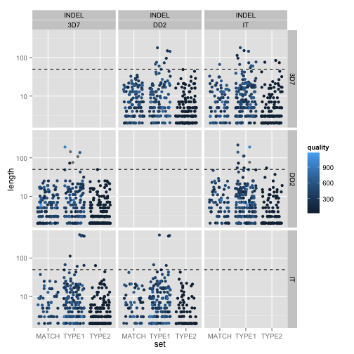 

```r
indel_lengthD <- ggplot(subset(nuccfs,type=="INDEL" & concordance != "MISMATCH"),aes(x=length,group=set, colour=set)) + 
  geom_density() + facet_grid(ref1 ~ type + ref2) + geom_vline(x=50,linetype=2) + scale_x_log10()
indel_lengthD
```

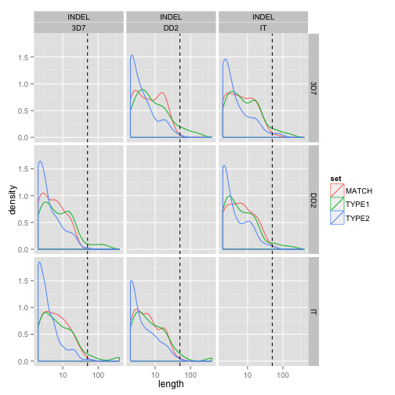 
###complexity
(ratio of string length to bz comp string length)

```r
indel_complexity <- ggplot(subset(nuccfs,type=="INDEL"),aes(y=complexity,x=set, colour=set)) + geom_boxplot() + facet_grid(ref1 ~ ref2) + scale_y_log10()
indel_complexityD <- ggplot(subset(nuccfs,(type=="INDEL" & concordance != "MISMATCH")),aes(x=complexity,group=set, colour=set)) + 
                      geom_density() + facet_grid(ref1 ~ ref2) + scale_x_log10()
indel_complexity
```

 

```r
indel_complexityD
```

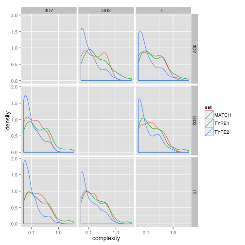 

###length v complexity

```r
indel_len_complex <- ggplot(subset(nuccfs,type=="INDEL"),aes(y=complexity,x=length, colour=set)) + geom_point() + 
  scale_y_log10() + scale_x_log10()
indel_len_complex
```

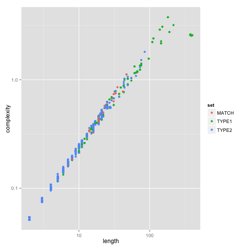 
###no of alleles

```r
alleles <- ggplot(subset(nuccfs,type=="INDEL"),aes(x=alleles,fill=concordance)) + geom_bar(binwidth=1) + facet_grid(ref1 ~ ref2)
alleles
```

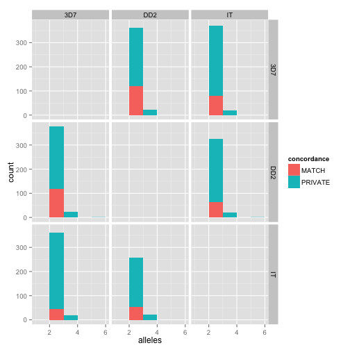 

#STR metrics
STR metrics derived from mreps calls on target genome (currently 3d7 only)
##whole length v repeat unit length

```r
strstats <- ggplot(subset(nuccfs,STR!="" & ref1 == "3D7"),aes(y=STRlength,x=period, colour=set)) + geom_point()  + facet_grid(set ~ ref2)
strstats
```

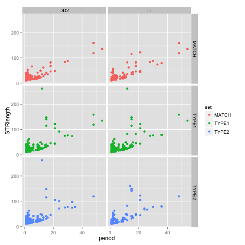 

##AT percentage
nb: Pf crosses show large predominance of indels in AT repeats (intergenic) + polyA repeats (coding)

```r
ATpc <- ggplot(subset(nuccfs,STR!="" & ref1 == "3D7"),aes(y=STRlength,x=Apc+Tpc, colour=polyA)) + geom_point()  + facet_grid(set ~ ref2)
ATpc
```

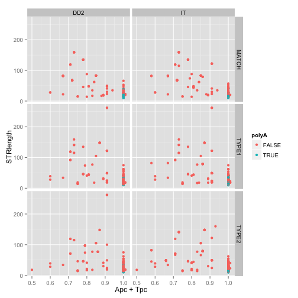 

##STR length v indel length

```r
len_len <- ggplot(subset(nuccfs,STR!="" & ref1 == "3D7"),aes(y=STRlength,x=length, colour=set)) + geom_point()  + facet_grid(set ~ ref2)+
  geom_abline(intercept=0,slope=1)
len_len
```

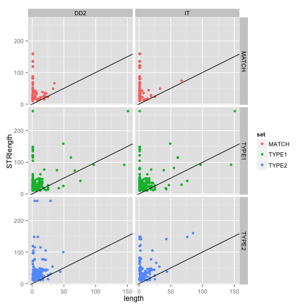 
###log scale: 
len_len + scale_y_log10() + scale_x_log10()

##STR period v indel length

```r
period_len <- ggplot(subset(nuccfs,type=="INDEL" & STR!="" & ref1 == "3D7"),aes(y=period,x=length, colour=set)) + geom_point()  + facet_grid(set ~ ref2) + 
   geom_abline(intercept=0,slope=1)
period_len; period_len + scale_y_log10() + scale_x_log10()
```

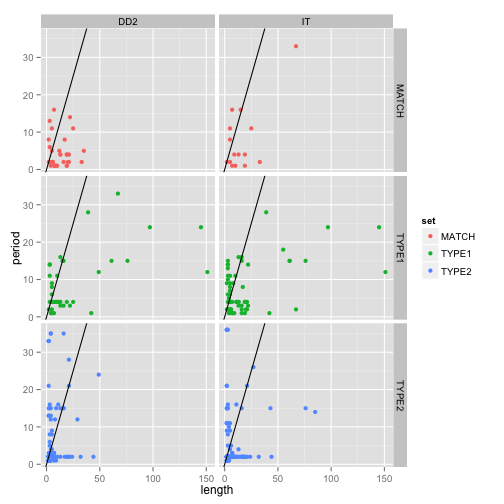 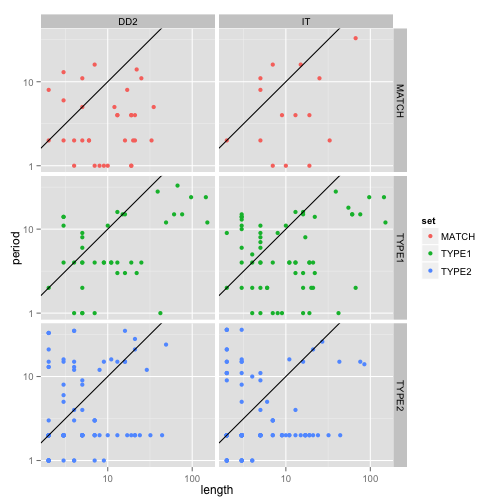 
###log scale


##remainder of period over indel length
(i.e. are indels predominantly one unit of repeat)

```r
period_lenrem <- ggplot(subset(nuccfs,type=="INDEL" & STR!="" & ref1 == "3D7"),aes(y=period,x=length %% period, colour=TA)) + 
    geom_point()  + facet_grid(set ~ ref2)
lenrem_hist <- ggplot(subset(nuccfs,type=="INDEL" & STR!="" & ref1 == "3D7"),aes(x=length %% period, fill=set)) + 
    geom_histogram(binwidth=1,colour="gray50")  + facet_grid(STRtype ~ ref2)
print(period_lenrem)
```

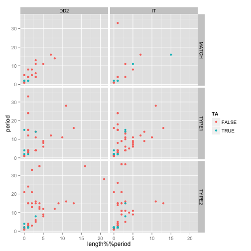 

```r
print(lenrem_hist)
```

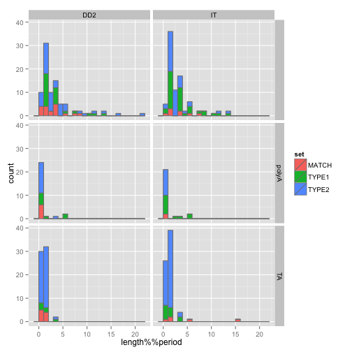 

##presence of STR vs call concordance

```r
hasSTR <- ggplot(subset(nuccfs,ref1 == "3D7"),aes(x=set, group=(STR!=''), fill=(STR!=''))) + geom_histogram()  + facet_grid(type ~ ref2,scales="free_y")
hasSTR
```

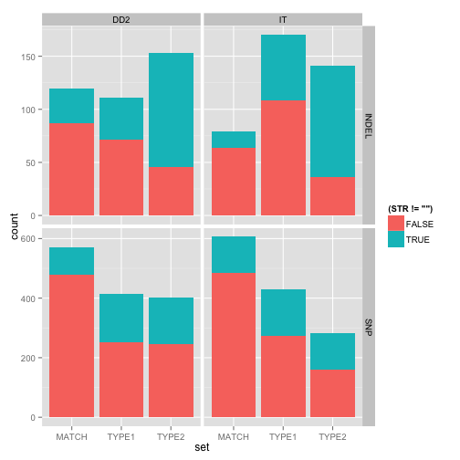 

##STR type (A/TA/complex) vs call concordance

```r
STRtype <- ggplot(subset(nuccfs,ref1 == "3D7" & STR!=''),aes(x=set, group=STRtype, fill=STRtype)) + geom_histogram()  + facet_grid(type ~ ref2,scales="free_y")
STRtype
```

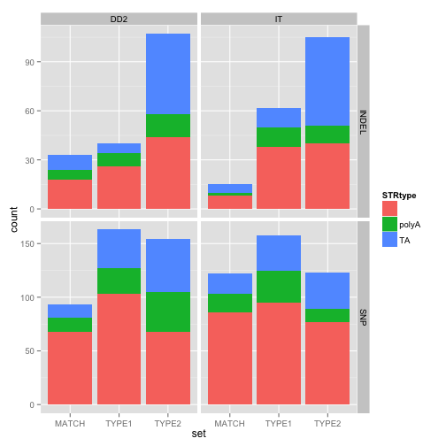 
