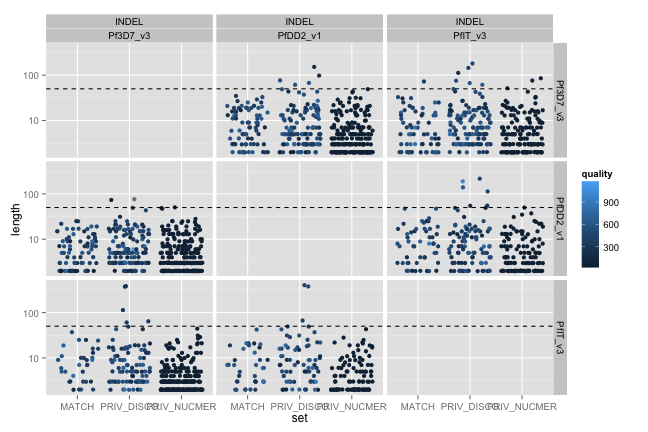
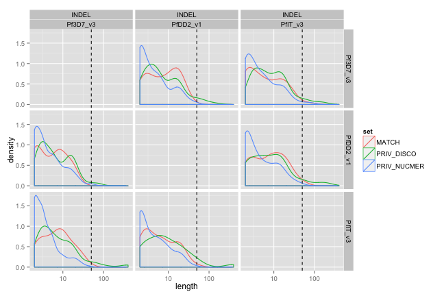
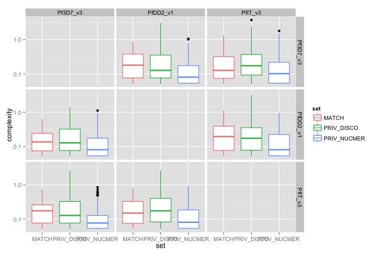
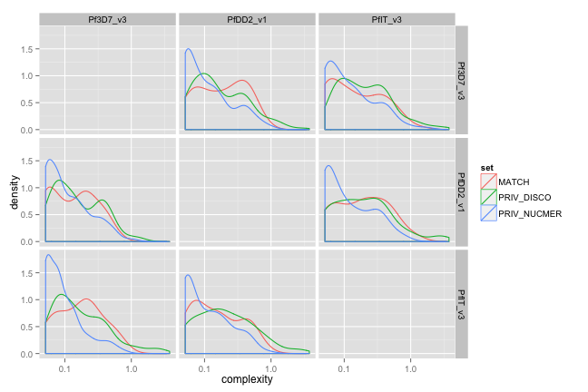
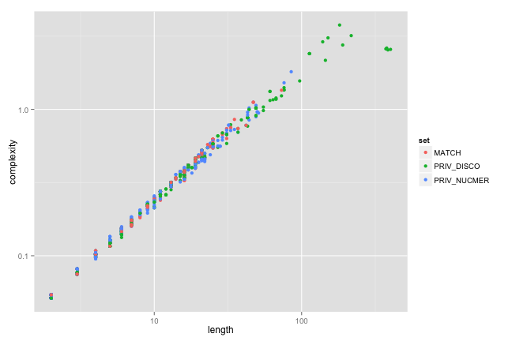
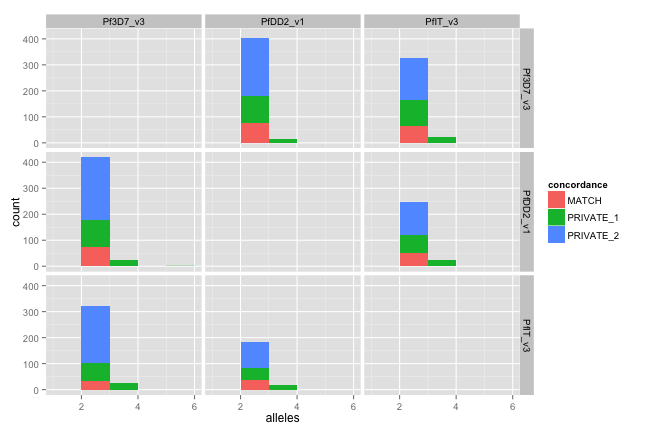

library(ggplot2)
library(knitr)

```r
opts_chunk$set(fig.width=9, fig.height=6)
```


```r
#150626 - indel stats, but no STR/mreps stats
#nuccfs <- read.table("pairwise_nucmer_discovar_cfs_150626.txt",sep="\t",stringsAsFactors = F)
#150629 - indel stats and STR/mreps stats
nuccfs <- read.table("cf.allNucmervDisco.150707.txt",sep="\t",stringsAsFactors = F)
colnames(nuccfs) <- c("ref1","ref2","chr","pos","type","concordance","quality","length","alleles","complexity",
                      "STR","period","exponent","STRlength",
                      "STRcomplexity","Apc","Tpc","Cpc","Gpc" )
```


```r
nuccfs$polyA = (nuccfs$Apc==1 | nuccfs$Tpc==1)
nuccfs$TA = (nuccfs$Apc==0.5 & nuccfs$Tpc==0.5)
nuccfs$STRtype=""
nuccfs[nuccfs$TA,]$STRtype = "TA"
nuccfs[nuccfs$polyA,]$STRtype = "polyA"

nuccfs$set = "MATCH"
nuccfs[which(nuccfs$concordance=="PRIVATE_1"),"set"] <- "PRIV_DISCO"
nuccfs[which(nuccfs$concordance=="PRIVATE_2"),"set"] <- "PRIV_NUCMER"
nuccfs[which(nuccfs$concordance=="MISMATCH"),"set"] <- "MISMATCH"
#remove nucmer matches to prevent double counting (leave discovar matches untouched)
#nuccfs <- nuccfs[!(nuccfs$prog=="NUC" & nuccfs$concordance=="MATCH"),]

nuccfs$quality <- as.numeric(nuccfs$quality)
```

```
## Warning: NAs introduced by coercion
```

```r
#nuccfs[is.na(as.numeric(nuccfs$quality)),]
#REMOVE MISMATCHES (messy/infrequent)
nuccfs <- nuccfs[which(nuccfs$concordance!="MISMATCH"),]
```

#indel metrics
##length

```r
indel_length <- ggplot(subset(nuccfs,type=="INDEL"),aes(y=length,x=set, colour=quality)) + 
  geom_jitter() + facet_grid(ref1 ~ type + ref2) + geom_hline(y=50,linetype=2) + scale_y_log10()
indel_length
```

 

```r
indel_lengthD <- ggplot(subset(nuccfs,type=="INDEL" & concordance != "MISMATCH"),aes(x=length,group=set, colour=set)) + 
  geom_density() + facet_grid(ref1 ~ type + ref2) + geom_vline(x=50,linetype=2) + scale_x_log10()
indel_lengthD
```

 
###complexity
(ratio of string length to bz comp string length)

```r
indel_complexity <- ggplot(subset(nuccfs,type=="INDEL"),aes(y=complexity,x=set, colour=set)) + geom_boxplot() + facet_grid(ref1 ~ ref2) + scale_y_log10()
indel_complexityD <- ggplot(subset(nuccfs,(type=="INDEL" & concordance != "MISMATCH")),aes(x=complexity,group=set, colour=set)) + 
                      geom_density() + facet_grid(ref1 ~ ref2) + scale_x_log10()
indel_complexity
```

 

```r
indel_complexityD
```

 

###length v complexity

```r
indel_len_complex <- ggplot(subset(nuccfs,type=="INDEL"),aes(y=complexity,x=length, colour=set)) + geom_point() + 
  scale_y_log10() + scale_x_log10()
indel_len_complex
```

 
###no of alleles

```r
alleles <- ggplot(subset(nuccfs,type=="INDEL"),aes(x=alleles,fill=concordance)) + geom_bar(binwidth=1) + facet_grid(ref1 ~ ref2)
alleles
```

 

