library(ggplot2)
library(knitr)

```r
opts_chunk$set(fig.width=9, fig.height=6)
```


```r
#150626 - indel stats, but no STR/mreps stats
#nuccfs <- read.table("pairwise_nucmer_discovar_cfs_150626.txt",sep="\t",stringsAsFactors = F)
#150629 - indel stats and STR/mreps stats
nuccfs <- read.table("cfNucmerDiscoHaplo_150714.txt",sep="\t",stringsAsFactors = F)
colnames(nuccfs) <- c("file","chr","pos","type","concordance","matched","quality","length","alleles","complexity",
                      "STR","period","exponent","STRlength",
                      "STRcomplexity","Apc","Tpc","Cpc","Gpc" )
matchlevels <- c("","NUCMER","DISCO","HAPLO","NUCMER,DISCO","NUCMER,HAPLO","DISCO,HAPLO","NUCMER,DISCO,HAPLO")
nuccfs$matched <- factor(nuccfs$matched,levels = matchlevels)
```


```r
nuccfs$polyA = (nuccfs$Apc==1 | nuccfs$Tpc==1)
nuccfs$TA = (nuccfs$Apc==0.5 & nuccfs$Tpc==0.5)
nuccfs$STRtype=""
nuccfs[nuccfs$TA,]$STRtype = "TA"
nuccfs[nuccfs$polyA,]$STRtype = "polyA"

#remove nucmer matches to prevent double counting (leave discovar matches untouched)
#nuccfs <- nuccfs[!(nuccfs$prog=="NUC" & nuccfs$concordance=="MATCH"),]

nuccfs$quality <- as.numeric(nuccfs$quality)
#nuccfs[is.na(as.numeric(nuccfs$quality)),]
#REMOVE MISMATCHES (messy/infrequent)
nuccfs <- nuccfs[which(nuccfs$concordance!="MISMATCH"),]
```


```r
cfhaplo <- nuccfs[grep("HAPLO", nuccfs$matched),]
cfhaplo$prog="HAPLO"
cfdisco <- nuccfs[grep("DISCO", nuccfs$matched),]
cfdisco$prog="DISCO"
cfnucmer <- nuccfs[grep("NUCMER", nuccfs$matched),]
cfnucmer$prog="NUCMER"
nuccfs_ind <- rbind(cfhaplo,cfdisco,cfnucmer)
```

#STR metrics
STR metrics derived from mreps calls on target genome (currently 3d7 only)
##whole length v repeat unit length

```r
strstats <- ggplot(subset(nuccfs_ind,STR!="NULL" & concordance !="MATCH0"),aes(y=STRlength,x=period, colour=matched)) + geom_point()  + facet_grid(prog ~ .)
strstats
```

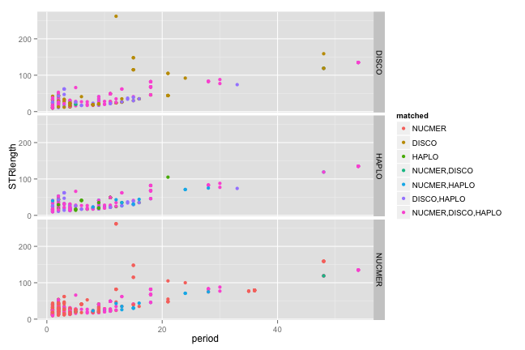 

##AT percentage
nb: Pf crosses show large predominance of indels in AT repeats (intergenic) + polyA repeats (coding)

```r
ATpc <- ggplot(subset(nuccfs_ind,STR!="NULL" & concordance !="MATCH0" ),aes(y=STRlength,x=Apc+Tpc, colour=STRtype)) + geom_point()  + facet_grid(prog ~ .)
ATpc
```

 

##STR length v indel length

```r
len_len <- ggplot(subset(nuccfs_ind,STR!="NULL" & type=="INDEL"),aes(y=STRlength,x=length, colour=matched)) + geom_point()  + facet_grid(concordance ~ prog)+
  geom_abline(intercept=0,slope=1)
len_len
```

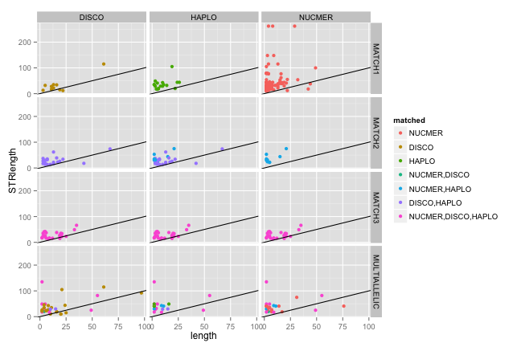 
###log scale: 

```r
len_len + scale_y_log10() + scale_x_log10()
```

 

##STR period v indel length

```r
period_len <- ggplot(subset(nuccfs,type=="INDEL" & STR!="NULL" & ref1 == "Pf3D7_v3"),aes(y=period,x=length, colour=set)) + geom_point()  + facet_grid(set ~ ref2) + 
   geom_abline(intercept=0,slope=1)
```

```
## Error in eval(expr, envir, enclos): object 'ref1' not found
```

```r
period_len; period_len + scale_y_log10() + scale_x_log10()
```

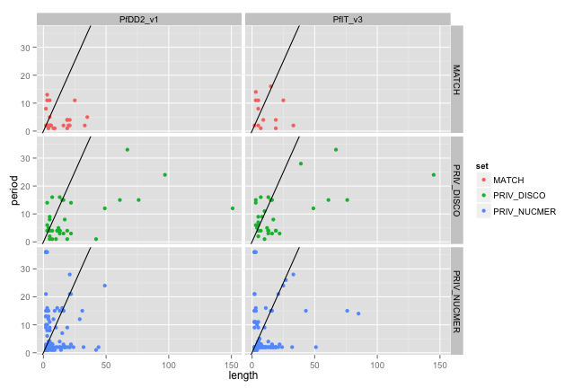 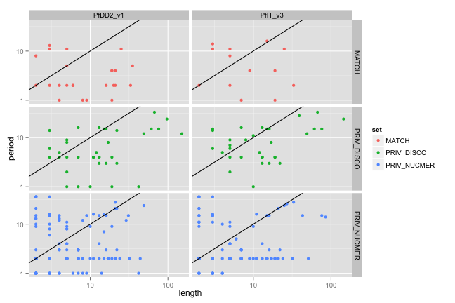 
###log scale


##remainder of period over indel length
(i.e. are indels predominantly one unit of repeat)

```r
period_lenrem <- ggplot(subset(nuccfs,type=="INDEL" & STR!="NULL" & ref1 == "Pf3D7_v3"),aes(y=period,x=length %% period, colour=TA)) + 
    geom_point()  + facet_grid(set ~ ref2)
```

```
## Error in eval(expr, envir, enclos): object 'ref1' not found
```

```r
lenrem_hist <- ggplot(subset(nuccfs,type=="INDEL" & STR!="NULL" & ref1 == "Pf3D7_v3"),aes(x=length %% period, fill=set)) + 
    geom_histogram(binwidth=1,colour="gray50")  + facet_grid(STRtype ~ ref2)
```

```
## Error in eval(expr, envir, enclos): object 'ref1' not found
```

```r
print(period_lenrem)
```

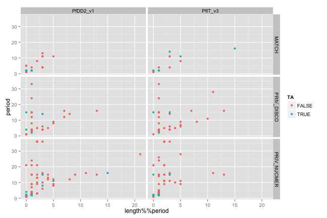 

```r
print(lenrem_hist)
```

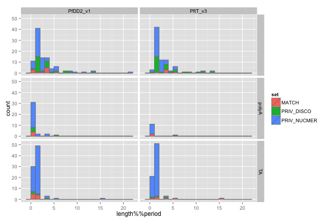 

##presence of STR vs call concordance

```r
hasSTR <- ggplot(subset(nuccfs,ref1 == "Pf3D7_v3" & concordance !="MATCH0"),aes(x=set, group=(STR!="NULL"), fill=(STR!="NULL"))) + geom_histogram()  + facet_grid(type ~ ref2,scales="free_y")
```

```
## Error in eval(expr, envir, enclos): object 'ref1' not found
```

```r
hasSTR
```

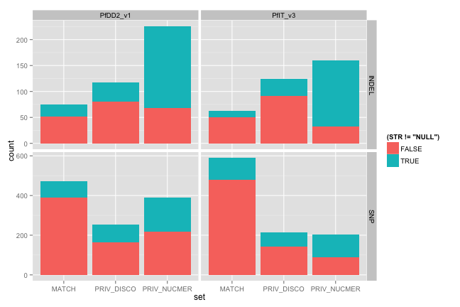 

##STR type (A/TA/complex) vs call concordance

```r
STRtype <- ggplot(subset(nuccfs_ind,STR!="NULL" & concordance !="MATCH0"),aes(x=matched, group=STRtype, fill=STRtype)) + geom_histogram()  + facet_grid(type ~ .,scales="free_y") + theme(axis.text.x = element_text(angle = 90, hjust = 1))
STRtype
```

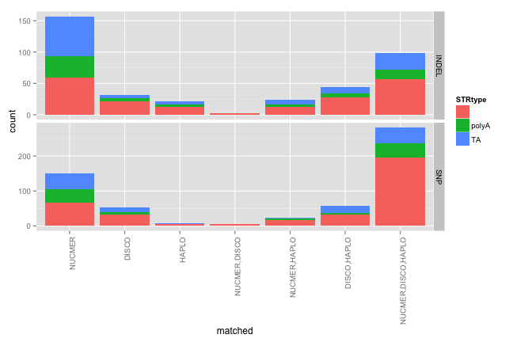 

##STR type (A/TA/complex) vs call concordance vs posn

```r
posConcSTR <- ggplot(subset(nuccfs,STR!="NULL"),aes(x=pos, group=matched, fill=matched)) + geom_histogram(binwidth=10000)  + facet_grid(STRtype ~ .,scales="free_y")
posConcSTR
```

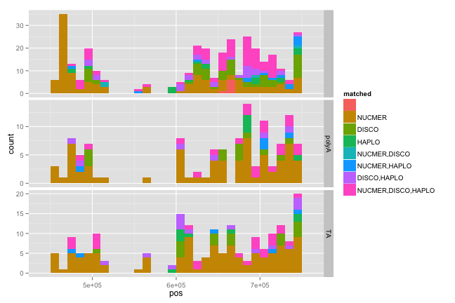 

```r
posConc <- ggplot(subset(nuccfs,STR!="NULL"),aes(x=pos, group=matched, fill=matched)) + geom_histogram(binwidth=10000)
posConc
```

 

```r
posConcSTR <- ggplot(subset(nuccfs,STR!="NULL"),aes(x=pos, group=STRtype, fill=STRtype)) + geom_histogram(binwidth=10000)  + facet_grid(matched ~ .,scales="free_y")
posConcSTR
```

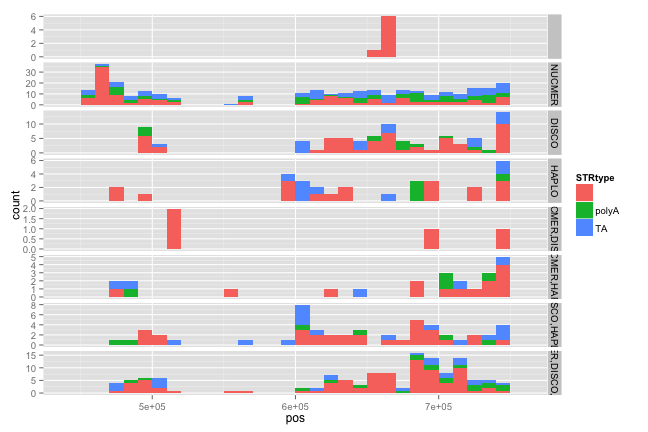 

##CONCORDANCE: all samples

```r
ctable <- as.data.frame(table(subset(nuccfs,concordance != "MATCH0",c(matched,type))))
ctable$x <- c(0,1,2,3,1,1,2,4)
ctable$y <- c(0,1,2,3,2,3,3,4)
ctable$x <- factor(ctable$x,labels=c("none","NUCMER","DISCO","HAPLO","ALL"))
ctable$y <- factor(ctable$y,labels=c("none","NUCMER","DISCO","HAPLO","ALL"))
ggplot(subset(ctable,x!="none"),aes(x,y,fill=Freq)) + geom_tile() + scale_fill_gradient(low="white",high="red") +
  facet_grid(type ~ .)
```

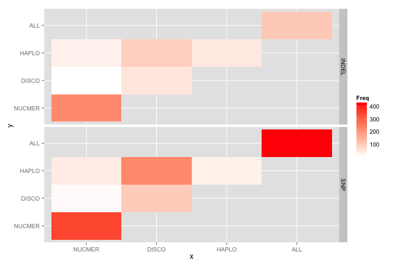 


```r
ctable <- as.data.frame(table(subset(nuccfs,concordance != "MATCH0",c(matched,type,STRtype))))
ctable$x <- c(0,1,2,3,1,1,2,4)
ctable$y <- c(0,1,2,3,2,3,3,4)
ctable$x <- factor(ctable$x,labels=c("none","NUCMER","DISCO","HAPLO","ALL"))
ctable$y <- factor(ctable$y,labels=c("none","NUCMER","DISCO","HAPLO","ALL"))
ggplot(subset(ctable,x!="none"),aes(x,y,fill=Freq)) + geom_tile() + scale_fill_gradient(low="white",high="red") +
  facet_grid(type ~ STRtype)
```

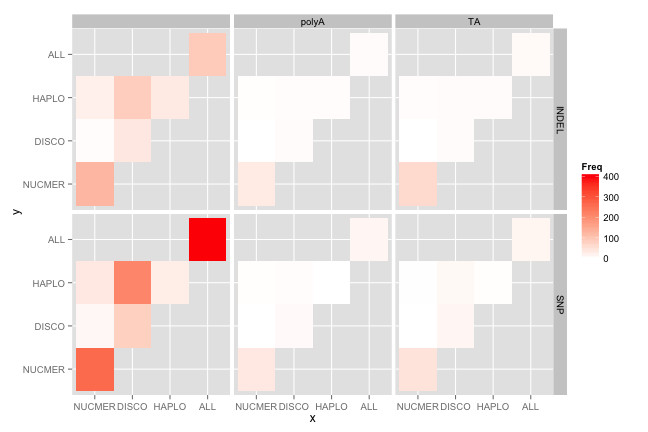 

```r
ggplot(subset(ctable,matched != "" & STRtype %in% c("polyA","TA")),aes(x,y,fill=Freq)) + geom_tile() + scale_fill_gradient(low="white",high="red") +
  facet_grid(type ~ STRtype)
```

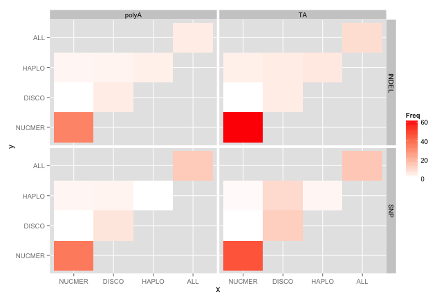 
