library(ggplot2)
library(knitr)

```r
#opts_chunk$set(fig.width=9, fig.height=6)
opts_chunk$set(fig.width=9, fig.height=4.5)
```

#depth vs snp rates vs call rates

```r
values <- read.table("cfNucmerDiscoHaplo_150714.DEPTH.txt",stringsAsFactors = F,sep='\t',header=T)
# colnames(values) <- c("chrom","start","end",
#                       "covered1","covered2","covered3",
#                       "d1",  "d2",	"d3",	
#                       "dcov1",  "dcov2",	"dcov3",
#                       "SNPS",	"Smatch0",	"Smatch1",	"Spriv",	
#                       "INDELS",	"Imatch",	"Imiss",	"Ipriv")
values$block <- values$end - ((values$end-values$start)/2)
values$meandepth <- (values$d2+values$d3)/2
```

##alignment depth v 3D7

```r
depths <- values[,c("chrom","block","d1","d2","d3")]
colnames(depths) <- c("chrom","block","3D7","DD2","IT")
depths <- melt(depths,id.vars =c("chrom","block"))

depthplot <- ggplot(depths,aes(x=block,y=value,colour=variable,group=variable)) + geom_line()+
  ylab("depth")+xlab("pos")
depthplot
```

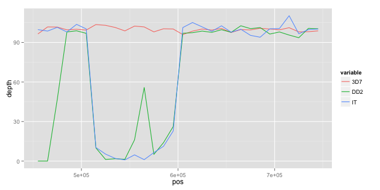 

##INDEL counts & concordance w. nucmer

```r
indelcounts <- values[,c("chrom","block","INDELS", "I.MATCH1","I.MATCH2","I.MATCH3","I.MULTIALLELIC","I.MATCH0")]
indelcounts <- melt(indelcounts,id.vars =c("chrom","block","INDELS"))
indelcounts <- droplevels(indelcounts)
ggplot(indelcounts,aes(x=block,y=value*INDELS,group=block,fill=variable)) + geom_bar(stat="identity")
```

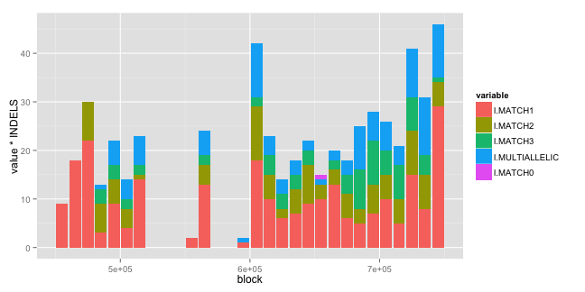 

```r
indelplot <- ggplot(indelcounts,aes(x=block,y=value,group=block,fill=variable)) + geom_bar(stat="identity") + ylab("indel concordance")
indelplot
```

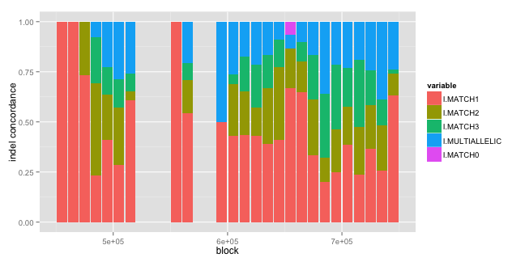 

##SNP counts & concordance w. nucmer

```r
snpcounts <- values[,c("chrom","block","SNPS",  "S.MATCH1","S.MATCH2","S.MATCH3","S.MULTIALLELIC","S.MATCH0")]
snpcounts <- melt(snpcounts,id.vars =c("chrom","block","SNPS"))
snpcounts <- droplevels(snpcounts)
ggplot(snpcounts,aes(x=block,y=value*SNPS,group=block,fill=variable)) + geom_bar(stat="identity")
```

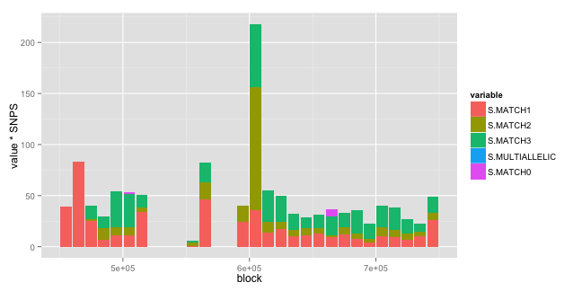 

```r
snpplot <- ggplot(snpcounts,aes(x=block,y=value,group=block,fill=variable)) + geom_bar(stat="identity") + ylab("snp concordance")
snpplot
```

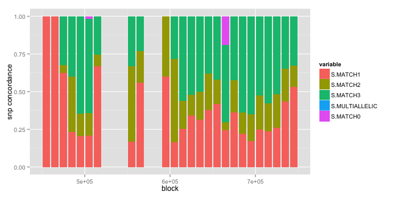 

##SNP counts & concordance w. nucmer

```r
snpcounts <- values[,c("chrom","block","SNPS",  "S.NUCMER","S.HAPLO","S.DISCO",
                      "S.NUCMER.DISCO","S.NUCMER.HAPLO","S.DISCO.HAPLO",
                      "S.NUCMER.DISCO.HAPLO")]
snpcounts$S.NUCMER.GRAPH <- snpcounts$S.NUCMER.DISCO + snpcounts$S.NUCMER.HAPLO

snpcounts <- melt(snpcounts,id.vars =c("chrom","block","SNPS"))
snpcounts <- snpcounts[snpcounts$variable %in% c("S.NUCMER","S.HAPLO","S.DISCO","S.NUCMER.GRAPH","S.DISCO.HAPLO","S.NUCMER.DISCO.HAPLO"),]
snpcounts <- droplevels(snpcounts)
ggplot(snpcounts,aes(x=block,y=value*SNPS,group=block,fill=variable)) + geom_bar(stat="identity")
```

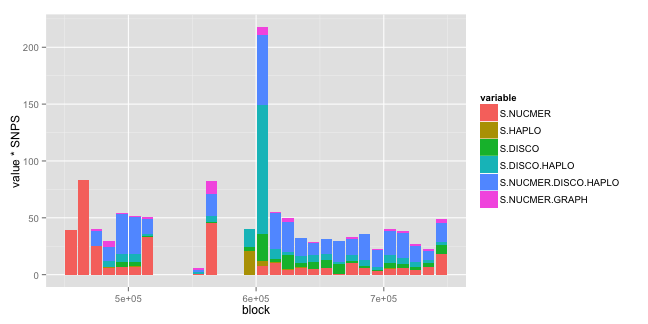 

```r
snpplot <- ggplot(snpcounts,aes(x=block,y=value,group=block,fill=variable)) + geom_bar(stat="identity") + ylab("snp concordance")
snpplot
```

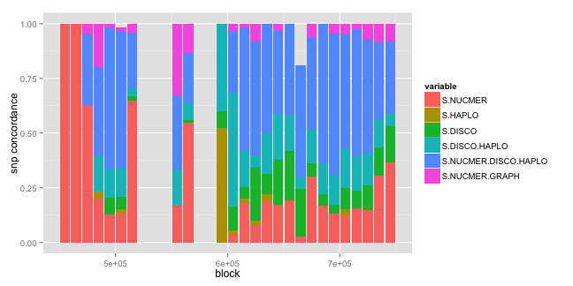 

##INDEL counts & concordance w. nucmer

```r
indelcounts <- values[,c("chrom","block","INDELS",  "I.NUCMER","I.HAPLO","I.DISCO",
                       "I.NUCMER.DISCO","I.NUCMER.HAPLO","I.DISCO.HAPLO",
                       "I.NUCMER.DISCO.HAPLO")]
indelcounts$I.NUCMER.GRAPH <- indelcounts$I.NUCMER.DISCO + indelcounts$I.NUCMER.HAPLO

indelcounts <- melt(indelcounts,id.vars =c("chrom","block","INDELS"))
indelcounts <- indelcounts[indelcounts$variable %in% c("I.NUCMER","I.HAPLO","I.DISCO","I.NUCMER.GRAPH","I.DISCO.HAPLO","I.NUCMER.DISCO.HAPLO"),]
indelcounts <- droplevels(indelcounts)
ggplot(indelcounts,aes(x=block,y=value*INDELS,group=block,fill=variable)) + geom_bar(stat="identity")
```

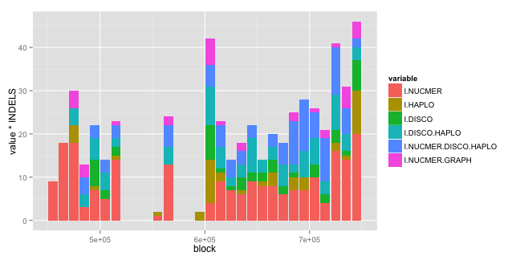 

```r
indelplot <- ggplot(indelcounts,aes(x=block,y=value,group=block,fill=variable)) + geom_bar(stat="identity") + ylab("indel concordance")
indelplot
```

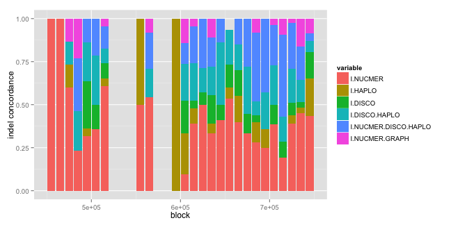 


```r
#tracks(depthplot,indelplot,snpplot)
```

##matched indel proportions, SNPs v INDELs

```r
varcf <- values[,c("chrom","block","meandepth","SNPS",  "INDELS","S.MATCH3",  "I.MATCH3")]
ggplot(varcf,aes(x=meandepth,y=S.MATCH3,colour=I.MATCH3)) + geom_point()
```

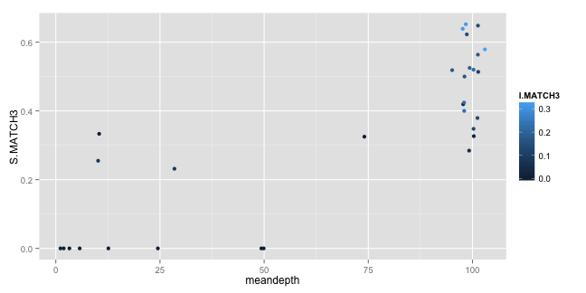 

```r
ggplot(varcf,aes(x=meandepth,y=I.MATCH3,colour=S.MATCH3)) + geom_point()
```

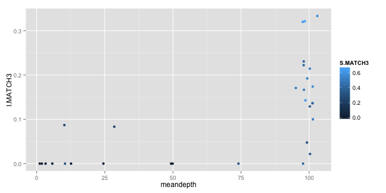 

```r
#ggplot(varcf,aes(x=Smatch*SNPS,y=Imatch*INDELS,colour=meandepth)) + geom_point()
```
