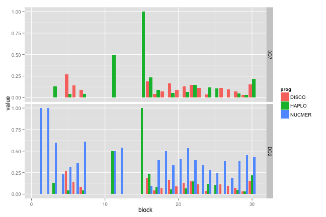
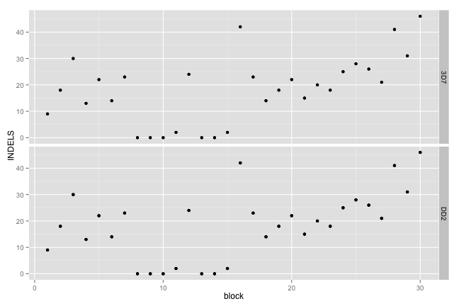
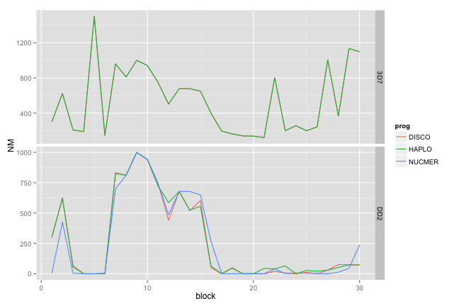
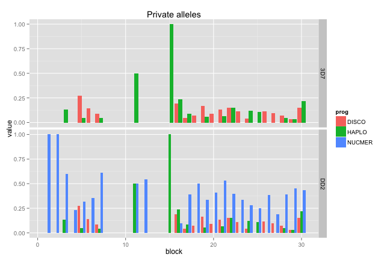
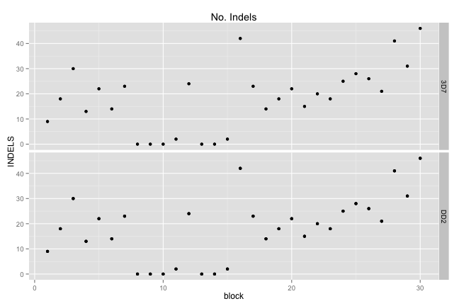
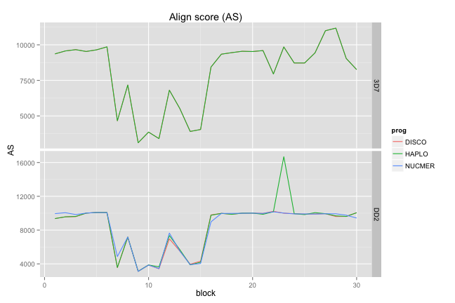
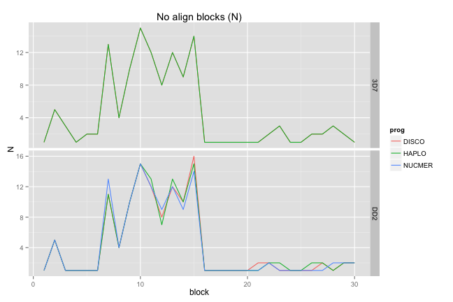
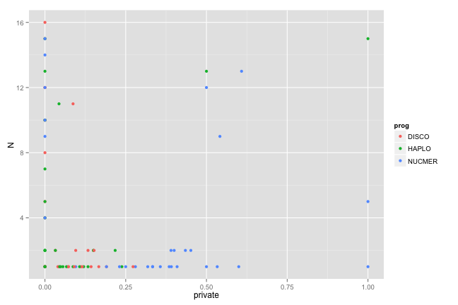
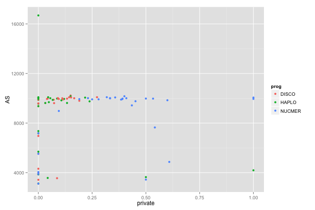
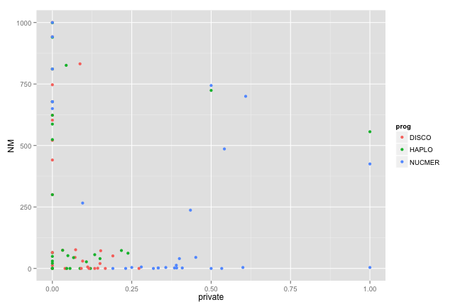

library(ggplot2)
library(knitr)

```r
opts_chunk$set(fig.width=9, fig.height=6)
```


```r
depths <- read.table("cfNucmerDiscoHaplo_150714.DEPTH.txt",stringsAsFactors = F,sep='\t',header=T)
# colnames(values) <- c("chrom","start","end",
#                       "covered1","covered2","covered3",
#                       "d1",  "d2",  "d3",	
#                       "dcov1",  "dcov2",	"dcov3",
#                       "SNPS",	"Smatch0",	"Smatch1",	"Spriv",	
#                       "INDELS",	"Imatch",	"Imiss",	"Ipriv")
depths$block <- values$end - ((values$end-values$start)/2)
```

```
## Error in `$<-.data.frame`(`*tmp*`, "block", value = c(452500, 457500, : replacement has 60 rows, data has 30
```

```r
depths$meandepth <- (values$d2+values$d3)/2
```

```
## Error in `$<-.data.frame`(`*tmp*`, "meandepth", value = c(49.0369, 50.736, : replacement has 60 rows, data has 30
```

```r
depths$block <- c(1:30) #nb, 10kb blocks
```


```r
discoDD2 <- read.table("disco_qDD2vr3D7.txt",sep="\t",stringsAsFactors = F,header=T)
discoDD2$prog="DISCO"
discoDD2$q="DD2"
disco3D7 <- read.table("disco_q3D7vr3D7.txt",sep="\t",stringsAsFactors = F,header=T)
disco3D7$prog="DISCO"
disco3D7$q="3D7"
haploDD2 <- read.table("haplo_qDD2vr3D7.txt",sep="\t",stringsAsFactors = F,header=T)
haploDD2$prog="HAPLO"
haploDD2$q="DD2"
haplo3D7 <- read.table("haplo_q3D7vr3D7.txt",sep="\t",stringsAsFactors = F,header=T)
haplo3D7$prog="HAPLO"
haplo3D7$q="3D7"
nucmerDD2 <- read.table("nucmer_qDD2vr3D7.txt",sep="\t",stringsAsFactors = F,header=T)
nucmerDD2$prog="NUCMER"
nucmerDD2$q="DD2"

realigns <- rbind(discoDD2,disco3D7,haploDD2,haplo3D7,nucmerDD2)
```

#NM vs no. private alleles

```r
d.n <- depths[,c("block","chrom","start","end","I.NUCMER","INDELS")]
d.n$prog="NUCMER"
d.d <- depths[,c("block","chrom","start","end","I.DISCO","INDELS")]
d.d$prog="DISCO"
d.h <- depths[,c("block","chrom","start","end","I.HAPLO","INDELS")]
d.h$prog="HAPLO"
colnames(d.n)[[5]] <- "private"
colnames(d.d)[[5]] <- "private"
colnames(d.h)[[5]] <- "private"


nmdepth <- merge(realigns[,c("block","NM.PfDD2_v1","prog","q")],
                rbind(d.n,d.d,d.h))
#                 depths[,c("block","chrom","start","end","I.HAPLO","I.DISCO","I.NUCMER")])
colnames(nmdepth)[3]<-"NM"
nmpriv <- melt(nmdepth,id.vars = c("block","prog","q","chrom","start","end","NM","INDELS"))

ggplot(nmpriv,aes(x=block,y=value,group=prog,fill=prog)) + geom_bar(stat="identity",position="dodge") + 
  facet_grid(q ~ .,scale="free_y")
```

 

```r
ggplot(nmpriv,aes(x=block,y=INDELS)) + geom_point() + facet_grid(q ~ .,scale="free_y")
```

 

```r
ggplot(nmdepth,aes(x=block,y=NM,group=prog,colour=prog)) + geom_line() + facet_grid(q ~ .,scale="free_y")
```

 

#AS vs no. private alleles

```r
d.n <- depths[,c("block","chrom","start","end","I.NUCMER","INDELS")]
d.n$prog="NUCMER"
d.d <- depths[,c("block","chrom","start","end","I.DISCO","INDELS")]
d.d$prog="DISCO"
d.h <- depths[,c("block","chrom","start","end","I.HAPLO","INDELS")]
d.h$prog="HAPLO"
colnames(d.n)[[5]] <- "private"
colnames(d.d)[[5]] <- "private"
colnames(d.h)[[5]] <- "private"


asdepth <- merge(realigns[,c("block","AS.PfDD2_v1","prog","q")],
                rbind(d.n,d.d,d.h))
#                 depths[,c("block","chrom","start","end","I.HAPLO","I.DISCO","I.NUCMER")])
colnames(asdepth)[3]<-"AS"
aspriv <- melt(nmdepth,id.vars = c("block","prog","q","chrom","start","end","NM","INDELS"))

ggplot(aspriv,aes(x=block,y=value,group=prog,fill=prog)) + geom_bar(stat="identity",position="dodge") + 
  facet_grid(q ~ .,scale="free_y") +ggtitle("Private alleles")
```

 

```r
ggplot(aspriv,aes(x=block,y=INDELS)) + geom_point() + facet_grid(q ~ .,scale="free_y")  +ggtitle("No. Indels")
```

 

```r
ggplot(asdepth,aes(x=block,y=AS,group=prog,colour=prog)) + geom_line() + facet_grid(q ~ .,scale="free_y")  +ggtitle("Align score (AS)")
```

 

#N vs no. private alleles

```r
d.n <- depths[,c("block","chrom","start","end","I.NUCMER","INDELS")]
d.n$prog="NUCMER"
d.d <- depths[,c("block","chrom","start","end","I.DISCO","INDELS")]
d.d$prog="DISCO"
d.h <- depths[,c("block","chrom","start","end","I.HAPLO","INDELS")]
d.h$prog="HAPLO"
colnames(d.n)[[5]] <- "private"
colnames(d.d)[[5]] <- "private"
colnames(d.h)[[5]] <- "private"


Ndepth <- merge(realigns[,c("block","N.PfDD2_v1","prog","q")],
                rbind(d.n,d.d,d.h))
#                 depths[,c("block","chrom","start","end","I.HAPLO","I.DISCO","I.NUCMER")])
colnames(Ndepth)[3]<-"N"
Npriv <- melt(Ndepth,id.vars = c("block","prog","q","chrom","start","end","NM","INDELS"))
```

```
## Error: id variables not found in data: NM
```

```r
ggplot(Npriv,aes(x=block,y=value,group=prog,fill=prog)) + geom_bar(stat="identity",position="dodge") + 
  facet_grid(q ~ .,scale="free_y") + ggtitle("private alleles")
```

 

```r
ggplot(Npriv,aes(x=block,y=INDELS)) + geom_point() + facet_grid(q ~ .,scale="free_y")
```

 

```r
ggplot(Ndepth,aes(x=block,y=N,group=prog,colour=prog)) + geom_line() + facet_grid(q ~ .,scale="free_y") +ggtitle("No align blocks (N)")
```

 

#proportion priv alleles cf all

```r
d.n <- depths[,c("block","chrom","start","end","I.NUCMER","INDELS")]
d.n$prog="NUCMER"
d.d <- depths[,c("block","chrom","start","end","I.DISCO","INDELS")]
d.d$prog="DISCO"
d.h <- depths[,c("block","chrom","start","end","I.HAPLO","INDELS")]
d.h$prog="HAPLO"
colnames(d.n)[[5]] <- "private"
colnames(d.d)[[5]] <- "private"
colnames(d.h)[[5]] <- "private"


cfPriv <- merge(realigns[,c("block","N.PfDD2_v1","AS.PfDD2_v1","NM.PfDD2_v1","prog","q")],
                rbind(d.n,d.d,d.h))
#                 depths[,c("block","chrom","start","end","I.HAPLO","I.DISCO","I.NUCMER")])
cfPriv <- cfPriv[cfPriv$q=="DD2",]
colnames(cfPriv)[3:5]<-c("N","AS","NM")
ggplot(cfPriv,aes(x=private,y=N,group=prog,colour=prog)) + geom_point()
```

 

```r
ggplot(cfPriv,aes(x=private,y=AS,group=prog,colour=prog)) + geom_point()
```

 

```r
ggplot(cfPriv,aes(x=private,y=NM,group=prog,colour=prog)) + geom_point()
```

 
