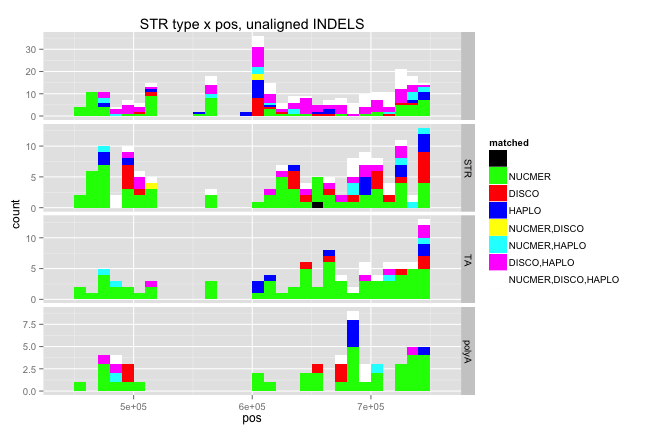
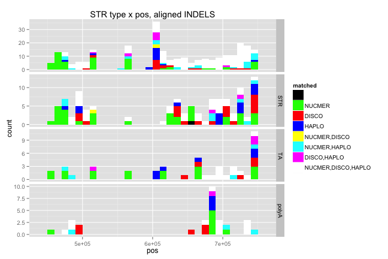

library(ggplot2)
library(knitr)
library(reshape2)

```r
opts_chunk$set(fig.width=9, fig.height=6)
```


```r
depths <- read.table("cfNucmerDiscoHaplo_150722_leftAlign.DEPTH.txt",stringsAsFactors = F,sep='\t',header=T)
# colnames(values) <- c("chrom","start","end",
#                       "covered1","covered2","covered3",
#                       "d1",  "d2",  "d3",	
#                       "dcov1",  "dcov2",	"dcov3",
#                       "SNPS",	"Smatch0",	"Smatch1",	"Spriv",	
#                       "INDELS",	"Imatch",	"Imiss",	"Ipriv")
depths$block <- depths$end - ((depths$end-depths$start)/2)
depths$meandepth <- (depths$d2+depths$d3)/2
depths$block <- c(1:30) #nb, 10kb blocks
```


```r
nuccfs <- read.table("cfNucmerDiscoHaplo_150722_leftAlign.txt",sep="\t",stringsAsFactors = F)
colnames(nuccfs) <- c("file","chr","pos","type","concordance","matched","quality","length","alleles","complexity",
                      "STR","period","exponent","STRlength",
                      "STRcomplexity","Apc","Tpc","Cpc","Gpc" )
matchlevels <- c("",     "NUCMER","DISCO","HAPLO","NUCMER,DISCO","NUCMER,HAPLO","DISCO,HAPLO","NUCMER,DISCO,HAPLO")
colours <-     c("black","green", "red",  "blue", "yellow",      "cyan",        "magenta",     "white")
names(colours) <- matchlevels


nuccfs$matched <- factor(nuccfs$matched,levels = matchlevels)

nuccfs$polyA = (nuccfs$Apc==1 | nuccfs$Tpc==1)
nuccfs$TA = (nuccfs$Apc==0.5 & nuccfs$Tpc==0.5)
nuccfs$STRtype=""
nuccfs$STRtype <- factor(nuccfs$STRtype,levels=c("","STR","TA","polyA"))
nuccfs[nuccfs$STR != "NULL",]$STRtype = "STR"
nuccfs[nuccfs$TA,]$STRtype = "TA"
nuccfs[nuccfs$polyA,]$STRtype = "polyA"

nuccfs$quality <- as.numeric(nuccfs$quality)
nuccfs <- nuccfs[which(nuccfs$concordance!="MISMATCH"),]

nuccfsLeft <- nuccfs
rm(nuccfs)
```


```r
nuccfs <- read.table("cfNucmerDiscoHaplo_150722_noLeftAlign.txt",sep="\t",stringsAsFactors = F)
colnames(nuccfs) <- c("file","chr","pos","type","concordance","matched","quality","length","alleles","complexity",
                      "STR","period","exponent","STRlength",
                      "STRcomplexity","Apc","Tpc","Cpc","Gpc" )
matchlevels <- c("","NUCMER","DISCO","HAPLO","NUCMER,DISCO","NUCMER,HAPLO","DISCO,HAPLO","NUCMER,DISCO,HAPLO")
nuccfs$matched <- factor(nuccfs$matched,levels = matchlevels)

nuccfs$polyA = (nuccfs$Apc==1 | nuccfs$Tpc==1)
nuccfs$TA = (nuccfs$Apc==0.5 & nuccfs$Tpc==0.5)
nuccfs$STRtype=""
nuccfs$STRtype <- factor(nuccfs$STRtype,levels=c("","STR","TA","polyA"))
nuccfs[nuccfs$STR !="NULL",]$STRtype = "STR"
nuccfs[nuccfs$TA,]$STRtype = "TA"
nuccfs[nuccfs$polyA,]$STRtype = "polyA"

nuccfs$quality <- as.numeric(nuccfs$quality)
#nuccfs[is.na(as.numeric(nuccfs$quality)),]
#REMOVE MISMATCHES (messy/infrequent)
nuccfs <- nuccfs[which(nuccfs$concordance!="MISMATCH"),]

nuccfsRight <- nuccfs
rm(nuccfs)
```

#method concordance
##no left align

```r
ctable <- as.data.frame(table(subset(nuccfsRight,concordance != "MATCH0",c(matched,type,STRtype))))
ctable$x <- c(0,1,2,3,1,1,2,4)
ctable$y <- c(0,1,2,3,2,3,3,4)
ctable$x <- factor(ctable$x,labels=c("none","NUCMER","DISCO","HAPLO","ALL"))
ctable$y <- factor(ctable$y,labels=c("none","NUCMER","DISCO","HAPLO","ALL"))
ggplot(subset(ctable,x!="none"),aes(x,y,fill=Freq)) + 
  geom_tile() + scale_fill_gradient(low="white",high="red") +
  stat_bin2d(geom="text", aes(label=Freq)) +
  facet_grid(type ~ STRtype) + ggtitle("concordance, unaligned indels")
```

 

```r
# ggplot(subset(ctable,matched != "" & STRtype %in% c("polyA","TA")),aes(x,y,fill=Freq)) + 
#   geom_tile() + scale_fill_gradient(low="white",high="red") +
#   stat_bin2d(geom="text", aes(label=Freq)) +
#   facet_grid(type ~ STRtype)
```
##left align

```r
ctable <- as.data.frame(table(subset(nuccfsLeft,concordance != "MATCH0",c(matched,type,STRtype))))
ctable$x <- c(0,1,2,3,1,1,2,4)
ctable$y <- c(0,1,2,3,2,3,3,4)
ctable$x <- factor(ctable$x,labels=c("none","NUCMER","DISCO","HAPLO","ALL"))
ctable$y <- factor(ctable$y,labels=c("none","NUCMER","DISCO","HAPLO","ALL"))
ggplot(subset(ctable,x!="none"),aes(x,y,fill=Freq)) + 
  geom_tile() + scale_fill_gradient(low="white",high="red") +
  stat_bin2d(geom="text", aes(label=Freq)) +
  facet_grid(type ~ STRtype) + ggtitle("concordance, aligned indels")
```

 

```r
# ggplot(subset(ctable,matched != "" & STRtype %in% c("polyA","TA")),aes(x,y,fill=Freq)) + 
#   geom_tile() + scale_fill_gradient(low="white",high="red") +
#   stat_bin2d(geom="text", aes(label=Freq)) +
#   facet_grid(type ~ STRtype)
```

#call concordance vs posn, SNPs

```r
posConcL <- ggplot(subset(nuccfsLeft,type=="S"),aes(x=pos, group=matched, fill=matched)) + geom_histogram(binwidth=10000)
posConcL + ggtitle("concordance x pos, aligned") + scale_fill_manual(values = colours)
```

 
#call concordance vs posn, INDELS

```r
posConcR <- ggplot(subset(nuccfsRight,type=="I"),aes(x=pos, group=matched, fill=matched)) + geom_histogram(binwidth=10000)
posConcR + ggtitle("concordance x pos, unaligned") + scale_fill_manual(values = colours)
```

 

```r
posConcL <- ggplot(subset(nuccfsLeft,type=="I"),aes(x=pos, group=matched, fill=matched)) + geom_histogram(binwidth=10000)
posConcL + ggtitle("concordance x pos, aligned") + scale_fill_manual(values = colours)
```

 
##STR type (A/TA/complex) vs concordance, INDELS

```r
posConcSTRR <- ggplot(subset(nuccfsRight,type=="I"),aes(x=pos, group=matched, fill=matched)) + geom_histogram(binwidth=10000)  + facet_grid(STRtype ~ .,scales="free_y") + ggtitle("STR type x pos, unaligned") + scale_fill_manual(values = colours)
posConcSTRR
```

 

```r
posConcSTRL <- ggplot(subset(nuccfsLeft,type=="I"),aes(x=pos, group=matched, fill=matched)) + geom_histogram(binwidth=10000)  + facet_grid(STRtype ~ .,scales="free_y") + ggtitle("STR type x pos, aligned") + scale_fill_manual(values = colours)
posConcSTRL
```

 
