library(ggplot2)
library(knitr)
library(reshape2)

```r
opts_chunk$set(fig.width=9, fig.height=6)
```


```r
SWscores <- read.table("disco.qDD2vr3D7.SW.txt",stringsAsFactors = F,sep='\t',header=T)
colnames(SWscores)[1:2] <- c("i","var")
SWscores <- cbind(t(as.data.frame(strsplit(SWscores$var,split = ':'))),SWscores)
colnames(SWscores)[1:2] <- c("chr","pos")
SWscores$pos <- as.integer(as.character(SWscores$pos))
```


```r
nuccfs <- read.table("cfNucmerDiscoHaplo_150722_leftAlignGATKSPLIT.txt",sep="\t",stringsAsFactors = F)
colnames(nuccfs) <- c("file","chr","pos","type","concordance","matched","quality","length","alleles","complexity",
                      "STR","period","exponent","STRlength",
                      "STRcomplexity","Apc","Tpc","Cpc","Gpc" )
matchlevels <- c("",     "NUCMER","DISCO","HAPLO","NUCMER,DISCO","NUCMER,HAPLO","DISCO,HAPLO","NUCMER,DISCO,HAPLO")
colours <-     c("black","green", "red",  "blue", "yellow",      "cyan",        "magenta",     "white")
names(colours) <- matchlevels


nuccfs$matched <- factor(nuccfs$matched,levels = matchlevels)

nuccfs$polyA = (nuccfs$Apc==1 | nuccfs$Tpc==1)
nuccfs$TA = (nuccfs$Apc==0.5 & nuccfs$Tpc==0.5)
nuccfs$STRtype=""
nuccfs$STRtype <- factor(nuccfs$STRtype,levels=c("","STR","TA","polyA"))
nuccfs[nuccfs$STR != "NULL",]$STRtype = "STR"
nuccfs[nuccfs$TA,]$STRtype = "TA"
nuccfs[nuccfs$polyA,]$STRtype = "polyA"

nuccfs$quality <- as.numeric(nuccfs$quality)
nuccfs <- nuccfs[which(nuccfs$concordance!="MISMATCH"),]
```


```r
SWcf <- merge(nuccfs,SWscores,by=c("pos","chr"))
SWcf <- SWcf[SWcf$XS > 0,]
```


#variable densities cf concordance
##levenshtein distance post

```r
ggplot(SWcf,aes(NM,colour=matched)) + 
  geom_density(size=1) +  scale_colour_manual(values = colours)
```

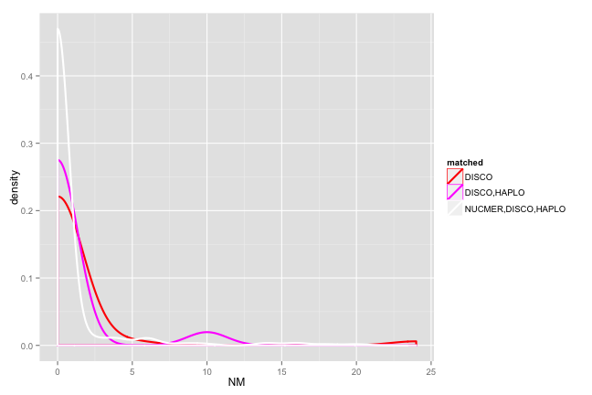 

```r
ggplot(SWcf,aes(NM,colour=STRtype)) + 
  geom_density(size=1)
```

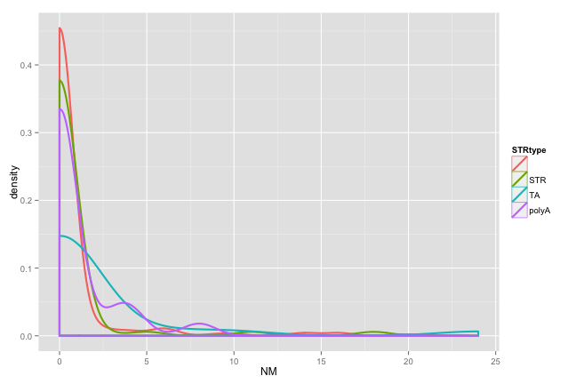 
##relative align length

```r
ggplot(SWcf,aes(RS,colour=matched)) + 
  geom_density(size=1) +  scale_colour_manual(values = colours)
```

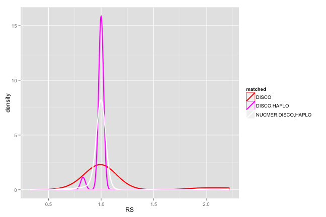 

```r
ggplot(SWcf,aes(RS,colour=STRtype)) + 
  geom_density(size=1)
```

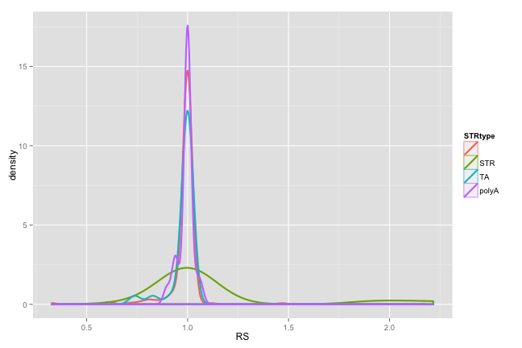 


#levenshtein distance, pre (LD) vs post (NM)

```r
#anything over ab-line is presumed error (higher output Lev dist than input)
#nb lots of disco-only well below line, 0 edit distance after realignment
ggplot(SWcf,aes(LD,NM,colour=matched)) + 
  geom_point(size=3) +  scale_colour_manual(values = colours) + geom_abline()
```

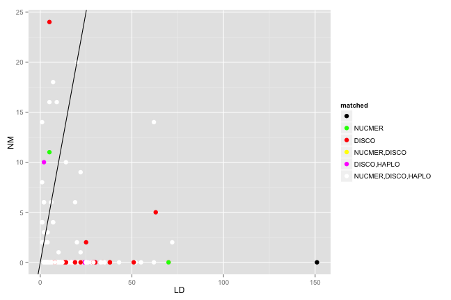 

```r
#fairly good reassembly of TA/polyA
ggplot(SWcf,aes(LD,NM,colour=STRtype)) + 
  geom_point(size=3) + geom_abline()
```

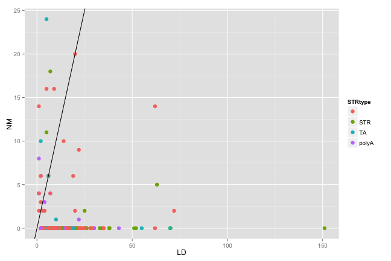 

#levenshtein distance, pre (LD) vs relative score (RS)

```r
ggplot(SWcf,aes(LD,RS,colour=matched,shape=NM>LD)) + 
  geom_point(size=3) +  scale_colour_manual(values = colours)
```

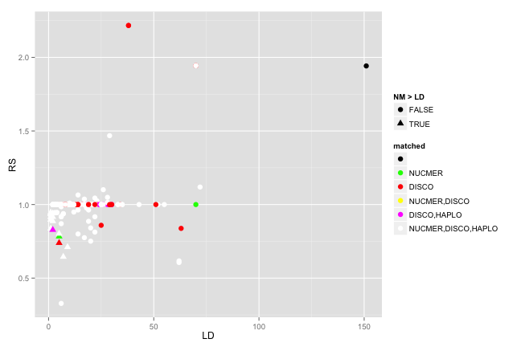 

```r
ggplot(SWcf,aes(LD,RS,colour=STRtype,shape=NM>LD)) + 
  geom_point(size=3)
```

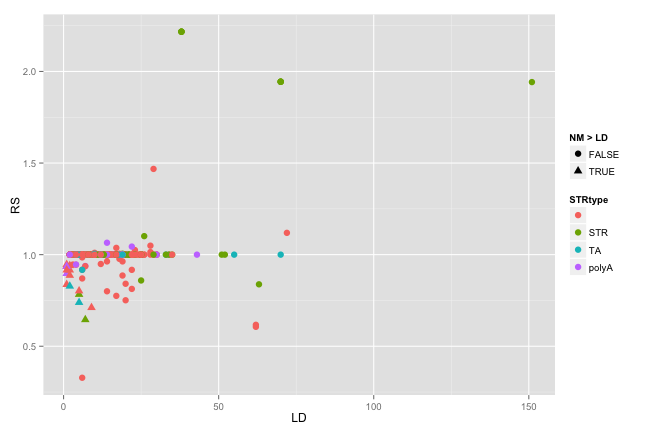 

```r
ggplot(SWcf,aes(LD,RS,colour=NM>LD,shape=RS>1)) + 
  geom_point(size=3)
```

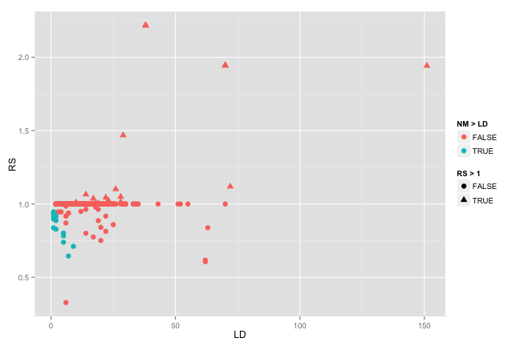 

#levenshtein distance post (NM) vs relative score (RS)

```r
ggplot(SWcf,aes(NM,RS,colour=matched,shape=NM>LD)) + 
  geom_point(size=3) +  scale_colour_manual(values = colours)
```

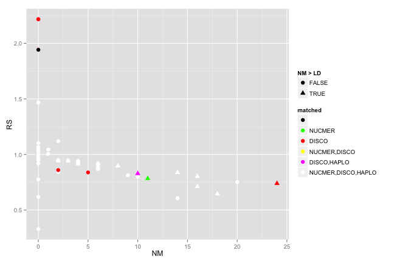 

```r
ggplot(SWcf,aes(NM,RS,colour=STRtype,shape=NM>LD)) + 
  geom_point(size=3)
```

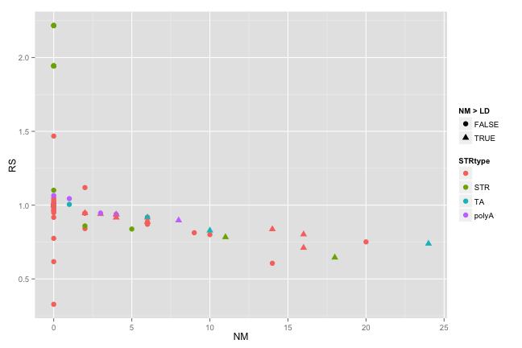 


#PREDICTING ERRORS?

```r
SWcf$error=""
SWcf[SWcf$NM>SWcf$LD,"error"]="LDerror"
SWcf[SWcf$RS>1,"error"]="RSerror"
#nb, will only have LD and STR presence to work with 
ggplot(SWcf,aes(LD,STRlength,colour=error)) + 
  geom_point(size=3)
```

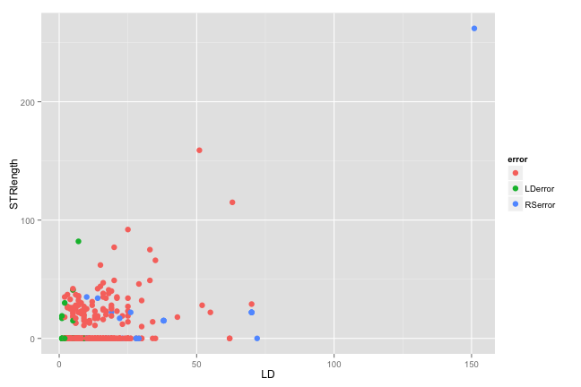 

```r
ggplot(SWcf,aes(LD,concordance,colour=error)) + 
  geom_point(size=3)
```

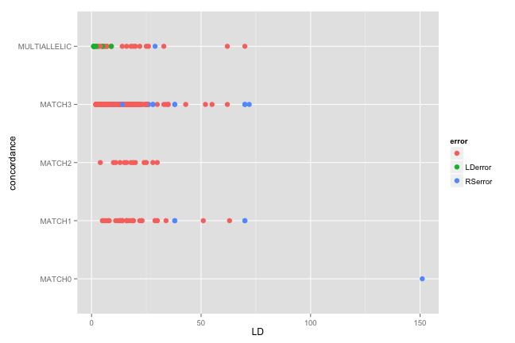 

```r
ggplot(SWcf,aes(STRlength,STRcomplexity,colour=error)) + 
  geom_point(size=3)
```

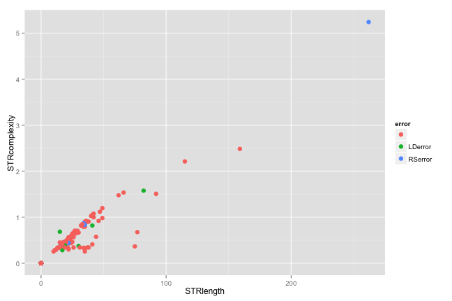 

```r
ggplot(SWcf,aes(LD,STRcomplexity,colour=error)) + 
  geom_point(size=3)
```

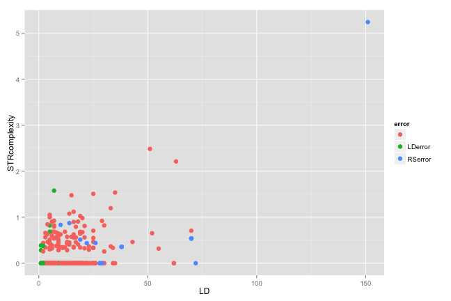 

```r
ggplot(SWcf,aes(LD,complexity,colour=error,shape=concordance)) + 
  geom_point(size=3,alpha=0.7)
```

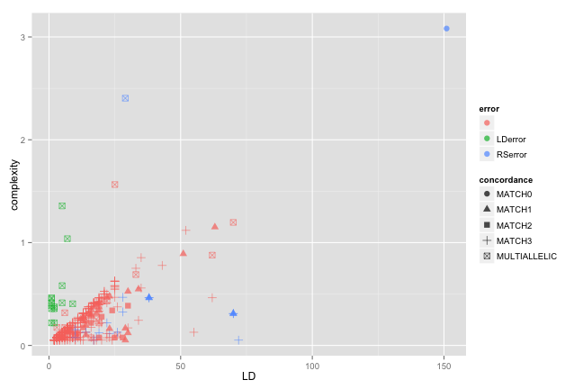 

```r
ggplot(SWcf,aes(LD,complexity,colour=error,shape=concordance)) + 
  geom_point(size=3,alpha=0.7) + scale_x_log10() + scale_y_log10()
```

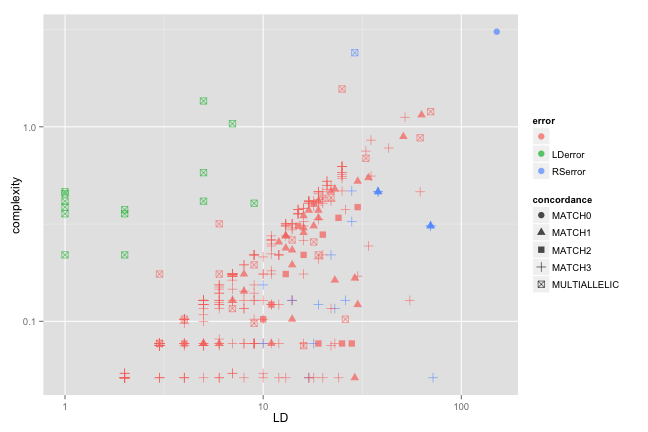 

