library(ggplot2)
library(knitr)
library(reshape2)

```r
opts_chunk$set(fig.width=9, fig.height=6)
```


```r
SWnucmer <- read.table("NUCMER.qDD2vr3D7.INDELS.SW.txt",stringsAsFactors = F,sep='\t',header=T)
SWnucmer$set="NUCMER"
SWdisco <- read.table("DISCO.qDD2vr3D7.INDELS.SW.txt",stringsAsFactors = F,sep='\t',header=T)
SWdisco$set="DISCO"
SWhaplo <- read.table("HAPLO.qDD2vr3D7.INDELS.SW.txt",stringsAsFactors = F,sep='\t',header=T)
SWhaplo$set="HAPLO"
SWscores <- rbind(SWnucmer,SWdisco,SWhaplo)
colnames(SWscores)[1:2] <- c("i","var")
SWscores <- cbind(t(as.data.frame(strsplit(SWscores$var,split = ':'))),SWscores)
colnames(SWscores)[1:2] <- c("chr","pos")
SWscores$pos <- as.integer(as.character(SWscores$pos))
```


```r
nuccfs <- read.table("cfNucmerDiscoHaplo_150729_leftAlignGATKSPLIT.txt",sep="\t",stringsAsFactors = F)
colnames(nuccfs) <- c("file","chr","pos","type","concordance","matched","quality","length","alleles","complexity",
                      "STR","period","exponent","STRlength",
                      "STRcomplexity","Apc","Tpc","Cpc","Gpc" )
matchlevels <- c("",     "NUCMER","DISCO","HAPLO","NUCMER,DISCO","NUCMER,HAPLO","DISCO,HAPLO","NUCMER,DISCO,HAPLO")
colours <-     c("black","green", "red",  "blue", "yellow",      "cyan",        "magenta",     "white")
names(colours) <- matchlevels


nuccfs$matched <- factor(nuccfs$matched,levels = matchlevels)

nuccfs$polyA = (nuccfs$Apc==1 | nuccfs$Tpc==1)
nuccfs$TA = (nuccfs$Apc==0.5 & nuccfs$Tpc==0.5)
nuccfs$STRtype=""
nuccfs$STRtype <- factor(nuccfs$STRtype,levels=c("","STR","TA","polyA"))
nuccfs[nuccfs$STR != "NULL",]$STRtype = "STR"
nuccfs[nuccfs$TA,]$STRtype = "TA"
nuccfs[nuccfs$polyA,]$STRtype = "polyA"

nuccfs$quality <- as.numeric(nuccfs$quality)
nuccfs <- nuccfs[which(nuccfs$concordance!="MISMATCH"),]
nuccfs <- nuccfs[nuccfs$type=="I",]
```


```r
depth <- read.table("cfNucmerDiscoHaplo_150729_leftAlignGATKSPLIT.DEPTH.txt",sep="\t",stringsAsFactors = F,header=T)
```


```r
SWcf <- merge(nuccfs,SWscores,by=c("pos","chr"),all.y=T)
SWcf <- SWcf[!is.na(SWcf$type),]
```


#levenshtein distance post

```r
ggplot(subset(SWcf,concordance %in% c("MATCH1","MATCH2","MATCH3")),aes(NM,fill=set)) + 
  geom_histogram(size=1,binwidth=1,position="dodge") +  scale_fill_manual(values = colours) +
  ggtitle("levenshtein distance, post / cf DD2")
```

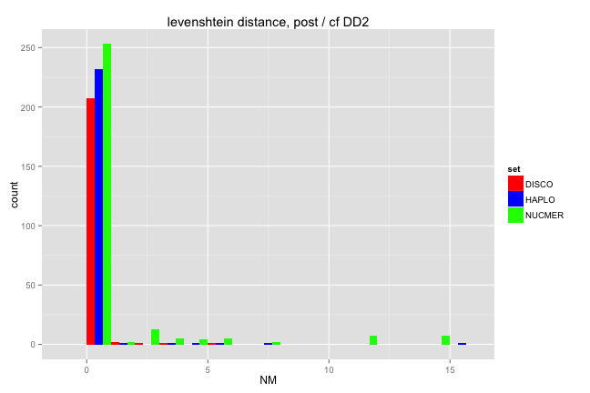 

```r
# ggplot(subset(SWcf,concordance %in% c("MATCH1","MATCH2","MATCH3")),aes(NM,fill=set)) + 
#   geom_histogram(size=1,binwidth=1,position="dodge") +  scale_fill_manual(values = colours) +
#   scale_y_log10()

ggplot(subset(SWcf,concordance %in% c("MATCH1","MATCH2")),aes(NM,colour=matched)) + 
  geom_density(size=1,adjust=0.5) +  scale_colour_manual(values = colours) +
  xlim(0,8)+
  facet_grid(set ~ concordance)
```

```
## Warning: Removed 1 rows containing non-finite values (stat_density).
```

```
## Warning: Removed 14 rows containing non-finite values (stat_density).
```

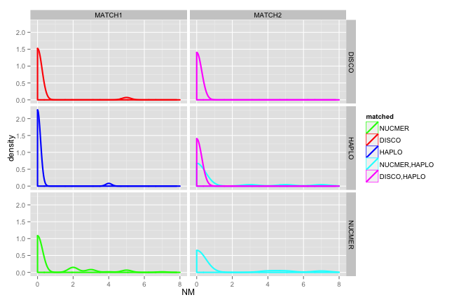 

```r
ggplot(subset(SWcf,concordance %in% c("MATCH1","MATCH2","MATCH3")),aes(NM,colour=STRtype)) + 
  geom_density(size=1,adjust=0.5)+
  xlim(0,5)+
  facet_grid(set ~ STRtype)
```

```
## Warning: Removed 2 rows containing non-finite values (stat_density).
```

```
## Warning: Removed 8 rows containing non-finite values (stat_density).
```

```
## Warning: Removed 6 rows containing non-finite values (stat_density).
```

```
## Warning: Removed 2 rows containing non-finite values (stat_density).
```

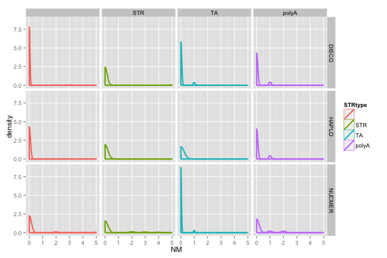 


#levenshtein distance, pre (LD) vs post (NM)

```r
#anything over ab-line is presumed error (higher output Lev dist than input)
#nb lots of disco-only well below line, 0 edit distance after realignment
ggplot(SWcf,aes(LD,NM,colour=matched)) + 
  geom_point(size=3) +  scale_colour_manual(values = colours) + geom_abline() +
  facet_grid(set ~ .)
```

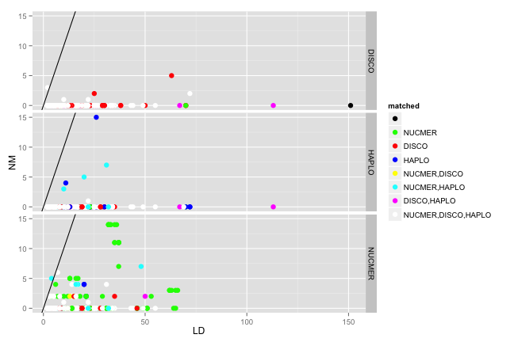 

```r
ggplot(SWcf,aes(matched,NM,colour=matched)) + 
  geom_boxplot() +  scale_colour_manual(values = colours)
```

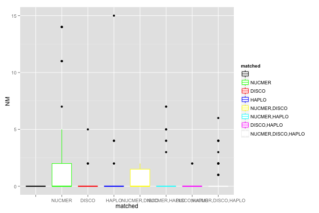 

```r
#private_only
ggplot(subset(SWcf,set==matched),aes(LD,NM,colour=matched)) + 
  geom_point(size=3) +  scale_colour_manual(values = colours) + geom_abline() +
  facet_grid(set ~ .)
```

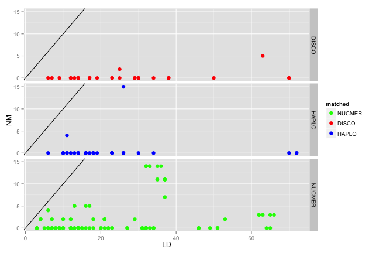 

```r
#doubleton only
##ggplot(subset(SWcf,concordance=="MATCH2"),aes(LD,NM,colour=matched)) + 
##  geom_point(size=3) +  scale_colour_manual(values = colours) + geom_abline() +
##  facet_grid(set ~ .)
```


#pos / indel length vs LD (post)

```r
ggplot(SWcf,aes(pos,NM,colour=matched)) + 
  geom_point(size=4,alpha=0.7) +  scale_colour_manual(values = colours) + 
   ggtitle("levenshtein distance x posn") +
  facet_grid(set ~ .)
```

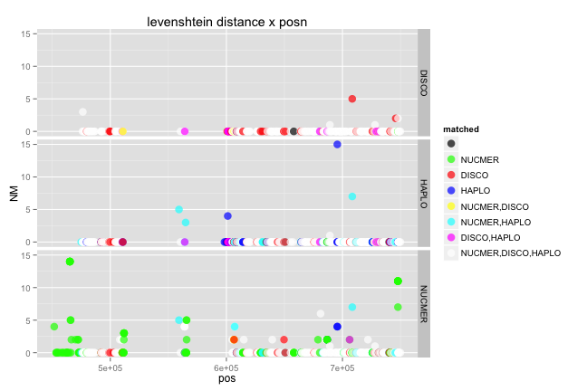 

```r
ggplot(SWcf,aes(length,NM,colour=matched)) + 
  geom_point(size=4,alpha=0.7) + scale_colour_manual(values = colours) + 
   ggtitle("levenshtein distance x indel length") +
  facet_grid(set ~ .)
```

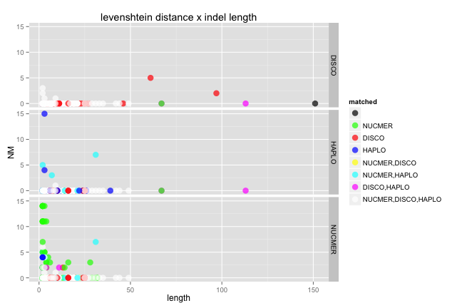 


```r
SWcf$error=""
SWcf[SWcf$NM>0,"error"]="LDerror"
SWcf[SWcf$RS>1,"error"]="RSerror"

table(SWcf[,c("error","set")])
```

```
##          set
## error     DISCO HAPLO NUCMER
##             207   276    289
##   LDerror     3     4     71
##   RSerror    18     7      8
```
##LD/complexity values

```r
ggplot(SWcf,aes(LD,complexity,colour=error,shape=STRtype)) + 
  geom_point(size=3,alpha=0.7) + ggtitle("levenshtein distance x indel complexity") +
  facet_grid(set ~ .)
```

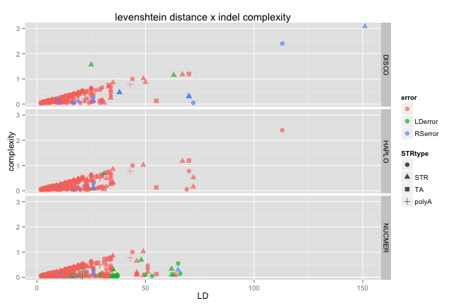 

```r
ggplot(SWcf,aes(LD-length,complexity,colour=error,shape=concordance)) + 
  geom_point(size=3,alpha=0.7) + ggtitle("levenshtein distance (flank only) x indel complexity") +
  facet_grid(set ~ .)
```

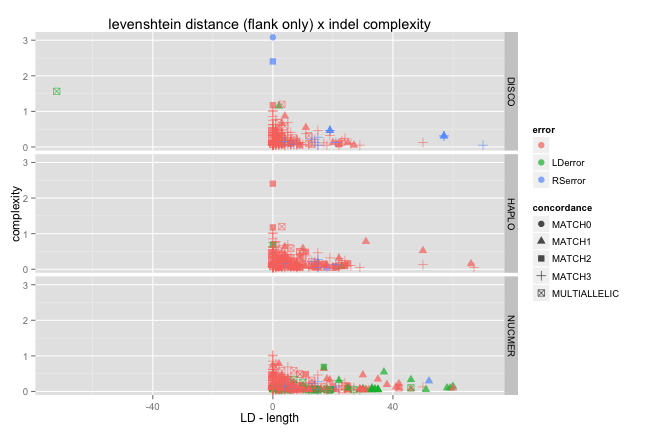 

```r
#nb multiallelic with LD error is false diploid call in discovar:
# Pf3D7_07_v3	745910	.	GTTCATTTTTTGAATGATCTACTGGTTCATTTTTTGAATGATCTACTGGTTCATTTTTTGAATGATCTACTGATTCATTTTTTGAATGATCTACTGA	TTCATTTTTTGAATGATCTACTGG,G	214.00	PASS	AC=1,1;AN=2;BL=2;SF=1	GT:ALTP:REFP:GP	.	1/2:60,154:0:0,0,0,0,60,4.34295e-06	.

ggplot(SWcf,aes(LD,complexity,colour=error,shape=concordance)) + 
  geom_point(size=3,alpha=0.7) + scale_x_log10() + scale_y_log10() +
   ggtitle("levenshtein distance x indel complexity [log scale]") +
  facet_grid(set ~ .)
```

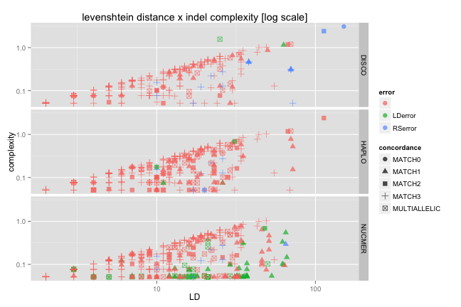 

