library(ggplot2)
library(knitr)
library(reshape2)
library(hexbin)

```r
opts_chunk$set(fig.width=9, fig.height=6)

matchlevels <- c("",     "NUCMER","DISCO","HAPLO","NUCMER,DISCO","NUCMER,HAPLO","DISCO,HAPLO","NUCMER,DISCO,HAPLO")
colours <-     c("black","green", "red",  "blue", "yellow",      "cyan",        "magenta",     "white")
names(colours) <- matchlevels
```


```r
SWnucmer <- read.table("NUCMER.qDD2vr3D7.INDELS.SW.txt",stringsAsFactors = F,sep='\t',header=T)
SWnucmer$set="NUCMER"
SWdisco <- read.table("DISCO.qDD2vr3D7.INDELS.SW.txt",stringsAsFactors = F,sep='\t',header=T)
SWdisco$set="DISCO"
SWscores <- rbind(SWnucmer,SWdisco)
#SWscores <- SWdisco
head(SWscores)
```

```
##   i                 block  L    TD  IL LD N  AS   RS NM XS    set
## 1 1 PFC10_API_IRAB:15420  14 15420 202 15 1 202 1.00  0  0 NUCMER
## 2 2 PFC10_API_IRAB:23945  -1 10297 204  4 1 200 0.98  1  0 NUCMER
## 3 3 PFC10_API_IRAB:23947  -1 10295 204  4 1 200 0.98  1  0 NUCMER
## 4 4 PFC10_API_IRAB:27761   1  6481 202  2 1 202 1.00  0  0 NUCMER
## 5 5 PFC10_API_IRAB:28008   1  6234 202  2 1 202 1.00  0  0 NUCMER
## 6 6 PFC10_API_IRAB:28127  -1  6115 204  4 1 200 0.98  1  0 NUCMER
```

```r
colnames(SWscores)[1:2] <- c("i","var")
SWscores <- cbind(t(as.data.frame(strsplit(SWscores$var,split = ':'))),SWscores)
colnames(SWscores)[1:2] <- c("chr","pos")
SWscores$pos <- as.integer(as.character(SWscores$pos))
```


```r
telos <- readLines("List.subtelomeres.3D7.regions.txt")
telos <- t(as.data.frame(strsplit(telos,split = ':')))
telos <- as.data.frame(cbind(telos[,1],t(as.data.frame(strsplit(telos[,2],split = '-')))))
colnames(telos) <- c("chr","st","en")
telos$st <- as.numeric(as.character(telos$st))
telos$en <- as.numeric(as.character(telos$en))
telos$chr <- as.character(telos$chr)

telos <- merge(subset(telos,st < 1000),subset(telos,st > 1000),by="chr")
colnames(telos) <- c("chr","stL","enL","stR","enR")


SWscores$chr <- as.character(SWscores$chr)
SWscores$telo=F
tmp <- merge(SWscores,telos,by="chr",all.x=T)

tmp[is.na(tmp$stL),c("stL","enL","stR","enR")] <- -1
tmp$telo[tmp$pos < tmp$enL] = T # "L"
tmp$telo[tmp$pos > tmp$stR] = T # "R"
SWscores <- tmp[,colnames(SWscores)]
rm(tmp)
```


```r
SWscores$error=""
SWscores[SWscores$NM>0,"error"]="LDerror"
SWscores[SWscores$RS>1,"error"]="RSerror"

table(SWscores[,c("error","set")])
```

```
##          set
## error     DISCO NUCMER
##           37964  25589
##   LDerror   489  20954
##   RSerror  1464    716
```

#levenshtein distance post distributions

```r
ggplot(SWscores,aes(NM,fill=set)) + 
  geom_histogram(size=1,binwidth=2,position="dodge") +  
#  geom_density(size=1,adjust=0.5) +  
  scale_y_log10() + scale_fill_manual(values = colours) +
  ggtitle("levenshtein distance, post / cf DD2") + 
  facet_grid(. ~ set)
```

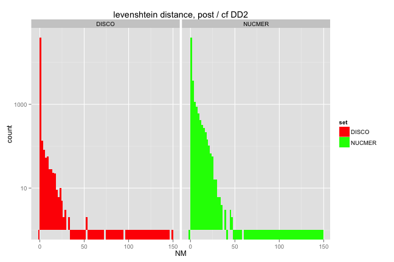 

```r
ggplot(subset(SWscores,NM < 50),aes(NM,colour=set)) + 
#  geom_histogram(size=1,binwidth=2,position="dodge") +  
  geom_density(size=1) +  
  scale_fill_manual(values = colours) +
  ggtitle("levenshtein distance, post / cf DD2") + 
  facet_grid(. ~ set)
```

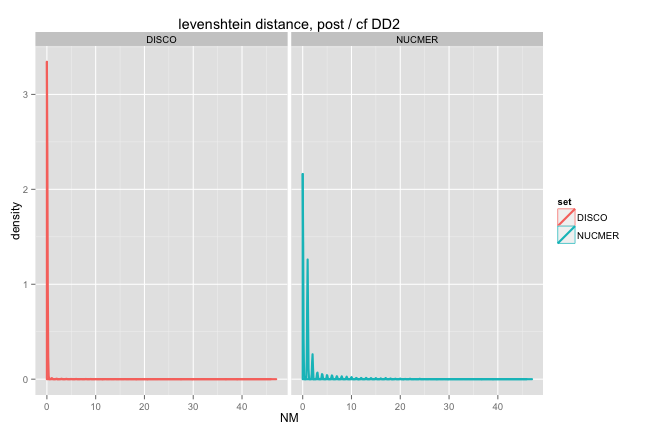 

```r
ggplot(subset(SWdisco,NM > 0 & NM < 50),aes(NM,colour=set)) + 
#  geom_histogram(size=1,binwidth=2,position="dodge") +  
  geom_density(size=1, adjust=0.5) +  
  scale_fill_manual(values = colours) +
  ggtitle("levenshtein distance, post / cf DD2") + 
  facet_grid(. ~ set)
```

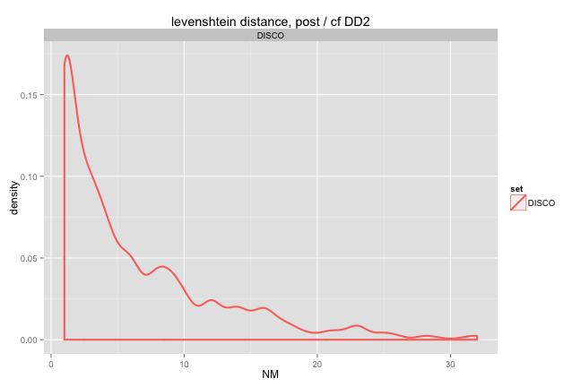 


#levenshtein distance, pre (LD) vs post (NM)

```r
#anything over ab-line is presumed error (higher output Lev dist than input)
#nb lots of disco-only well below line, 0 edit distance after realignment

ggplot(SWscores,aes(LD,NM)) + 
  geom_hex() + xlim(-1,50) + ylim(-1,50) +
  ggtitle("levenshtein distance pre vs post") +
  facet_grid(. ~ set)
```

```
## Warning: Removed 1337 rows containing missing values (stat_hexbin).
```

```
## Warning: Removed 1714 rows containing missing values (stat_hexbin).
```

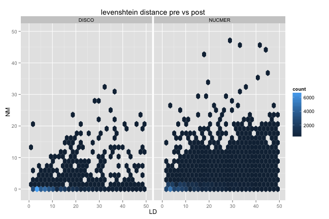 

```r
ggplot(SWscores,aes(LD,NM,colour=set)) + 
  geom_point(size=3,alpha=0.7) + scale_colour_manual(values = colours) + 
   ggtitle("levenshtein distance pre vs post") + xlim(0,100) + ylim(0,50) +
  facet_grid(. ~ set)
```

```
## Warning: Removed 434 rows containing missing values (geom_point).
```

```
## Warning: Removed 55 rows containing missing values (geom_point).
```

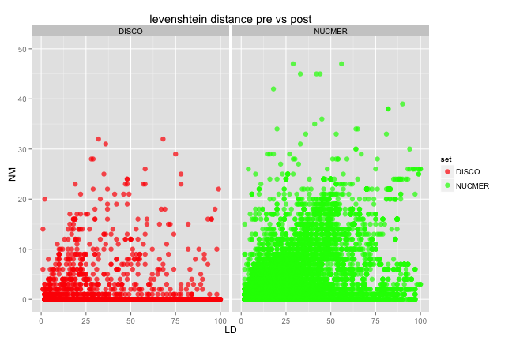 

```r
#indel length vs LD (post)
ggplot(SWscores,aes(L,NM)) + 
  geom_hex() + xlim(-20,20) + 
  ggtitle("levenshtein distance x indel length") + 
  facet_grid(set ~ .)
```

```
## Warning: Removed 3540 rows containing missing values (stat_hexbin).
```

```
## Warning: Removed 2536 rows containing missing values (stat_hexbin).
```

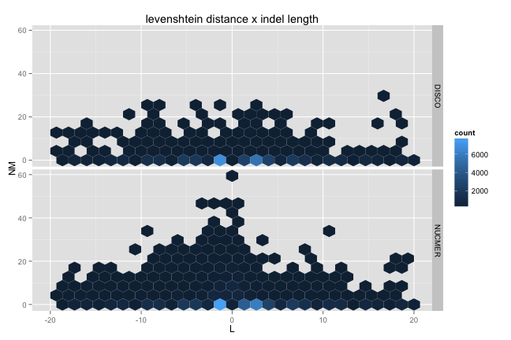 


#pos / indel length vs LD (post)

```r
ggplot(SWscores,aes(pos,LD,colour=telo)) + 
  geom_point(size=1,alpha=0.7) +  
   ggtitle("levenshtein distance (pre) x posn") + scale_y_log10() + 
  facet_grid(chr ~ set)
```

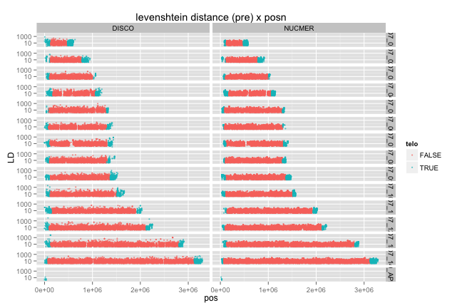 

```r
ggplot(SWscores,aes(pos,NM,colour=telo)) + 
  geom_point(size=1,alpha=0.7) +  
   ggtitle("levenshtein distance (post) x posn") + scale_y_log10() + 
  facet_grid(chr ~ set)
```

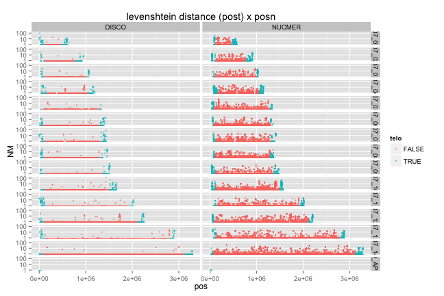 

```r
ggplot(SWscores,aes(pos,NM/LD,colour=telo)) + 
  geom_point(size=1,alpha=0.7) +  
   ggtitle("levenshtein distance (post) x posn") + scale_y_log10() + 
  facet_grid(chr ~ set)
```

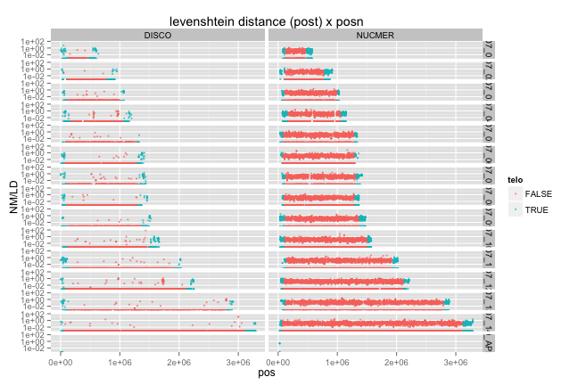 

#telomere distance / presence v levenshtein (post)

```r
ggplot(SWscores,aes(TD,NM,colour=telo)) + 
  geom_point(size=3,alpha=0.7) + 
   ggtitle("levenshtein distance x telomere distance") + ylim(0,50) +
  facet_grid(. ~ set)
```

```
## Warning: Removed 5 rows containing missing values (geom_point).
```

```
## Warning: Removed 1 rows containing missing values (geom_point).
```

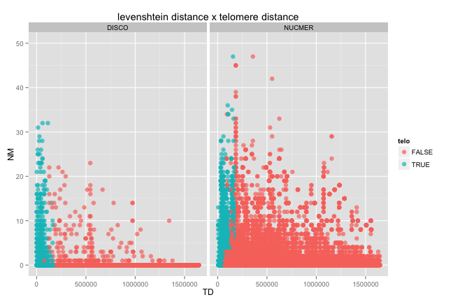 

```r
ggplot(SWscores,aes(LD,NM,colour=set)) + 
  geom_point(size=3,alpha=0.7) + scale_colour_manual(values = colours) + 
   ggtitle("levenshtein distance pre vs post") + xlim(0,100) + ylim(0,50) +
  facet_grid(telo ~ set)
```

```
## Warning: Removed 312 rows containing missing values (geom_point).
```

```
## Warning: Removed 35 rows containing missing values (geom_point).
```

```
## Warning: Removed 122 rows containing missing values (geom_point).
```

```
## Warning: Removed 20 rows containing missing values (geom_point).
```

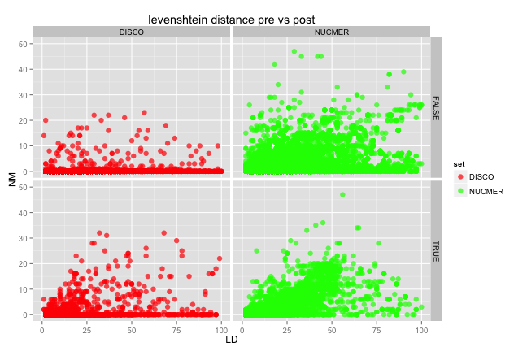 


