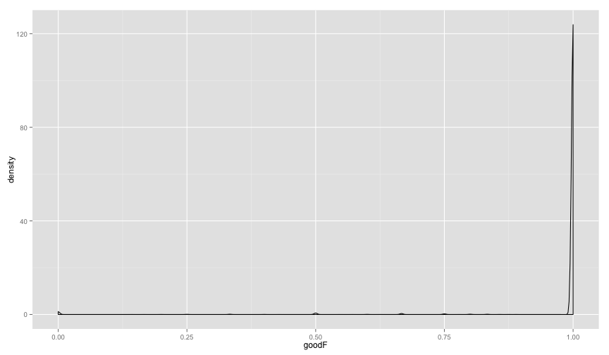

library(ggplot2)
library(knitr)
library(reshape2)
library(hexbin)

```r
opts_chunk$set(fig.width=12, fig.height=7)

matchlevels <- c("",     "NUCMER","DISCO","HAPLO","NUCMER,DISCO","NUCMER,HAPLO","DISCO,HAPLO","NUCMER,DISCO,HAPLO")
colours <-     c("black","green", "red",  "blue", "yellow",      "cyan",        "magenta",     "white")
names(colours) <- matchlevels
```


```r
SWnucmer <- read.table("NUCMER.qDD2vr3D7.INDELS.SW.txt",stringsAsFactors = F,sep='\t',header=T)
SWnucmer$set="NUCMER"
SWdisco <- read.table("DISCO.qDD2vr3D7.INDELS.SW.txt",stringsAsFactors = F,sep='\t',header=T)
SWdisco$set="DISCO"
SWscores <- rbind(SWnucmer,SWdisco)
#SWscores <- SWdisco
head(SWscores)
```

```
##   i                 block  L    TD  IL LD N  AS   RS NM XS    set
## 1 1 PFC10_API_IRAB:15420  14 15420 202 15 1 202 1.00  0  0 NUCMER
## 2 2 PFC10_API_IRAB:23945  -1 10297 204  4 1 200 0.98  1  0 NUCMER
## 3 3 PFC10_API_IRAB:23947  -1 10295 204  4 1 200 0.98  1  0 NUCMER
## 4 4 PFC10_API_IRAB:27761   1  6481 202  2 1 202 1.00  0  0 NUCMER
## 5 5 PFC10_API_IRAB:28008   1  6234 202  2 1 202 1.00  0  0 NUCMER
## 6 6 PFC10_API_IRAB:28127  -1  6115 204  4 1 200 0.98  1  0 NUCMER
```

```r
colnames(SWscores)[1:2] <- c("i","var")
SWscores <- cbind(t(as.data.frame(strsplit(SWscores$var,split = ':'))),SWscores)
colnames(SWscores)[1:2] <- c("chr","pos")
SWscores$pos <- as.integer(as.character(SWscores$pos))
```


```r
telos <- readLines("List.subtelomeres.3D7.regions.txt")
telos <- t(as.data.frame(strsplit(telos,split = ':')))
telos <- as.data.frame(cbind(telos[,1],t(as.data.frame(strsplit(telos[,2],split = '-')))))
colnames(telos) <- c("chr","st","en")
telos$st <- as.numeric(as.character(telos$st))
telos$en <- as.numeric(as.character(telos$en))
telos$chr <- as.character(telos$chr)

telos <- merge(subset(telos,st < 1000),subset(telos,st > 1000),by="chr")
colnames(telos) <- c("chr","stL","enL","stR","enR")


SWscores$chr <- as.character(SWscores$chr)
SWscores$telo=F
tmp <- merge(SWscores,telos,by="chr",all.x=T)

tmp[is.na(tmp$stL),c("stL","enL","stR","enR")] <- -1
tmp$telo[tmp$pos < tmp$enL] = T # "L"
tmp$telo[tmp$pos > tmp$stR] = T # "R"
SWscores <- tmp[,colnames(SWscores)]
rm(tmp)
```


```r
SWscores$error=""
SWscores[SWscores$NM>0,"error"]="LDerror"
SWscores[SWscores$RS>1,"error"]="RSerror"

table(SWscores[,c("error","set")])
```

```
##          set
## error     DISCO NUCMER
##           37964  25589
##   LDerror   489  20954
##   RSerror  1464    716
```

```r
#remake subtables with chr/pos values, etc
SWdisco <- subset(SWscores,set=="DISCO")
SWnucmer <- subset(SWscores,set=="NUCMER")
```


```r
#make nucmer blockscores
blocksize <- 1000
SWnucmer$block <- paste(SWnucmer$chr,floor(SWnucmer$pos/blocksize),sep=":")

varcount <- aggregate(SWnucmer$var,by=list(SWnucmer$block),FUN=length)[,2]
means <- as.data.frame(aggregate(SWnucmer[,c("LD","RS","NM")],by=list(SWnucmer$block),FUN=mean))
goodcount <- aggregate(SWnucmer$NM==0,by=list(SWnucmer$block),FUN=sum)[,2]
LDcount <- aggregate(SWnucmer$error=="LDerror",by=list(SWnucmer$block),FUN=sum)[,2]
RScount <- aggregate(SWnucmer$error=="RSerror",by=list(SWnucmer$block),FUN=sum)[,2]
colnames(means)[[1]] <- "block"

poschr <- t(as.data.frame(strsplit(means$block,split = ':')))
colnames(poschr) <- c("chr","pos")
poschr <- as.data.frame(poschr)
poschr$pos <- as.numeric(as.character(poschr$pos))
poschr$st = poschr$pos*blocksize
poschr$mid = poschr$st+(blocksize/2)
poschr$en = poschr$st+blocksize

blocksumN <- cbind(poschr,means,varcount,goodcount,LDcount,RScount)
fs <- blocksumN[,c("goodcount","LDcount","RScount")]/varcount
colnames(fs) <- c("goodF","LDF","RSF")
blocksumN <- cbind(blocksumN,fs)
rm(fs)


#make disco blockscores
SWdisco$block <- paste(SWdisco$chr,floor(SWdisco$pos/blocksize),sep=":")

varcount <- aggregate(SWdisco$var,by=list(SWdisco$block),FUN=length)[,2]
means <- as.data.frame(aggregate(SWdisco[,c("LD","RS","NM")],by=list(SWdisco$block),FUN=mean))
goodcount <- aggregate(SWdisco$NM==0,by=list(SWdisco$block),FUN=sum)[,2]
LDcount <- aggregate(SWdisco$error=="LDerror",by=list(SWdisco$block),FUN=sum)[,2]
RScount <- aggregate(SWdisco$error=="RSerror",by=list(SWdisco$block),FUN=sum)[,2]
colnames(means)[[1]] <- "block"

poschr <- t(as.data.frame(strsplit(means$block,split = ':')))
colnames(poschr) <- c("chr","pos")
poschr <- as.data.frame(poschr)
poschr$pos <- as.numeric(as.character(poschr$pos))
poschr$st = poschr$pos*blocksize
poschr$mid = poschr$st+(blocksize/2)
poschr$en = poschr$st+blocksize

blocksumD <- cbind(poschr,means,varcount,goodcount,LDcount,RScount)
fs <- blocksumD[,c("goodcount","LDcount","RScount")]/varcount
colnames(fs) <- c("goodF","LDF","RSF")
blocksumD <- cbind(blocksumD,fs)
rm(fs)
```

#DISCOVAR ONLY

```r
goodlim=0.6
ggplot(blocksumD,aes(x=mid,y=LDF,colour=goodF>=goodlim)) + 
  ggtitle(paste("LD-failing percentage, ",(blocksize/1000),"kb blocks")) +
  geom_point() + facet_grid(chr ~ .)
```

 

```r
ggplot(blocksumD,aes(x=mid,y=RSF,colour=goodF>=goodlim)) + 
  ggtitle(paste("RS-failing* percentage, ",(blocksize/1000),"kb blocks")) +
  geom_point() + facet_grid(chr ~ .)
```

 

```r
ggplot(blocksumD,aes(x=mid,y=LDF+RSF,colour=goodF>=goodlim)) + 
  ggtitle(paste("All-failing percentage, ",(blocksize/1000),"kb blocks")) +
  geom_point() + facet_grid(chr ~ .)
```

 

```r
ggplot(blocksumD,aes(x=mid,y=goodF,colour=goodF>=goodlim)) + 
  ggtitle(paste("pass percentage, ",(blocksize/1000),"kb blocks")) +
  geom_point() + facet_grid(chr ~ .)
```

 

```r
ggplot(blocksumD,aes(x=goodF)) + geom_density(adjust=0.2)
```

 

```r
print(sum(blocksumD$goodF>goodlim) / length(blocksumD$goodF))
```

```
## [1] 0.9832079
```

```r
write.table(aggregate(blocksumD$goodF,by=list(blocksumD$chr),function(x) {sum(x>goodlim) / length(x)}))
```

```
## "Group.1" "x"
## "1" "Pf3D7_01_v3" 0.947727272727273
## "2" "Pf3D7_02_v3" 0.981848184818482
## "3" "Pf3D7_03_v3" 0.98236092265943
## "4" "Pf3D7_04_v3" 0.965116279069767
## "5" "Pf3D7_05_v3" 0.991516436903499
## "6" "Pf3D7_06_v3" 0.974137931034483
## "7" "Pf3D7_07_v3" 0.976241900647948
## "8" "Pf3D7_08_v3" 0.981409001956947
## "9" "Pf3D7_09_v3" 0.987364620938628
## "10" "Pf3D7_10_v3" 0.983079526226734
## "11" "Pf3D7_11_v3" 0.983181499649615
## "12" "Pf3D7_12_v3" 0.98190892077355
## "13" "Pf3D7_13_v3" 0.988448016072325
## "14" "Pf3D7_14_v3" 0.994546979865772
## "15" "PFC10_API_IRAB" 1
```

##nucmer

```r
ggplot(blocksumN,aes(x=mid,y=goodF,colour=goodF>=goodlim)) + 
  ggtitle(paste("pass percentage, ",(blocksize/1000),"kb blocks")) +
  geom_point() + facet_grid(chr ~ .)
```

 

```r
ggplot(blocksumN,aes(x=goodF)) + geom_density(adjust=0.2)
```

 

```r
print(sum(blocksumN$goodF>goodlim) / length(blocksumN$goodF))
```

```
## [1] 0.5338213
```


```r
#limits <- c(12:20)/20
limits <- c(6:10)/10
outm <- aggregate(blocksumN$goodF,by=list(blocksumN$chr),length)
total <- outm[,2]
for(limit in limits) {
  pass <- aggregate(blocksumN$goodF,by=list(blocksumN$chr),function(x){sum(x>=limit)})[,2]
  pass <- as.numeric(pass)
  pass <- round(pass/total,3)
  outm <- cbind(outm,pass)  
}
colnames(outm) <- c("chr","blocks",paste("x",limits,sep=""))
#NUCMER LIMITS
outm
```

```
##               chr blocks  x0.6  x0.7  x0.8  x0.9    x1
## 1     Pf3D7_01_v3    398 0.475 0.397 0.344 0.332 0.332
## 2     Pf3D7_02_v3    600 0.553 0.480 0.452 0.425 0.423
## 3     Pf3D7_03_v3    707 0.583 0.487 0.454 0.438 0.438
## 4     Pf3D7_04_v3    759 0.489 0.411 0.381 0.354 0.354
## 5     Pf3D7_05_v3    978 0.518 0.428 0.397 0.380 0.380
## 6     Pf3D7_06_v3    908 0.558 0.467 0.428 0.417 0.417
## 7     Pf3D7_07_v3    903 0.553 0.477 0.442 0.421 0.421
## 8     Pf3D7_08_v3    995 0.555 0.469 0.424 0.405 0.405
## 9     Pf3D7_09_v3   1083 0.575 0.485 0.443 0.421 0.421
## 10    Pf3D7_10_v3   1164 0.531 0.452 0.408 0.386 0.386
## 11    Pf3D7_11_v3   1425 0.535 0.448 0.408 0.385 0.385
## 12    Pf3D7_12_v3   1546 0.559 0.471 0.429 0.413 0.413
## 13    Pf3D7_13_v3   2005 0.580 0.486 0.450 0.432 0.432
## 14    Pf3D7_14_v3   2373 0.557 0.486 0.450 0.432 0.432
## 15 PFC10_API_IRAB      4 0.500 0.500 0.500 0.500 0.500
```

```r
#DISCO LIMITS
outm <- aggregate(blocksumD$goodF,by=list(blocksumD$chr),length)
total <- outm[,2]
for(limit in limits) {
  pass <- aggregate(blocksumD$goodF,by=list(blocksumD$chr),function(x){sum(x>=limit)})[,2]
  pass <- as.numeric(pass)
  pass <- round(pass/total,3)
  outm <- cbind(outm,pass)  
}
colnames(outm) <- c("chr","blocks",paste("x",limits,sep=""))
outm
```

```
##               chr blocks  x0.6  x0.7  x0.8  x0.9    x1
## 1     Pf3D7_01_v3    440 0.948 0.936 0.930 0.927 0.927
## 2     Pf3D7_02_v3    606 0.982 0.980 0.979 0.977 0.977
## 3     Pf3D7_03_v3    737 0.982 0.978 0.977 0.974 0.974
## 4     Pf3D7_04_v3    774 0.968 0.964 0.960 0.957 0.957
## 5     Pf3D7_05_v3    943 0.992 0.990 0.988 0.987 0.987
## 6     Pf3D7_06_v3    928 0.975 0.968 0.968 0.966 0.966
## 7     Pf3D7_07_v3    926 0.976 0.971 0.970 0.965 0.965
## 8     Pf3D7_08_v3   1022 0.981 0.978 0.977 0.974 0.974
## 9     Pf3D7_09_v3   1108 0.987 0.986 0.983 0.982 0.982
## 10    Pf3D7_10_v3   1182 0.984 0.974 0.970 0.966 0.966
## 11    Pf3D7_11_v3   1427 0.985 0.980 0.980 0.976 0.976
## 12    Pf3D7_12_v3   1603 0.983 0.980 0.976 0.974 0.974
## 13    Pf3D7_13_v3   1991 0.988 0.986 0.983 0.982 0.982
## 14    Pf3D7_14_v3   2384 0.995 0.993 0.992 0.990 0.990
## 15 PFC10_API_IRAB      8 1.000 1.000 1.000 1.000 1.000
```
