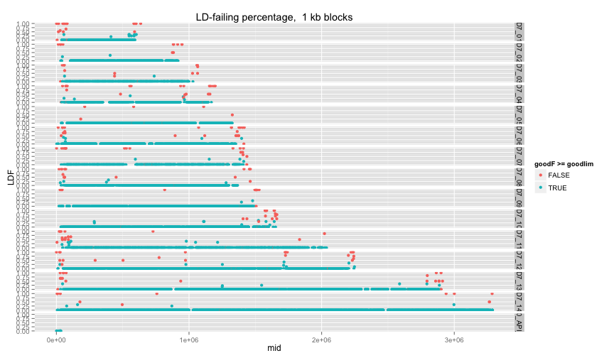
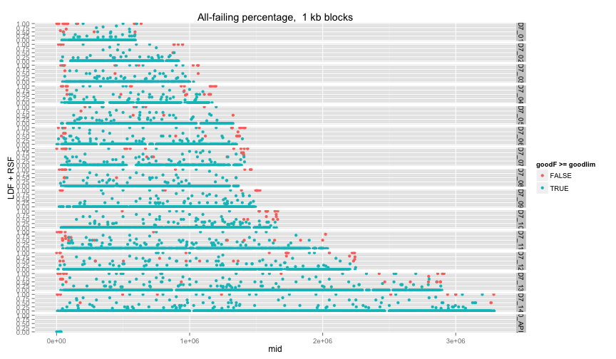
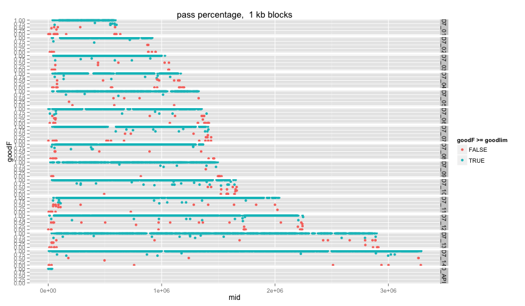

library(ggplot2)
library(knitr)
library(reshape2)
library(hexbin)

```r
opts_chunk$set(fig.width=12, fig.height=7)

matchlevels <- c("",     "NUCMER","DISCO","HAPLO","NUCMER,DISCO","NUCMER,HAPLO","DISCO,HAPLO","NUCMER,DISCO,HAPLO")
colours <-     c("black","green", "red",  "blue", "yellow",      "cyan",        "magenta",     "white")
names(colours) <- matchlevels
```


```r
SWnucmer <- read.table("NUCMER.qDD2vr3D7.INDELS.SW.txt",stringsAsFactors = F,sep='\t',header=T)
SWnucmer$set="NUCMER"
SWdisco <- read.table("DISCO.qDD2vr3D7.INDELS.SW.txt",stringsAsFactors = F,sep='\t',header=T)
SWdisco$set="DISCO"
SWscores <- rbind(SWnucmer,SWdisco)
#SWscores <- SWdisco
head(SWscores)
```

```
##   i                 block  L    TD  IL LD N  AS   RS NM XS    set
## 1 1 PFC10_API_IRAB:15420  14 15420 202 15 1 202 1.00  0  0 NUCMER
## 2 2 PFC10_API_IRAB:23945  -1 10297 204  4 1 200 0.98  1  0 NUCMER
## 3 3 PFC10_API_IRAB:23947  -1 10295 204  4 1 200 0.98  1  0 NUCMER
## 4 4 PFC10_API_IRAB:27761   1  6481 202  2 1 202 1.00  0  0 NUCMER
## 5 5 PFC10_API_IRAB:28008   1  6234 202  2 1 202 1.00  0  0 NUCMER
## 6 6 PFC10_API_IRAB:28127  -1  6115 204  4 1 200 0.98  1  0 NUCMER
```

```r
colnames(SWscores)[1:2] <- c("i","var")
SWscores <- cbind(t(as.data.frame(strsplit(SWscores$var,split = ':'))),SWscores)
colnames(SWscores)[1:2] <- c("chr","pos")
SWscores$pos <- as.integer(as.character(SWscores$pos))
```


```r
telos <- readLines("List.subtelomeres.3D7.regions.txt")
telos <- t(as.data.frame(strsplit(telos,split = ':')))
telos <- as.data.frame(cbind(telos[,1],t(as.data.frame(strsplit(telos[,2],split = '-')))))
colnames(telos) <- c("chr","st","en")
telos$st <- as.numeric(as.character(telos$st))
telos$en <- as.numeric(as.character(telos$en))
telos$chr <- as.character(telos$chr)

telos <- merge(subset(telos,st < 1000),subset(telos,st > 1000),by="chr")
colnames(telos) <- c("chr","stL","enL","stR","enR")


SWscores$chr <- as.character(SWscores$chr)
SWscores$telo=F
tmp <- merge(SWscores,telos,by="chr",all.x=T)

tmp[is.na(tmp$stL),c("stL","enL","stR","enR")] <- -1
tmp$telo[tmp$pos < tmp$enL] = T # "L"
tmp$telo[tmp$pos > tmp$stR] = T # "R"
SWscores <- tmp[,colnames(SWscores)]
rm(tmp)
```


```r
SWscores$error=""
SWscores[SWscores$NM>0,"error"]="LDerror"
SWscores[SWscores$RS>1,"error"]="RSerror"

table(SWscores[,c("error","set")])
```

```
##          set
## error     DISCO NUCMER
##           37964  25589
##   LDerror   489  20954
##   RSerror  1464    716
```


```r
blocksize <- 1000
SWscores$block <- paste(SWscores$chr,floor(SWscores$pos/blocksize),sep=":")

varcount <- aggregate(SWscores$var,by=list(SWscores$block),FUN=length)[,2]
means <- as.data.frame(aggregate(SWscores[,c("LD","RS","NM")],by=list(SWscores$block),FUN=mean))
goodcount <- aggregate(SWscores$NM==0,by=list(SWscores$block),FUN=sum)[,2]
LDcount <- aggregate(SWscores$error=="LDerror",by=list(SWscores$block),FUN=sum)[,2]
RScount <- aggregate(SWscores$error=="RSerror",by=list(SWscores$block),FUN=sum)[,2]
colnames(means)[[1]] <- "block"

poschr <- t(as.data.frame(strsplit(means$block,split = ':')))
colnames(poschr) <- c("chr","pos")
poschr <- as.data.frame(poschr)
poschr$pos <- as.numeric(as.character(poschr$pos))
poschr$st = poschr$pos*blocksize
poschr$mid = poschr$st+(blocksize/2)
poschr$en = poschr$st+blocksize

blocksum <- cbind(poschr,means,varcount,goodcount,LDcount,RScount)
fs <- blocksum[,c("goodcount","LDcount","RScount")]/varcount
colnames(fs) <- c("goodF","LDF","RSF")
blocksum <- cbind(blocksum,fs)
rm(fs)
```


```r
goodlim=0.6
ggplot(blocksum,aes(x=mid,y=LDF,colour=goodF>=goodlim)) + 
  ggtitle(paste("LD-failing percentage, ",(blocksize/1000),"kb blocks")) +
  geom_point() + facet_grid(chr ~ .)
```

 

```r
ggplot(blocksum,aes(x=mid,y=RSF,colour=goodF>=goodlim)) + 
  ggtitle(paste("RS-failing* percentage, ",(blocksize/1000),"kb blocks")) +
  geom_point() + facet_grid(chr ~ .)
```

 

```r
ggplot(blocksum,aes(x=mid,y=LDF+RSF,colour=goodF>=goodlim)) + 
  ggtitle(paste("All-failing percentage, ",(blocksize/1000),"kb blocks")) +
  geom_point() + facet_grid(chr ~ .)
```

 

```r
ggplot(blocksum,aes(x=mid,y=goodF,colour=goodF>=goodlim)) + 
  ggtitle(paste("pass percentage, ",(blocksize/1000),"kb blocks")) +
  geom_point() + facet_grid(chr ~ .)
```

 

```r
ggplot(blocksum,aes(x=goodF)) + geom_density(adjust=0.2)
```

 

```r
print(sum(blocksum$goodF>goodlim) / length(blocksum$goodF))
```

```
## [1] 0.7487828
```

```r
write.table(aggregate(blocksum$goodF,by=list(blocksum$chr),function(x) {sum(x>goodlim) / length(x)}))
```

```
## "Group.1" "x"
## "1" "Pf3D7_01_v3" 0.684444444444444
## "2" "Pf3D7_02_v3" 0.763239875389408
## "3" "Pf3D7_03_v3" 0.787598944591029
## "4" "Pf3D7_04_v3" 0.690361445783133
## "5" "Pf3D7_05_v3" 0.719367588932806
## "6" "Pf3D7_06_v3" 0.728456913827655
## "7" "Pf3D7_07_v3" 0.738289205702648
## "8" "Pf3D7_08_v3" 0.748091603053435
## "9" "Pf3D7_09_v3" 0.78008658008658
## "10" "Pf3D7_10_v3" 0.735483870967742
## "11" "Pf3D7_11_v3" 0.744
## "12" "Pf3D7_12_v3" 0.760657734470158
## "13" "Pf3D7_13_v3" 0.762399622106755
## "14" "Pf3D7_14_v3" 0.764227642276423
## "15" "PFC10_API_IRAB" 0.875
```
