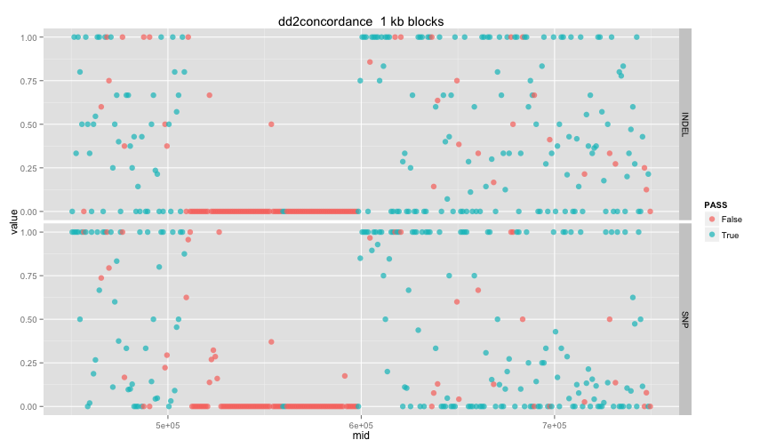
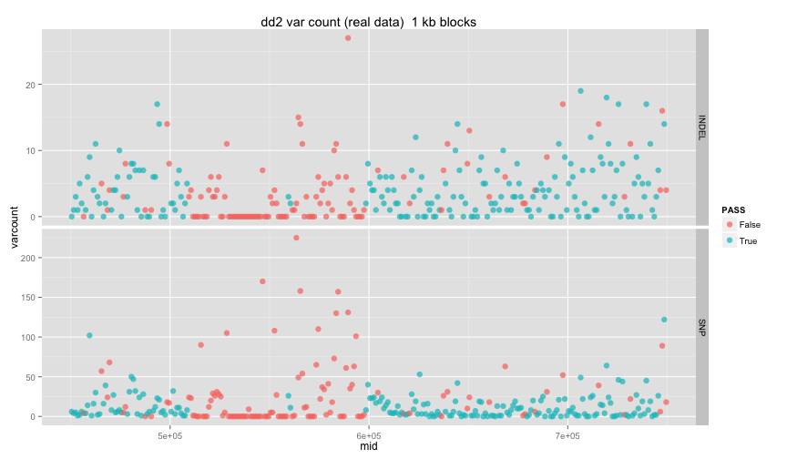
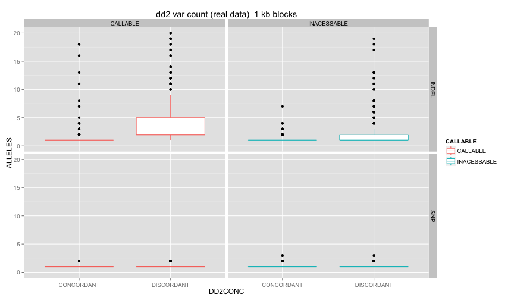

library(ggplot2)
library(knitr)
library(reshape2)
library(hexbin)

```r
opts_chunk$set(fig.width=12, fig.height=7)

matchlevels <- c("",     "NUCMER","DISCO","HAPLO","NUCMER,DISCO","NUCMER,HAPLO","DISCO,HAPLO","NUCMER,DISCO,HAPLO")
colours <-     c("black","green", "red",  "blue", "yellow",      "cyan",        "magenta",     "white")
names(colours) <- matchlevels
```


```r
dd2cf <- read.table("3D7DD2_all_10k.DD2c.STRs.CALLABLE.MATCHED.txt",stringsAsFactors = F,sep='\t',header=T)
#3D7 only:
sum(dd2cf$DD2CALLRATE==0)
```

```
## [1] 1616
```

```r
#DD2 SNPs:
sum(dd2cf$DD2CALLRATE>=0)
```

```
## [1] 8040
```

```r
dd2cf <- dd2cf[dd2cf$DD2CALLRATE>0,]
dd2cf$dd2 <- paste(dd2cf$DD2CONC,dd2cf$DD2ALL)
#dd2cf[(dd2cf$DD2CALLRATE<1 & dd2cf$DD2CONS != ""),]

dd2cfI <- dd2cf[dd2cf$TYPE=="INDEL",]
dd2cfS <- dd2cf[dd2cf$TYPE=="SNP",]

dd2cf$CALLABLE[dd2cf$CALLABLE == ""] = "INACESSABLE"
dd2cf$DD2CONC[dd2cf$DD2CONC == ""] = "DISCORDANT"
dd2cf$DD2CONC[dd2cf$DD2CONC == "DD2CONC"] = "CONCORDANT"
```


```r
callable <- read.table("callable_halfmeg.txt",stringsAsFactors = F,sep='\t')
colnames(callable) <- c("chr","st","en","vars","nmfails","NMpass","rsfails","RSpass","cov","len","covpass","PASS")
callable$mid <- callable$st + ((callable$en-callable$st)/2)
callable <- callable[,c("chr","mid","PASS")]
```


```r
#make indel blockscores
blocksize <- 1000

dd2cfI$block <-   paste(dd2cfI$CHR,floor(dd2cfI$POS/blocksize),sep=":")

varcount <- aggregate(dd2cfI$POS,by=list(dd2cfI$block),FUN=length)[,2]
callcount <- aggregate(dd2cfI$CALLABLE!="",by=list(dd2cfI$block),FUN=sum)[,2]

means <- as.data.frame(aggregate(dd2cfI[,c("ALLELES")],by=list(dd2cfI$block),FUN=mean))
conscount <- aggregate(dd2cfI$DD2CONS!="",by=list(dd2cfI$block),FUN=sum)[,2]
conccount <- aggregate(dd2cfI$DD2CONC!="",by=list(dd2cfI$block),FUN=sum)[,2]
allcount <- aggregate(dd2cfI$DD2ALL!="",by=list(dd2cfI$block),FUN=sum)[,2]
colnames(means) <- c("block","mean_alleles")

poschr <- t(as.data.frame(strsplit(means$block,split = ':')))
colnames(poschr) <- c("chr","pos")
poschr <- as.data.frame(poschr)
poschr$pos <- as.numeric(as.character(poschr$pos))
poschr$st = poschr$pos*blocksize
poschr$mid = poschr$st+(blocksize/2)
poschr$en = poschr$st+blocksize

blocksumI <- cbind(poschr,means,varcount,conscount,conccount,allcount)
fs <- blocksumI[,c("conscount","conccount","allcount")]/varcount
colnames(fs) <- c("consF","concF","allF")
blocksumI <- cbind(blocksumI,fs)
rm(fs)

blocksumI <- merge(callable,blocksumI,by=c("chr","mid"),all.x=T)
blocksumI[is.na(blocksumI)] <- 0

dd2cfS$block <-   paste(dd2cfS$CHR,floor(dd2cfS$POS/blocksize),sep=":")

varcount <- aggregate(dd2cfS$POS,by=list(dd2cfS$block),FUN=length)[,2]
callcount <- aggregate(dd2cfS$CALLABLE!="",by=list(dd2cfS$block),FUN=sum)[,2]

means <- as.data.frame(aggregate(dd2cfS[,c("ALLELES")],by=list(dd2cfS$block),FUN=mean))
conscount <- aggregate(dd2cfS$DD2CONS!="",by=list(dd2cfS$block),FUN=sum)[,2]
conccount <- aggregate(dd2cfS$DD2CONC!="",by=list(dd2cfS$block),FUN=sum)[,2]
allcount <- aggregate(dd2cfS$DD2ALL!="",by=list(dd2cfS$block),FUN=sum)[,2]
colnames(means) <- c("block","mean_alleles")

poschr <- t(as.data.frame(strsplit(means$block,split = ':')))
colnames(poschr) <- c("chr","pos")
poschr <- as.data.frame(poschr)
poschr$pos <- as.numeric(as.character(poschr$pos))
poschr$st = poschr$pos*blocksize
poschr$mid = poschr$st+(blocksize/2)
poschr$en = poschr$st+blocksize

blocksumS <- cbind(poschr,means,varcount,conscount,conccount,allcount)
fs <- blocksumS[,c("conscount","conccount","allcount")]/varcount
colnames(fs) <- c("consF","concF","allF")
blocksumS <- cbind(blocksumS,fs)
rm(fs)

blocksumS <- merge(callable,blocksumS,by=c("chr","mid"),all.x=T)
blocksumS[is.na(blocksumS)] <- 0

head(blocksumI)
```

```
##           chr    mid PASS pos     st     en           block mean_alleles
## 1 Pf3D7_07_v3 450500 True   0      0      0               0      0.00000
## 2 Pf3D7_07_v3 451500 True 451 451000 452000 Pf3D7_07_v3:451      1.00000
## 3 Pf3D7_07_v3 452500 True 452 452000 453000 Pf3D7_07_v3:452     39.66667
## 4 Pf3D7_07_v3 453500 True 453 453000 454000 Pf3D7_07_v3:453      1.00000
## 5 Pf3D7_07_v3 454500 True 454 454000 455000 Pf3D7_07_v3:454      3.80000
## 6 Pf3D7_07_v3 455500 True 455 455000 456000 Pf3D7_07_v3:455     47.00000
##   varcount conscount conccount allcount     consF     concF      allF
## 1        0         0         0        0 0.0000000 0.0000000 0.0000000
## 2        1         1         1        1 1.0000000 1.0000000 1.0000000
## 3        3         1         1        1 0.3333333 0.3333333 0.3333333
## 4        1         1         1        1 1.0000000 1.0000000 1.0000000
## 5        5         3         4        5 0.6000000 0.8000000 1.0000000
## 6        2         2         1        2 1.0000000 0.5000000 1.0000000
```

```r
head(blocksumS)
```

```
##           chr    mid PASS pos     st     en           block mean_alleles
## 1 Pf3D7_07_v3 450500 True 450 450000 451000 Pf3D7_07_v3:450            1
## 2 Pf3D7_07_v3 451500 True 451 451000 452000 Pf3D7_07_v3:451            1
## 3 Pf3D7_07_v3 452500 True 452 452000 453000 Pf3D7_07_v3:452            1
## 4 Pf3D7_07_v3 453500 True 453 453000 454000 Pf3D7_07_v3:453            1
## 5 Pf3D7_07_v3 454500 True 454 454000 455000 Pf3D7_07_v3:454            1
## 6 Pf3D7_07_v3 455500 True 455 455000 456000 Pf3D7_07_v3:455            1
##   varcount conscount conccount allcount     consF concF allF
## 1        6         4         6        6 0.6666667   1.0  1.0
## 2        4         3         4        4 0.7500000   1.0  1.0
## 3        5         4         5        5 0.8000000   1.0  1.0
## 4        1         1         1        1 1.0000000   1.0  1.0
## 5        2         1         1        1 0.5000000   0.5  0.5
## 6        6         6         6        6 1.0000000   1.0  1.0
```

#INDELS ONLY

```r
blocksumIM <- melt(blocksumI[,c("mid","PASS","varcount","st","concF")],id.vars = c("mid","PASS","st","varcount"))
blocksumSM <- melt(blocksumS[,c("mid","PASS","varcount","st","concF")],id.vars = c("mid","PASS","st","varcount"))

blocksumIM$type="INDEL"
blocksumSM$type="SNP"
blocksumM <- rbind(blocksumIM,blocksumSM)

blocksumI$type="INDEL"
blocksumS$type="SNP"
blocksum <- rbind(blocksumI,blocksumS)
```


#dd2 concordance

```r
ggplot(blocksumM,aes(x=mid,y=value,colour=PASS)) + 
  ggtitle(paste("dd2concordance ",(blocksize/1000),"kb blocks")) +
  geom_point(size=3,alpha=0.7) + facet_grid(type ~ .)
```

 

```r
# ggplot(blocksumIM,aes(x=mid,y=value)) + 
#   ggtitle(paste("dd2concordance INDELs",(blocksize/1000),"kb blocks")) +
#   geom_hex() + facet_grid(PASS ~ .)
# ggplot(blocksumSM,aes(x=mid,y=value)) + 
#   ggtitle(paste("dd2concordance, SNPs ",(blocksize/1000),"kb blocks")) +
#   geom_hex() + facet_grid(PASS ~ .)
# 

ggplot(blocksumM,aes(x=mid,y=varcount,colour=PASS)) + 
  ggtitle(paste("dd2 var count (real data) ",(blocksize/1000),"kb blocks")) +
  geom_point(size=3,alpha=0.7) + facet_grid(type ~ .,scales = "free_y")
```

 

#hypervariables?

```r
ggplot(dd2cf,aes(x=DD2CONC,y=ALLELES,colour=CALLABLE)) + 
  ggtitle(paste("dd2 var count (real data) ",(blocksize/1000),"kb blocks")) +
  geom_boxplot() + facet_grid(TYPE ~ CALLABLE,scales="free_y") + ylim(0,20)
```

```
## Warning: Removed 68 rows containing non-finite values (stat_boxplot).
```

```
## Warning: Removed 19 rows containing non-finite values (stat_boxplot).
```

 

```r
table(dd2cf[,c("CALLABLE","DD2CONC")])
```

```
##              DD2CONC
## CALLABLE      CONCORDANT DISCORDANT
##   CALLABLE           985       1964
##   INACESSABLE        415       3060
```
