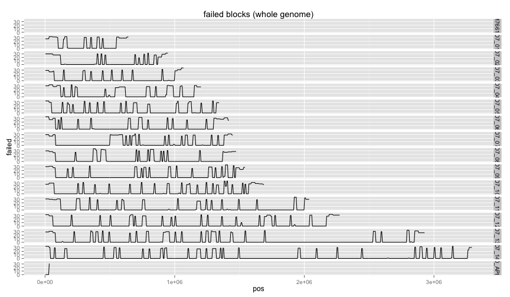
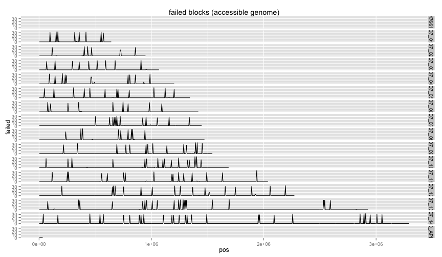

library(ggplot2)
library(knitr)
library(reshape2)
library(hexbin)

```r
opts_chunk$set(fig.width=12, fig.height=7)
```


```r
incomplete_all <- read.table("all_not_done.tab.5k.txt",stringsAsFactors = F,sep='\t',header=T,col.names=c("chrom","s","e","access","failed"))
#3D7 only:
incomplete_acc <- read.table("access_not_done.tab.5k.txt",stringsAsFactors = F,sep='\t',header=T,col.names=c("chrom","s","e","access","failed"))

incomplete_all$pos=incomplete_all$s+2500
incomplete_acc$pos=incomplete_all$s+2500
```


#INDELS ONLY
#dd2 concordance

```r
ggplot(incomplete_all,aes(x=pos,y=failed)) + 
  ggtitle(paste("failed blocks (whole genome)")) +
  geom_line() + 
  facet_grid(chrom ~ .)
```

```
## geom_path: Each group consist of only one observation. Do you need to adjust the group aesthetic?
```

 

```r
ggplot(incomplete_acc,aes(x=pos,y=failed)) + 
  ggtitle(paste("failed blocks (accessible genome)")) +
  geom_line() + 
  facet_grid(chrom ~ .)
```

```
## geom_path: Each group consist of only one observation. Do you need to adjust the group aesthetic?
```

 

