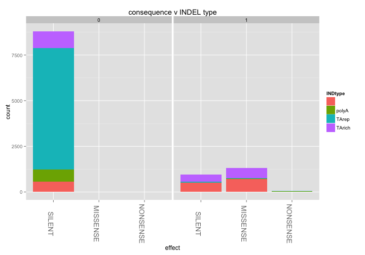
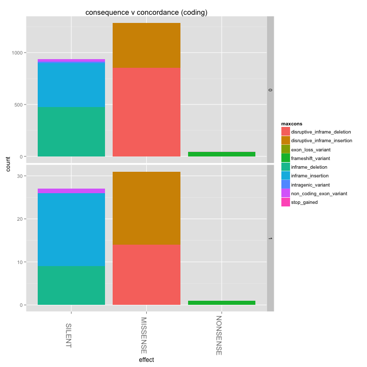
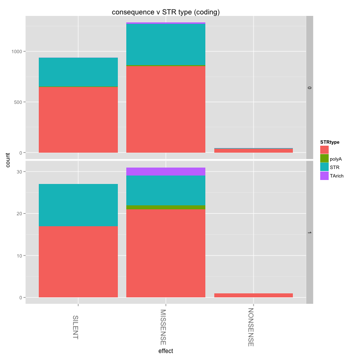

library(ggplot2)
library(knitr)
library(reshape2)
library(hexbin)

```r
opts_chunk$set(fig.width=12, fig.height=7)

# matchlevels <- c("",     "NUCMER","DISCO","HAPLO","NUCMER,DISCO","NUCMER,HAPLO","DISCO,HAPLO","NUCMER,DISCO,HAPLO")
# colours <-     c("black","green", "red",  "blue", "yellow",      "cyan",        "magenta",     "white")
# names(colours) <- matchlevels
```


```r
#vartypes <- read.table("pfx_v_3D7DD2fullrun_miss0callable.PASS.DD2CONC.R3.varClass.txt",stringsAsFactors = F,sep='\t',header=T)
vartypes <- read.table("pfx_v_3D7DD2fullrun_miss0callable.PASS.DD2CONC.VARCLASS.varClass.txt",stringsAsFactors = F,sep='\t',header=T)
#3D7 only:
vartypes$refsAbsent = vartypes$FDKRefAbsent
vartypes$anyDiscord = vartypes$X2D4Discord | vartypes$FDKDiscord | vartypes$FDK2D4Incons
vartypes$anyDiscord <- as.numeric(vartypes$anyDiscord)
vartypes$abslen = abs(vartypes$varlen)

vartypes$STR = 0
vartypes$STR[vartypes$STRtype != ""] <- 1

vartypes$coding[vartypes$coding=="intergenic"] <- 0
vartypes$coding[vartypes$coding=="coding"] <- 1
#head(vartypes$coding,50)
vartypes$coding <- as.numeric(vartypes$coding)
#head(vartypes$coding,50)


#set max call length to read length (only one above this)
#vartypes <- subset(vartypes,abslen < 500)
vartypes$maxcons = vartypes$consequence
vartypes$maxcons[vartypes$consequence==""] <- "intergenic"
vartypes$maxcons <- unlist(lapply(vartypes$maxcons,FUN=function(x) {unlist(strsplit(x,split ='&'))[[1]]}))

vartypes$effect="NONE"
vartypes$effect[vartypes$maxcons %in% c("frameshift_variant","stop_lost","start_lost","stop_gained","exon_loss_variant")] <- "NONSENSE"
vartypes$effect[vartypes$maxcons %in% c("missense_variant","disruptive_inframe_insertion","disruptive_inframe_deletion","splice_region_variant")] <- "MISSENSE"
vartypes$effect[vartypes$maxcons %in% c("inframe_insertion","inframe_deletion","synonymous_variant","intergenic","intragenic_variant","non_coding_exon_variant")] <- "NEUTRAL"

                           

indels <- subset(vartypes,vartype=="INDEL")
snps <- subset(vartypes,vartype=="SNP")
```


```r
# #subset(vartypes,anyDiscord)
# #summary(indels[,c("STR","DUST","coding","anyDiscord","effect")])
# colMeans(indels[,c("STR","DUST","coding","anyDiscord")])
# #no appreciable drop in discordance with STRs
# colMeans(subset(indels,STR==1)[,c("STR","DUST","coding","anyDiscord")])
# colMeans(subset(indels,STRtype=="STR")[,c("STR","DUST","coding","anyDiscord")])
# colMeans(subset(indels,STRtype=="polyA")[,c("STR","DUST","coding","anyDiscord")])
# colMeans(subset(indels,STRtype=="TArich")[,c("STR","DUST","coding","anyDiscord")])
# #large increase in discordance with TA-repeats
# colMeans(subset(indels,STRtype=="TArep")[,c("STR","DUST","coding","anyDiscord")])
# 
# colMeans(subset(snps,STR==1)[,c("STR","DUST","coding","anyDiscord")])
# colMeans(subset(snps,STRtype=="STR")[,c("STR","DUST","coding","anyDiscord")])
# colMeans(subset(snps,STRtype=="polyA")[,c("STR","DUST","coding","anyDiscord")])
# colMeans(subset(snps,STRtype=="TArich")[,c("STR","DUST","coding","anyDiscord")])
# colMeans(subset(snps,STRtype=="TArep")[,c("STR","DUST","coding","anyDiscord")])
```

#INDEL SIZE DISTRIBUTION

```r
#indels are longer in STRs
ggplot(indels,aes(x=abslen,colour=STRtype,group=STRtype)) + 
  ggtitle(paste("indel length by STR presence / type")) +
  geom_density(size=1,alpha=0.7) +
  xlim(0,50)
```

```
## Warning: Removed 64 rows containing non-finite values (stat_density).
```

```
## Warning: Removed 4 rows containing non-finite values (stat_density).
```

```
## Warning: Removed 82 rows containing non-finite values (stat_density).
```

 

```r
#SOME V LONG INDELS
indels[indels$abslen > 50,c("chr","pos","vartype","STRtype","varlen","coding","consequence")]
```

```
##               chr     pos vartype STRtype varlen coding
## 67    Pf3D7_01_v3  151056   INDEL            -63      1
## 340   Pf3D7_01_v3  389887   INDEL     STR   -135      1
## 446   Pf3D7_01_v3  514968   INDEL             60      1
## 772   Pf3D7_01_v3  535713   INDEL             72      1
## 860   Pf3D7_02_v3  145149   INDEL     STR     66      1
## 949   Pf3D7_02_v3  243918   INDEL             54      0
## 1317  Pf3D7_02_v3  562165   INDEL     STR    -54      1
## 1408  Pf3D7_02_v3  712997   INDEL     STR   -105      1
## 1478  Pf3D7_02_v3  771705   INDEL     STR    -52      0
## 1935  Pf3D7_03_v3  416399   INDEL     STR    -63      1
## 1961  Pf3D7_03_v3  431059   INDEL     STR    -81      1
## 2079  Pf3D7_03_v3  563781   INDEL     STR     66      1
## 2097  Pf3D7_03_v3  575748   INDEL            -72      1
## 2144  Pf3D7_03_v3  629619   INDEL     STR     54      1
## 2145  Pf3D7_03_v3  629619   INDEL     STR     54      1
## 2244  Pf3D7_03_v3  703302   INDEL             72      1
## 2438  Pf3D7_03_v3  959731   INDEL            -72      1
## 2439  Pf3D7_03_v3  959731   INDEL            -72      1
## 2785  Pf3D7_04_v3  287150   INDEL             66      1
## 2860  Pf3D7_04_v3  348127   INDEL     STR    -54      0
## 2872  Pf3D7_04_v3  357667   INDEL     STR    -63      1
## 3400  Pf3D7_04_v3  863671   INDEL             90      1
## 3469  Pf3D7_04_v3  899348   INDEL            -63      1
## 3535  Pf3D7_04_v3  927535   INDEL            -57      1
## 3679  Pf3D7_04_v3 1032035   INDEL            -60      1
## 4126  Pf3D7_05_v3  272634   INDEL            -72      1
## 4474  Pf3D7_05_v3  614963   INDEL   polyA    -53      0
## 4477  Pf3D7_05_v3  631839   INDEL     STR    -72      1
## 4570  Pf3D7_05_v3  700571   INDEL     STR     81      1
## 4576  Pf3D7_05_v3  704847   INDEL             60      1
## 4891  Pf3D7_05_v3 1060658   INDEL     STR   -165      1
## 4896  Pf3D7_05_v3 1062215   INDEL     STR    -51      1
## 5077  Pf3D7_05_v3 1192034   INDEL     STR    -60      0
## 5435  Pf3D7_06_v3  340616   INDEL             84      1
## 5518  Pf3D7_06_v3  428124   INDEL             72      1
## 5669  Pf3D7_06_v3  556608   INDEL            -90      1
## 5681  Pf3D7_06_v3  566662   INDEL             54      1
## 5701  Pf3D7_06_v3  569919   INDEL     STR    -54      1
## 5702  Pf3D7_06_v3  569919   INDEL     STR    -54      1
## 5706  Pf3D7_06_v3  575948   INDEL     STR    -60      1
## 5830  Pf3D7_06_v3  682232   INDEL            108      1
## 6322  Pf3D7_06_v3 1151260   INDEL            -63      1
## 6538  Pf3D7_07_v3  152597   INDEL     STR    -72      1
## 6988  Pf3D7_07_v3  465697   INDEL             63      1
## 7080  Pf3D7_07_v3  468576   INDEL            -84      1
## 7563  Pf3D7_07_v3  779481   INDEL     STR    -69      1
## 7800  Pf3D7_07_v3 1006208   INDEL     STR   -107      0
## 7949  Pf3D7_07_v3 1184822   INDEL     STR    -51      1
## 8226  Pf3D7_08_v3  135143   INDEL     STR    135      1
## 8248  Pf3D7_08_v3  182306   INDEL     STR    -72      1
## 8358  Pf3D7_08_v3  244441   INDEL     STR    -84      1
## 8390  Pf3D7_08_v3  264661   INDEL             84      1
## 8404  Pf3D7_08_v3  276606   INDEL     STR     63      1
## 8488  Pf3D7_08_v3  354633   INDEL     STR    120      1
## 8573  Pf3D7_08_v3  415871   INDEL     STR   -122      0
## 9294  Pf3D7_08_v3 1169607   INDEL     STR    -60      1
## 9406  Pf3D7_08_v3 1259657   INDEL     STR     60      0
## 9642  Pf3D7_09_v3  119351   INDEL     STR    -51      1
## 10139 Pf3D7_09_v3  526265   INDEL   polyA   -100      0
## 10232 Pf3D7_09_v3  589720   INDEL     STR    -54      1
## 10329 Pf3D7_09_v3  681213   INDEL     STR   -148      0
## 10464 Pf3D7_09_v3  835796   INDEL     STR    -90      1
## 10610 Pf3D7_09_v3  952082   INDEL     STR    -54      1
## 10639 Pf3D7_09_v3  996714   INDEL     STR   -180      1
## 10683 Pf3D7_09_v3 1034882   INDEL     STR   -105      1
## 10762 Pf3D7_09_v3 1110805   INDEL            -72      1
## 10874 Pf3D7_09_v3 1194318   INDEL     STR    -93      1
## 11059 Pf3D7_09_v3 1301332   INDEL     STR    -60      1
## 11232 Pf3D7_09_v3 1437364   INDEL            -60      1
## 11417 Pf3D7_10_v3  135605   INDEL     STR     72      1
## 11468 Pf3D7_10_v3  215883   INDEL     STR   -118      0
## 11679 Pf3D7_10_v3  395461   INDEL     STR    -99      1
## 11731 Pf3D7_10_v3  453677   INDEL   polyA    -66      0
## 12138 Pf3D7_10_v3  837912   INDEL             54      1
## 12177 Pf3D7_10_v3  891174   INDEL             63      1
## 12297 Pf3D7_10_v3 1033861   INDEL     STR   -184      0
## 12319 Pf3D7_10_v3 1043914   INDEL     STR   -156      1
## 13032 Pf3D7_10_v3 1500605   INDEL             66      0
## 13540 Pf3D7_11_v3  484196   INDEL     STR    -72      1
## 13609 Pf3D7_11_v3  529385   INDEL     STR    -70      0
## 13713 Pf3D7_11_v3  648856   INDEL     STR   -102      1
## 13851 Pf3D7_11_v3  776894   INDEL            -54      1
## 13883 Pf3D7_11_v3  806771   INDEL             90      1
## 14009 Pf3D7_11_v3  994250   INDEL            -54      1
## 14060 Pf3D7_11_v3 1034394   INDEL     STR    177      1
## 14254 Pf3D7_11_v3 1259714   INDEL     STR   -146      0
## 14255 Pf3D7_11_v3 1259714   INDEL     STR   -146      0
## 14437 Pf3D7_11_v3 1428186   INDEL            -51      1
## 14651 Pf3D7_11_v3 1624286   INDEL           -105      1
## 15046 Pf3D7_11_v3 1954874   INDEL             69      1
## 15050 Pf3D7_11_v3 1955393   INDEL            -60      1
## 15593 Pf3D7_12_v3  631751   INDEL             54      1
## 15684 Pf3D7_12_v3  750600   INDEL     STR    -81      1
## 15735 Pf3D7_12_v3  839508   INDEL            -81      1
## 15788 Pf3D7_12_v3  914410   INDEL            198      1
## 15864 Pf3D7_12_v3  967359   INDEL             54      1
## 15977 Pf3D7_12_v3 1092797   INDEL   polyA   -187      0
## 16025 Pf3D7_12_v3 1124649   INDEL     STR    -55      0
## 16069 Pf3D7_12_v3 1171455   INDEL             75      1
## 16073 Pf3D7_12_v3 1174961   INDEL     STR    -72      1
## 16193 Pf3D7_12_v3 1316708   INDEL     STR     72      1
## 16340 Pf3D7_12_v3 1422378   INDEL            -54      1
## 16380 Pf3D7_12_v3 1456929   INDEL            -60      0
## 16460 Pf3D7_12_v3 1541135   INDEL            -72      1
## 16464 Pf3D7_12_v3 1543017   INDEL     STR   -156      1
## 16513 Pf3D7_12_v3 1578708   INDEL           -348      1
## 16520 Pf3D7_12_v3 1583456   INDEL            -56      0
## 16652 Pf3D7_12_v3 1782453   INDEL     STR     90      1
## 16737 Pf3D7_12_v3 1892630   INDEL             54      1
## 16949 Pf3D7_12_v3 2036986   INDEL             54      1
## 17139 Pf3D7_13_v3  103931   INDEL            330      1
## 17419 Pf3D7_13_v3  241485   INDEL          -1748      1
## 17544 Pf3D7_13_v3  375083   INDEL             54      1
## 17553 Pf3D7_13_v3  379458   INDEL     STR     84      1
## 17634 Pf3D7_13_v3  473991   INDEL     STR    -72      1
## 17787 Pf3D7_13_v3  729046   INDEL     STR    -63      1
## 17941 Pf3D7_13_v3  898544   INDEL     STR    -56      0
## 17980 Pf3D7_13_v3 1005086   INDEL     STR    -54      1
## 17982 Pf3D7_13_v3 1007790   INDEL     STR    -90      1
## 17990 Pf3D7_13_v3 1014642   INDEL     STR    -90      1
## 18018 Pf3D7_13_v3 1082084   INDEL     STR    -63      1
## 18127 Pf3D7_13_v3 1168308   INDEL     STR     80      0
## 18129 Pf3D7_13_v3 1168988   INDEL     STR    -54      0
## 18306 Pf3D7_13_v3 1323089   INDEL     STR    -69      0
## 18356 Pf3D7_13_v3 1386385   INDEL     STR   -213      1
## 18608 Pf3D7_13_v3 1607473   INDEL     STR    -60      1
## 18712 Pf3D7_13_v3 1748951   INDEL     STR     60      1
## 19040 Pf3D7_13_v3 2120022   INDEL     STR    198      1
## 19227 Pf3D7_13_v3 2380474   INDEL             51      0
## 19230 Pf3D7_13_v3 2381684   INDEL             54      1
## 19597 Pf3D7_13_v3 2703947   INDEL            -66      1
## 19733 Pf3D7_13_v3 2834696   INDEL            140      0
## 20392 Pf3D7_14_v3  719973   INDEL             81      1
## 20393 Pf3D7_14_v3  719973   INDEL             81      1
## 20543 Pf3D7_14_v3  950955   INDEL     STR   -108      1
## 20684 Pf3D7_14_v3 1073596   INDEL            -56      0
## 20744 Pf3D7_14_v3 1131073   INDEL     STR    -89      0
## 20787 Pf3D7_14_v3 1161731   INDEL            -60      1
## 21215 Pf3D7_14_v3 1570916   INDEL             54      0
## 21446 Pf3D7_14_v3 1814267   INDEL     STR    -66      1
## 21760 Pf3D7_14_v3 2135736   INDEL            108      1
## 21815 Pf3D7_14_v3 2256213   INDEL     STR     78      0
## 21863 Pf3D7_14_v3 2285669   INDEL     STR     62      0
## 21874 Pf3D7_14_v3 2298877   INDEL     STR   -105      1
## 21928 Pf3D7_14_v3 2379067   INDEL     STR    -60      1
## 22023 Pf3D7_14_v3 2479234   INDEL             60      1
## 22243 Pf3D7_14_v3 2740298   INDEL            -96      1
## 22473 Pf3D7_14_v3 3015684   INDEL     STR     60      1
## 22715 Pf3D7_14_v3 3202180   INDEL     STR    223      0
## 22812 Pf3D7_14_v3 3250529   INDEL            -59      1
##                                    consequence
## 67                 disruptive_inframe_deletion
## 340                           inframe_deletion
## 446               disruptive_inframe_insertion
## 772               disruptive_inframe_insertion
## 860                          inframe_insertion
## 949                                           
## 1317                          inframe_deletion
## 1408               disruptive_inframe_deletion
## 1478                                          
## 1935                          inframe_deletion
## 1961               disruptive_inframe_deletion
## 2079                         inframe_insertion
## 2097               disruptive_inframe_deletion
## 2144              disruptive_inframe_insertion
## 2145              disruptive_inframe_insertion
## 2244                         inframe_insertion
## 2438               disruptive_inframe_deletion
## 2439               disruptive_inframe_deletion
## 2785                         inframe_insertion
## 2860                                          
## 2872               disruptive_inframe_deletion
## 3400              disruptive_inframe_insertion
## 3469                          inframe_deletion
## 3535               disruptive_inframe_deletion
## 3679                          inframe_deletion
## 4126                          inframe_deletion
## 4474                                          
## 4477               disruptive_inframe_deletion
## 4570                         inframe_insertion
## 4576                         inframe_insertion
## 4891                          inframe_deletion
## 4896                          inframe_deletion
## 5077                                          
## 5435                         inframe_insertion
## 5518              disruptive_inframe_insertion
## 5669               disruptive_inframe_deletion
## 5681                         inframe_insertion
## 5701                          inframe_deletion
## 5702                          inframe_deletion
## 5706               disruptive_inframe_deletion
## 5830                         inframe_insertion
## 6322               disruptive_inframe_deletion
## 6538               disruptive_inframe_deletion
## 6988              disruptive_inframe_insertion
## 7080                          inframe_deletion
## 7563                          inframe_deletion
## 7800                                          
## 7949               disruptive_inframe_deletion
## 8226                         inframe_insertion
## 8248                          inframe_deletion
## 8358               disruptive_inframe_deletion
## 8390                         inframe_insertion
## 8404                         inframe_insertion
## 8488              disruptive_inframe_insertion
## 8573                                          
## 9294               disruptive_inframe_deletion
## 9406                                          
## 9642               disruptive_inframe_deletion
## 10139                                         
## 10232                         inframe_deletion
## 10329                                         
## 10464              disruptive_inframe_deletion
## 10610              disruptive_inframe_deletion
## 10639              disruptive_inframe_deletion
## 10683              disruptive_inframe_deletion
## 10762              disruptive_inframe_deletion
## 10874                         inframe_deletion
## 11059              disruptive_inframe_deletion
## 11232                         inframe_deletion
## 11417             disruptive_inframe_insertion
## 11468                                         
## 11679                         inframe_deletion
## 11731                                         
## 12138             disruptive_inframe_insertion
## 12177                        inframe_insertion
## 12297                                         
## 12319              disruptive_inframe_deletion
## 13032                                         
## 13540              disruptive_inframe_deletion
## 13609                                         
## 13713                         inframe_deletion
## 13851                         inframe_deletion
## 13883                        inframe_insertion
## 14009              disruptive_inframe_deletion
## 14060                        inframe_insertion
## 14254                                         
## 14255                                         
## 14437                         inframe_deletion
## 14651                         inframe_deletion
## 15046                        inframe_insertion
## 15050                         inframe_deletion
## 15593                        inframe_insertion
## 15684                         inframe_deletion
## 15735              disruptive_inframe_deletion
## 15788 stop_gained&disruptive_inframe_insertion
## 15864                        inframe_insertion
## 15977                                         
## 16025                                         
## 16069                        inframe_insertion
## 16073              disruptive_inframe_deletion
## 16193             disruptive_inframe_insertion
## 16340                         inframe_deletion
## 16380                                         
## 16460              disruptive_inframe_deletion
## 16464              disruptive_inframe_deletion
## 16513                         inframe_deletion
## 16520                                         
## 16652                        inframe_insertion
## 16737             disruptive_inframe_insertion
## 16949                        inframe_insertion
## 17139             disruptive_inframe_insertion
## 17419                        exon_loss_variant
## 17544             disruptive_inframe_insertion
## 17553                        inframe_insertion
## 17634                         inframe_deletion
## 17787              disruptive_inframe_deletion
## 17941                                         
## 17980                         inframe_deletion
## 17982              disruptive_inframe_deletion
## 17990              disruptive_inframe_deletion
## 18018              disruptive_inframe_deletion
## 18127                                         
## 18129                                         
## 18306                                         
## 18356              disruptive_inframe_deletion
## 18608              disruptive_inframe_deletion
## 18712             disruptive_inframe_insertion
## 19040                        inframe_insertion
## 19227                                         
## 19230             disruptive_inframe_insertion
## 19597                         inframe_deletion
## 19733                                         
## 20392             disruptive_inframe_insertion
## 20393             disruptive_inframe_insertion
## 20543              disruptive_inframe_deletion
## 20684                                         
## 20744                                         
## 20787                         inframe_deletion
## 21215                                         
## 21446              disruptive_inframe_deletion
## 21760                        inframe_insertion
## 21815                                         
## 21863                                         
## 21874              disruptive_inframe_deletion
## 21928              disruptive_inframe_deletion
## 22023                        inframe_insertion
## 22243                         inframe_deletion
## 22473                        inframe_insertion
## 22715                                         
## 22812                  non_coding_exon_variant
```

```r
ggplot(indels[indels$abslen > 50,],aes(x=abslen,y=vcomplex,colour=STRtype)) + 
  ggtitle(paste("long indels: length v complexity")) +
  xlim(50,400) +
  geom_point(size=3,alpha=1)
```

```
## Warning: Removed 1 rows containing missing values (geom_point).
```

 

```r
ggplot(indels[indels$abslen > 50,],aes(x=abslen,y=vcomplex,colour=STRtype)) + 
  ggtitle(paste("long indels: length v complexity")) +
  xlim(1600,2000) +
  geom_point(size=3,alpha=1)
```

```
## Warning: Removed 149 rows containing missing values (geom_point).
```

 

```r
#RELATIVELY SMALL NUMBER ARE TA REPEATS (possible difficulties in calling really long TA repeats?)
ggplot(indels[indels$abslen > 50,],aes(x=abslen,y=vcomplex,colour=consequence)) + 
  ggtitle(paste("long indels: coding consequences")) +
  xlim(50,400) +theme(legend.position="bottom")+guides(col = guide_legend(nrow = 2))+
  geom_point(size=3,alpha=1)
```

```
## Warning: Removed 1 rows containing missing values (geom_point).
```

 

```r
#RELATIVELY SMALL NUMBER OF CODING SNPs ARE polyA REPEATS (possible difficulties in calling really long TA repeats?)
table(indels[,c("maxcons","STRtype")])
```

```
##                               STRtype
## maxcons                             polyA  STR TArep TArich
##   disruptive_inframe_deletion   576     7  277     0     10
##   disruptive_inframe_insertion  299     2  141     0      5
##   exon_loss_variant               1     0    0     0      0
##   frameshift_variant             39     0    3     0      1
##   inframe_deletion              336     1  145     0      0
##   inframe_insertion             299     5  139     0      1
##   intergenic                   6634   223 1921    14      6
##   intragenic_variant              8     0    4     0      0
##   non_coding_exon_variant        21     0    5     0      0
##   stop_gained                     1     0    0     0      0
```

```r
#RELATIVELY SMALL NUMBER OF CODING SNPs ARE polyA REPEATS (possible difficulties in calling really long TA repeats?)
table(indels[,c("maxcons","INDtype")])
```

```
##                               INDtype
## maxcons                             polyA TArep TArich
##   disruptive_inframe_deletion   444    10    27    389
##   disruptive_inframe_insertion  273     1     7    166
##   exon_loss_variant               1     0     0      0
##   frameshift_variant              9    18    14      2
##   inframe_deletion              279     1     9    193
##   inframe_insertion             227     1    20    196
##   intergenic                    555   670  6652    921
##   intragenic_variant              0     0    12      0
##   non_coding_exon_variant         1    12    13      0
##   stop_gained                     1     0     0      0
```

#tables of STR types and discordance

```r
#aggregate(anyDiscord ~ STRtype + vartype, data=vartypes,FUN = mean)
#aggregate(anyDiscord ~ STRtype + vartype, data=vartypes,FUN = sum)

#where TA-repeats can be called, may have much higher freqs of discordance?
cbind(aggregate(anyDiscord ~ STRtype + vartype, data=vartypes,FUN = function(x) {sum(!is.na(x))})[,1:2],
      "n"=aggregate(anyDiscord ~ STRtype + vartype, data=vartypes,FUN = function(x) {sum(!is.na(x))})[,3],
      "discord"=aggregate(anyDiscord ~ STRtype + vartype, data=vartypes,FUN = sum)[,3],
      "discord_f"=round(aggregate(anyDiscord ~ STRtype + vartype, data=vartypes,FUN = mean)[,"anyDiscord"],3))
```

```
##    STRtype vartype    n discord discord_f
## 1            INDEL 8214     382     0.047
## 2    polyA   INDEL  238      12     0.050
## 3      STR   INDEL 2635      79     0.030
## 4    TArep   INDEL   14       3     0.214
## 5   TArich   INDEL   23       2     0.087
## 6              SNP 8196     191     0.023
## 7    polyA     SNP  158      11     0.070
## 8      STR     SNP 3303     107     0.032
## 9    TArep     SNP    7       0     0.000
## 10  TArich     SNP   37       0     0.000
```

```r
#vast majority of discordant mutations are TA repeat INDELS
cbind(aggregate(anyDiscord ~ INDtype + vartype, data=vartypes,FUN = function(x) {sum(!is.na(x))})[,1:2],
      "n"=aggregate(anyDiscord ~ INDtype + vartype, data=vartypes,FUN = function(x) {sum(!is.na(x))})[,3],
      "discord"=aggregate(anyDiscord ~ INDtype + vartype, data=vartypes,FUN = sum)[,3],
      "discord_f"=round(aggregate(anyDiscord ~ INDtype + vartype, data=vartypes,FUN = mean)[,"anyDiscord"],3))
```

```
##   INDtype vartype     n discord discord_f
## 1           INDEL  1790      49     0.027
## 2   polyA   INDEL   713      19     0.027
## 3   TArep   INDEL  6754     355     0.053
## 4  TArich   INDEL  1867      55     0.029
## 5             SNP 11701     309     0.026
```

```r
#most discordant loci in indels, over half in low-complexity regions
cbind(aggregate(anyDiscord ~ DUST + vartype, data=vartypes,FUN = function(x) {sum(!is.na(x))})[,1:2],
      "n"=aggregate(anyDiscord ~ DUST + vartype, data=vartypes,FUN = function(x) {sum(!is.na(x))})[,3],
      "discord"=aggregate(anyDiscord ~ DUST + vartype, data=vartypes,FUN = sum)[,3],
      "discord_f"=round(aggregate(anyDiscord ~ DUST + vartype, data=vartypes,FUN = mean)[,"anyDiscord"],3))
```

```
##   DUST vartype    n discord discord_f
## 1    0   INDEL 4897     222     0.045
## 2    1   INDEL 6227     256     0.041
## 3    0     SNP 7962     213     0.027
## 4    1     SNP 3739      96     0.026
```


```r
#most indels intergenic or neutral
ggplot(vartypes,aes(x=effect,fill=maxcons,group=maxcons)) + 
  ggtitle(paste("consequence v var type")) +
  geom_bar() + facet_grid(. ~ vartype, scale="free_y") + 
  theme(axis.text.x=element_text(angle=-90,size=14))
```

 


```r
#TA rich STRs more likely to generate missense/nonsense mutations?
ggplot(vartypes,aes(x=effect,fill=maxcons,group=maxcons)) + 
  ggtitle(paste("consequence v STR type")) +
  geom_bar() + facet_grid(STRtype ~ vartype, scale="free_y") + 
  theme(axis.text.x=element_text(angle=-90,size=14))
```

 

```r
ggplot(subset(vartypes,coding==1),aes(x=effect,fill=maxcons,group=maxcons)) + 
  ggtitle(paste("consequence v STR type (coding only)")) +
  geom_bar() + facet_grid(STRtype ~ vartype, scale="free_y") + 
  theme(axis.text.x=element_text(angle=-90,size=14))
```

 


##TA-RICH INDELS MORE LIKELY TO CAUSE CODING CHANGES?

```r
#most indels intergenic or neutral
#TA rich STRs more likely to generate missense/nonsense mutations?
ggplot(indels,aes(x=effect,fill=maxcons,group=maxcons)) + 
  ggtitle(paste("consequence v INDEL type")) +
  geom_bar() + facet_grid(INDtype ~ ., scale="free_y") + 
  theme(axis.text.x=element_text(angle=-90,size=14))
```

 

```r
#MOST CODING DIFFS ARE POLY-A INSERTIONS
ggplot(subset(indels,coding==1),aes(x=effect,fill=maxcons,group=maxcons)) + 
  ggtitle(paste("consequence v INDEL type (coding only)")) +
  geom_bar() + facet_grid(INDtype ~ ., scale="free_y") + 
  theme(axis.text.x=element_text(angle=-90,size=14))
```

 

##VAST MAJORITY OF TA/polyA in intergenic sequence

```r
ggplot(indels,aes(x=effect,fill=INDtype,group=INDtype)) + 
  ggtitle(paste("consequence v INDEL type")) +
  geom_bar() + facet_grid(. ~ coding, scale="free_y") + 
  theme(axis.text.x=element_text(angle=-90,size=14))
```

 

##NO MORE LIKELY TO BE DISCORDANT

```r
# ggplot(indels,aes(x=effect,fill=INDtype,group=INDtype)) + 
#   ggtitle(paste("consequence v INDEL type")) +
#   geom_bar() + facet_grid(anyDiscord ~ coding, scale="free_y") + 
#   theme(axis.text.x=element_text(angle=-90,size=14))

#NO MAJOR DIFFERENCES IN RATIOS FOR CONCORDANT/DISCORDANT VARS
ggplot(subset(indels),aes(x=effect,fill=maxcons,group=maxcons)) + 
  ggtitle(paste("consequence v concordance (all)")) +
  geom_bar() + facet_grid(anyDiscord ~ ., scale="free_y") + 
  theme(axis.text.x=element_text(angle=-90,size=14))
```

 

```r
ggplot(subset(indels,coding==1),aes(x=effect,fill=maxcons,group=maxcons)) + 
  ggtitle(paste("consequence v concordance (coding)")) +
  geom_bar() + facet_grid(anyDiscord ~ ., scale="free_y") + 
  theme(axis.text.x=element_text(angle=-90,size=14))
```

 


```r
#NO MAJOR DIFFERENCES IN RATIOS FOR LOW-COMPLEXITY SEQ
ggplot(subset(indels),aes(x=effect,fill=maxcons,group=maxcons)) + 
  ggtitle(paste("consequence v concordance (all)")) +
  geom_bar() + facet_grid(DUST ~ ., scale="free_y") + 
  theme(axis.text.x=element_text(angle=-90,size=14))
```

 

```r
#NO MAJOR DIFFERENCES IN RATIOS FOR LOW-COMPLEXITY SEQ
ggplot(subset(indels,coding==1),aes(x=effect,fill=maxcons,group=maxcons)) + 
  ggtitle(paste("consequence v concordance (all)")) +
  geom_bar() + facet_grid(DUST ~ ., scale="free_y") + 
  theme(axis.text.x=element_text(angle=-90,size=14))
```

 

