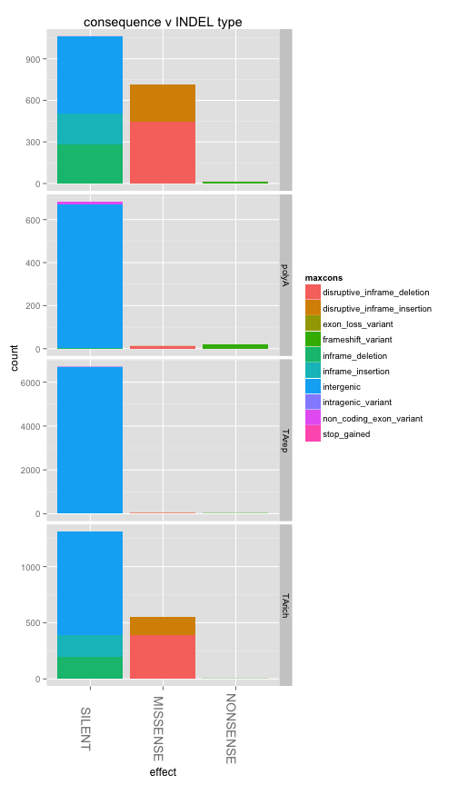
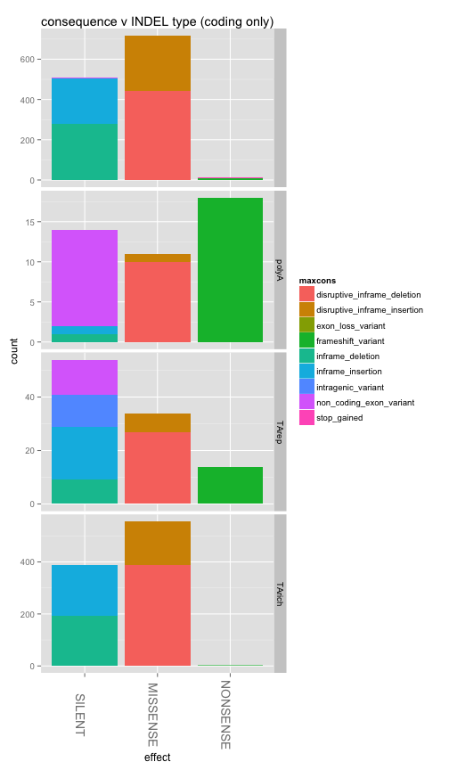

library(ggplot2)
library(knitr)
library(reshape2)
library(hexbin)

```r
opts_chunk$set(fig.width=12, fig.height=7)

# matchlevels <- c("",     "NUCMER","DISCO","HAPLO","NUCMER,DISCO","NUCMER,HAPLO","DISCO,HAPLO","NUCMER,DISCO,HAPLO")
# colours <-     c("black","green", "red",  "blue", "yellow",      "cyan",        "magenta",     "white")
# names(colours) <- matchlevels
```


```r
#vartypes <- read.table("pfx_v_3D7DD2fullrun_miss0callable.PASS.DD2CONC.R3.varClass.txt",stringsAsFactors = F,sep='\t',header=T)
vartypes <- read.table("pfx_v_3D7DD2fullrun_miss0callable.PASS.DD2CONC.VARCLASS.varClass.txt",stringsAsFactors = F,sep='\t',header=T)
#3D7 only:
vartypes$refsAbsent = vartypes$FDKRefAbsent
vartypes$anyDiscord = vartypes$X2D4Discord | vartypes$FDKDiscord | vartypes$FDK2D4Incons
vartypes$anyDiscord <- as.numeric(vartypes$anyDiscord)
vartypes$abslen = abs(vartypes$varlen)

vartypes$STR = 0
vartypes$STR[vartypes$STRtype != ""] <- 1

vartypes$coding[vartypes$coding=="intergenic"] <- 0
vartypes$coding[vartypes$coding=="coding"] <- 1
#head(vartypes$coding,50)
vartypes$coding <- as.numeric(vartypes$coding)
#head(vartypes$coding,50)


#set max call length to read length (only one above this)
#vartypes <- subset(vartypes,abslen < 500)
vartypes$maxcons = vartypes$consequence
vartypes$maxcons[vartypes$consequence==""] <- "intergenic"
vartypes$maxcons <- unlist(lapply(vartypes$maxcons,FUN=function(x) {unlist(strsplit(x,split ='&'))[[1]]}))

vartypes$effect="NONE"
vartypes$effect[vartypes$maxcons %in% c("inframe_insertion","inframe_deletion","synonymous_variant","intergenic","intragenic_variant","non_coding_exon_variant")] <- "SILENT"
vartypes$effect[vartypes$maxcons %in% c("missense_variant","disruptive_inframe_insertion","disruptive_inframe_deletion","splice_region_variant")] <- "MISSENSE"
vartypes$effect[vartypes$maxcons %in% c("frameshift_variant","stop_lost","start_lost","stop_gained","exon_loss_variant")] <- "NONSENSE"
vartypes$effect <- factor(vartypes$effect,levels =c("SILENT","MISSENSE","NONSENSE"))
                           

indels <- subset(vartypes,vartype=="INDEL")
snps <- subset(vartypes,vartype=="SNP")
```


```r
# #subset(vartypes,anyDiscord)
# #summary(indels[,c("STR","DUST","coding","anyDiscord","effect")])
# colMeans(indels[,c("STR","DUST","coding","anyDiscord")])
# #no appreciable drop in discordance with STRs
# colMeans(subset(indels,STR==1)[,c("STR","DUST","coding","anyDiscord")])
# colMeans(subset(indels,STRtype=="STR")[,c("STR","DUST","coding","anyDiscord")])
# colMeans(subset(indels,STRtype=="polyA")[,c("STR","DUST","coding","anyDiscord")])
# colMeans(subset(indels,STRtype=="TArich")[,c("STR","DUST","coding","anyDiscord")])
# #large increase in discordance with TA-repeats
# colMeans(subset(indels,STRtype=="TArep")[,c("STR","DUST","coding","anyDiscord")])
# 
# colMeans(subset(snps,STR==1)[,c("STR","DUST","coding","anyDiscord")])
# colMeans(subset(snps,STRtype=="STR")[,c("STR","DUST","coding","anyDiscord")])
# colMeans(subset(snps,STRtype=="polyA")[,c("STR","DUST","coding","anyDiscord")])
# colMeans(subset(snps,STRtype=="TArich")[,c("STR","DUST","coding","anyDiscord")])
# colMeans(subset(snps,STRtype=="TArep")[,c("STR","DUST","coding","anyDiscord")])
```

#INDEL SIZE DISTRIBUTION

```r
#indels are longer in STRs
ggplot(indels,aes(x=abslen,colour=STRtype,group=STRtype)) + 
  ggtitle(paste("indel length by STR presence / type")) +
  geom_density(size=1,alpha=0.7) +
  xlim(0,50)
```

```
## Warning: Removed 64 rows containing non-finite values (stat_density).
```

```
## Warning: Removed 4 rows containing non-finite values (stat_density).
```

```
## Warning: Removed 82 rows containing non-finite values (stat_density).
```

 

```r
#SOME V LONG INDELS
#indels[indels$abslen > 50,c("chr","pos","vartype","STRtype","varlen","coding","consequence")]
ggplot(indels[indels$abslen > 50,],aes(x=abslen,y=vcomplex,colour=STRtype)) + 
  ggtitle(paste("long indels: length v complexity")) +
  xlim(50,400) + theme(legend.position="none") + 
  geom_point(size=3,alpha=1)
```

```
## Warning: Removed 1 rows containing missing values (geom_point).
```

 

```r
ggplot(indels[indels$abslen > 50,],aes(x=abslen,y=vcomplex,colour=STRtype)) + 
  ggtitle(paste("long indels: length v complexity")) +
  xlim(1600,2000) +
  geom_point(size=3,alpha=1)
```

```
## Warning: Removed 149 rows containing missing values (geom_point).
```

 

```r
#RELATIVELY SMALL NUMBER ARE NON-CODING (possible difficulties in calling really long TA repeats?)
ggplot(indels[indels$abslen > 50,],aes(x=abslen,y=vcomplex,colour=consequence)) + 
  ggtitle(paste("long indels: coding consequences")) +
  xlim(50,400) +theme(legend.position="none")+guides(col = guide_legend(nrow = 2))+
  geom_point(size=3,alpha=1)
```

```
## Warning: Removed 1 rows containing missing values (geom_point).
```

 

```r
#RELATIVELY SMALL NUMBER OF CODING SNPs ARE polyA REPEATS (possible difficulties in calling really long TA repeats?)
table(indels[,c("maxcons","STRtype")])
```

```
##                               STRtype
## maxcons                             polyA  STR TArep TArich
##   disruptive_inframe_deletion   576     7  277     0     10
##   disruptive_inframe_insertion  299     2  141     0      5
##   exon_loss_variant               1     0    0     0      0
##   frameshift_variant             39     0    3     0      1
##   inframe_deletion              336     1  145     0      0
##   inframe_insertion             299     5  139     0      1
##   intergenic                   6634   223 1921    14      6
##   intragenic_variant              8     0    4     0      0
##   non_coding_exon_variant        21     0    5     0      0
##   stop_gained                     1     0    0     0      0
```

```r
#RELATIVELY SMALL NUMBER OF CODING SNPs ARE polyA REPEATS (possible difficulties in calling really long TA repeats?)
table(indels[,c("maxcons","vartype")])
```

```
##                               vartype
## maxcons                        INDEL
##   disruptive_inframe_deletion    870
##   disruptive_inframe_insertion   447
##   exon_loss_variant                1
##   frameshift_variant              43
##   inframe_deletion               482
##   inframe_insertion              444
##   intergenic                    8798
##   intragenic_variant              12
##   non_coding_exon_variant         26
##   stop_gained                      1
```

```r
table(vartypes[,c("coding","vartype")])
```

```
##       vartype
## coding INDEL  SNP
##      0  8798 4734
##      1  2326 6967
```

```r
table(vartypes[,c("DUST","vartype")])
```

```
##     vartype
## DUST INDEL  SNP
##    0  4897 7962
##    1  6227 3739
```

```r
#MODE INDELS V SHORT
sum(indels$varlen <= 1) / dim(indels)[[1]]
```

```
## [1] 0.6049083
```

```r
sum(indels$varlen <= 5) / dim(indels)[[1]]
```

```
## [1] 0.7455052
```

#tables of STR types and discordance

```r
#aggregate(anyDiscord ~ STRtype + vartype, data=vartypes,FUN = mean)
#aggregate(anyDiscord ~ STRtype + vartype, data=vartypes,FUN = sum)

#where TA-repeats can be called, may have much higher freqs of discordance?
cbind(aggregate(anyDiscord ~ STRtype + vartype, data=vartypes,FUN = function(x) {sum(!is.na(x))})[,1:2],
      "n"=aggregate(anyDiscord ~ STRtype + vartype, data=vartypes,FUN = function(x) {sum(!is.na(x))})[,3],
      "discord"=aggregate(anyDiscord ~ STRtype + vartype, data=vartypes,FUN = sum)[,3],
      "discord_f"=round(aggregate(anyDiscord ~ STRtype + vartype, data=vartypes,FUN = mean)[,"anyDiscord"],3))
```

```
##    STRtype vartype    n discord discord_f
## 1            INDEL 8214     382     0.047
## 2    polyA   INDEL  238      12     0.050
## 3      STR   INDEL 2635      79     0.030
## 4    TArep   INDEL   14       3     0.214
## 5   TArich   INDEL   23       2     0.087
## 6              SNP 8196     191     0.023
## 7    polyA     SNP  158      11     0.070
## 8      STR     SNP 3303     107     0.032
## 9    TArep     SNP    7       0     0.000
## 10  TArich     SNP   37       0     0.000
```

```r
#vast majority of discordant mutations are TA repeat INDELS
cbind(aggregate(anyDiscord ~ INDtype + vartype, data=vartypes,FUN = function(x) {sum(!is.na(x))})[,1:2],
      "n"=aggregate(anyDiscord ~ INDtype + vartype, data=vartypes,FUN = function(x) {sum(!is.na(x))})[,3],
      "discord"=aggregate(anyDiscord ~ INDtype + vartype, data=vartypes,FUN = sum)[,3],
      "discord_f"=round(aggregate(anyDiscord ~ INDtype + vartype, data=vartypes,FUN = mean)[,"anyDiscord"],3))
```

```
##   INDtype vartype     n discord discord_f
## 1           INDEL  1790      49     0.027
## 2   polyA   INDEL   713      19     0.027
## 3   TArep   INDEL  6754     355     0.053
## 4  TArich   INDEL  1867      55     0.029
## 5             SNP 11701     309     0.026
```

```r
#most discordant loci in indels, over half in low-complexity regions
cbind(aggregate(anyDiscord ~ DUST + vartype, data=vartypes,FUN = function(x) {sum(!is.na(x))})[,1:2],
      "n"=aggregate(anyDiscord ~ DUST + vartype, data=vartypes,FUN = function(x) {sum(!is.na(x))})[,3],
      "discord"=aggregate(anyDiscord ~ DUST + vartype, data=vartypes,FUN = sum)[,3],
      "discord_f"=round(aggregate(anyDiscord ~ DUST + vartype, data=vartypes,FUN = mean)[,"anyDiscord"],3))
```

```
##   DUST vartype    n discord discord_f
## 1    0   INDEL 4897     222     0.045
## 2    1   INDEL 6227     256     0.041
## 3    0     SNP 7962     213     0.027
## 4    1     SNP 3739      96     0.026
```


```r
#most indels intergenic or neutral
ggplot(vartypes,aes(x=effect,fill=maxcons,group=maxcons)) + 
  ggtitle(paste("consequence v var type")) +
  geom_bar() + facet_grid(. ~ vartype, scale="free_y") + 
  theme(axis.text.x=element_text(angle=-90,size=14))
```

 


```r
#TA rich STRs more likely to generate missense/nonsense mutations?
ggplot(vartypes,aes(x=effect,fill=maxcons,group=maxcons)) + 
  ggtitle(paste("consequence v STR type")) +
  geom_bar() + facet_grid(STRtype ~ vartype, scale="free_y") + 
  theme(axis.text.x=element_text(angle=-90,size=14))
```

 

```r
ggplot(subset(vartypes,coding==1),aes(x=effect,fill=maxcons,group=maxcons)) + 
  ggtitle(paste("consequence v STR type (coding only)")) +
  geom_bar() + facet_grid(STRtype ~ vartype, scale="free_y") + 
  theme(axis.text.x=element_text(angle=-90,size=14))
```

 


##TA-RICH INDELS MORE LIKELY TO CAUSE CODING CHANGES?

```r
#most indels intergenic or neutral
#TA rich STRs more likely to generate missense/nonsense mutations?
ggplot(indels,aes(x=effect,fill=maxcons,group=maxcons)) + 
  ggtitle(paste("consequence v INDEL type")) +
  geom_bar() + facet_grid(INDtype ~ ., scale="free_y") + 
  theme(axis.text.x=element_text(angle=-90,size=14))
```

 

```r
#MOST CODING DIFFS ARE POLY-A INSERTIONS
ggplot(subset(indels,coding==1),aes(x=effect,fill=maxcons,group=maxcons)) + 
  ggtitle(paste("consequence v INDEL type (coding only)")) +
  geom_bar() + facet_grid(INDtype ~ ., scale="free_y") + 
  theme(axis.text.x=element_text(angle=-90,size=14))
```

 

##VAST MAJORITY OF TA/polyA in intergenic sequence

```r
ggplot(indels,aes(x=effect,fill=INDtype,group=INDtype)) + 
  ggtitle(paste("consequence v INDEL type")) +
  geom_bar() + facet_grid(. ~ coding, scale="free_y") + 
  theme(axis.text.x=element_text(angle=-90,size=14))
```

 

##DISCORDANT CONSEQUENCES SIMILAR
###CODING NO LESS LIKELY TO BE DISCORDANT

```r
# ggplot(indels,aes(x=effect,fill=INDtype,group=INDtype)) + 
#   ggtitle(paste("consequence v INDEL type")) +
#   geom_bar() + facet_grid(anyDiscord ~ coding, scale="free_y") + 
#   theme(axis.text.x=element_text(angle=-90,size=14))

#NO MAJOR DIFFERENCES IN RATIOS FOR CONCORDANT/DISCORDANT VARS
ggplot(subset(indels),aes(x=effect,fill=maxcons,group=maxcons)) + 
  ggtitle(paste("consequence v concordance (all)")) +
  geom_bar() + facet_grid(anyDiscord ~ ., scale="free_y") + 
  theme(axis.text.x=element_text(angle=-90,size=14))
```

 

```r
ggplot(subset(indels,coding==1),aes(x=effect,fill=maxcons,group=maxcons)) + 
  ggtitle(paste("consequence v concordance (coding)")) +
  geom_bar() + facet_grid(anyDiscord ~ ., scale="free_y") + 
  theme(axis.text.x=element_text(angle=-90,size=14))
```

 

##DISCORDANT STRtypes SIMILAR

```r
# ggplot(indels,aes(x=effect,fill=INDtype,group=INDtype)) + 
#   ggtitle(paste("consequence v INDEL type")) +
#   geom_bar() + facet_grid(anyDiscord ~ coding, scale="free_y") + 
#   theme(axis.text.x=element_text(angle=-90,size=14))

#NO MAJOR DIFFERENCES IN RATIOS FOR CONCORDANT/DISCORDANT VARS
ggplot(subset(indels),aes(x=effect,fill=STRtype,group=STRtype)) + 
  ggtitle(paste("consequence v STR type (all)")) +
  geom_bar() + facet_grid(anyDiscord ~ ., scale="free_y") + 
  theme(axis.text.x=element_text(angle=-90,size=14))
```

 

```r
ggplot(subset(indels,coding==1),aes(x=effect,fill=STRtype,group=STRtype)) + 
  ggtitle(paste("consequence v STR type (coding)")) +
  geom_bar() + facet_grid(anyDiscord ~ ., scale="free_y") + 
  theme(axis.text.x=element_text(angle=-90,size=14))
```

 

##DISCORDANT INDELtypes SIMILAR

```r
# ggplot(indels,aes(x=effect,fill=INDtype,group=INDtype)) + 
#   ggtitle(paste("consequence v INDEL type")) +
#   geom_bar() + facet_grid(anyDiscord ~ coding, scale="free_y") + 
#   theme(axis.text.x=element_text(angle=-90,size=14))

#NO MAJOR DIFFERENCES IN RATIOS FOR CONCORDANT/DISCORDANT VARS
ggplot(subset(indels),aes(x=effect,fill=INDtype,group=INDtype)) + 
  ggtitle(paste("consequence v INDEL type (all)")) +
  geom_bar() + facet_grid(anyDiscord ~ ., scale="free_y") + 
  theme(axis.text.x=element_text(angle=-90,size=14))
```

 

```r
ggplot(subset(indels,coding==1),aes(x=effect,fill=INDtype,group=INDtype)) + 
  ggtitle(paste("consequence v INDEL type (coding)")) +
  geom_bar() + facet_grid(anyDiscord ~ ., scale="free_y") + 
  theme(axis.text.x=element_text(angle=-90,size=14))
```

 


```r
#NO MAJOR DIFFERENCES IN RATIOS FOR LOW-COMPLEXITY SEQ
ggplot(subset(indels),aes(x=effect,fill=maxcons,group=maxcons)) + 
  ggtitle(paste("consequence v concordance (all)")) +
  geom_bar() + facet_grid(DUST ~ ., scale="free_y") + 
  theme(axis.text.x=element_text(angle=-90,size=14))
```

 

```r
#NO MAJOR DIFFERENCES IN RATIOS FOR LOW-COMPLEXITY SEQ
ggplot(subset(indels,coding==1),aes(x=effect,fill=maxcons,group=maxcons)) + 
  ggtitle(paste("consequence v concordance (all)")) +
  geom_bar() + facet_grid(DUST ~ ., scale="free_y") + 
  theme(axis.text.x=element_text(angle=-90,size=14))
```

 

