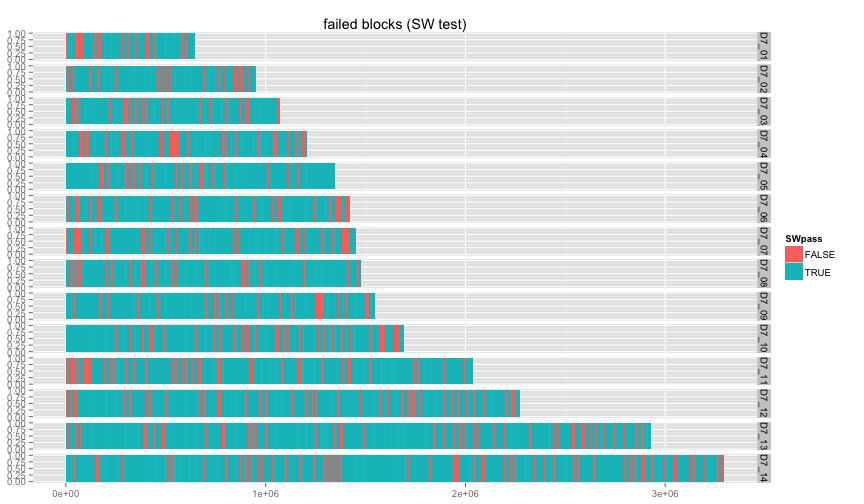
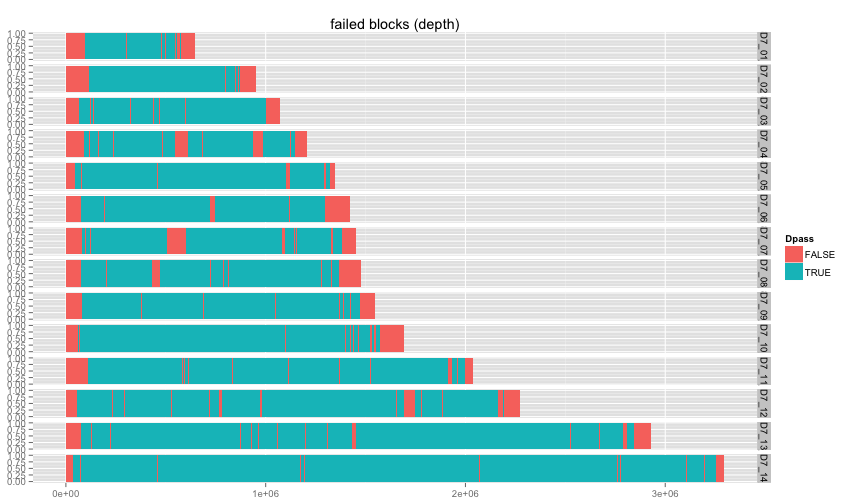
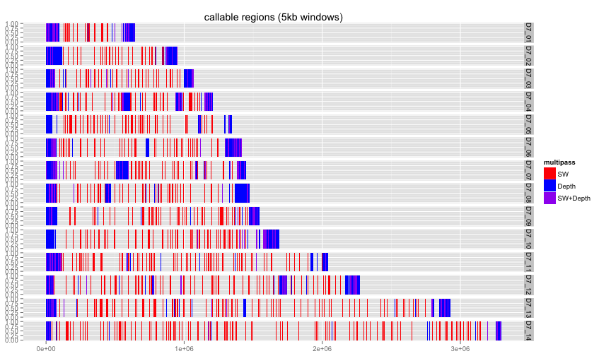
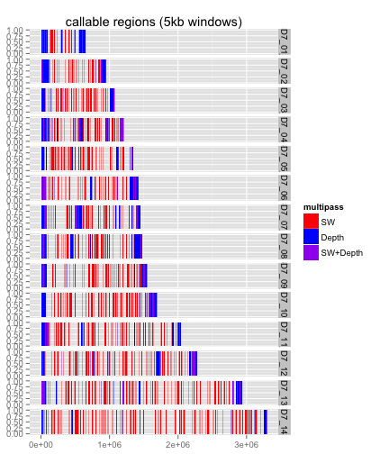

library(ggplot2)
library(knitr)
library(reshape2)
library(hexbin)

```r
opts_chunk$set(fig.width=12, fig.height=7)
```


```r
#vartypes <- read.table("pfx_v_3D7DD2fullrun_miss0callable.PASS.DD2CONC.R3.varClass.txt",stringsAsFactors = F,sep='\t',header=T)
calcols <- c("ch","st","en","NV","LDfails","LDpass","RSfails","RSpass","df","dn","Dpass","multipass")
callable <- read.table("qDD2vr3D7.callable.blocks5k.tab.txt",stringsAsFactors = T,sep='\t',header=F,col.names = calcols)

callable$multipass=NULL
callable$LDpass = callable$LDpass=="True"
callable$Dpass = callable$Dpass=="True"
callable$RSpass = callable$RSpass=="True"

callable$SWpass = (callable$LDpass & callable$RSpass)

callable$multipass=factor(rep(NA,4676),levels=c("SW","Depth","SW+Depth"))
callable[!callable$SWpass,"multipass"]="SW"
callable[!callable$Dpass,"multipass"]="Depth"
callable[!callable$SWpass & !callable$Dpass,"multipass"]="SW+Depth"

head(callable)
```

```
##               ch    st    en NV LDfails LDpass RSfails RSpass  df   dn
## 1         M76611     1  5000  0       0   TRUE       0   TRUE 684 5000
## 2         M76611  5001 10000  0       0   TRUE       0   TRUE  20  967
## 3 PFC10_API_IRAB     1  5000  2       0   TRUE       0   TRUE 267 4991
## 4 PFC10_API_IRAB  5001 10000  0       0   TRUE       0   TRUE   0 5000
## 5 PFC10_API_IRAB 10001 15000  0       0   TRUE       0   TRUE  21 5000
## 6 PFC10_API_IRAB 15001 20000  1       0   TRUE       0   TRUE  14 5000
##   Dpass SWpass multipass
## 1 FALSE   TRUE     Depth
## 2  TRUE   TRUE      <NA>
## 3  TRUE   TRUE      <NA>
## 4  TRUE   TRUE      <NA>
## 5  TRUE   TRUE      <NA>
## 6  TRUE   TRUE      <NA>
```

```r
callable <- subset(callable,!ch %in% c("M76611","PFC10_API_IRAB"))
```


```r
#INDELS ONLY
#dd2 concordance
```

```r
ggplot(subset(callable,ch="Pf3D7_01_v3"),aes(xmin=st,xmax=en,ymin=0,ymax=1,fill=SWpass)) + 
  ggtitle(paste("failed blocks (SW test)")) +
  geom_rect() + 
  facet_grid(ch ~ .)
```

 

```r
ggplot(subset(callable,ch="Pf3D7_01_v3"),aes(xmin=st,xmax=en,ymin=0,ymax=1,fill=Dpass)) + 
  ggtitle(paste("failed blocks (depth)")) +
  geom_rect() + 
  facet_grid(ch ~ .)
```

 

```r
ggplot(callable,aes(xmin=st,xmax=en,ymin=0,ymax=1,fill=multipass)) + 
  ggtitle(paste("callable regions (5kb windows)")) +
  geom_rect() + scale_fill_manual(values=c("red","blue","purple"))+
  facet_grid(ch ~ .)
```

 


```r
ggplot(callable,aes(xmin=st,xmax=en,ymin=0,ymax=1,fill=multipass)) + 
  ggtitle(paste("callable regions (5kb windows)")) +
  geom_rect() + scale_fill_manual(values=c("red","blue","purple"))+
  facet_grid(ch ~ .)
```

 
