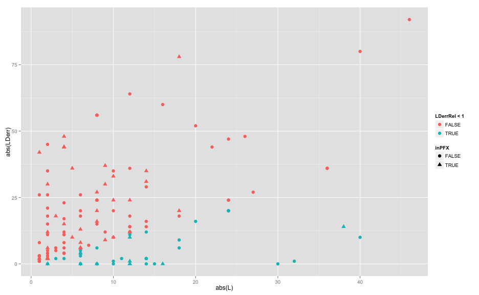
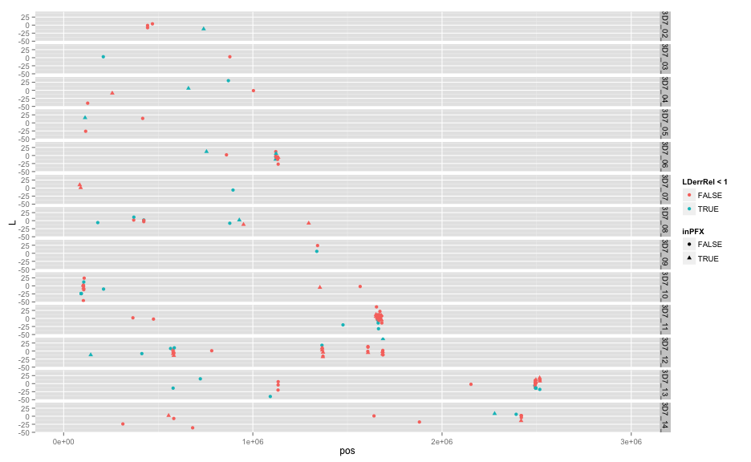
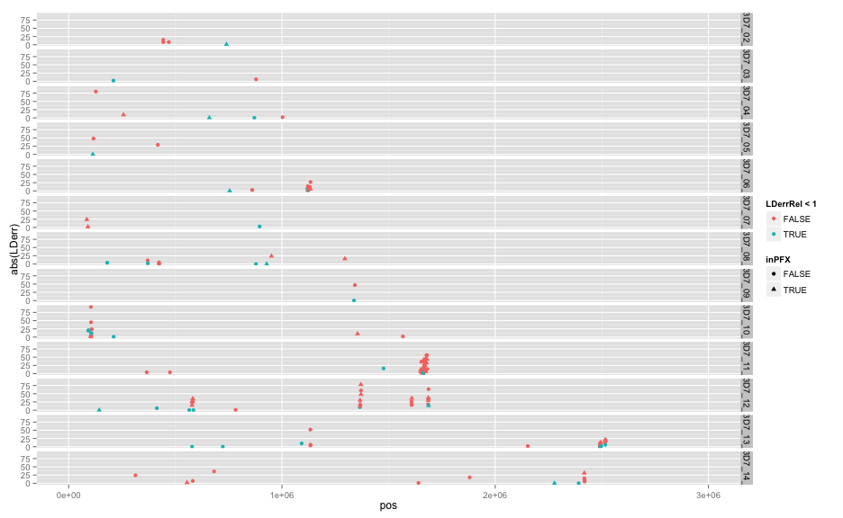

library(ggplot2)
library(reshape2)
library(knitr)

```r
opts_chunk$set(fig.width=13, fig.height=8)
```


```r
LD_2D4 <- read.table("dd22D4_diffs_noPFX_SW_validation.1000bp.txt",sep="\t",header=T,skip = 2,row.names=1,stringsAsFactors = F)
LD_FDK <- read.table("dd2FDK_diffs_noPFX_SW_validation.1000bp.txt",sep="\t",header=T,skip = 2,row.names=1,stringsAsFactors = F)

LD_2D4_PFX <- read.table("dd22D4_diffs_SW_validation.1000bp.txt",sep="\t",header=T,skip = 2,row.names=1,stringsAsFactors = F)


LDcf <- merge(LD_2D4,LD_FDK,by.y=c("block","L"), by.x=c("block","L"),suffixes=c(".2D4",".FDK"))
cp <- t(matrix(unlist(strsplit(LDcf$block,":")),nrow=2))
LDcf$pos <- as.numeric(cp[,2])
LDcf$chr <- as.character(cp[,1])
LDcf$LDdiff <- LDcf$NM.2D4 - LDcf$NM.FDK
LDcf$LDerr <- LDcf$LDdiff - LDcf$L
LDcf$LDerrRel <- abs(LDcf$LDerr)/abs(LDcf$L)
LDcf$inPFX = LDcf$block %in% LD_2D4_PFX$block
```


```r
#indel size v LD error
ggplot(LDcf,aes(x=abs(L),y=abs(LDerr),colour=LDerrRel < 1,shape=inPFX)) + geom_point(size=3)
```

 

```r
#indel size v posn 
ggplot(LDcf,aes(x=pos,y=L,colour=LDerrRel < 1,shape=inPFX)) + geom_point() + facet_grid(chr ~ .) + xlim(0,3e6)
```

 

```r
#LD error ((LDpost.2D4 - LDpost.FDK) - L)
ggplot(LDcf,aes(x=pos,y=abs(LDerr),colour=LDerrRel < 1,shape=inPFX)) + geom_point() + facet_grid(chr ~ .) + xlim(0,3e6)
```

 
