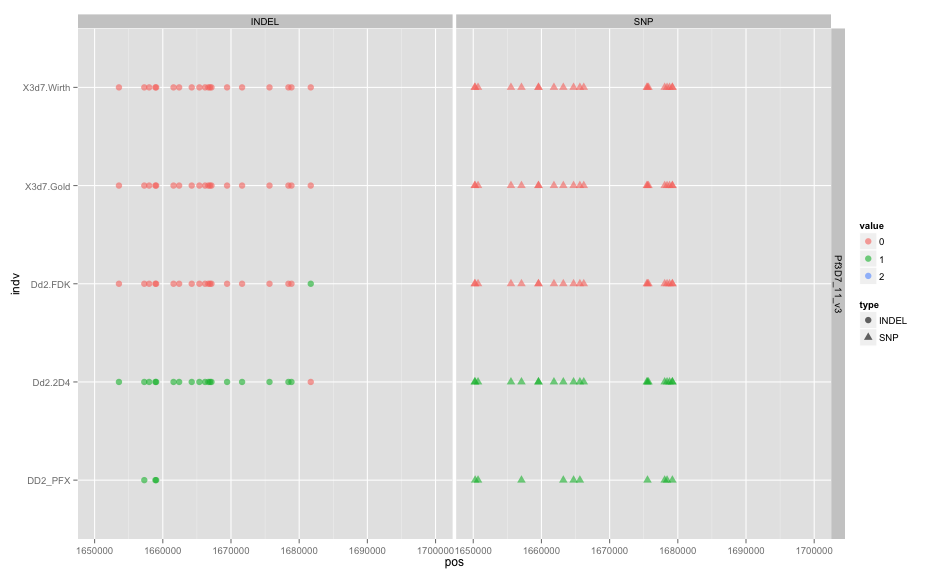

library(ggplot2)
library(reshape2)
library(knitr)

```r
opts_chunk$set(fig.width=13, fig.height=8)
```


```r
genotab <- read.table("pfx_v_3D7DD2fullrun.DD2DISCORD.incPFXcalls.LMRG.RENAME.HAPLOID.alleles.tab.txt",sep="\t",header=T,stringsAsFactors=F,na.strings=c('.'))
genotab <- unique(genotab)
colnames(genotab)[dim(genotab)[[2]]] <- "DD2_PFX"
genotab$DD2_PFX <- as.numeric(genotab$DD2)
```

```
## Warning: NAs introduced by coercion
```

```r
#remove ref calls
genotab <- genotab[rowSums(genotab[,5:9],na.rm=T)!=0,]


#colnames(genotab)[1:2]<-c("chr","pos")
genotab.m <- melt(genotab,id.vars =c("chr","pos","type","alleles"),variable.name ="indv")
genotab.m$value <- as.factor(genotab.m$value)
#sort levels
genotab.m$indv <- factor(genotab.m$indv,levels=sort(levels(genotab.m$indv)))

genotab.m <- genotab.m[!is.na(genotab.m$value),]

#all vars
ggplot(genotab.m,aes(x=pos,y=indv,colour=value,group=indv,shape=type)) + geom_point() + facet_grid(chr ~ .) + xlim(0,3e6)
```

 

```r
#SNPs only
ggplot(subset(genotab.m,type=="SNP"),aes(x=pos,y=indv,colour=value,group=indv,shape=type)) + geom_point(alpha=0.6,size=3) + facet_grid(chr ~ type) + xlim(0,3e6)
```

 

```r
#INDELs only
ggplot(subset(genotab.m,type=="INDEL"),aes(x=pos,y=indv,colour=value,group=indv,shape=type)) + geom_point(alpha=0.6,size=3) + facet_grid(chr ~ type) + xlim(0,3e6)
```

 

```r
#poss recombination??
ggplot(subset(genotab.m,chr=="Pf3D7_11_v3"),aes(x=pos,y=indv,colour=value,group=indv,shape=type)) + geom_point(alpha=0.6,size=3) + facet_grid(chr ~ type) + xlim(1.65e6,1.7e6)
```

```
## Warning: Removed 12 rows containing missing values (geom_point).
```

 

```r
#likely de novo
ggplot(subset(genotab.m,chr=="Pf3D7_10_v3"),aes(x=pos,y=indv,colour=value,group=indv,shape=type)) + geom_point(alpha=0.6,size=3) + facet_grid(chr ~ type) + xlim(0.05e6,0.25e6)
```

```
## Warning: Removed 4 rows containing missing values (geom_point).
```

```
## Warning: Removed 13 rows containing missing values (geom_point).
```

 
