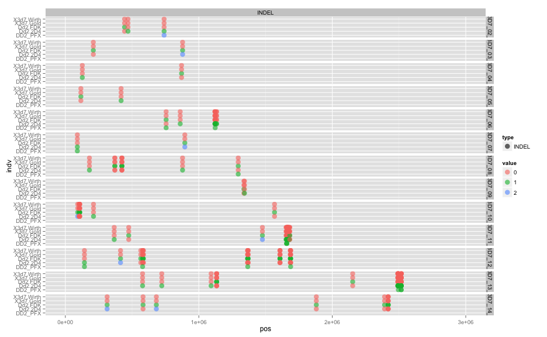
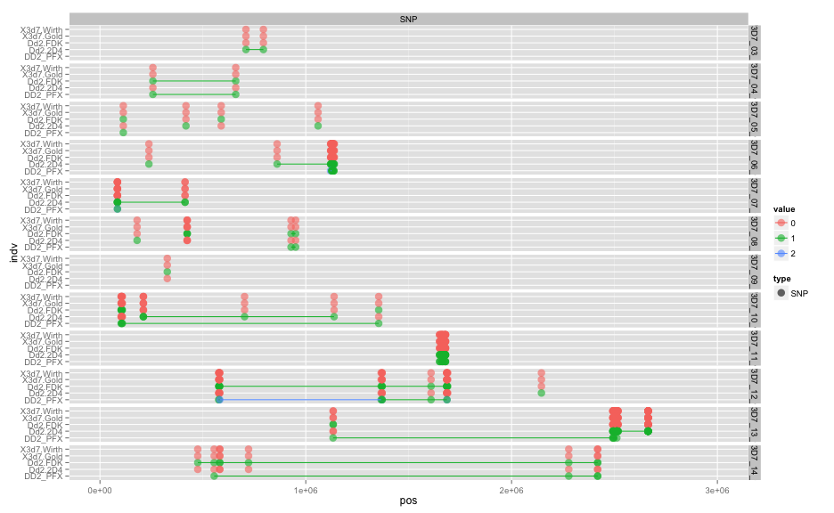

library(ggplot2)
library(reshape2)
library(knitr)

```r
opts_chunk$set(fig.width=13, fig.height=8)
```


```r
genotab <- read.table("pfx_v_3D7DD2fullrun.DD2DISCORD.incPFXcalls.LMRG.RENAME.HAPLOID.alleles.tab.txt",sep="\t",header=T,stringsAsFactors=F,na.strings=c('.'))
genotab <- unique(genotab)
colnames(genotab)[dim(genotab)[[2]]] <- "DD2_PFX"
genotab$DD2_PFX <- as.numeric(genotab$DD2)
```

```
## Warning: NAs introduced by coercion
```

```r
#remove ref calls
genotab <- genotab[rowSums(genotab[,5:9],na.rm=T)!=0,]


#colnames(genotab)[1:2]<-c("chr","pos")
genotab.m <- melt(genotab,id.vars =c("chr","pos","type","alleles"),variable.name ="indv")
genotab.m$value <- as.factor(genotab.m$value)
#sort levels
genotab.m$indv <- factor(genotab.m$indv,levels=sort(levels(genotab.m$indv)))

genotab.m <- genotab.m[!is.na(genotab.m$value),]
genotab.m$value <- as.numeric(as.character(genotab.m$value))

hNo=0
vlast=0
genotab.m$haplo=0
for (i in c(1:dim(genotab.m)[[1]])) {
  if (genotab.m[i,"value"]==0) {haplo=0}
  else if (genotab.m[i,"value"]>=1) {
    if (vlast==0) {hNo <- hNo+1}
      genotab.m[i,"haplo"]<-hNo  
    }
  vlast=genotab.m[i,"value"]
}
genotab.m$value <- factor(genotab.m$value)
genotab.m$haplo <- factor(genotab.m$haplo)

#all vars
ggplot(genotab.m,aes(x=pos,y=indv,colour=value,group=haplo,shape=type)) + geom_point(size=4) + 
  facet_grid(chr ~ .) + xlim(0,3e6)
```

 

```r
#SNPs only
ggplot(subset(genotab.m,type=="SNP"),aes(x=pos,y=indv,colour=value,group=haplo,shape=type)) + geom_point(alpha=0.6,size=4) + 
  facet_grid(chr ~ type) + xlim(0,3e6)
```

 

```r
#INDELs only
ggplot(subset(genotab.m,type=="INDEL"),aes(x=pos,y=indv,colour=value,group=haplo,shape=type)) + geom_point(alpha=0.6,size=4) + 
  facet_grid(chr ~ type) + xlim(0,3e6)
```

 

```r
#poss recombination??
ggplot(subset(genotab.m,chr=="Pf3D7_11_v3"),aes(x=pos,y=indv,colour=value,group=haplo,shape=type)) + geom_point(alpha=0.6,size=4) + 
  facet_grid(chr ~ type) + xlim(1.65e6,1.7e6)
```

```
## Warning: Removed 12 rows containing missing values (geom_point).
```

 

```r
#likely de novo
ggplot(subset(genotab.m,chr=="Pf3D7_10_v3"),aes(x=pos,y=indv,colour=value,group=haplo,shape=type)) + geom_point(alpha=0.6,size=4) + 
  facet_grid(chr ~ type) + xlim(0.05e6,0.25e6)
```

```
## Warning: Removed 4 rows containing missing values (geom_point).
```

```
## Warning: Removed 13 rows containing missing values (geom_point).
```

 


```r
#with haplotypes shown

#all vars
ggplot(genotab.m,aes(x=pos,y=indv,colour=value,group=haplo,shape=type)) + geom_point(size=4) + 
  geom_line(data=subset(genotab.m,value!=0)) + facet_grid(chr ~ .) + xlim(0,3e6)
```

 

```r
#SNPs only
ggplot(subset(genotab.m,type=="SNP"),aes(x=pos,y=indv,colour=value,group=haplo,shape=type)) + geom_point(alpha=0.6,size=4) + 
  geom_line(data=subset(genotab.m,value!=0 & type=="SNP")) + facet_grid(chr ~ type) + xlim(0,3e6)
```

```
## geom_path: Each group consist of only one observation. Do you need to adjust the group aesthetic?
## geom_path: Each group consist of only one observation. Do you need to adjust the group aesthetic?
```

 

```r
#INDELs only
ggplot(subset(genotab.m,type=="INDEL"),aes(x=pos,y=indv,colour=value,group=haplo,shape=type)) + geom_point(alpha=0.6,size=4) + 
  geom_line(data=subset(genotab.m,value!=0 & type=="INDEL")) + facet_grid(chr ~ type) + xlim(0,3e6)
```

```
## geom_path: Each group consist of only one observation. Do you need to adjust the group aesthetic?
## geom_path: Each group consist of only one observation. Do you need to adjust the group aesthetic?
## geom_path: Each group consist of only one observation. Do you need to adjust the group aesthetic?
## geom_path: Each group consist of only one observation. Do you need to adjust the group aesthetic?
```

 


```r
#triallelic / denovo variants?
write.table(genotab[apply(genotab[,5:9],1,FUN=max,na.rm=T)==2,c(1,2,4,5,6,9)],sep="\t",quote=F,stdout())
```

```
## chr	pos	alleles	Dd2.FDK	Dd2.2D4	DD2_PFX
## 5	Pf3D7_02_v3	739897	G/GATATATATATAT/GATATATATAT 	0	1	2
## 9	Pf3D7_03_v3	878451	AAATAAT/AAAT/A 	1	2	NA
## 30	Pf3D7_06_v3	1120632	C/CATATATATATAT/CATATATATATATAT 	0	1	2
## 56	Pf3D7_07_v3	84920	GTATACATATA/G/GTA 	0	1	2
## 62	Pf3D7_07_v3	895206	T/TAAC/TAATAAC 	1	2	NA
## 89	Pf3D7_10_v3	92532	T/TTATATATATATATATATATATA/TTATATATATATATATATATATATA 	1	2	NA
## 126	Pf3D7_11_v3	1476463	A/AATATATAAATATATAT/AATATATAAATATATATATAT 	1	2	NA
## 174	Pf3D7_12_v3	413354	C/CATATAT/CATATATAT 	1	2	NA
## 184	Pf3D7_12_v3	582085	G/GATATATATATATAT/GATATATATATAT 	1	0	2
## 192	Pf3D7_12_v3	1370032	T/TTTATTATTATTATTATTA/TTTATTATTA 	1	0	2
## 205	Pf3D7_12_v3	1685929	A/ATATATATAT/ATATATATATAT 	1	0	2
## 300	Pf3D7_14_v3	313007	C/CATATATATATATATATATATATAT/CATATATATATATATATATAT 	1	2	NA
## 306	Pf3D7_14_v3	681822	A/ATATGTATGTATGTATGTATGTATGTATGTATGTATG/ATATGTATGTATGTATGTATGTATGTATGTATG 	1	2	NA
```
