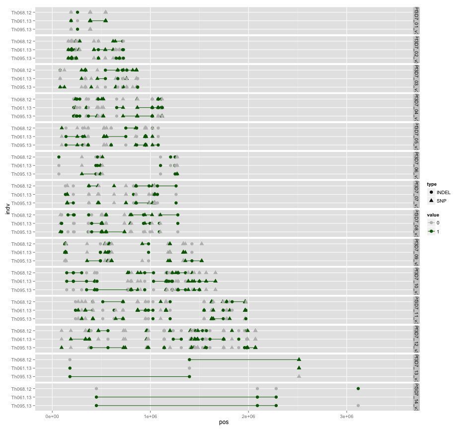
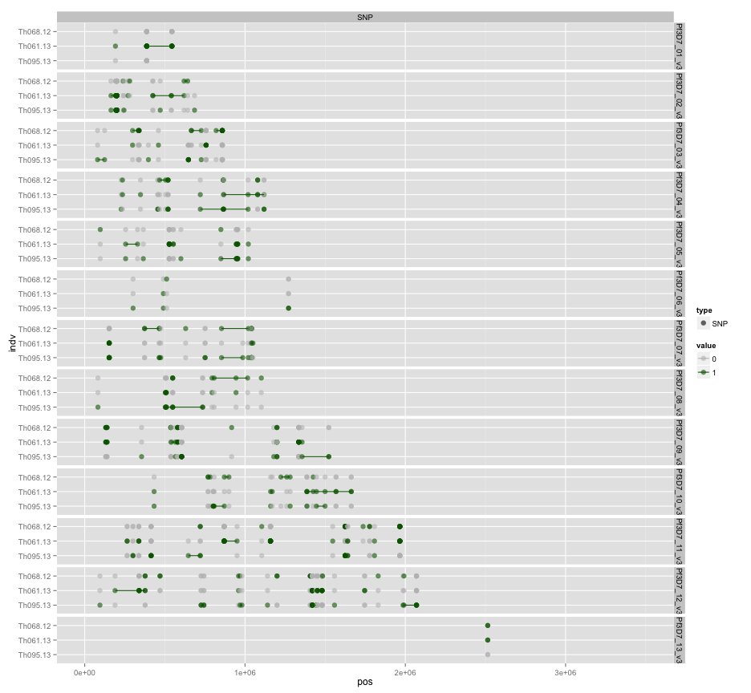
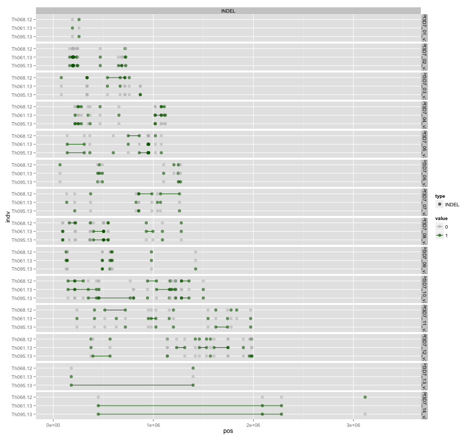
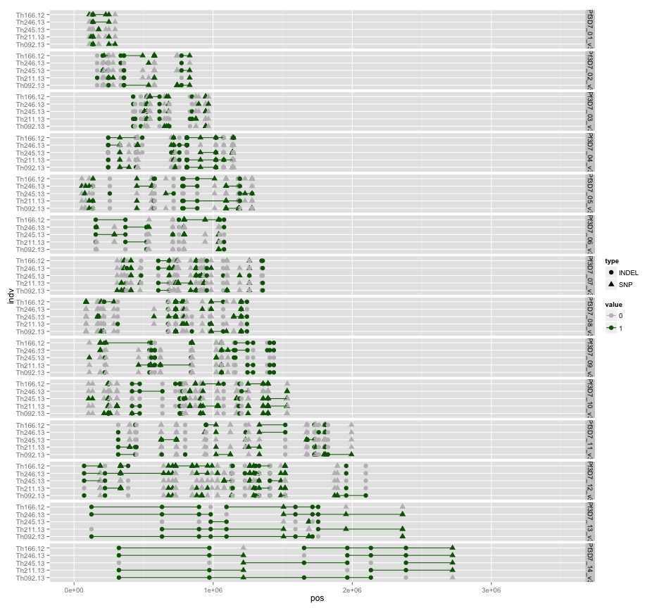
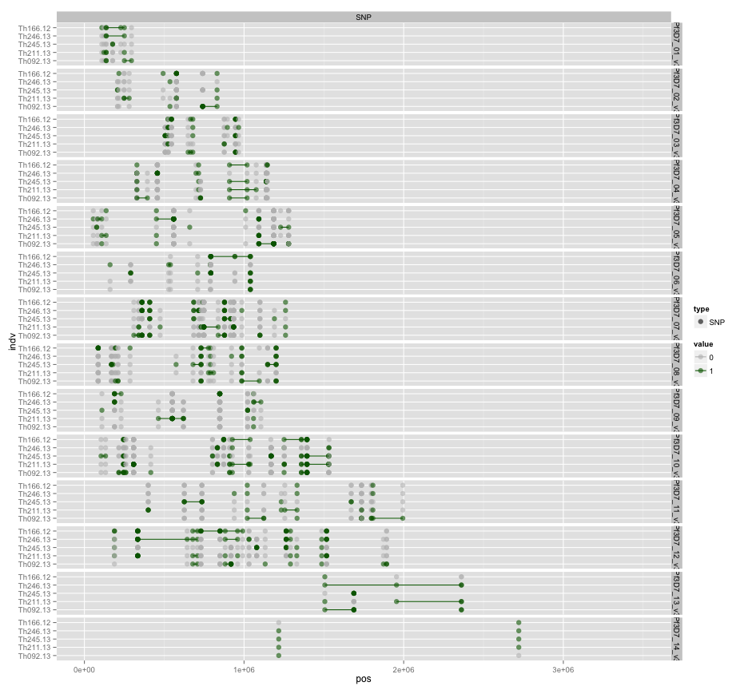
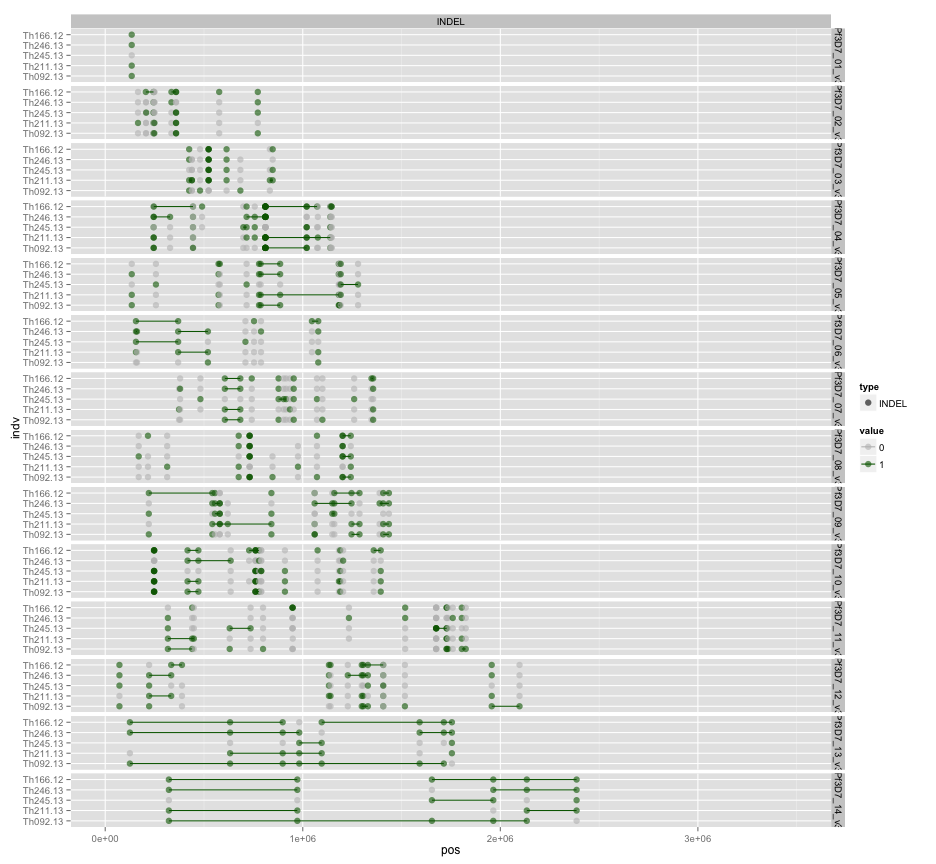
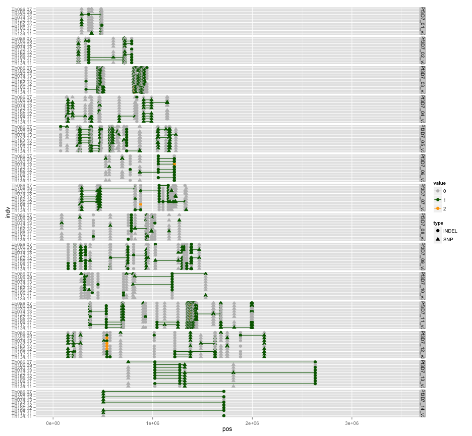
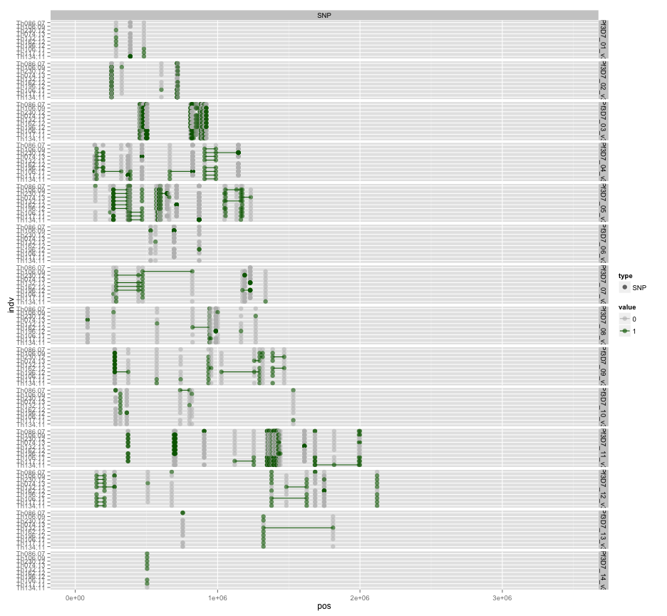
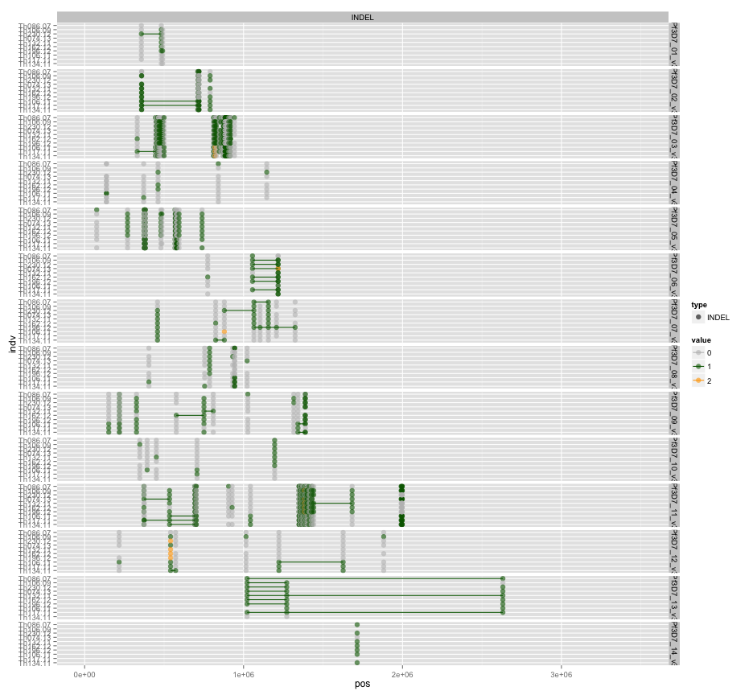

library(ggplot2)
library(reshape2)
library(knitr)

```r
opts_chunk$set(fig.width=13, fig.height=12)
```


```r
getGenoTab <- function(filename) {
  genotab <- read.table(filename,sep="\t",header=T,stringsAsFactors=F,na.strings=c('.','. '))
  genotab <- unique(genotab)
  
  #remove ref calls
  #genotab <- genotab[rowSums(genotab[,5:dim(genotab)[2]],na.rm=T)!=0,]
  
  #colnames(genotab)[1:2]<-c("chr","pos")
  genotab.m <- melt(genotab,id.vars =c("chr","pos","type","alleles"),variable.name ="indv")
  genotab.m$value <- as.factor(genotab.m$value)
  #sort levels
  genotab.m$indv <- factor(genotab.m$indv,levels=sort(levels(genotab.m$indv)))
  
  genotab.m <- genotab.m[!is.na(genotab.m$value),]
  genotab.m$value <- as.numeric(as.character(genotab.m$value))
  
  hNo=0
  vlast=0
  genotab.m$haplo=0
  for (i in c(1:dim(genotab.m)[[1]])) {
    if (genotab.m[i,"value"]==0) {haplo=0}
    else if (genotab.m[i,"value"]>=1) {
      if (vlast==0) {hNo <- hNo+1}
        genotab.m[i,"haplo"]<-hNo  
      }
    vlast=genotab.m[i,"value"]
  }
  genotab.m$value <- factor(genotab.m$value)
  genotab.m$haplo <- factor(genotab.m$haplo)
  genotab.m
}
```


```r
clade1F <- "Thies_all_manual.PASS.Cls.miss0.5.LMRG.HAP.DISCORDS.clade1.recode.alleles.tab.txt"
genotab1 <- getGenoTab(clade1F)
genotab1$indv <- factor(genotab1$indv,levels = c("Th095.13","Th061.13","Th068.12"),ordered=T)

clade2F <- "Thies_all_manual.PASS.Cls.miss0.5.LMRG.HAP.DISCORDS.clade2.recode.alleles.tab.txt"
genotab2 <- getGenoTab(clade2F)
genotab2$indv <- factor(genotab2$indv,levels = c("Th092.13","Th211.13","Th245.13","Th246.13","Th166.12"),ordered=T)

clade3F <- "Thies_all_manual.PASS.Cls.miss0.5.LMRG.HAP.DISCORDS.clade3.recode.alleles.tab.txt"
genotab3 <- getGenoTab(clade3F)
genotab3$indv <- factor(genotab3$indv,levels = c("Th134.11","Th117.11","Th106.11","Th196.12","Th162.12","Th132.11","Th074.13","Th230.12","Th106.09","Th086.07"),ordered=T)
```


```r
cols=c("grey","dark green","orange","dark red")
names(cols)<-c(0,1,2,3)
colsc <- scale_color_manual(values = cols)
```


```r
#Clade1

#all vars
ggplot(genotab1,aes(x=pos,y=indv,colour=value,group=haplo,shape=type)) + geom_point(size=3) + 
  geom_line(data=subset(genotab1,value!=0)) + facet_grid(chr ~ .) + xlim(0,3.5e6) +colsc
```

 

```r
#SNPs only
ggplot(subset(genotab1,type=="SNP"),aes(x=pos,y=indv,colour=value,group=haplo,shape=type)) + geom_point(alpha=0.6,size=3) + 
  geom_line(data=subset(genotab1,value!=0 & type=="SNP")) + facet_grid(chr ~ type) + xlim(0,3.5e6) +colsc
```

 

```r
#INDELs only
ggplot(subset(genotab1,type=="INDEL"),aes(x=pos,y=indv,colour=value,group=haplo,shape=type)) + geom_point(alpha=0.6,size=3) + 
  geom_line(data=subset(genotab1,value!=0 & type=="INDEL")) + facet_grid(chr ~ type) + xlim(0,3.5e6) +colsc
```

```
## geom_path: Each group consist of only one observation. Do you need to adjust the group aesthetic?
```

 


```r
#Clade2

#all vars
ggplot(genotab2,aes(x=pos,y=indv,colour=value,group=haplo,shape=type)) + geom_point(size=3) + 
  geom_line(data=subset(genotab2,value!=0)) + facet_grid(chr ~ .) + xlim(0,3.5e6) +colsc
```

 

```r
#SNPs only
ggplot(subset(genotab2,type=="SNP"),aes(x=pos,y=indv,colour=value,group=haplo,shape=type)) + geom_point(alpha=0.6,size=3) + 
  geom_line(data=subset(genotab2,value!=0 & type=="SNP")) + facet_grid(chr ~ type) + xlim(0,3.5e6) +colsc
```

```
## geom_path: Each group consist of only one observation. Do you need to adjust the group aesthetic?
```

 

```r
#INDELs only
ggplot(subset(genotab2,type=="INDEL"),aes(x=pos,y=indv,colour=value,group=haplo,shape=type)) + geom_point(alpha=0.6,size=3) + 
  geom_line(data=subset(genotab2,value!=0 & type=="INDEL")) + facet_grid(chr ~ type) + xlim(0,3.5e6) +colsc
```

```
## geom_path: Each group consist of only one observation. Do you need to adjust the group aesthetic?
```

 


```r
#Clade3

#all vars
ggplot(genotab3,aes(x=pos,y=indv,colour=value,group=haplo,shape=type)) + geom_point(size=3) + 
  geom_line(data=subset(genotab3,value!=0)) + facet_grid(chr ~ .) + xlim(0,3.5e6) +colsc
```

 

```r
#SNPs only
ggplot(subset(genotab3,type=="SNP"),aes(x=pos,y=indv,colour=value,group=haplo,shape=type)) + geom_point(alpha=0.6,size=3) + 
  geom_line(data=subset(genotab3,value!=0 & type=="SNP")) + facet_grid(chr ~ type) + xlim(0,3.5e6) +colsc
```

```
## geom_path: Each group consist of only one observation. Do you need to adjust the group aesthetic?
```

 

```r
#INDELs only
ggplot(subset(genotab3,type=="INDEL"),aes(x=pos,y=indv,colour=value,group=haplo,shape=type)) + geom_point(alpha=0.6,size=3) + 
  geom_line(data=subset(genotab3,value!=0 & type=="INDEL")) + facet_grid(chr ~ type) + xlim(0,3.5e6) +colsc
```

```
## geom_path: Each group consist of only one observation. Do you need to adjust the group aesthetic?
## geom_path: Each group consist of only one observation. Do you need to adjust the group aesthetic?
```

 


