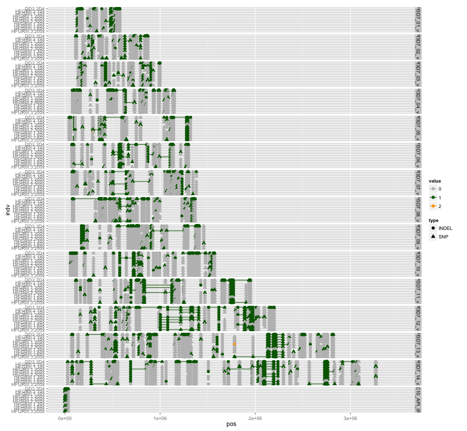
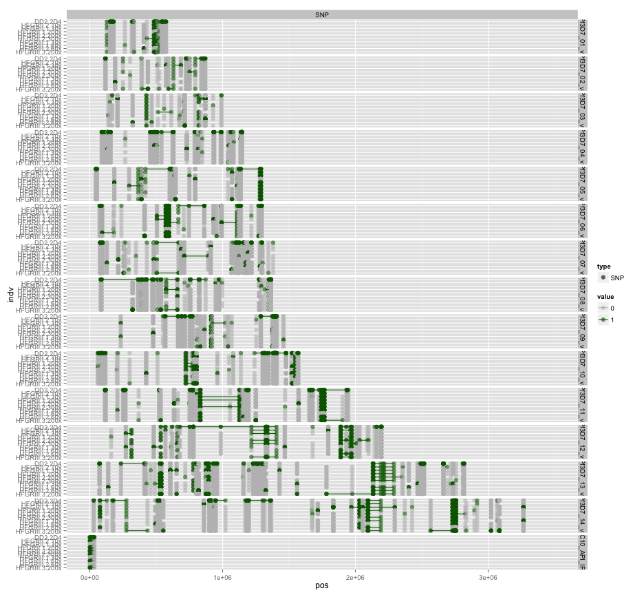
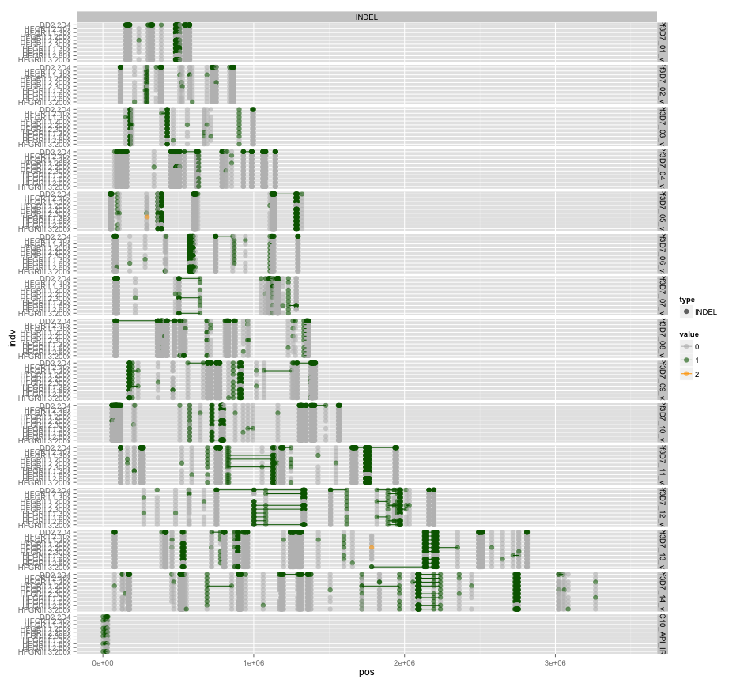
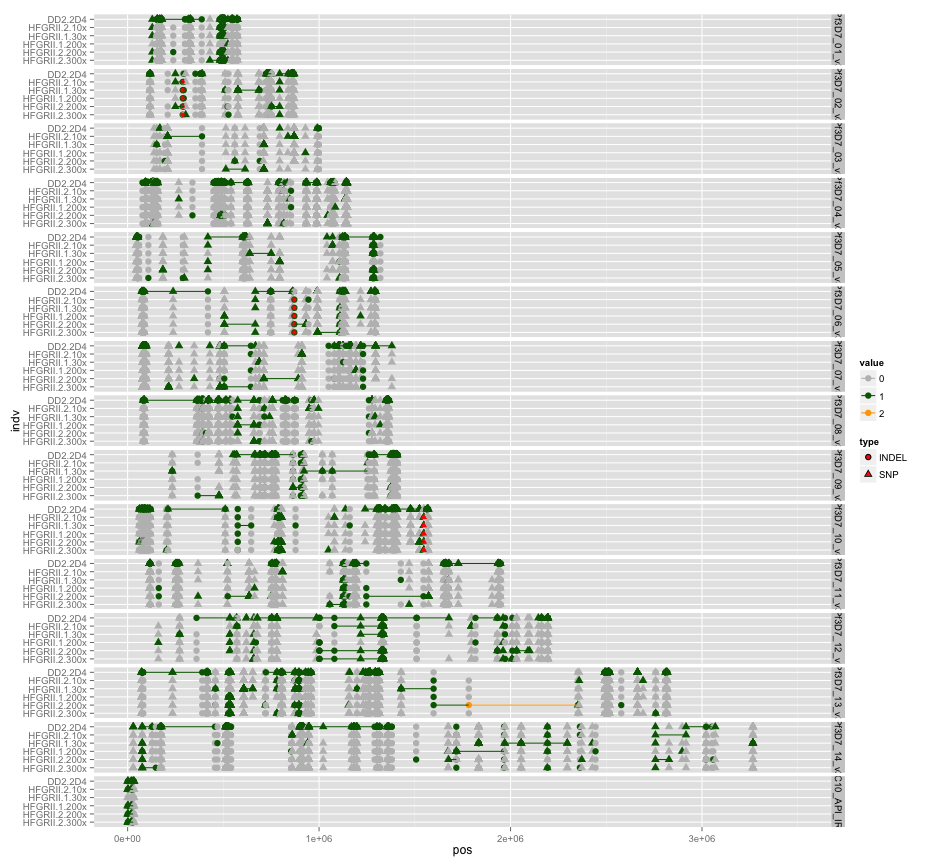
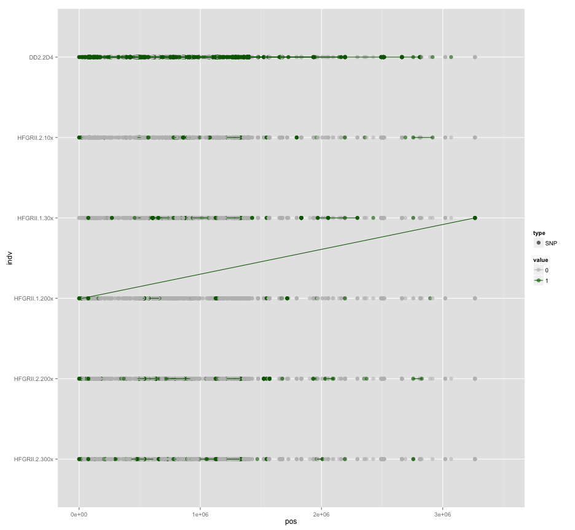
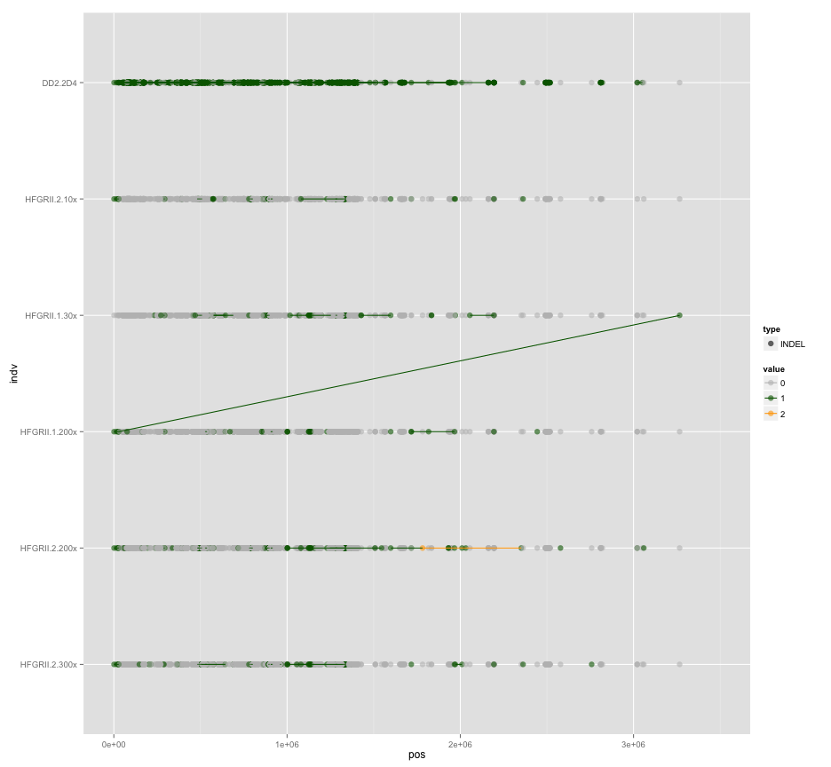
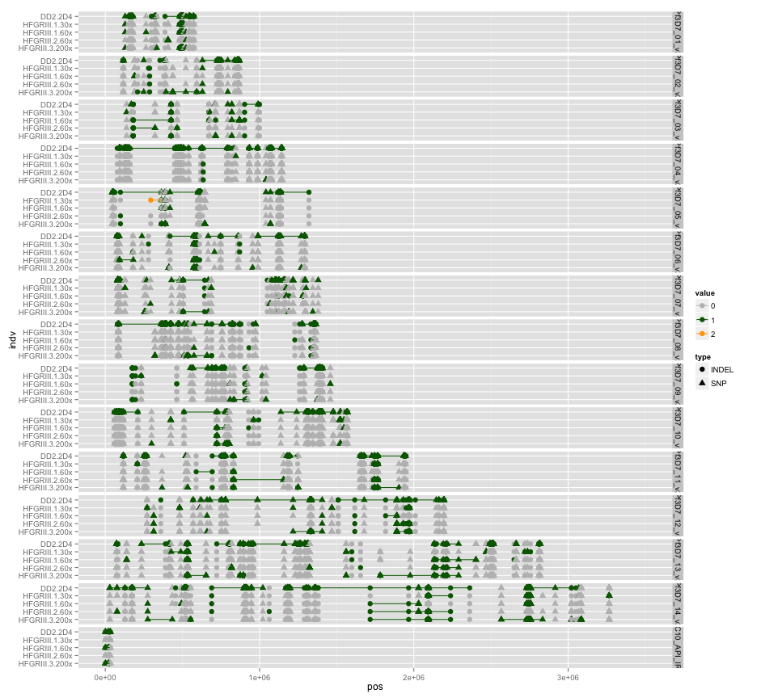
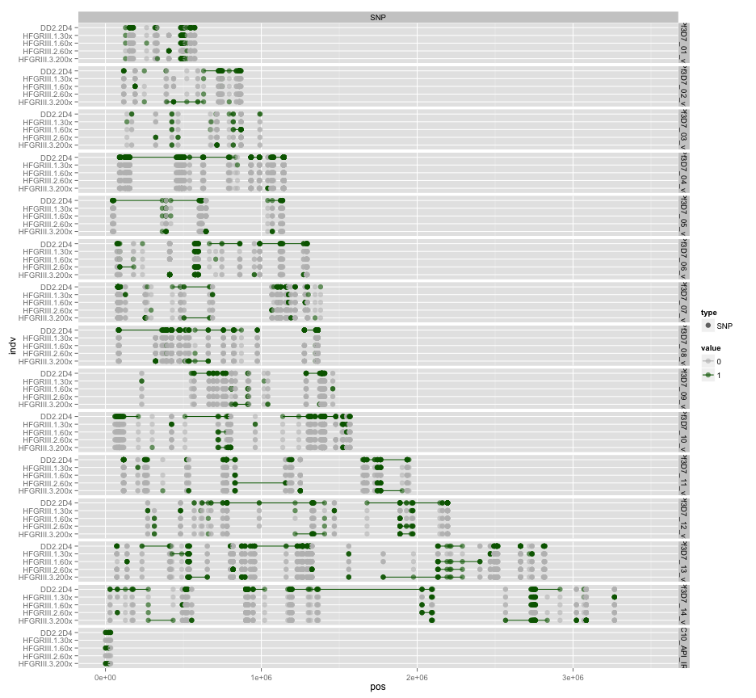
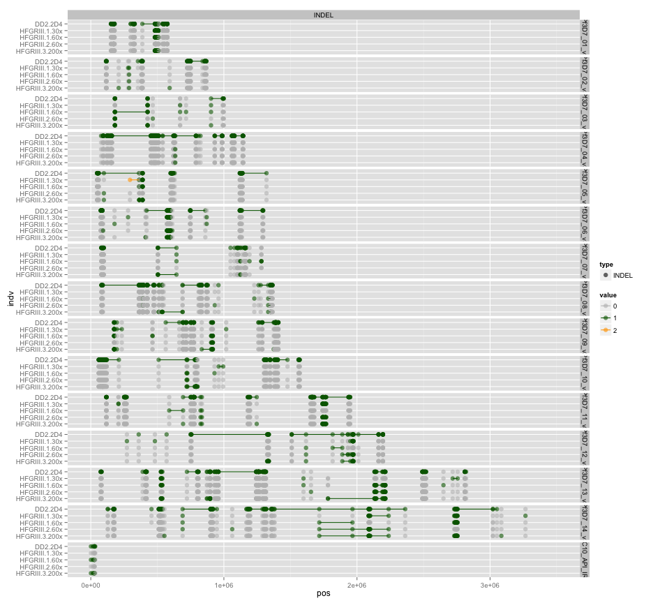

library(ggplot2)
library(reshape2)
library(knitr)

```r
opts_chunk$set(fig.width=13, fig.height=12)
```


```r
getGenoTab <- function(filename) {
  genotab <- read.table(filename,sep="\t",header=T,stringsAsFactors=F,na.strings=c('.','. '))
  genotab <- unique(genotab)
  
  #remove ref calls
  #genotab <- genotab[rowSums(genotab[,5:dim(genotab)[2]],na.rm=T)!=0,]
  
  #colnames(genotab)[1:2]<-c("chr","pos")
  genotab.m <- melt(genotab,id.vars =c("chr","pos","type","alleles"),variable.name ="indv")
  genotab.m$value <- as.factor(genotab.m$value)
  #sort levels
  genotab.m$indv <- factor(genotab.m$indv,levels=sort(levels(genotab.m$indv)))
  
  genotab.m <- genotab.m[!is.na(genotab.m$value),]
  genotab.m$value <- as.numeric(as.character(genotab.m$value))
  
  hNo=0
  vlast=0
  genotab.m$haplo=0
  for (i in c(1:dim(genotab.m)[[1]])) {
    if (genotab.m[i,"value"]==0) {haplo=0}
    else if (genotab.m[i,"value"]>=1) {
      if (vlast==0) {hNo <- hNo+1}
        genotab.m[i,"haplo"]<-hNo  
      }
    vlast=genotab.m[i,"value"]
  }
  genotab.m$value <- factor(genotab.m$value)
  genotab.m$haplo <- factor(genotab.m$haplo)
  genotab.m
}
```


```r
clade1F <- "HFGR_all_incDD2select.PASS.miss0.5.LMRG.HAP.DISCORDS.MKSNGL.alleles.tab.txt"
cladeH2 <- "HFGR_all_incDD2select.PASS.miss0.5.LMRG.HAP.DISCORDS.MKSNGL.HFII.alleles.tab.txt"
cladeH3 <- "HFGR_all_incDD2select.PASS.miss0.5.LMRG.HAP.DISCORDS.MKSNGL.HFIII.alleles.tab.txt"

genotab1 <- getGenoTab(clade1F)
genotabH2 <- getGenoTab(cladeH2)
genotabH3 <- getGenoTab(cladeH3)

newOrder <- c("DD2.2D4", 
              "HFGRII.2.10x","HFGRII.1.30x"  , "HFGRII.1.200x" , "HFGRII.2.200x" , "HFGRII.2.300x"  ,
"HFGRIII.1.30x",  "HFGRIII.1.60x",  "HFGRIII.2.60x",  "HFGRIII.3.200x")
newOrder <- rev(newOrder)
genotab1$indv <- factor(genotab1$indv,levels = newOrder,ordered=T)
genotabH2$indv <- factor(genotabH2$indv,levels = newOrder,ordered=T)
genotabH3$indv <- factor(genotabH3$indv,levels = newOrder,ordered=T)
genotabH2 <- subset(genotabH2, indv %in% c("DD2.2D4", "HFGRII.2.10x","HFGRII.1.30x"  , "HFGRII.1.200x" , "HFGRII.2.200x" , "HFGRII.2.300x"))
genotabH3 <- subset(genotabH3, indv %in% c("DD2.2D4", "HFGRIII.1.30x",  "HFGRIII.1.60x",  "HFGRIII.2.60x",  "HFGRIII.3.200x"))

tempH2 <- read.table("HFGR_all_incDD2select.PASS.miss0.5.LMRG.HAP.DISCORDS.HFII.temporal.txt",stringsAsFactors = F,sep="\t")
colnames(tempH2)<-c("chr","pos","type","alleles","DD2.2D4", "HFGRII.2.10x","HFGRII.1.30x"  , "HFGRII.1.200x" , "HFGRII.2.200x" , "HFGRII.2.300x","result","freq")
genotabH2[(genotabH2$chr %in% tempH2$chr & genotabH2$pos %in% tempH2$pos),]
```

```
##               chr     pos  type                                  alleles
## 308   Pf3D7_02_v3  287739 INDEL                                   CAT/C 
## 1522  Pf3D7_06_v3  870784 INDEL                                   AAT/A 
## 3012  Pf3D7_10_v3 1547111   SNP                                     G/A 
## 3013  Pf3D7_10_v3 1547122   SNP                                     T/C 
## 3014  Pf3D7_10_v3 1547125   SNP                                     A/C 
## 3770  Pf3D7_13_v3 1598144 INDEL T/TCTTTTTCTTTTCCTTTTTCTTTTTCTTTTTCTTTTC 
## 4465  Pf3D7_02_v3  287739 INDEL                                   CAT/C 
## 5679  Pf3D7_06_v3  870784 INDEL                                   AAT/A 
## 7169  Pf3D7_10_v3 1547111   SNP                                     G/A 
## 7170  Pf3D7_10_v3 1547122   SNP                                     T/C 
## 7171  Pf3D7_10_v3 1547125   SNP                                     A/C 
## 7927  Pf3D7_13_v3 1598144 INDEL T/TCTTTTTCTTTTCCTTTTTCTTTTTCTTTTTCTTTTC 
## 8622  Pf3D7_02_v3  287739 INDEL                                   CAT/C 
## 9836  Pf3D7_06_v3  870784 INDEL                                   AAT/A 
## 11326 Pf3D7_10_v3 1547111   SNP                                     G/A 
## 11327 Pf3D7_10_v3 1547122   SNP                                     T/C 
## 11328 Pf3D7_10_v3 1547125   SNP                                     A/C 
## 12084 Pf3D7_13_v3 1598144 INDEL T/TCTTTTTCTTTTCCTTTTTCTTTTTCTTTTTCTTTTC 
## 12779 Pf3D7_02_v3  287739 INDEL                                   CAT/C 
## 13993 Pf3D7_06_v3  870784 INDEL                                   AAT/A 
## 15483 Pf3D7_10_v3 1547111   SNP                                     G/A 
## 15484 Pf3D7_10_v3 1547122   SNP                                     T/C 
## 15485 Pf3D7_10_v3 1547125   SNP                                     A/C 
## 16241 Pf3D7_13_v3 1598144 INDEL T/TCTTTTTCTTTTCCTTTTTCTTTTTCTTTTTCTTTTC 
## 16936 Pf3D7_02_v3  287739 INDEL                                   CAT/C 
## 18150 Pf3D7_06_v3  870784 INDEL                                   AAT/A 
## 19640 Pf3D7_10_v3 1547111   SNP                                     G/A 
## 19641 Pf3D7_10_v3 1547122   SNP                                     T/C 
## 19642 Pf3D7_10_v3 1547125   SNP                                     A/C 
## 20398 Pf3D7_13_v3 1598144 INDEL T/TCTTTTTCTTTTCCTTTTTCTTTTTCTTTTTCTTTTC 
## 37721 Pf3D7_02_v3  287739 INDEL                                   CAT/C 
## 38935 Pf3D7_06_v3  870784 INDEL                                   AAT/A 
## 40425 Pf3D7_10_v3 1547111   SNP                                     G/A 
## 40426 Pf3D7_10_v3 1547122   SNP                                     T/C 
## 40427 Pf3D7_10_v3 1547125   SNP                                     A/C 
## 41183 Pf3D7_13_v3 1598144 INDEL T/TCTTTTTCTTTTCCTTTTTCTTTTTCTTTTTCTTTTC 
##                indv value haplo
## 308    HFGRII.2.10x     1     5
## 1522   HFGRII.2.10x     1    16
## 3012   HFGRII.2.10x     1    37
## 3013   HFGRII.2.10x     1    37
## 3014   HFGRII.2.10x     1    37
## 3770   HFGRII.2.10x     1    47
## 4465   HFGRII.1.30x     1    59
## 5679   HFGRII.1.30x     1    72
## 7169   HFGRII.1.30x     1    87
## 7170   HFGRII.1.30x     1    87
## 7171   HFGRII.1.30x     1    87
## 7927   HFGRII.1.30x     1   102
## 8622  HFGRII.1.200x     1   112
## 9836  HFGRII.1.200x     1   121
## 11326 HFGRII.1.200x     1   132
## 11327 HFGRII.1.200x     1   132
## 11328 HFGRII.1.200x     1   132
## 12084 HFGRII.1.200x     1   145
## 12779 HFGRII.2.200x     1   159
## 13993 HFGRII.2.200x     1   180
## 15483 HFGRII.2.200x     1   238
## 15484 HFGRII.2.200x     1   238
## 15485 HFGRII.2.200x     1   238
## 16241 HFGRII.2.200x     1   257
## 16936 HFGRII.2.300x     1   272
## 18150 HFGRII.2.300x     1   287
## 19640 HFGRII.2.300x     1   309
## 19641 HFGRII.2.300x     1   309
## 19642 HFGRII.2.300x     1   309
## 20398 HFGRII.2.300x     0     0
## 37721       DD2.2D4     0     0
## 38935       DD2.2D4     0     0
## 40425       DD2.2D4     0     0
## 40426       DD2.2D4     0     0
## 40427       DD2.2D4     0     0
## 41183       DD2.2D4     0     0
```

```r
genotabH2 <- merge(genotabH2,subset(tempH2,result=="mut1",c("chr","pos","result")),all.x=T)
```


```r
cols=c("grey","dark green","orange","dark red")
names(cols)<-c(0,1,2,3)
colsc <- scale_color_manual(values = cols)
```


```r
#HFGR - all

#all vars
ggplot(genotab1,aes(x=pos,y=indv,colour=value,group=haplo,shape=type)) + geom_point(size=3) + 
  geom_line(data=subset(genotab1,value!=0)) + facet_grid(chr ~ .) + xlim(0,3.5e6) +colsc
```

 

```r
#SNPs only
ggplot(subset(genotab1,type=="SNP"),aes(x=pos,y=indv,colour=value,group=haplo,shape=type)) + geom_point(alpha=0.6,size=3) + 
  geom_line(data=subset(genotab1,value!=0 & type=="SNP")) + facet_grid(chr ~ type) + xlim(0,3.5e6) +colsc
```

 

```r
#INDELs only
ggplot(subset(genotab1,type=="INDEL"),aes(x=pos,y=indv,colour=value,group=haplo,shape=type)) + geom_point(alpha=0.6,size=3) + 
  geom_line(data=subset(genotab1,value!=0 & type=="INDEL")) + facet_grid(chr ~ type) + xlim(0,3.5e6) +colsc
```

 


```r
#HFGR - GII

#all vars
ggplot(genotabH2,aes(x=pos,y=indv,colour=value,group=haplo,shape=type)) + geom_point(size=3) + 
  geom_point(data=subset(genotabH2,result=="mut1" & value != 0),colour="red") +
  geom_line(data=subset(genotabH2,value!=0)) + facet_grid(chr ~ .) + xlim(0,3.5e6) +colsc
```

 

```r
#SNPs only
ggplot(subset(genotabH2,type=="SNP"),aes(x=pos,y=indv,colour=value,group=haplo,shape=type)) + geom_point(alpha=0.6,size=3) + 
  geom_line(data=subset(genotabH2,value!=0 & type=="SNP")) + xlim(0,3.5e6) +colsc
```

 

```r
#INDELs only
ggplot(subset(genotabH2,type=="INDEL"),aes(x=pos,y=indv,colour=value,group=haplo,shape=type)) + geom_point(alpha=0.6,size=3) + 
  geom_line(data=subset(genotabH2,value!=0 & type=="INDEL")) + xlim(0,3.5e6) +colsc
```

 


```r
#HFGR - GIII

#all vars
ggplot(genotabH3,aes(x=pos,y=indv,colour=value,group=haplo,shape=type)) + geom_point(size=3) + 
  geom_line(data=subset(genotabH3,value!=0)) + facet_grid(chr ~ .) + xlim(0,3.5e6) +colsc
```

 

```r
#SNPs only
ggplot(subset(genotabH3,type=="SNP"),aes(x=pos,y=indv,colour=value,group=haplo,shape=type)) + geom_point(alpha=0.6,size=3) + 
  geom_line(data=subset(genotabH3,value!=0 & type=="SNP")) + facet_grid(chr ~ type) + xlim(0,3.5e6) +colsc
```

 

```r
#INDELs only
ggplot(subset(genotabH3,type=="INDEL"),aes(x=pos,y=indv,colour=value,group=haplo,shape=type)) + geom_point(alpha=0.6,size=3) + 
  geom_line(data=subset(genotabH3,value!=0 & type=="INDEL")) + facet_grid(chr ~ type) + xlim(0,3.5e6) +colsc
```

 


```r
#HFGR - all

#all vars
ggplot(genotabH2H3,aes(x=pos,y=indv,colour=value,group=haplo,shape=type)) + geom_point(size=3) + 
  geom_line(data=subset(genotabH2H3,value!=0)) + facet_grid(chr ~ .) + xlim(0,3.5e6) +colsc
```

```
## Error in ggplot(genotabH2H3, aes(x = pos, y = indv, colour = value, group = haplo, : object 'genotabH2H3' not found
```

```r
#SNPs only
ggplot(subset(genotabH2H3,type=="SNP"),aes(x=pos,y=indv,colour=value,group=haplo,shape=type)) + geom_point(alpha=0.6,size=3) + 
  geom_line(data=subset(genotabH2H3,value!=0 & type=="SNP")) + facet_grid(chr ~ type) + xlim(0,3.5e6) +colsc
```

```
## Error in subset(genotabH2H3, type == "SNP"): object 'genotabH2H3' not found
```

```r
#INDELs only
ggplot(subset(genotabH2H3,type=="INDEL"),aes(x=pos,y=indv,colour=value,group=haplo,shape=type)) + geom_point(alpha=0.6,size=3) + 
  geom_line(data=subset(genotabH2H3,value!=0 & type=="INDEL")) + facet_grid(chr ~ type) + xlim(0,3.5e6) +colsc
```

```
## Error in subset(genotabH2H3, type == "INDEL"): object 'genotabH2H3' not found
```


