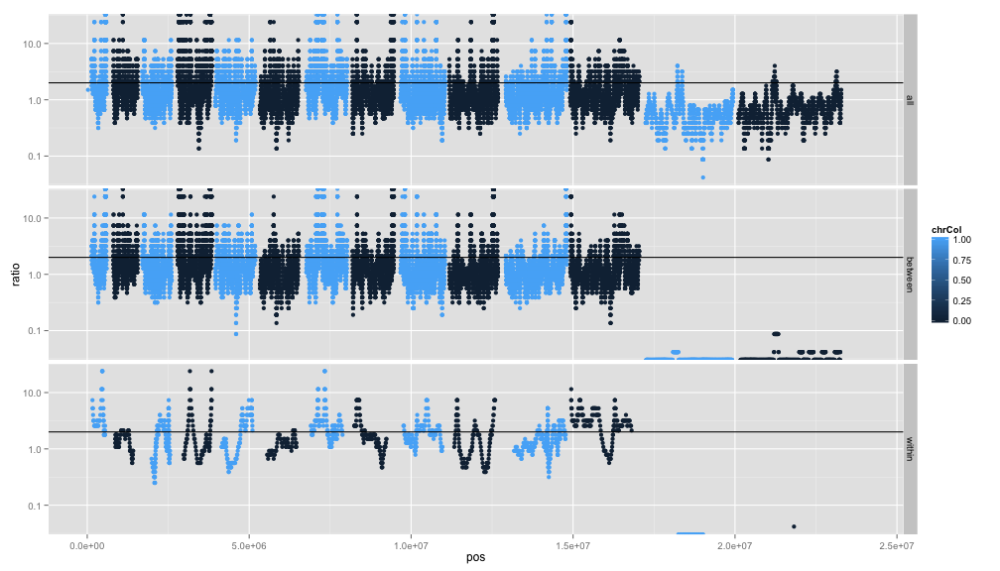
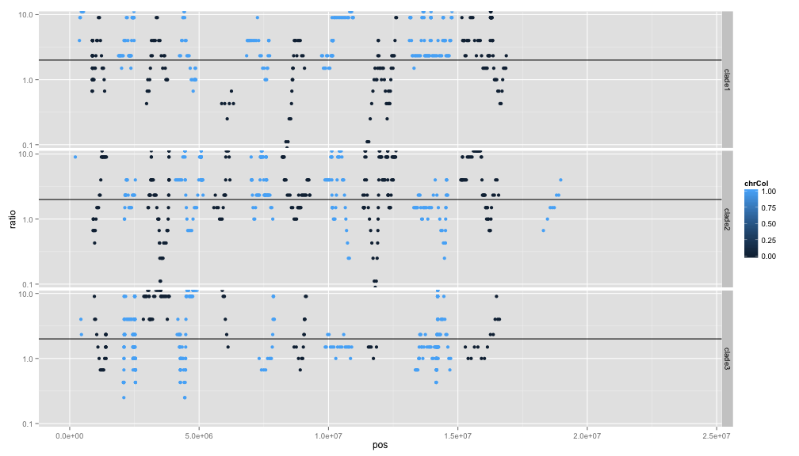

library(ggplot2)
library(reshape2)
library(knitr)
library(zoo)


```r
opts_chunk$set(fig.width=14, fig.height=8)
```


```r
reorder <- function(M,new_order) {
  M[lower.tri(M)] = t(M)[lower.tri(M)]
  M <- M[new_order,new_order]
  M[lower.tri(M)] <- NA
  M
}

sym <- function(M) {
  M[lower.tri(M)] = t(M)[lower.tri(M)]
  M
}


ggcolour <- function(n) {
  hues = seq(15, 375, length=n+1)
  hcl(h=hues, l=65, c=100)[1:n]
}


tree_order <- c(
"Th166.12", "Th246.13", "Th245.13", "Th211.13" ,"Th092.13" ,
"Th086.07", "Th106.09",  "Th230.12","Th074.13", "Th132.11","Th162.12","Th196.12", "Th106.11", "Th117.11", "Th134.11",
"Th068.12", "Th061.13", "Th095.13"
)
clades <- c(
  rep(2,5),
  rep(3,10),
  rep(1,3))
names(clades)<-tree_order
clades
```

```
## Th166.12 Th246.13 Th245.13 Th211.13 Th092.13 Th086.07 Th106.09 Th230.12 
##        2        2        2        2        2        3        3        3 
## Th074.13 Th132.11 Th162.12 Th196.12 Th106.11 Th117.11 Th134.11 Th068.12 
##        3        3        3        3        3        3        3        1 
## Th061.13 Th095.13 
##        1        1
```


```r
INDEL_dist <- read.table("Thies_all_manual.PASS.Cls.miss0.5.LMRG.HAP.INDEL.recode.vcf.dist.tab.txt",header=T,row.names=1,sep="\t")
SNP_dist <- read.table("Thies_all_manual.PASS.Cls.miss0.5.LMRG.HAP.SNP.recode.vcf.dist.tab.txt",header=T,row.names=1,sep="\t")
total_dist <- read.table("Thies_manual.nj.dist.tab.txt",header=T,row.names=1,sep="\t")
INDEL_dist <- reorder(INDEL_dist,tree_order)
SNP_dist <- reorder(SNP_dist,tree_order)
total_dist <- reorder(total_dist,tree_order)
#discord_dist <- reorder(discord_dist,tree_order)


chrLens <- read.table("chrLens.txt",sep="\t",row.names=1,col.names=c("name","pos","increment"))
```


```r
window=25

allalleles <- read.table("Thies_all_manual.PASS.Cls.miss0.5.LMRG.HAP.alleles.tab.txt",sep="\t",header=T)
allalleles$cumpos <- allalleles$pos + chrLens[as.character(allalleles$chr),"increment"]


allratios <- data.frame("pos"=rollapply(allalleles$cumpos,FUN=mean,width=window),
  "ratio"=rollapply(allalleles$type,FUN=function(x) {sum(x=="SNP")/sum(x=="INDEL")},width=window),
  "chrNo"=rollapply(allalleles$chr,FUN=function(x) {length(unique(x))},width=window),
  "chr"=rollapply(allalleles$chr,FUN=function(x) {paste(as.character(unique(x)),sep=",",collapse=",")},width=window),
  "chrCol"=rollapply(allalleles$chr,FUN=function(x) {as.numeric(x[1]) %% 2},width=window),
  "dataset"="all"
)

betweenalleles <- read.table("Thies_all_manual.PASS.Cls.miss0.5.LMRG.HAP.MKSNGL.alleles.tab.txt",sep="\t",header=T)
betweenalleles$cumpos <- betweenalleles$pos + chrLens[as.character(betweenalleles$chr),"increment"]

betweenratios <- data.frame("pos"=rollapply(betweenalleles$cumpos,FUN=mean,width=window),
  "ratio"=rollapply(betweenalleles$type,FUN=function(x) {sum(x=="SNP")/sum(x=="INDEL")},width=window),
  "chrNo"=rollapply(betweenalleles$chr,FUN=function(x) {length(unique(x))},width=window),
  "chr"=rollapply(betweenalleles$chr,FUN=function(x) {paste(as.character(unique(x)),sep=",",collapse=",")},width=window),
  "chrCol"=rollapply(betweenalleles$chr,FUN=function(x) {as.numeric(x[1]) %% 2},width=window),
  "dataset"="between"
)

withinalleles <- read.table("Thies_all_manual.PASS.Cls.miss0.5.LMRG.HAP.MKSNGL.DISCORD.alleles.tab.txt",sep="\t",header=T)
withinalleles$cumpos <- withinalleles$pos + chrLens[as.character(withinalleles$chr),"increment"]

withinratios <- data.frame("pos"=rollapply(withinalleles$cumpos,FUN=mean,width=window),
  "ratio"=rollapply(withinalleles$type,FUN=function(x) {sum(x=="SNP")/sum(x=="INDEL")},width=window),
  "chrNo"=rollapply(withinalleles$chr,FUN=function(x) {length(unique(x))},width=window),
  "chr"=rollapply(withinalleles$chr,FUN=function(x) {paste(as.character(unique(x)),sep=",",collapse=",")},width=window),
  "chrCol"=rollapply(withinalleles$chr,FUN=function(x) {as.numeric(x[1]) %% 2},width=window),
  "dataset"="within"
)
```


```r
window=10

clade1alleles <- read.table("Thies_all_manual.PASS.Cls.miss0.5.LMRG.HAP.DISCORDS.clade1.recode.alleles.tab.txt",sep="\t",header=T)
clade1alleles$cumpos <- clade1alleles$pos + chrLens[as.character(clade1alleles$chr),"increment"]
clade1ratios <- data.frame("pos"=rollapply(clade1alleles$cumpos,FUN=mean,width=window),
  "ratio"=rollapply(clade1alleles$type,FUN=function(x) {sum(x=="SNP")/sum(x=="INDEL")},width=window),
  "chrNo"=rollapply(clade1alleles$chr,FUN=function(x) {length(unique(x))},width=window),
  "chr"=rollapply(clade1alleles$chr,FUN=function(x) {paste(as.character(unique(x)),sep=",",collapse=",")},width=window),
  "chrCol"=rollapply(clade1alleles$chr,FUN=function(x) {as.numeric(x[1]) %% 2},width=window),
  "dataset"="clade1"
)


clade2alleles <- read.table("Thies_all_manual.PASS.Cls.miss0.5.LMRG.HAP.DISCORDS.clade2.recode.alleles.tab.txt",sep="\t",header=T)
clade2alleles$cumpos <- clade2alleles$pos + chrLens[as.character(clade2alleles$chr),"increment"]
clade2ratios <- data.frame("pos"=rollapply(clade2alleles$cumpos,FUN=mean,width=window),
  "ratio"=rollapply(clade2alleles$type,FUN=function(x) {sum(x=="SNP")/sum(x=="INDEL")},width=window),
  "chrNo"=rollapply(clade2alleles$chr,FUN=function(x) {length(unique(x))},width=window),
  "chr"=rollapply(clade2alleles$chr,FUN=function(x) {paste(as.character(unique(x)),sep=",",collapse=",")},width=window),
  "chrCol"=rollapply(clade2alleles$chr,FUN=function(x) {as.numeric(x[1]) %% 2},width=window),
  "dataset"="clade2"
)

clade3alleles <- read.table("Thies_all_manual.PASS.Cls.miss0.5.LMRG.HAP.DISCORDS.clade3.recode.alleles.tab.txt",sep="\t",header=T)
clade3alleles$cumpos <- clade3alleles$pos + chrLens[as.character(clade3alleles$chr),"increment"]
clade3ratios <- data.frame("pos"=rollapply(clade3alleles$cumpos,FUN=mean,width=window),
  "ratio"=rollapply(clade3alleles$type,FUN=function(x) {sum(x=="SNP")/sum(x=="INDEL")},width=window),
  "chrNo"=rollapply(clade3alleles$chr,FUN=function(x) {length(unique(x))},width=window),
  "chr"=rollapply(clade3alleles$chr,FUN=function(x) {paste(as.character(unique(x)),sep=",",collapse=",")},width=window),
  "chrCol"=rollapply(clade3alleles$chr,FUN=function(x) {as.numeric(x[1]) %% 2},width=window),
  "dataset"="clade3"
)
```

#between and within clades

```r
ratios <-rbind(allratios,betweenratios,withinratios)
ratios <- subset(ratios,chrNo==1)
ggplot(ratios,aes(x=pos,y=ratio,colour=chrCol)) + geom_point() + geom_hline(aes(yintercept=2)) + scale_y_log10() + facet_grid(dataset ~ .) + xlim(0,24e6)
```

 

#within clades only

```r
ratios <-rbind(clade1ratios,clade2ratios,clade3ratios)
ratios <- subset(ratios,chrNo==1)
ggplot(ratios,aes(x=pos,y=ratio,colour=chrCol)) + geom_point() + geom_hline(aes(yintercept=2)) + scale_y_log10() + facet_grid(dataset ~ .) + xlim(0,24e6)
```

 

