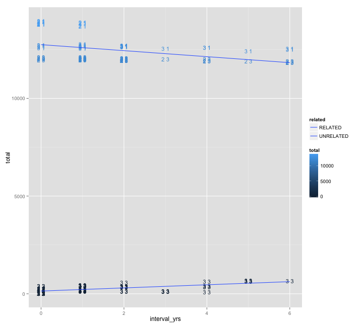

library(ggplot2)
library(reshape2)
library(knitr)

```r
opts_chunk$set(fig.width=10, fig.height=9)
```


```r
reorder <- function(M,new_order) {
  M[lower.tri(M)] = t(M)[lower.tri(M)]
  M <- M[new_order,new_order]
  M[lower.tri(M)] <- NA
  M
}

sym <- function(M) {
  M[lower.tri(M)] = t(M)[lower.tri(M)]
  M
}


ggcolour <- function(n) {
  hues = seq(15, 375, length=n+1)
  hcl(h=hues, l=65, c=100)[1:n]
}


tree_order <- c(
"Th166.12", "Th246.13", "Th245.13", "Th211.13" ,"Th092.13" ,
"Th086.07", "Th106.09",  "Th230.12","Th074.13", "Th132.11","Th162.12","Th196.12", "Th106.11", "Th117.11", "Th134.11",
"Th068.12", "Th061.13", "Th095.13"
)
clades <- c(
  rep(2,5),
  rep(3,10),
  rep(1,3))
names(clades)<-tree_order
clades
```

```
## Th166.12 Th246.13 Th245.13 Th211.13 Th092.13 Th086.07 Th106.09 Th230.12 
##        2        2        2        2        2        3        3        3 
## Th074.13 Th132.11 Th162.12 Th196.12 Th106.11 Th117.11 Th134.11 Th068.12 
##        3        3        3        3        3        3        3        1 
## Th061.13 Th095.13 
##        1        1
```


```r
doubletons <- read.table("sharedDoubles_thies.txt",header=T,row.names=1,sep="\t")
#doesn't handle missingness properly
#total_dist <- read.table("Thies_manual.nj.dist.tab.txt",header=T,row.names=1,sep="\t")
total_dist <- read.table("Thies_all_manual.PASS.Cls.miss0.5.LMRG.HAP.MKSNGL.dist.tab.txt",header=T,row.names=1,sep="\t")

singletons <- read.table("Thies_all_manual.PASS.Cls.miss0.5.LMRG.HAP.DISCORDS.singletonCounts",header=F,sep=":")
rownames(singletons) <- singletons$V1
colnames(singletons) <- c("sample","singletons")
singletons <- singletons[tree_order,]
singletons$sample <- ordered(singletons$sample,levels=rev(tree_order))
singletons <- cbind(singletons,clades)


doubletons <- reorder(doubletons,tree_order)
total_dist <- reorder(total_dist,tree_order)
```


```r
distances <- merge(
    melt(as.matrix(total_dist),value.name ="total",factorsAsStrings = T),
    melt(as.matrix(doubletons),value.name ="doubletons",factorsAsStrings = T),
    by=c("Var1","Var2")
    )
distances
```

```
##         Var1     Var2 total doubletons
## 1   Th061.13 Th061.13     0          0
## 2   Th061.13 Th068.12    NA         NA
## 3   Th061.13 Th074.13    NA         NA
## 4   Th061.13 Th086.07    NA         NA
## 5   Th061.13 Th092.13    NA         NA
## 6   Th061.13 Th095.13   282        272
## 7   Th061.13 Th106.09    NA         NA
## 8   Th061.13 Th106.11    NA         NA
## 9   Th061.13 Th117.11    NA         NA
## 10  Th061.13 Th132.11    NA         NA
## 11  Th061.13 Th134.11    NA         NA
## 12  Th061.13 Th162.12    NA         NA
## 13  Th061.13 Th166.12    NA         NA
## 14  Th061.13 Th196.12    NA         NA
## 15  Th061.13 Th211.13    NA         NA
## 16  Th061.13 Th230.12    NA         NA
## 17  Th061.13 Th245.13    NA         NA
## 18  Th061.13 Th246.13    NA         NA
## 19  Th068.12 Th061.13   356        192
## 20  Th068.12 Th068.12     0          0
## 21  Th068.12 Th074.13    NA         NA
## 22  Th068.12 Th086.07    NA         NA
## 23  Th068.12 Th092.13    NA         NA
## 24  Th068.12 Th095.13   297        232
## 25  Th068.12 Th106.09    NA         NA
## 26  Th068.12 Th106.11    NA         NA
## 27  Th068.12 Th117.11    NA         NA
## 28  Th068.12 Th132.11    NA         NA
## 29  Th068.12 Th134.11    NA         NA
## 30  Th068.12 Th162.12    NA         NA
## 31  Th068.12 Th166.12    NA         NA
## 32  Th068.12 Th196.12    NA         NA
## 33  Th068.12 Th211.13    NA         NA
## 34  Th068.12 Th230.12    NA         NA
## 35  Th068.12 Th245.13    NA         NA
## 36  Th068.12 Th246.13    NA         NA
## 37  Th074.13 Th061.13 12719         12
## 38  Th074.13 Th068.12 12632          0
## 39  Th074.13 Th074.13     0          0
## 40  Th074.13 Th086.07    NA         NA
## 41  Th074.13 Th092.13    NA         NA
## 42  Th074.13 Th095.13 12701          0
## 43  Th074.13 Th106.09    NA         NA
## 44  Th074.13 Th106.11   385         30
## 45  Th074.13 Th117.11   404          0
## 46  Th074.13 Th132.11   144          3
## 47  Th074.13 Th134.11   384          3
## 48  Th074.13 Th162.12   188          0
## 49  Th074.13 Th166.12    NA         NA
## 50  Th074.13 Th196.12   155          4
## 51  Th074.13 Th211.13    NA         NA
## 52  Th074.13 Th230.12    NA         NA
## 53  Th074.13 Th245.13    NA         NA
## 54  Th074.13 Th246.13    NA         NA
## 55  Th086.07 Th061.13 12545          0
## 56  Th086.07 Th068.12 12422          1
## 57  Th086.07 Th074.13   652          0
## 58  Th086.07 Th086.07     0          0
## 59  Th086.07 Th092.13    NA         NA
## 60  Th086.07 Th095.13 12502          0
## 61  Th086.07 Th106.09   576          0
## 62  Th086.07 Th106.11   408          7
## 63  Th086.07 Th117.11   399          1
## 64  Th086.07 Th132.11   622          7
## 65  Th086.07 Th134.11   347          0
## 66  Th086.07 Th162.12   652          7
## 67  Th086.07 Th166.12    NA         NA
## 68  Th086.07 Th196.12   677          0
## 69  Th086.07 Th211.13    NA         NA
## 70  Th086.07 Th230.12   620          0
## 71  Th086.07 Th245.13    NA         NA
## 72  Th086.07 Th246.13    NA         NA
## 73  Th092.13 Th061.13 13803          0
## 74  Th092.13 Th068.12 13689          0
## 75  Th092.13 Th074.13 11951          0
## 76  Th092.13 Th086.07 11831          0
## 77  Th092.13 Th092.13     0          0
## 78  Th092.13 Th095.13 13790          0
## 79  Th092.13 Th106.09 11911          0
## 80  Th092.13 Th106.11 11963          0
## 81  Th092.13 Th117.11 11925          0
## 82  Th092.13 Th132.11 11929          0
## 83  Th092.13 Th134.11 11935          0
## 84  Th092.13 Th162.12 12014          0
## 85  Th092.13 Th166.12    NA         NA
## 86  Th092.13 Th196.12 12025          0
## 87  Th092.13 Th211.13    NA         NA
## 88  Th092.13 Th230.12 11971          0
## 89  Th092.13 Th245.13    NA         NA
## 90  Th092.13 Th246.13    NA         NA
## 91  Th095.13 Th061.13    NA         NA
## 92  Th095.13 Th068.12    NA         NA
## 93  Th095.13 Th074.13    NA         NA
## 94  Th095.13 Th086.07    NA         NA
## 95  Th095.13 Th092.13    NA         NA
## 96  Th095.13 Th095.13     0          0
## 97  Th095.13 Th106.09    NA         NA
## 98  Th095.13 Th106.11    NA         NA
## 99  Th095.13 Th117.11    NA         NA
## 100 Th095.13 Th132.11    NA         NA
## 101 Th095.13 Th134.11    NA         NA
## 102 Th095.13 Th162.12    NA         NA
## 103 Th095.13 Th166.12    NA         NA
## 104 Th095.13 Th196.12    NA         NA
## 105 Th095.13 Th211.13    NA         NA
## 106 Th095.13 Th230.12    NA         NA
## 107 Th095.13 Th245.13    NA         NA
## 108 Th095.13 Th246.13    NA         NA
## 109 Th106.09 Th061.13 12604          0
## 110 Th106.09 Th068.12 12542          0
## 111 Th106.09 Th074.13    88          7
## 112 Th106.09 Th086.07    NA         NA
## 113 Th106.09 Th092.13    NA         NA
## 114 Th106.09 Th095.13 12612          0
## 115 Th106.09 Th106.09     0          0
## 116 Th106.09 Th106.11   358          1
## 117 Th106.09 Th117.11   359          2
## 118 Th106.09 Th132.11   121          2
## 119 Th106.09 Th134.11   343          0
## 120 Th106.09 Th162.12   125          1
## 121 Th106.09 Th166.12    NA         NA
## 122 Th106.09 Th196.12   140          0
## 123 Th106.09 Th211.13    NA         NA
## 124 Th106.09 Th230.12   107          4
## 125 Th106.09 Th245.13    NA         NA
## 126 Th106.09 Th246.13    NA         NA
## 127 Th106.11 Th061.13 12698          0
## 128 Th106.11 Th068.12 12619          0
## 129 Th106.11 Th074.13    NA         NA
## 130 Th106.11 Th086.07    NA         NA
## 131 Th106.11 Th092.13    NA         NA
## 132 Th106.11 Th095.13 12694          0
## 133 Th106.11 Th106.09    NA         NA
## 134 Th106.11 Th106.11     0          0
## 135 Th106.11 Th117.11   111          3
## 136 Th106.11 Th132.11    NA         NA
## 137 Th106.11 Th134.11   105          0
## 138 Th106.11 Th162.12    NA         NA
## 139 Th106.11 Th166.12    NA         NA
## 140 Th106.11 Th196.12    NA         NA
## 141 Th106.11 Th211.13    NA         NA
## 142 Th106.11 Th230.12    NA         NA
## 143 Th106.11 Th245.13    NA         NA
## 144 Th106.11 Th246.13    NA         NA
## 145 Th117.11 Th061.13 12681          0
## 146 Th117.11 Th068.12 12594          2
## 147 Th117.11 Th074.13    NA         NA
## 148 Th117.11 Th086.07    NA         NA
## 149 Th117.11 Th092.13    NA         NA
## 150 Th117.11 Th095.13 12670          0
## 151 Th117.11 Th106.09    NA         NA
## 152 Th117.11 Th106.11    NA         NA
## 153 Th117.11 Th117.11     0          0
## 154 Th117.11 Th132.11    NA         NA
## 155 Th117.11 Th134.11   111          5
## 156 Th117.11 Th162.12    NA         NA
## 157 Th117.11 Th166.12    NA         NA
## 158 Th117.11 Th196.12    NA         NA
## 159 Th117.11 Th211.13    NA         NA
## 160 Th117.11 Th230.12    NA         NA
## 161 Th117.11 Th245.13    NA         NA
## 162 Th117.11 Th246.13    NA         NA
## 163 Th132.11 Th061.13 12683          0
## 164 Th132.11 Th068.12 12557          0
## 165 Th132.11 Th074.13    NA         NA
## 166 Th132.11 Th086.07    NA         NA
## 167 Th132.11 Th092.13    NA         NA
## 168 Th132.11 Th095.13 12628          0
## 169 Th132.11 Th106.09    NA         NA
## 170 Th132.11 Th106.11   403         15
## 171 Th132.11 Th117.11   410          0
## 172 Th132.11 Th132.11     0          0
## 173 Th132.11 Th134.11   398          0
## 174 Th132.11 Th162.12   164          1
## 175 Th132.11 Th166.12    NA         NA
## 176 Th132.11 Th196.12   139          2
## 177 Th132.11 Th211.13    NA         NA
## 178 Th132.11 Th230.12    NA         NA
## 179 Th132.11 Th245.13    NA         NA
## 180 Th132.11 Th246.13    NA         NA
## 181 Th134.11 Th061.13 12655          6
## 182 Th134.11 Th068.12 12597          0
## 183 Th134.11 Th074.13    NA         NA
## 184 Th134.11 Th086.07    NA         NA
## 185 Th134.11 Th092.13    NA         NA
## 186 Th134.11 Th095.13 12663          0
## 187 Th134.11 Th106.09    NA         NA
## 188 Th134.11 Th106.11    NA         NA
## 189 Th134.11 Th117.11    NA         NA
## 190 Th134.11 Th132.11    NA         NA
## 191 Th134.11 Th134.11     0          0
## 192 Th134.11 Th162.12    NA         NA
## 193 Th134.11 Th166.12    NA         NA
## 194 Th134.11 Th196.12    NA         NA
## 195 Th134.11 Th211.13    NA         NA
## 196 Th134.11 Th230.12    NA         NA
## 197 Th134.11 Th245.13    NA         NA
## 198 Th134.11 Th246.13    NA         NA
## 199 Th162.12 Th061.13 12776          0
## 200 Th162.12 Th068.12 12657          0
## 201 Th162.12 Th074.13    NA         NA
## 202 Th162.12 Th086.07    NA         NA
## 203 Th162.12 Th092.13    NA         NA
## 204 Th162.12 Th095.13 12726          0
## 205 Th162.12 Th106.09    NA         NA
## 206 Th162.12 Th106.11   453          0
## 207 Th162.12 Th117.11   427          3
## 208 Th162.12 Th132.11    NA         NA
## 209 Th162.12 Th134.11   408          2
## 210 Th162.12 Th162.12     0          0
## 211 Th162.12 Th166.12    NA         NA
## 212 Th162.12 Th196.12   176         45
## 213 Th162.12 Th211.13    NA         NA
## 214 Th162.12 Th230.12    NA         NA
## 215 Th162.12 Th245.13    NA         NA
## 216 Th162.12 Th246.13    NA         NA
## 217 Th166.12 Th061.13 13886          5
## 218 Th166.12 Th068.12 13791          1
## 219 Th166.12 Th074.13 12028          0
## 220 Th166.12 Th086.07 11913          0
## 221 Th166.12 Th092.13   175         14
## 222 Th166.12 Th095.13 13881          0
## 223 Th166.12 Th106.09 11998          0
## 224 Th166.12 Th106.11 12039          0
## 225 Th166.12 Th117.11 12007          0
## 226 Th166.12 Th132.11 12005          1
## 227 Th166.12 Th134.11 11997          0
## 228 Th166.12 Th162.12 12091          0
## 229 Th166.12 Th166.12     0          0
## 230 Th166.12 Th196.12 12116          0
## 231 Th166.12 Th211.13   219         16
## 232 Th166.12 Th230.12 12030          0
## 233 Th166.12 Th245.13   223         31
## 234 Th166.12 Th246.13   197         14
## 235 Th196.12 Th061.13 12727          0
## 236 Th196.12 Th068.12 12621          0
## 237 Th196.12 Th074.13    NA         NA
## 238 Th196.12 Th086.07    NA         NA
## 239 Th196.12 Th092.13    NA         NA
## 240 Th196.12 Th095.13 12680          1
## 241 Th196.12 Th106.09    NA         NA
## 242 Th196.12 Th106.11   418          0
## 243 Th196.12 Th117.11   419          0
## 244 Th196.12 Th132.11    NA         NA
## 245 Th196.12 Th134.11   420          0
## 246 Th196.12 Th162.12    NA         NA
## 247 Th196.12 Th166.12    NA         NA
## 248 Th196.12 Th196.12     0          0
## 249 Th196.12 Th211.13    NA         NA
## 250 Th196.12 Th230.12    NA         NA
## 251 Th196.12 Th245.13    NA         NA
## 252 Th196.12 Th246.13    NA         NA
## 253 Th211.13 Th061.13 13925          1
## 254 Th211.13 Th068.12 13826          0
## 255 Th211.13 Th074.13 12042          0
## 256 Th211.13 Th086.07 11901          0
## 257 Th211.13 Th092.13   214         18
## 258 Th211.13 Th095.13 13928          1
## 259 Th211.13 Th106.09 12007          0
## 260 Th211.13 Th106.11 12055          0
## 261 Th211.13 Th117.11 12029          0
## 262 Th211.13 Th132.11 12003          0
## 263 Th211.13 Th134.11 11980          0
## 264 Th211.13 Th162.12 12073          0
## 265 Th211.13 Th166.12    NA         NA
## 266 Th211.13 Th196.12 12086          0
## 267 Th211.13 Th211.13     0          0
## 268 Th211.13 Th230.12 12025          0
## 269 Th211.13 Th245.13    NA         NA
## 270 Th211.13 Th246.13    NA         NA
## 271 Th230.12 Th061.13 12671          0
## 272 Th230.12 Th068.12 12589          0
## 273 Th230.12 Th074.13   129          2
## 274 Th230.12 Th086.07    NA         NA
## 275 Th230.12 Th092.13    NA         NA
## 276 Th230.12 Th095.13 12682          0
## 277 Th230.12 Th106.09    NA         NA
## 278 Th230.12 Th106.11   391          0
## 279 Th230.12 Th117.11   386          8
## 280 Th230.12 Th132.11   106          0
## 281 Th230.12 Th134.11   390          1
## 282 Th230.12 Th162.12   160          2
## 283 Th230.12 Th166.12    NA         NA
## 284 Th230.12 Th196.12   124          1
## 285 Th230.12 Th211.13    NA         NA
## 286 Th230.12 Th230.12     0          0
## 287 Th230.12 Th245.13    NA         NA
## 288 Th230.12 Th246.13    NA         NA
## 289 Th245.13 Th061.13 13965          0
## 290 Th245.13 Th068.12 13845          0
## 291 Th245.13 Th074.13 12099          0
## 292 Th245.13 Th086.07 11919          0
## 293 Th245.13 Th092.13   262          9
## 294 Th245.13 Th095.13 13930          0
## 295 Th245.13 Th106.09 12018          0
## 296 Th245.13 Th106.11 12055          0
## 297 Th245.13 Th117.11 12030          0
## 298 Th245.13 Th132.11 12030          0
## 299 Th245.13 Th134.11 12031          0
## 300 Th245.13 Th162.12 12123          0
## 301 Th245.13 Th166.12    NA         NA
## 302 Th245.13 Th196.12 12123          2
## 303 Th245.13 Th211.13   280         19
## 304 Th245.13 Th230.12 12035          0
## 305 Th245.13 Th245.13     0          0
## 306 Th245.13 Th246.13    NA         NA
## 307 Th246.13 Th061.13 13870          1
## 308 Th246.13 Th068.12 13729          0
## 309 Th246.13 Th074.13 12021          0
## 310 Th246.13 Th086.07 11856          1
## 311 Th246.13 Th092.13   203          4
## 312 Th246.13 Th095.13 13841          1
## 313 Th246.13 Th106.09 11935          0
## 314 Th246.13 Th106.11 11956          0
## 315 Th246.13 Th117.11 11967          0
## 316 Th246.13 Th132.11 11964          0
## 317 Th246.13 Th134.11 11948          0
## 318 Th246.13 Th162.12 12012          0
## 319 Th246.13 Th166.12    NA         NA
## 320 Th246.13 Th196.12 12068          0
## 321 Th246.13 Th211.13   234         18
## 322 Th246.13 Th230.12 11981          0
## 323 Th246.13 Th245.13   281          3
## 324 Th246.13 Th246.13     0          0
```

```r
#distances <- distances[distances$Var1!=distances$Var2,]
distances <- distances[!is.na(distances$total),]

distances$clade1 <- clades[distances$Var1]
distances$clade2 <- clades[distances$Var2]
distances$clades <- paste(clades[distances$Var1],clades[distances$Var2])

distances$interval_yrs <- abs(as.numeric(substr(as.character(distances$Var1),7,8)) - as.numeric(substr(as.character(distances$Var2),7,8)))
#distances$related <- distances$total < 10000
distances$related[distances$total >= 10000] <- "UNRELATED"
distances$related[distances$total < 10000] <- "RELATED"

distances$IBD <- distances$total < 2100


distances$Var1 <- factor(distances$Var1,levels=rev(tree_order))
distances$Var2 <- factor(distances$Var2,levels=rev(tree_order))
```


```r
relcol <- scale_color_manual(values=c("white","black"))
vxlab <- theme(axis.text.x = element_text(angle = 90, hjust = 1))  

ggplot(distances,aes(x=Var1,y=Var2,fill=total,label=total,colour=related)) + geom_tile() + scale_fill_gradient(trans="log") + geom_text(size=3) + relcol + vxlab
```

 

```r
ggplot(distances,aes(x=Var1,y=Var2,fill=doubletons,label=doubletons,colour=doubletons)) + geom_tile() + scale_fill_gradient(trans="log") + geom_text(size=5) +  vxlab + scale_colour_gradient(low="white",high="red")
```

 

```r
ggplot(subset(distances,related=="RELATED"),aes(x=Var1,y=Var2,fill=doubletons,label=doubletons,colour=doubletons)) + geom_tile() + scale_fill_gradient(trans="log") + geom_text(size=5) +  vxlab + scale_colour_gradient(low="white",high="red")
```

 

```r
ggplot(distances,aes(x=total,y=doubletons,colour=related)) + geom_point() + scale_x_log10() + facet_grid(. ~ related)
```

 

```r
ggplot(subset(distances,related=="RELATED"),aes(x=total,y=doubletons,colour=related)) + geom_point() + scale_x_log10() + facet_grid(. ~ related)
```

 

```r
ggplot(subset(distances,related=="UNRELATED"),aes(x=total,y=doubletons,colour=related)) + geom_point() + scale_x_log10() + facet_grid(. ~ related)
```

 


```r
#total var distance vs indel ration

ggplot(distances,aes(x=total,y=ratio,colour=related)) + geom_point() + facet_grid(. ~ related,scale="free_x") + ylim(0,1.5)
```

```
## Error in eval(expr, envir, enclos): object 'ratio' not found
```

```r
#intervening years vs indel ratio
ggplot(distances,aes(x=interval_yrs,y=ratio,colour=related,label=clades)) + geom_text(size=4) +
  geom_smooth(aes(group=related,colour=related), method="lm",se=F) + facet_grid(. ~ related,scale="free_x") + ylim(0,1.5)
```

```
## Error in eval(expr, envir, enclos): object 'ratio' not found
```

```r
#intervening years vs total var distance
ggplot(distances,aes(x=interval_yrs,y=total,colour=total,group=related,label=clades)) + geom_text(size=4) +
  geom_smooth(aes(group=related,fill=related), method="lm",se=F)
```

 

```r
ggplot(distances,aes(x=total,y=ratio,colour=total,group=related,label=clades)) + geom_text(size=4) +
  geom_smooth(aes(group=related,fill=related), method="lm",se=F) + ylim(0,1.3)
```

```
## Error in eval(expr, envir, enclos): object 'ratio' not found
```

```r
#SNP vs INDEL distances, all samples

ggplot(distances,aes(x=snp,y=indel,colour=related,group=related,label=clades)) + geom_text(size=4) + unrelatedLM + geom_abline(slope=0.5,linetype="dashed")
```

```
## Error in eval(expr, envir, enclos): object 'unrelatedLM' not found
```

```r
ggplot(subset(distances,related=="RELATED"),aes(x=snp,y=indel,colour=related,group=related,label=clades)) + geom_text(size=4) + unrelatedLM + geom_abline(linetype="dashed",slope=0.5)
```

```
## Error in eval(expr, envir, enclos): object 'unrelatedLM' not found
```

```r
ggplot(subset(distances,related=="UNRELATED"),aes(x=snp,y=indel,colour=related,group=related,label=clades)) + geom_text(size=4,colour=ggcolour(2)[[2]]) + unrelatedLM + geom_abline(linetype="dashed",slope=0.5)
```

```
## Error in eval(expr, envir, enclos): object 'unrelatedLM' not found
```

```r
#ggplot(distances,aes(x=snp,y=indel,colour=related,group=related,label=clades)) + geom_text(size=4) + unrelatedLM + facet_grid(. ~ related,scale="free")
#ggplot(subset(distances,related=="UNRELATED"),aes(x=snp,y=indel,colour=interval_yrs,group=related,label=clades)) + geom_text(size=4) + unrelatedLM
#ggplot(subset(distances,related=="RELATED"),aes(x=snp,y=indel,colour=interval_yrs,group=related,label=clades)) + geom_text(size=4) + unrelatedLM
#ggplot(subset(distances,related==F),aes(x=snp,y=indel,colour=total,group=related)) + geom_point(size=4)
```


```r
ggplot(singletons,aes(x=sample,y=singletons,fill=as.factor(clades))) + geom_bar(stat="identity") + vxlab + coord_flip() + scale_fill_manual(values = c("red","blue","green")) +  theme(axis.text=element_text(size=14, face="bold"),axis.title=element_blank())
```

 
