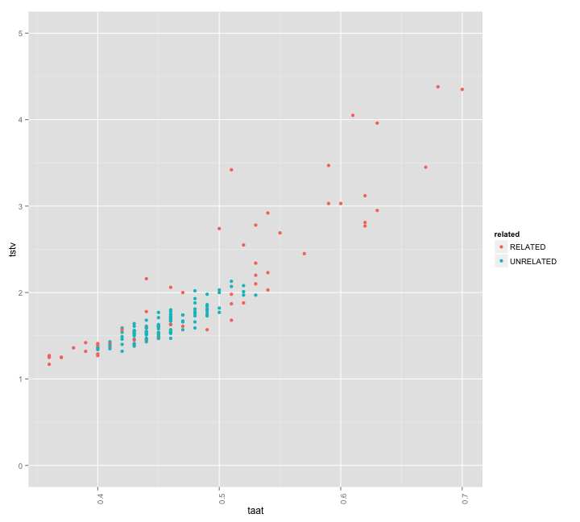

library(ggplot2)
library(reshape2)
library(knitr)

```r
opts_chunk$set(fig.width=10, fig.height=9)
```


```r
reorder <- function(M,new_order) {
  M[lower.tri(M)] = t(M)[lower.tri(M)]
  M <- M[new_order,new_order]
#  M[lower.tri(M)] <- NA
  M
}

sym <- function(M) {
  M[lower.tri(M)] = t(M)[lower.tri(M)]
  M
}


ggcolour <- function(n) {
  hues = seq(15, 375, length=n+1)
  hcl(h=hues, l=65, c=100)[1:n]
}


tree_order <- c(
"Th166.12", "Th246.13", "Th245.13", "Th211.13" ,"Th092.13" ,
"Th086.07", "Th106.09",  "Th230.12","Th074.13", "Th132.11","Th162.12","Th196.12", "Th106.11", "Th117.11", "Th134.11",
"Th068.12", "Th061.13", "Th095.13"
)
clades <- c(
  rep(2,5),
  rep(3,10),
  rep(1,3))
names(clades)<-tree_order
clades
```

```
## Th166.12 Th246.13 Th245.13 Th211.13 Th092.13 Th086.07 Th106.09 Th230.12 
##        2        2        2        2        2        3        3        3 
## Th074.13 Th132.11 Th162.12 Th196.12 Th106.11 Th117.11 Th134.11 Th068.12 
##        3        3        3        3        3        3        3        1 
## Th061.13 Th095.13 
##        1        1
```


```r
tstv <- read.table("Thies_all_manual.PASS.Cls.miss0.5.LMRG.HAP.MKSNGL.DISCORD.tstv.tab.txt",header=T,row.names=1,sep="\t")
tstv <- reorder(tstv,tree_order)
tstv[lower.tri(tstv)] <- NA
diag(tstv)<-0

indel <- read.table("Thies_all_manual.PASS.Cls.miss0.5.LMRG.HAP.MKSNGL.DISCORD.in-del.tab.txt",header=T,row.names=1,sep="\t")
indel <- reorder(indel,tree_order)
diag(indel) <- 0

indelsnp <- read.table("Thies_all_manual.PASS.Cls.miss0.5.LMRG.HAP.MKSNGL.DISCORD.indel-snp.tab.txt",header=T,row.names=1,sep="\t")
indelsnp <- reorder(indelsnp,tree_order)
indelsnp[lower.tri(indelsnp)] <- NA

taat <- read.table("Thies_all_manual.PASS.Cls.miss0.5.LMRG.HAP.MKSNGL.DISCORD.taat.tab.txt",header=T,row.names=1,sep="\t")
taat <- reorder(taat,tree_order)
taat[lower.tri(taat)] <- NA

total_dist <- read.table("Thies_all_manual.PASS.Cls.miss0.5.LMRG.HAP.MKSNGL.DISCORD.dist.tab.txt",header=T,row.names=1,sep="\t")
total_dist <- reorder(total_dist,tree_order)
total_dist[lower.tri(total_dist)] <- NA
```


```r
vartypes <- merge(
  merge(
      merge(   
        melt(as.matrix(taat),value.name ="taat",factorsAsStrings = T),
        melt(as.matrix(tstv),value.name ="tstv",factorsAsStrings = T),
        by=c("Var1","Var2")
      ),
      merge(   
        melt(as.matrix(indel),value.name ="indel",factorsAsStrings = T),
        melt(as.matrix(indelsnp),value.name ="indelsnp",factorsAsStrings = T),
        by=c("Var1","Var2")
      ),
      by=c("Var1","Var2")
    ),
    melt(as.matrix(total_dist),value.name ="total",factorsAsStrings = T),
    by=c("Var1","Var2")
    )

head(vartypes)
```

```
##       Var1     Var2 taat tstv indel indelsnp total
## 1 Th061.13 Th061.13   NA 0.00  0.00       NA     0
## 2 Th061.13 Th068.12   NA   NA  1.17       NA    NA
## 3 Th061.13 Th074.13   NA   NA  1.17       NA    NA
## 4 Th061.13 Th086.07   NA   NA  1.16       NA    NA
## 5 Th061.13 Th092.13   NA   NA  0.99       NA    NA
## 6 Th061.13 Th095.13 0.54 2.92  1.00     2.44   282
```

```r
#vartypes <- vartypes[vartypes$Var1!=vartypes$Var2,]
#vartypes <- vartypes[!is.na(vartypes$total),]

vartypes$clade1 <- clades[vartypes$Var1]
vartypes$clade2 <- clades[vartypes$Var2]
vartypes$clades <- paste(clades[vartypes$Var1],clades[vartypes$Var2])

vartypes$interval_yrs <- abs(as.numeric(substr(as.character(vartypes$Var1),7,8)) - as.numeric(substr(as.character(vartypes$Var2),7,8)))
vartypes$related[vartypes$clade1 != vartypes$clade2] <- "UNRELATED"
vartypes$related[vartypes$clade1 == vartypes$clade2] <- "RELATED"

#vartypes$IBD <- vartypes$total < 2100

vartypes$Var1 <- factor(vartypes$Var1,levels=rev(tree_order))
vartypes$Var2 <- factor(vartypes$Var2,levels=rev(tree_order))

head(vartypes)
```

```
##       Var1     Var2 taat tstv indel indelsnp total clade1 clade2 clades
## 1 Th061.13 Th061.13   NA 0.00  0.00       NA     0      1      1    1 1
## 2 Th061.13 Th068.12   NA   NA  1.17       NA    NA      1      1    1 1
## 3 Th061.13 Th074.13   NA   NA  1.17       NA    NA      1      3    1 3
## 4 Th061.13 Th086.07   NA   NA  1.16       NA    NA      1      3    1 3
## 5 Th061.13 Th092.13   NA   NA  0.99       NA    NA      1      2    1 2
## 6 Th061.13 Th095.13 0.54 2.92  1.00     2.44   282      1      1    1 1
##   interval_yrs   related
## 1            0   RELATED
## 2            1   RELATED
## 3            0 UNRELATED
## 4            6 UNRELATED
## 5            0 UNRELATED
## 6            0   RELATED
```

are t<->a changes responsible for spike in transversions?

```r
#taat proportion
ggplot(subset(vartypes,!is.na(tstv)),aes(x=Var1,y=Var2,fill=taat,label=tstv)) + geom_tile() + scale_fill_gradient(trans="log") + geom_text(size=4,colour="white") + relcol + vxlab
```

 

```r
#taat proportion
ggplot(subset(vartypes,!is.na(tstv)),aes(x=Var1,y=Var2,fill=tstv,label=taat)) + geom_tile() + scale_fill_gradient(trans="log") + geom_text(size=4,colour="white") + relcol + vxlab
```

```
## Warning: Removed 18 rows containing missing values (geom_text).
```

 

```r
#Ts:Tv x taat
ggplot(subset(vartypes,tstv > 0),aes(x=taat,y=tstv,colour=related)) + geom_point() + vxlab + ylim(0,5)
```

 

```r
#correlation
cor(vartypes$taat,vartypes$tstv,use = "pairwise.complete.obs")
```

```
## [1] 0.901297
```

```r
#taat x dist 
ggplot(subset(vartypes,tstv > 0),aes(x=total,y=taat,colour=related,label=clades)) + geom_text() + vxlab
```

 


```r
tstvs <- merge(
  merge(
    read.table("Thies_all_manual.PASS.Cls.miss0.5.LMRG.HAP.MKSNGL.CONCORD.TsTv.summary",header=T),
    read.table("Thies_all_manual.PASS.Cls.miss0.5.LMRG.HAP.MKSNGL.DISCORD.TsTv.summary",header=T),
    by="MODEL"
  ),
#  merge(
    read.table("Thies_all_manual.PASS.Cls.miss0.5.LMRG.HAP.MKSNGL.TsTv.summary",header=T),
#    read.table("Thies_all_manual.PASS.Cls.miss0.5.LMRG.HAP.TsTv.summary",header=T),
    by="MODEL"
#  ),
#  by="MODEL"
)

#colnames(tstvs)<-c("MODEL","CONCORD","DISCORD","MKSNGL","ALL")
colnames(tstvs)<-c("MODEL","CONCORD","DISCORD","ALL")
rownames(tstvs)<-tstvs$MODEL
tstvs$MODEL <- factor(tstvs$MODEL,levels=c("AT","AG","CT","AC","GT","CG","Ts","Tv","total","Tv-ta"))

tstvs["Tv-ta",1] <- "Tv-ta"
tstvs["Tv-ta",2:4] <- tstvs["Tv",2:4] - tstvs["AT",2:4]
tstvs["total",1] <- "total"
tstvs["total",2:4] <- tstvs["Tv",2:4] + tstvs["Ts",2:4]


tstvs["Tv",2:4] / tstvs["Ts",2:4]
```

```
##     CONCORD  DISCORD      ALL
## Tv 1.075135 2.167742 1.198141
```

```r
tstvs["Tv-ta",2:4] / tstvs["Ts",2:4]
```

```
##         CONCORD   DISCORD       ALL
## Tv-ta 0.4743821 0.4903226 0.4761766
```

```r
alleles <- subset(tstvs,MODEL %in% c("AC","AG","AT","CG","CT","GT"))
tstvs <- subset(tstvs,MODEL %in% c("Ts","Tv","Tv-ta","AT"))

tstvs <- melt(tstvs)
```

```
## Using MODEL as id variables
```

```r
tstvs$variable <- factor(tstvs$variable,levels=c("ALL","CONCORD","DISCORD"))
tstvs$MODEL <- ordered(tstvs$MODEL,levels =c("Ts","Tv","Tv-ta","AT"))
tstvs <- tstvs[order(tstvs$MODEL),]

alleles <- melt(alleles)
```

```
## Using MODEL as id variables
```

```r
alleles$variable <- factor(alleles$variable,levels=c("ALL","CONCORD","DISCORD"))
alleles$MODEL <- ordered(alleles$MODEL,levels=c("AT","AG","CT","AC","GT","CG"))
```


```r
cols <- c("#0000DD","#EE0000","#9999FF","#0000DD")
names(cols) <- c("Tv","Ts","Tv-ta","AT")
tscol <- scale_fill_manual(values = cols)

ggplot(subset(tstvs,MODEL %in% c("Ts","Tv")),aes(x=variable,y=value,group=MODEL,fill=MODEL)) + geom_bar(stat="identity",position = "stack") + tscol
```

 

```r
ggplot(subset(tstvs,MODEL %in% c("Ts","Tv-ta","AT")),aes(x=variable,y=value,group=MODEL,fill=MODEL)) + geom_bar(stat="identity",position = "stack") + tscol
```

 

```r
ggplot(subset(tstvs,MODEL %in% c("Ts","Tv")),aes(x=variable,y=value,group=MODEL,fill=MODEL)) + geom_bar(stat="identity",position = "fill") + tscol
```

 

```r
ggplot(subset(tstvs,MODEL %in% c("Ts","Tv-ta","AT")),aes(x=variable,y=value,group=MODEL,fill=MODEL)) + geom_bar(stat="identity",position = "fill") + tscol
```

 

```r
ggplot(subset(tstvs,MODEL %in% c("Ts","Tv-ta")),aes(x=variable,y=value,group=MODEL,fill=MODEL)) + geom_bar(stat="identity",position = "fill") + tscol
```

 

```r
#ggplot(subset(tstvs,!MODEL %in% c("Ts","Tv","total","Tv-ta")),aes(x=MODEL,y=value,group=variable,fill=variable)) + geom_bar(stat="identity",position = "dodge")
```

Base Change Counts

```r
cols<-ggcolour(6)
names(cols)<-levels(alleles$MODEL)
alcol <- scale_fill_manual(values = cols)

alleles <- alleles[order(alleles$MODEL),]
ggplot(alleles,aes(x=variable,y=value,group=MODEL,fill=MODEL)) + geom_bar(stat="identity",position = "dodge") + alcol
```

 

```r
ggplot(alleles,aes(x=variable,y=value,group=MODEL,fill=MODEL)) + geom_bar(stat="identity",position = "stack") + alcol
```

 

```r
ggplot(alleles,aes(x=variable,y=value,group=MODEL,fill=MODEL)) + geom_bar(stat="identity",position = "fill") + alcol
```

 

```r
ggplot(subset(alleles,MODEL != "AT"),aes(x=variable,y=value,group=MODEL,fill=MODEL)) + geom_bar(stat="identity",position = "fill") + alcol
```

 
