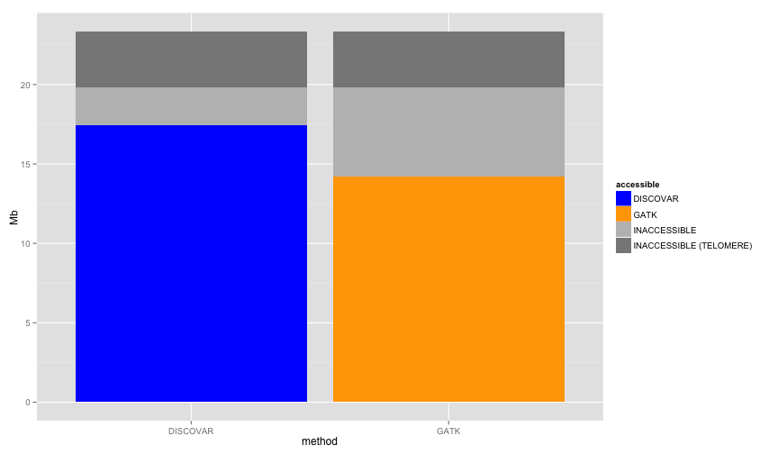

library(ggplot2)
library(knitr)
library(reshape2)
library(hexbin)

```r
opts_chunk$set(fig.width=12, fig.height=7, fig.path="figure/wgcf-")
```


```r
calcols <- c("chr","st","en","NV","LDfails","LDpass","RSfails","RSpass","df","dn","Dpass","multipass")
callable1k_disco <- read.table("qDD2vr3D7.callable.blocks1k.tab.txt",stringsAsFactors = T,sep='\t',header=F,col.names = calcols)
callable1k_haplo <- read.table("fakeNGS_haplo_qDD2r3D7_rl100.callable.1k.txt",stringsAsFactors = T,sep='\t',header=F,col.names = calcols)

callable1k_disco <- callable1k_disco[,c(1,2,3,12)]
callable1k_haplo <- callable1k_haplo[,c(1,2,3,12)]

callable1k_disco$method="DISCOVAR"
callable1k_haplo$method="GATK"
#callable1k <- rbind(callable1k_disco[1:1000,],callable1k_haplo[1:1000,])
callable1k <- rbind(callable1k_disco,callable1k_haplo)

callable1k$multipass <- callable1k$multipass=="True"
#colnames(callable1k)[[4]] <- "accessible"
#callable1k$accessible[is.na(callable1k$accessible)] <- "accessible"
```


```r
telos <- readLines("List.subtelomeres.3D7.regions.txt")
telos <- t(as.data.frame(strsplit(telos,split = ':')))
telos <- as.data.frame(cbind(telos[,1],t(as.data.frame(strsplit(telos[,2],split = '-')))))
colnames(telos) <- c("chr","st","en")
telos$st <- as.numeric(as.character(telos$st))
telos$en <- as.numeric(as.character(telos$en))
telos$chr <- as.character(telos$chr)

telos <- merge(subset(telos,st < 1000),subset(telos,st > 1000),by="chr")
colnames(telos) <- c("chr","stL","enL","stR","enR")


callable1k$chr <- as.character(callable1k$chr)
callable1k$telo=F
tmp <- merge(callable1k,telos,by="chr",all.x=T)

tmp[is.na(tmp$stL),c("stL","enL","stR","enR")] <- -1
tmp$telo[tmp$en < tmp$enL] = T # "L"
tmp$telo[tmp$st > tmp$stR] = T # "R"
callable1k <- tmp[,colnames(callable1k)]
rm(tmp)
```


```r
callable1k$accessible=F
callable1k$accessible[callable1k$multipass & callable1k$method=="DISCOVAR"] <- "DISCOVAR"
callable1k$accessible[callable1k$multipass & callable1k$method=="GATK"] <- "GATK"

callable1k$accessible[!callable1k$multipass] <- "INACCESSIBLE"
callable1k$accessible[callable1k$telo] <- "INACCESSIBLE (TELOMERE)"

callable1k$accessible <- factor(callable1k$accessible,levels=c("DISCOVAR",
                                                               "GATK",
                                                               "INACCESSIBLE",
                                                               "INACCESSIBLE (TELOMERE)"
                                                               ))
```


```r
  # ggtitle(paste("callable regions (5kb windows)")) +
ggplot(callable1k,aes(x=method,fill=accessible)) + 
  geom_bar(position="stack") + scale_fill_manual(values=c("blue","orange","grey","#888888")) +
  scale_y_continuous(breaks=seq(0,25000,5000),labels=seq(0,25,5),name="Mb")
```

 

```r
ggplot(callable1k,aes(xmin=st,xmax=en,ymin=0,ymax=1,fill=accessible)) + 
  ggtitle(paste("callable regions (1kb windows)")) +
  geom_rect() + scale_fill_manual(values=c("dark grey","grey","blue","orange"))+
  facet_grid(chr ~ .)   + theme(legend.position="bottom") 
```

 


```r
  # ggtitle(paste("callable regions (5kb windows)")) +
ggplot(callable1k,aes(x=method,fill=accessible)) + 
  geom_bar(position="stack") + scale_fill_manual(values=c("blue","orange","grey","#888888")) +
  scale_y_continuous(breaks=seq(0,25000,5000),labels=seq(0,25,5),name="Mb")
```

 
