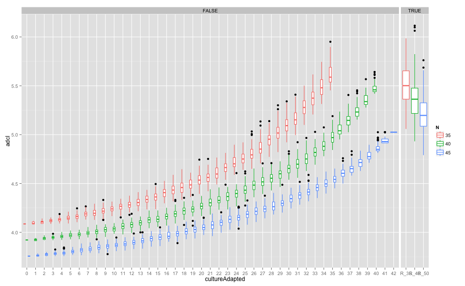
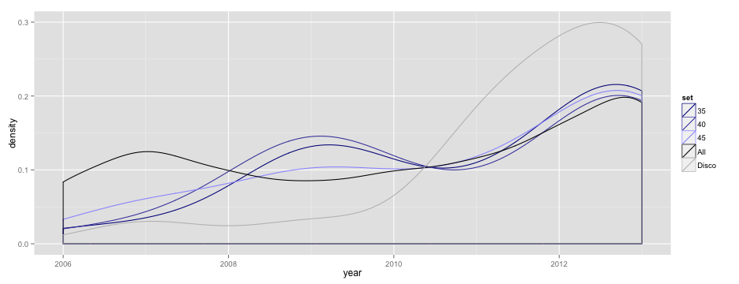
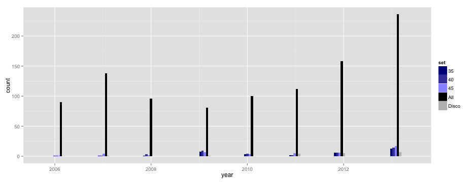
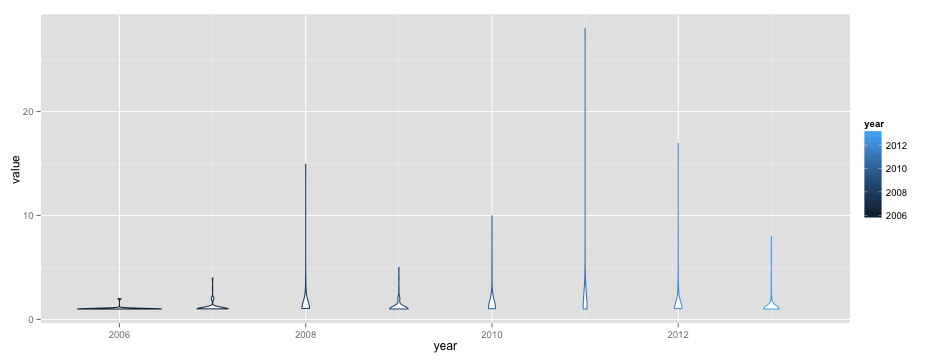

library(knitr)
library(ggplot2)

```r
opts_chunk$set(fig.width=13, fig.height=5)
```

total nos of reference samples: 35,40,45
0-42 (all) culture adapted samples used. 
100 iterations (boot selections of cultured parasites) per condition


```r
adcls <- read.table("all_iters_panel.txt")
colnames(adcls)<-c("N","cultureAdapted","adcl")
adcls$RAND <- adcls$cultureAdapted>=50
adcls$cultureAdapted <- factor(adcls$cultureAdapted,labels=c(as.character(seq(0,45)),"R_35","R_40","R_50"))
adcls$N <- factor(adcls$N)
adcls <- adcls[!adcls$cultureAdapted %in% c(43:45),]
adcls$group=paste(adcls$N,adcls$cultureAdapted)
ggplot(adcls,aes(x=cultureAdapted,y=adcl,group=group,colour=N)) + geom_boxplot() + 
  facet_grid(. ~ RAND,scale="free_x",space= "free_x",)
```

 


```r
adcl_groups <- read.table("daniels.thies.CA.txt",sep="\t",header=T)
adcl_groups$sum=apply(adcl_groups[,6:8],1,FUN=sum)

set35 <- subset(adcl_groups,ADCL_35==1,c("name","year"))
set35$set="35"
set35 <- subset(adcl_groups,ADCL_35==1,c("name","year"))
set35$set="35"
set40 <- subset(adcl_groups,ADCL_40==1,c("name","year"))
set40$set="40"
set45 <- subset(adcl_groups,ADCL_45==1,c("name","year"))
set45$set="45"
setAll <- adcl_groups[,c("name","year")]
setAll$set="All"
setDisco <- subset(adcl_groups,DISCO==1,c("name","year"))
setDisco$set="Disco"
sets <- rbind(set35,set40,set45,setAll,setDisco)
rm(set35,set40,set45,setAll)
cols<-c("black","#000088","#4444AA","#9999FF","grey")
names(cols)<-c("All","35","40","45","Disco")
ggplot(sets,aes(x=year,group=set,colour=set)) + geom_density() + scale_color_manual(values=cols)
```

```
## Warning: Removed 1 rows containing non-finite values (stat_density).
```

 

```r
ggplot(sets,aes(x=year,group=set,fill=set)) + geom_histogram(position="dodge") + scale_fill_manual(values=cols)
```

```
## stat_bin: binwidth defaulted to range/30. Use 'binwidth = x' to adjust this.
```

```
## Warning: position_dodge requires constant width: output may be incorrect
```

 

```r
subset(adcl_groups,sum==3)
```

```
##          name haplotype.number year culture_adapted DISCO ADCL_35 ADCL_40
## 77   Th017.13               21 2013               0     0       1       1
## 136  Th029.09               55 2009               1     0       1       1
## 152  Th033.09              356 2009               1     0       1       1
## 179  Th040.11                7 2011               0     0       1       1
## 316  Th073.11                8 2011               0     0       1       1
## 340  Th079.06              131 2006               0     0       1       1
## 483  Th113.13              626 2013               0     0       1       1
## 575  Th135.10               65 2010               0     0       1       1
## 602  Th141.07               44 2007               0     0       1       1
## 615  Th143.13               92 2013               0     0       1       1
## 698  Th163.10               64 2010               0     0       1       1
## 807  Th200.13              668 2013               0     0       1       1
## 877  Th222.12               12 2012               0     0       1       1
## 891  Th227.13              686 2013               0     0       1       1
## 911  Th235.13               98 2013               0     0       1       1
## 922  Th240.12               81 2012               0     0       1       1
## 941  Th251.08              345 2008               0     0       1       1
## 964  Th268.13               95 2013               0     0       1       1
## 971  Th274.12               16 2012               0     0       1       1
## 976  Th278.13               86 2013               0     0       1       1
## 991  Th288.12               79 2012               0     0       1       1
## 1002 Th303.13              715 2013               0     0       1       1
##      ADCL_45 SET_35_v1 SET_40_v1 SET_45_v1 sum
## 77         1         1         1         1   3
## 136        1       101       101       101   3
## 152        1       101       101       101   3
## 179        1         1         1         1   3
## 316        1         1         1         1   3
## 340        1         1         1         1   3
## 483        1         1         1         1   3
## 575        1         1         1         1   3
## 602        1         1         1         1   3
## 615        1         1         1         1   3
## 698        1         1         1         1   3
## 807        1         1         1         1   3
## 877        1         1         1         1   3
## 891        1         1         1         1   3
## 911        1         1         1         1   3
## 922        1         1         1         1   3
## 941        1         1         1         1   3
## 964        1         1         1         1   3
## 971        1         1         1         1   3
## 976        1         1         1         1   3
## 991        1         1         1         1   3
## 1002       1         1         1         1   3
```


excess of singletons explains underrepresentation of 2007 in ADCL sets?

```r
haplo_dist <- melt(table(adcl_groups[,c("year","haplotype.number")]))
haplo_dist <- subset(haplo_dist,value>0)
ggplot(haplo_dist,aes(x=year,y=value,group=year,colour=year)) + geom_violin()
```

 

```r
#ggplot(haplo_dist,aes(x=year,y=value,group=year,colour=year)) + geom_jitter()
#ggplot(subset(haplo_dist,value>1),aes(x=year,y=value,group=year,colour=year)) + geom_jitter()
```


```r
haplos <- table(adcl_groups[,c("year","haplotype.number")])
haplos <- data.frame(year=rownames(haplos),"multi"=apply(haplos[,1:dim(haplos)[[2]]]>1,1,FUN=sum),"all"=apply(haplos[,1:dim(haplos)[[2]]]>0,1,FUN=sum))
haplos$prop <- haplos$multi/haplos$all
haplos
```

```
##      year multi all       prop
## 2006 2006     3  87 0.03448276
## 2007 2007    12 121 0.09917355
## 2008 2008    10  69 0.14492754
## 2009 2009     9  66 0.13636364
## 2010 2010    15  61 0.24590164
## 2011 2011    12  64 0.18750000
## 2012 2012    17 106 0.16037736
## 2013 2013    21 182 0.11538462
```
