#seqtrack tutorial  

```r
library(ape)
library(adegenet)
library(knitr)
library(igraph)

opts_chunk$set(fig.width=9, fig.height=9)
opts_chunk$set(dev=c('png'))


sym <- function(M) {
  M[lower.tri(M)] = t(M)[lower.tri(M)]
  M
}
```

```r
#read in distance matrix
mat <- read.table("Thies_all_manual.PASS.Cls.miss0.5.LMRG.HAP.vcf.dist.tab.txt",sep="\t")
D <- as.dist(sym(mat))

#tre <- nj(D)
#tre <- ladderize(tre)
#plot(tre,edge.width=2, tip.col=num2col(weeks, col.pal=seasun))

#make into clusters
clust <- gengraph(D,ngrp=3)
plot(clust$g, main="gengraph clusters")
```

 

```r
distmat <- as.matrix(D)
names <- colnames(distmat)
```


```r
meta <- read.table("daniels.thies.CA.txt",sep="\t",header=T)
rownames(meta) <- meta$name
meta <- meta[names,]
coll <- as.Date(paste("1","jan",meta$year,sep=""),"%d%b%Y")
names(coll)<-meta$name

weeks <- as.integer(difftime(coll, min(coll), unit="weeks"))

name1 <- names[clust$clust$membership==1]
name2 <- names[clust$clust$membership==2]
name3 <- names[clust$clust$membership==3]
year1 <- meta$year[clust$clust$membership==1]
year2 <- meta$year[clust$clust$membership==2]
year3 <- meta$year[clust$clust$membership==3]
coll1 <- coll[name1]
coll2 <- coll[name2]
coll3 <- coll[name3]
```


```r
dist1 <- distmat[name1,name1]
dist2 <- distmat[name2,name2]
dist3 <- distmat[name3,name3]


#res1 <- seqTrack(distmat, x.names=name1, x.dates=coll1)
#res$clust <- clust$clust$membership[rownames(res)]

res1 <- seqTrack(dist1, x.names=name1, x.dates=coll1)
plot(as.igraph(res1),main="all vars")
```

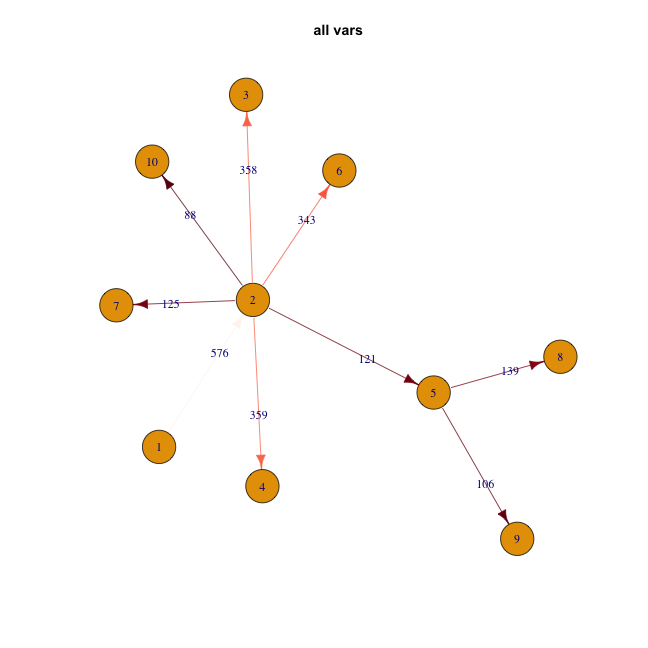 

```r
plot(res1,y=NULL,col.pal=flame)
```

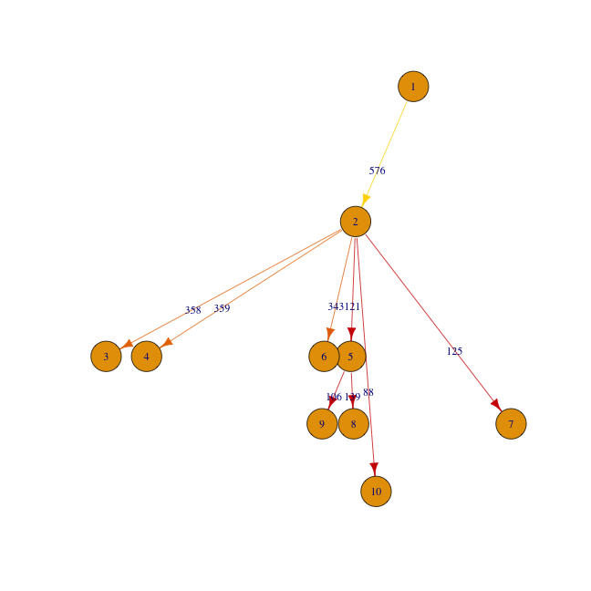 

```r
res2 <- seqTrack(dist2, x.names=name2, x.dates=coll2)
plot(res2,y=NULL,col.pal=flame)
```

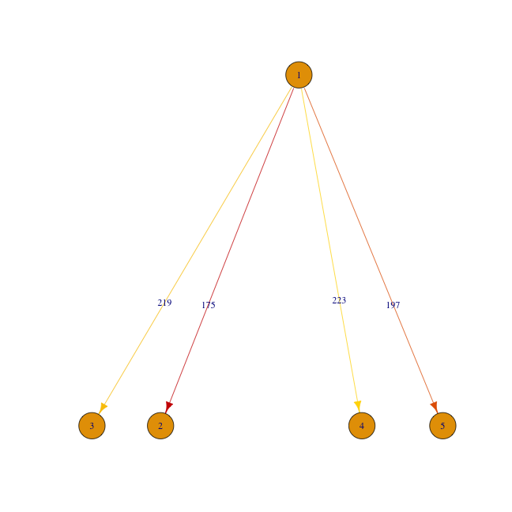 

```r
res3 <- seqTrack(dist3, x.names=name3, x.dates=coll3)
plot(res3,y=NULL,col.pal=flame)
```

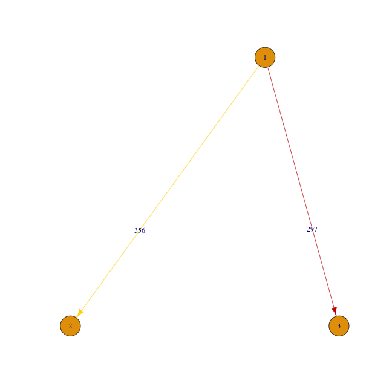 


```r
#read in distance matrix
mat <- read.table("Thies_all_manual.PASS.Cls.miss0.5.LMRG.HAP.INDEL.recode.vcf.dist.tab.txt",sep="\t")
indelD <- as.dist(sym(mat))
distmatINDEL <- as.matrix(indelD)

dist1INDEL <- distmatINDEL[name1,name1]
dist2INDEL <- distmatINDEL[name2,name2]
dist3INDEL <- distmatINDEL[name3,name3]

res1INDEL <- seqTrack(dist1INDEL, x.names=name1, x.dates=coll1)
plot(as.igraph(res1INDEL),main="INDELs")
```

 

```r
plot(res1INDEL,y=NULL,col.pal=flame)
```

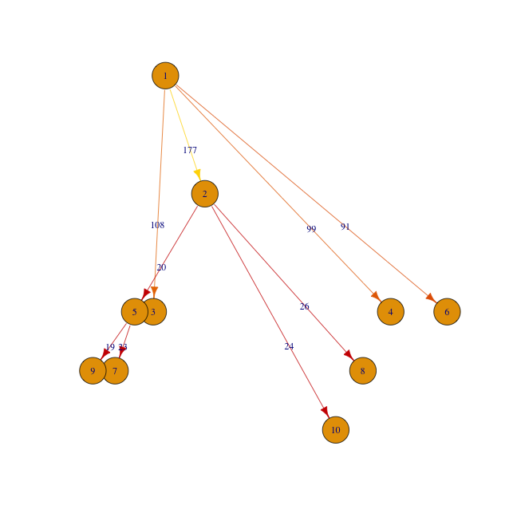 

```r
res2INDEL <- seqTrack(dist2INDEL, x.names=name2, x.dates=coll2)
plot(res2INDEL,y=NULL,col.pal=flame)
```

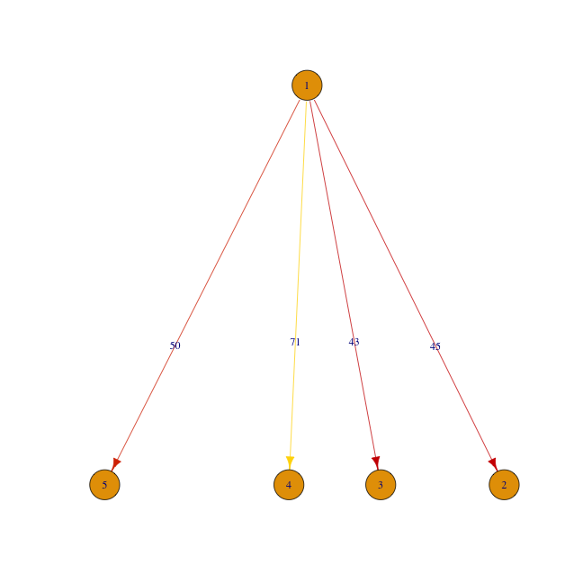 

```r
res3INDEL <- seqTrack(dist3INDEL, x.names=name3, x.dates=coll3)
plot(res3INDEL,y=NULL,col.pal=flame)
```

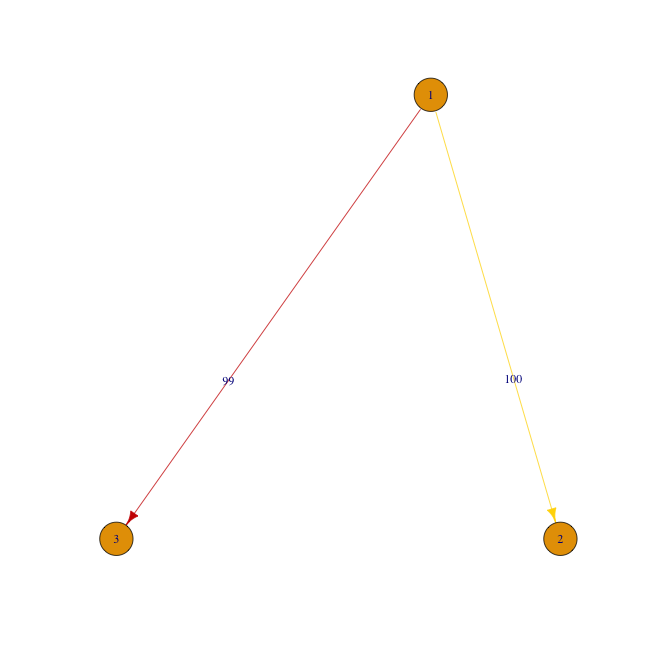 


```r
#read in distance matrix
mat <- read.table("Thies_all_manual.PASS.Cls.miss0.5.LMRG.HAP.SNP.recode.vcf.dist.tab.txt",sep="\t")
SNPD <- as.dist(sym(mat))
distmatSNP <- as.matrix(SNPD)

dist1SNP <- distmatSNP[name1,name1]
dist2SNP <- distmatSNP[name2,name2]
dist3SNP <- distmatSNP[name3,name3]

res1SNP <- seqTrack(dist1SNP, x.names=name1, x.dates=coll1)
plot(as.igraph(res1SNP),main="SNPs")
```

 

```r
plot(res1SNP,y=NULL,col.pal=flame)
```

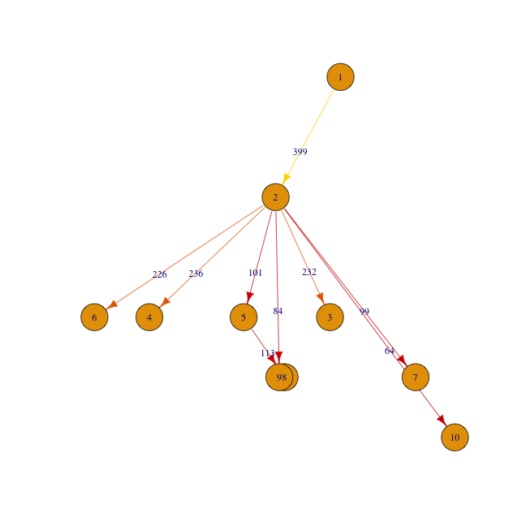 

```r
res2SNP <- seqTrack(dist2SNP, x.names=name2, x.dates=coll2)
plot(res2SNP,y=NULL,col.pal=flame)
```

 

```r
res3SNP <- seqTrack(dist3SNP, x.names=name3, x.dates=coll3)
plot(res3SNP,y=NULL,col.pal=flame)
```

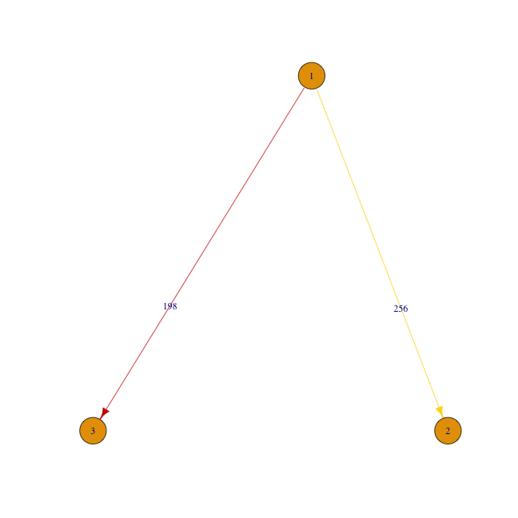 


```r
cols <- rev(brewer.pal(7, "RdBu") )

ts=1 #textsize
ig <- as.igraph(res1)
V(ig)$name <- name1
V(ig)$color <- cols[year1-min(year1)+1]
V(ig)$label.cex <- ts
plot(ig,main="all vars",vertex.size=25)
```

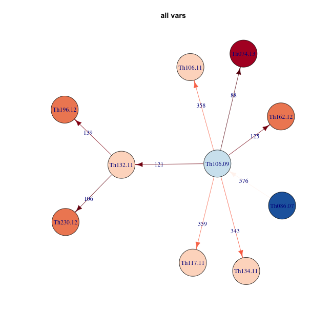 

```r
igSNP <- as.igraph(res1SNP)
V(igSNP)$name <- name1
V(igSNP)$color <- cols[year1-min(year1)+1]
V(igSNP)$label.cex <- ts
plot(igSNP,main="SNPs",vertex.size=25)
```

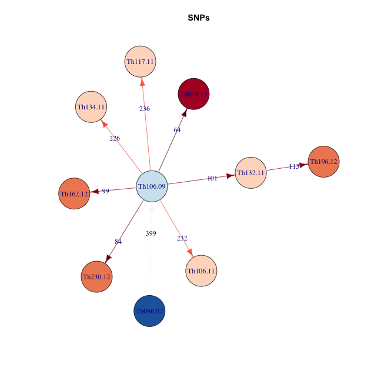 

```r
igINDEL <- as.igraph(res1INDEL)
V(igINDEL)$name <- name1
V(igINDEL)$color <- cols[year1-min(year1)+1]
V(igINDEL)$label.cex <- ts
plot(igINDEL,main="INDELs",vertex.size=25,)
```

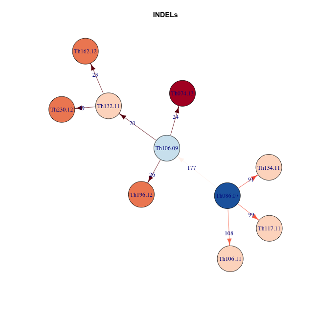 
