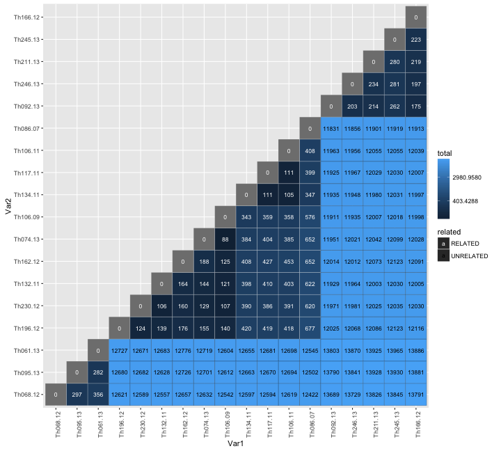
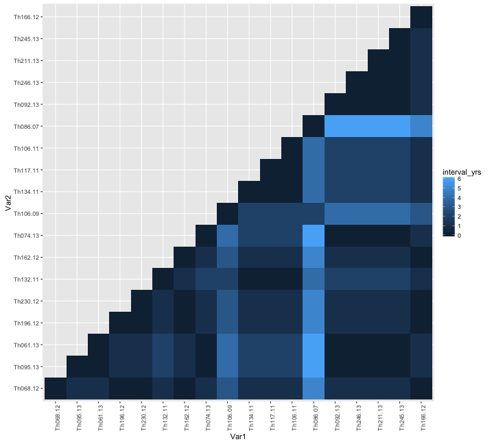
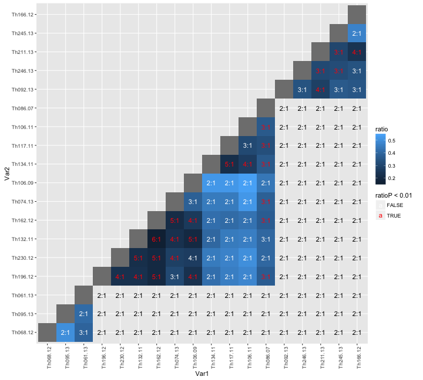
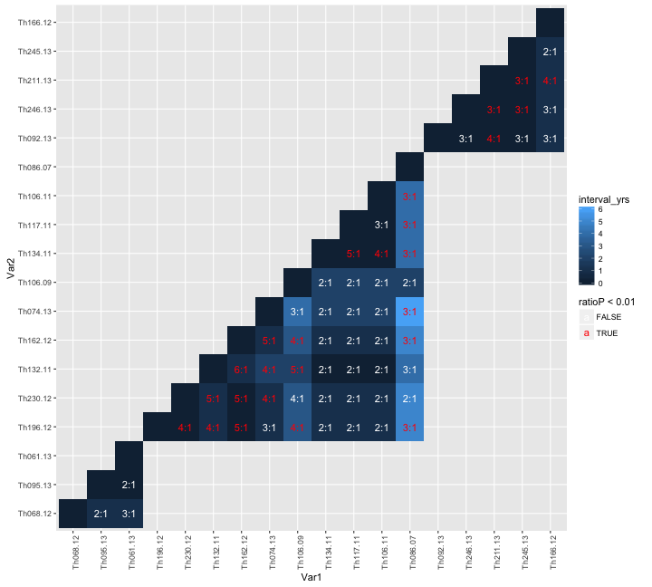
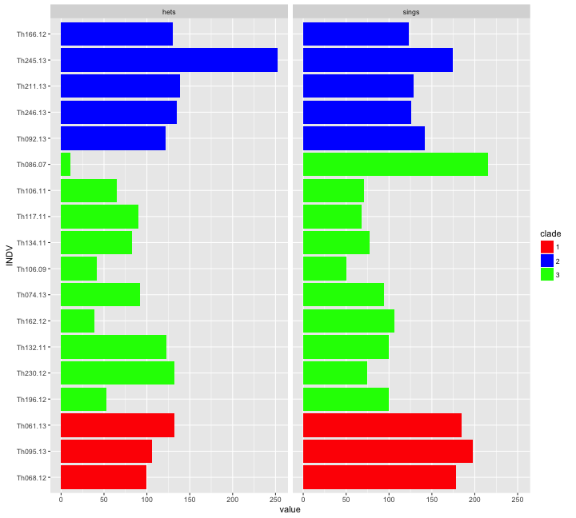
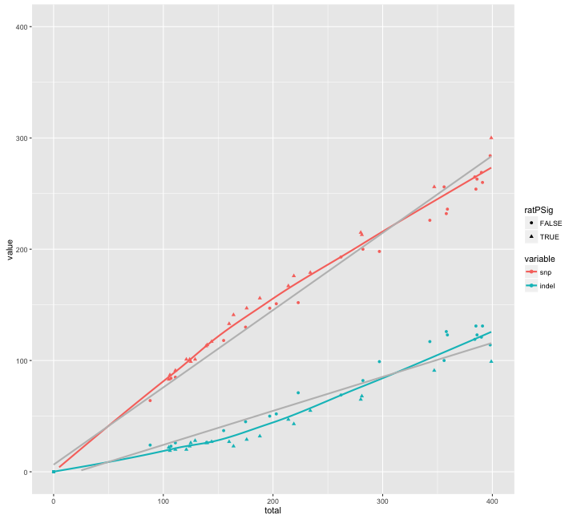

library(ggplot2)
library(reshape2)
library(knitr)

```r
opts_chunk$set(fig.width=10, fig.height=9)
opts_chunk$set(dev=c('png'))
```


```r
reorder <- function(M,new_order) {
  M[lower.tri(M)] = t(M)[lower.tri(M)]
  M <- M[new_order,new_order]
  M[lower.tri(M)] <- NA
  M
}

sym <- function(M) {
  M[lower.tri(M)] = t(M)[lower.tri(M)]
  M
}


ggcolour <- function(n) {
  hues = seq(15, 375, length=n+1)
  hcl(h=hues, l=65, c=100)[1:n]
}


tree_order <- c(
"Th166.12", "Th245.13", "Th211.13" ,"Th246.13", "Th092.13" ,
"Th086.07", "Th106.11", "Th117.11", "Th134.11", "Th106.09", "Th074.13", "Th162.12", "Th132.11","Th230.12","Th196.12", 
"Th061.13", "Th095.13","Th068.12"
)
clades <- c(
  rep(2,5),
  rep(3,10),
  rep(1,3))
names(clades)<-tree_order
clades
```

```
## Th166.12 Th245.13 Th211.13 Th246.13 Th092.13 Th086.07 Th106.11 Th117.11 
##        2        2        2        2        2        3        3        3 
## Th134.11 Th106.09 Th074.13 Th162.12 Th132.11 Th230.12 Th196.12 Th061.13 
##        3        3        3        3        3        3        3        1 
## Th095.13 Th068.12 
##        1        1
```


```r
INDEL_dist <- read.table("Thies_all_manual.PASS.Cls.miss0.5.LMRG.HAP.INDEL.recode.vcf.dist.tab.txt",header=T,row.names=1,sep="\t")

SNP_dist <- read.table("Thies_all_manual.PASS.Cls.miss0.5.LMRG.HAP.SNP.recode.vcf.dist.tab.txt",header=T,row.names=1,sep="\t")

total_dist <- read.table("Thies_all_manual.PASS.Cls.miss0.5.LMRG.HAP.vcf.dist.tab.txt",header=T,row.names=1,sep="\t")


INDEL_dist <- reorder(INDEL_dist,tree_order)
SNP_dist <- reorder(SNP_dist,tree_order)
total_dist <- reorder(total_dist,tree_order)
#discord_dist <- reorder(discord_dist,tree_order)
```


```r
distances <- merge(
  merge(
    melt(as.matrix(INDEL_dist),value.name ="indel"),
    melt(as.matrix(SNP_dist),value.name ="snp"),
    by=c("Var1","Var2")
    ),
  melt(as.matrix(total_dist),value.name ="total"),
  by=c("Var1","Var2")
)


#distances <- distances[distances$Var1!=distances$Var2,]
distances <- distances[!is.na(distances$total),]

distances$clade1 <- clades[distances$Var1]
distances$clade2 <- clades[distances$Var2]
distances$clades <- paste(clades[distances$Var1],clades[distances$Var2])

distances$interval_yrs <- abs(as.numeric(substr(as.character(distances$Var1),7,8)) - as.numeric(substr(as.character(distances$Var2),7,8)))
#distances$related <- distances$total < 10000
distances$related[distances$total >= 10000] <- "UNRELATED"
distances$related[distances$total < 10000] <- "RELATED"

distances$IBD <- distances$total < 2100


distances$ratio <- round(distances$indel/distances$snp,2)
distances$logratio <- log2(distances$ratio)
distances$Var1 <- factor(distances$Var1,levels=rev(tree_order))
distances$Var2 <- factor(distances$Var2,levels=rev(tree_order))

distances$ratio_t <- paste(round(distances$snp/distances$indel),1,sep=":")
distances$ratio_t[is.na(distances$ratio)] <- NA


snpRatioLM <- coef(lm(indel ~ snp, data = subset(distances,related=="UNRELATED")))
unrelatedLM <- geom_abline(intercept=snpRatioLM[[1]],slope=snpRatioLM[[2]])

#distances[as.numeric(distances$Var1) <= as.numeric(distances$Var2),]
#flip all to top half
#distances[as.numeric(distances$Var1) > as.numeric(distances$Var2),c("Var1","Var2")] <- distances[as.numeric(distances$Var1) > as.numeric(distances$Var2),c("Var2","Var1")]
```


```r
distances$ratioP <- NA
ID_unrelated <- c(sum(distances$indel[distances$related=="UNRELATED"]),sum(distances$snp[distances$related=="UNRELATED"]))
ID_related <- c(sum(distances$indel[distances$related=="RELATED"]),sum(distances$snp[distances$related=="RELATED"]))
tab <- cbind(ID_unrelated,ID_related)
colnames(tab)<-c("unrelated","related"); rownames(tab) <- c("indel","snp")
tab
```

```
##       unrelated related
## indel    392037    4931
## snp      794860   12794
```

```r
fisher.test(tab)
```

```
## 
## 	Fisher's Exact Test for Count Data
## 
## data:  tab
## p-value < 2.2e-16
## alternative hypothesis: true odds ratio is not equal to 1
## 95 percent confidence interval:
##  1.237996 1.323040
## sample estimates:
## odds ratio 
##   1.279747
```

```r
for(i in 1:dim(distances)[[1]]){ 
  t <- fisher.test(t(rbind(ID_unrelated,distances[i,c("indel","snp")])))
  distances[i,"ratioP"] <- t$p.value
  }

distances$ratio[is.nan(distances$ratio)] <- NA
#distances
```


```r
relcol <- scale_color_manual(values=c("white","black"))
vxlab <- theme(axis.text.x = element_text(angle = 90, hjust = 1))  

ggplot(distances,aes(x=Var1,y=Var2,fill=total,label=total,colour=related)) + geom_tile() + scale_fill_gradient(trans="log") + geom_text(size=3) + relcol + vxlab
```

 

```r
ggplot(distances,aes(x=Var1,y=Var2,fill=interval_yrs)) + geom_tile() + vxlab
```

 

```r
sigcol <- scale_color_manual(values=c("white","red"))
#ggplot(distances,aes(x=Var1,y=Var2,fill=ratio,label=ratio)) + geom_tile(size=1) + geom_text(aes(colour=ratioP < 0.01),size=4) + sigcol + vxlab
ggplot(subset(distances,related=="RELATED"),aes(x=Var1,y=Var2,fill=ratio,label=ratio_t)) + geom_tile(size=1) + 
  geom_text(aes(colour=ratioP < 0.01),size=4) + 
  geom_text(data=subset(distances,related=="UNRELATED"),size=4) + sigcol + vxlab
```

```
## Warning: Removed 18 rows containing missing values (geom_text).
```

 

```r
# ggplot(subset(distances,related=="RELATED"),aes(x=Var1,y=Var2,fill=total,label=ratio_t)) + geom_tile(size=1) + 
#   geom_text(aes(colour=ratioP < 0.01),size=4) + 
#   sigcol + vxlab
ggplot(subset(distances,related=="RELATED"),aes(x=Var1,y=Var2,fill=interval_yrs,label=ratio_t)) + geom_tile(size=1) + 
  geom_text(aes(colour=ratioP < 0.01),size=4) + 
  sigcol + vxlab
```

```
## Warning: Removed 18 rows containing missing values (geom_text).
```

 


```r
hets <- read.table("Thies_all_manual_2.PASS.Cls.miss0.5.LMRG.het.HETCOUNTS",header=T)
colnames(hets)[6] <- "hets"
rownames(hets) <- hets$INDV
hets <- hets[tree_order,]
ggplot(hets,aes(x=INDV,y=hets)) + geom_bar(stat="identity") + coord_flip()
```

 

```r
sings <- read.table("Thies_all_manual_2.PASS.Cls.miss0.5.LMRG.singletons",header=T)
sings <- subset(sings,SINGLETON.DOUBLETON=="D")
#sings$vartype<-"SNP"
#sings$vartype[apply(sings$ALLELE,1,FUN=length)>1]<-"INDEL"
#table(sings[,c("INDV","vartype")])
sings<-table(sings[,c("INDV")])
sings <- sings[tree_order]
hets$sings <- sings 
hets$clade <- as.factor(clades)

hets$INDV <- factor(hets$INDV,levels = rev(tree_order))
cftab <- melt(hets[,c("INDV","clade","hets","sings")],id.vars=c("INDV","clade"))
```

```
## Warning: attributes are not identical across measure variables; they will
## be dropped
```

```r
ggplot(cftab,aes(x=INDV,y=value,fill=clade)) + geom_bar(stat="identity") + coord_flip() + facet_grid(. ~ variable,scales ="free_y") + scale_fill_manual(values=c("red","blue","green"))
```

 


```r
distcfs <- melt(distances[,c("snp","indel","total")],id.vars=c("total"))
ggplot(distcfs,aes(x=total,y=value,colour=variable,group=variable)) + geom_point() + scale_y_log10() + scale_x_log10()
```

 

```r
ggplot(distcfs,aes(x=total,y=value,colour=variable,group=variable)) + geom_point() + geom_smooth(method = "lm", se = FALSE)+ xlim(0,1000)+ylim(0,1000)
```

```
## Warning: Removed 95 rows containing missing values (stat_smooth).
```

```
## Warning: Removed 95 rows containing missing values (stat_smooth).
```

```
## Warning: Removed 190 rows containing missing values (geom_point).
```

```
## Warning: Removed 3 rows containing missing values (geom_path).
```

 

```r
ggplot(distcfs,aes(x=total,y=value,colour=variable,group=variable)) + geom_point() + geom_smooth(se = FALSE)+ xlim(0,750)+ylim(0,750)
```

```
## geom_smooth: method="auto" and size of largest group is <1000, so using loess. Use 'method = x' to change the smoothing method.
```

```
## Warning: Removed 95 rows containing missing values (stat_smooth).
```

```
## Warning: Removed 95 rows containing missing values (stat_smooth).
```

```
## Warning: Removed 190 rows containing missing values (geom_point).
```

```
## Warning: Removed 1 rows containing missing values (geom_path).
```

 

