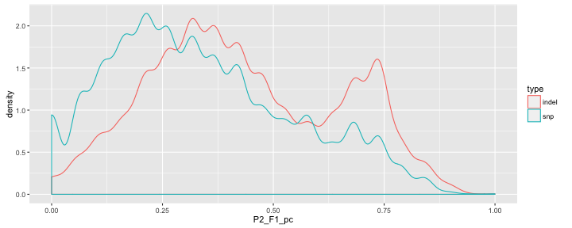
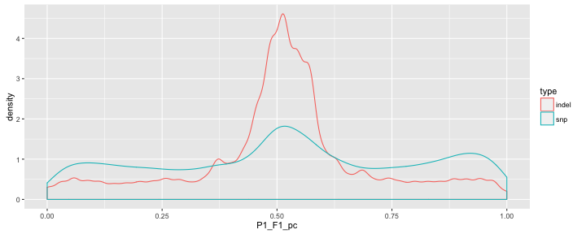

library(ggplot2)
library(reshape2)
library(knitr)

```r
opts_chunk$set(fig.width=10, fig.height=4)
opts_chunk$set(dev=c('png'))
```


```r
loss3H <- read.table("3d7_hb3.gatk.final.F1pc.txt",header=T,sep="\t")
loss3H <- subset(loss3H, P1!="None" & P2!="None")
loss3H$P1_F1_pc<-as.numeric(as.character(loss3H$P1_F1_pc))
```

```
## Warning: NAs introduced by coercion
```

```r
loss3H$P1_F1_pc[is.na(loss3H$P1_F1_pc)]<-0
loss3H$P2_F1_pc<-as.numeric(as.character(loss3H$P2_F1_pc))
```

```
## Warning: NAs introduced by coercion
```

```r
loss3H$P2_F1_pc[is.na(loss3H$P2_F1_pc)]<-0


loss7G <- read.table("7g8_gb4.gatk.final.F1pc.txt",header=T,sep="\t")
loss7G <- subset(loss7G, P1!="None" & P2!="None")
loss7G$P1_F1_pc<-as.numeric(as.character(loss7G$P1_F1_pc))
```

```
## Warning: NAs introduced by coercion
```

```r
loss7G$P1_F1_pc[is.na(loss7G$P1_F1_pc)]<-0
loss7G$P2_F1_pc<-as.numeric(as.character(loss7G$P2_F1_pc))
```

```
## Warning: NAs introduced by coercion
```

```r
loss7G$P2_F1_pc[is.na(loss7G$P2_F1_pc)]<-0

lossHD <- read.table("hb3_dd2.gatk.final.F1pc.txt",header=T,sep="\t")
lossHD <- subset(lossHD, P1!="None" & P2!="None")
lossHD$P1_F1_pc<-as.numeric(as.character(lossHD$P1_F1_pc))
```

```
## Warning: NAs introduced by coercion
```

```r
lossHD$P1_F1_pc[is.na(lossHD$P1_F1_pc)]<-0
lossHD$P2_F1_pc<-as.numeric(as.character(lossHD$P2_F1_pc))
```

```
## Warning: NAs introduced by coercion
```

```r
lossHD$P2_F1_pc[is.na(lossHD$P2_F1_pc)]<-0
```


```r
ggplot(lossHD,aes(x=P1_F1_pc,group=type,colour=type)) + geom_density()
```


```r
ggplot(loss7G,aes(x=P1_F1_pc,group=type,colour=type)) + geom_density()
```



```r
ggplot(loss3H,aes(x=P2_F1_pc,group=type,colour=type)) + geom_density()
```


