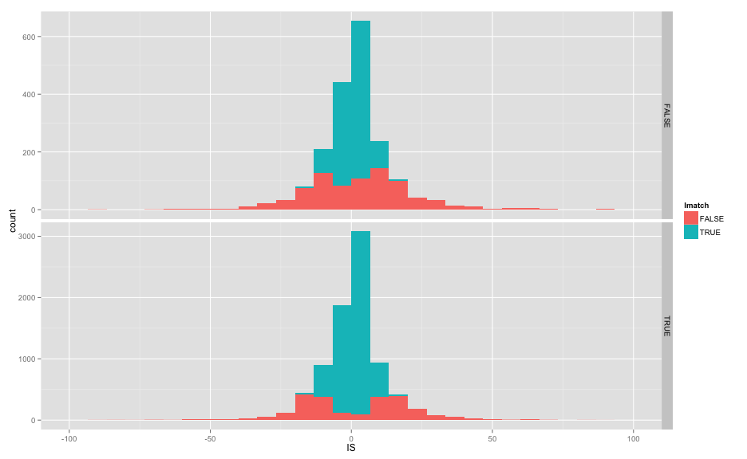
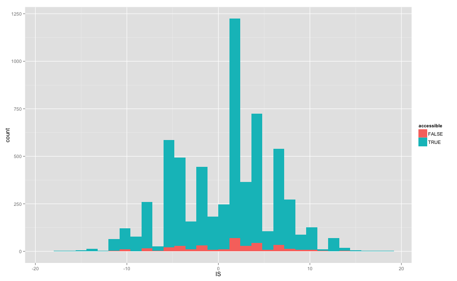
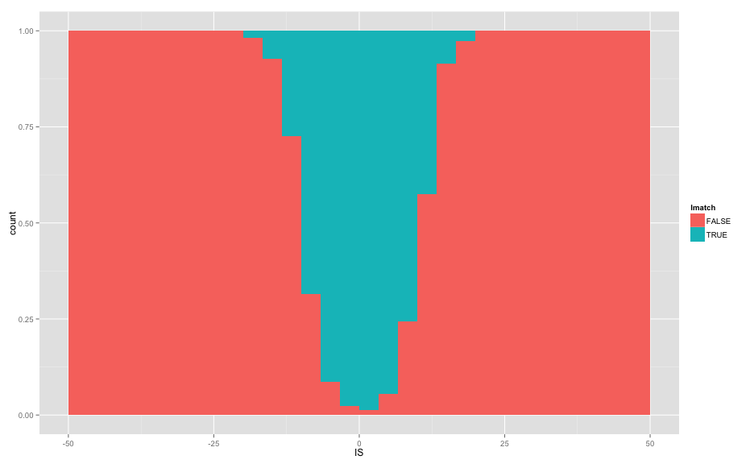
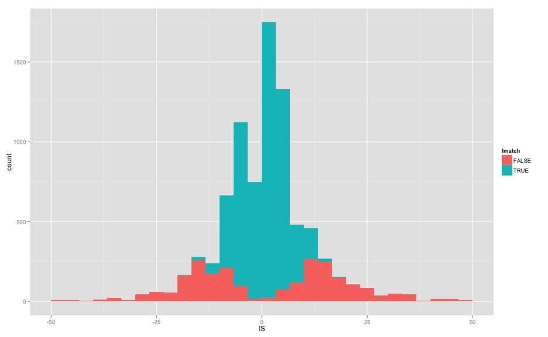
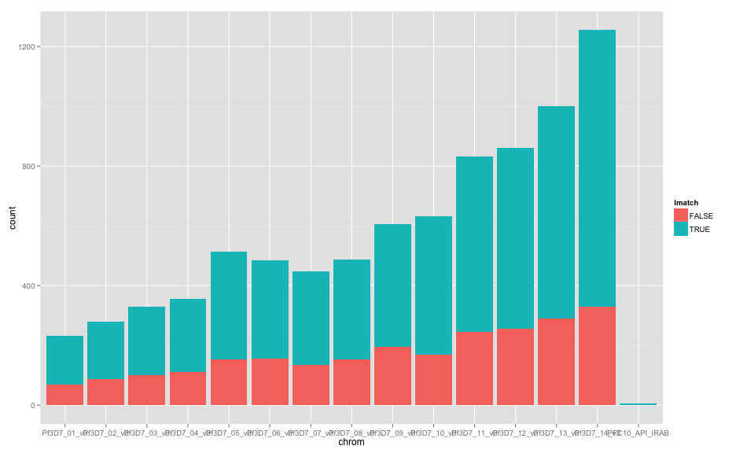

library(knitr)
library(ggplot2)

```r
opts_chunk$set(fig.width=13, fig.height=8)
```


```r
access <- read.table("DD2-2D4.align_cf.3D7_DD2.ACCESS.bed",stringsAsFactors = F)
colnames(access) <- c("chrom","st","en","var","IS","TD","VT","VC","LD","N1","C1","L1","NM1","N2","C2","L2","MN2")
access$Imatch <- (access$IS == (access$L2-access$L1))

sum(access$VC==1)
```

```
## [1] 8322
```

```r
sum(access$VC==1 & access$Imatch)
```

```
## [1] 5875
```

```r
sum(access$VC==1 & access$Imatch) / sum(access$VC==1)
```

```
## [1] 0.7059601
```


```r
inaccess <- read.table("DD2-2D4.align_cf.3D7_DD2.INACCESS.bed",stringsAsFactors = F)
colnames(inaccess) <- c("chrom","st","en","var","IS","TD","VT","VC","LD","N1","C1","L1","NM1","N2","C2","L2","MN2")
inaccess$Imatch <- (inaccess$IS == (inaccess$L2-inaccess$L1))

sum(inaccess$VC==1)
```

```
## [1] 562
```

```r
sum(inaccess$VC==1 & inaccess$Imatch)
```

```
## [1] 374
```

```r
sum(inaccess$VC==1 & inaccess$Imatch) / sum(inaccess$VC==1)
```

```
## [1] 0.6654804
```


```r
allvars <- read.table("DD2-2D4.align_cf.3D7_DD2.bed",stringsAsFactors = F)
colnames(allvars) <- c("chrom","st","en","var","IS","TD","VT","VC","LD","N1","C1","L1","NM1","N2","C2","L2","MN2")
allvars$Imatch <- (allvars$IS == (allvars$L2-allvars$L1))

sum(allvars$VC==1)
```

```
## [1] 8871
```

```r
sum(allvars$VC==1 & allvars$Imatch)
```

```
## [1] 6240
```

```r
sum(allvars$VC==1 & allvars$Imatch) / sum(allvars$VC==1)
```

```
## [1] 0.7034156
```

```r
#sum(allvars$VC!=1 & allvars$Imatch) / sum(allvars$VC!=1)

allvars$accessible = allvars$var %in% access$var
allvars$noFVars = allvars$VC==1

#predicted/aligned length differences (noFlankVars:T vs hasFlankVars:F)
ggplot(subset(allvars,accessible),aes(x=IS,y=L2-L1,colour=Imatch)) + geom_point() + facet_grid(noFVars ~ .) + xlim(-100,100)
```

```
## Warning: Removed 3 rows containing missing values (geom_point).
```

```
## Warning: Removed 11 rows containing missing values (geom_point).
```

 

```r
#predicted insert length distribution (no_flank_vars:T vs flank_vars:F)
ggplot(subset(allvars,accessible),aes(x=IS,fill=Imatch)) + geom_bar() + facet_grid(noFVars ~ .,scale="free_y") + xlim(-100,100)
```

```
## stat_bin: binwidth defaulted to range/30. Use 'binwidth = x' to adjust this.
## stat_bin: binwidth defaulted to range/30. Use 'binwidth = x' to adjust this.
```

 

```r
#insert calling better than del, both unmatched > 20bp
ggplot(subset(allvars,Imatch & noFVars),aes(x=IS,fill=accessible)) + geom_bar()
```

```
## stat_bin: binwidth defaulted to range/30. Use 'binwidth = x' to adjust this.
```

 

```r
ggplot(subset(allvars,noFVars & accessible),aes(x=IS,fill=Imatch)) + geom_bar(position="fill") + xlim(-50,50)
```

```
## stat_bin: binwidth defaulted to range/30. Use 'binwidth = x' to adjust this.
```

 

```r
ggplot(subset(allvars,noFVars & accessible),aes(x=IS,fill=Imatch)) + geom_bar() + xlim(-50,50)
```

```
## stat_bin: binwidth defaulted to range/30. Use 'binwidth = x' to adjust this.
```

 

```r
#ggplot(subset(allvars,VC==1),aes(x=TD,y=IS-(L2-L1),colour=Imatch)) + geom_point() + facet_grid(accessible ~ .)
```


```r
#no clear chr effects of accessibility
ggplot(subset(allvars,noFVars & accessible),aes(x=chrom,fill=Imatch)) + geom_bar()
```

 

```r
ggplot(subset(allvars,noFVars & accessible),aes(x=chrom,fill=Imatch)) + geom_bar(position="fill")
```

 


```r
allvars$mid <- allvars$en-(allvars$en-allvars$st)/2
allvars$block = round(allvars$mid/5000)

blockcf <- data.frame("chrom"=aggregate(allvars$chrom,list(paste(allvars$chrom,allvars$block)),FUN=unique)[[2]],
            "mid"=aggregate(allvars$mid,list(paste(allvars$chrom,allvars$block)),FUN=mean)[[2]],
            "block"=aggregate(allvars$block,list(paste(allvars$chrom,allvars$block)),FUN=unique)[[2]],
            "access"=aggregate(allvars$accessible,list(paste(allvars$chrom,allvars$block)),FUN=sum)[[2]],
            "match"=aggregate(allvars$Imatch,list(paste(allvars$chrom,allvars$block)),FUN=sum)[[2]],
            "total"=aggregate(allvars$Imatch,list(paste(allvars$chrom,allvars$block)),FUN=length)[[2]])
blockcf$matchpc = blockcf$match/blockcf$total
blockcf$accesspc = blockcf$access/blockcf$total
blockcf <- subset(blockcf,accesspc==1)

head(blockcf)
```

```
##         chrom      mid block access match total   matchpc accesspc
## 1 Pf3D7_01_v3 510051.6   102      5     3     5 0.6000000        1
## 2 Pf3D7_01_v3 515784.0   103      2     0     2 0.0000000        1
## 4 Pf3D7_01_v3 524898.3   105     11     9    11 0.8181818        1
## 6 Pf3D7_01_v3 534544.2   107      5     4     5 0.8000000        1
## 7 Pf3D7_01_v3 539994.1   108      8     6     8 0.7500000        1
## 8 Pf3D7_01_v3 550887.3   110      3     1     3 0.3333333        1
```

```r
ggplot(blockcf,aes(x=mid,y=matchpc,colour=accesspc)) + geom_point() + facet_grid(chrom ~ .)
```

 

```r
#ggplot(blockcf,aes(x=mid,y=match)) + geom_line(colour="red") + geom_line(aes(y=total)) + facet_grid(chrom ~ .)
ggplot(blockcf,aes(x=mid,y=match)) + geom_point(colour="red") + geom_point(aes(y=total)) + facet_grid(chrom ~ .)
```

 
