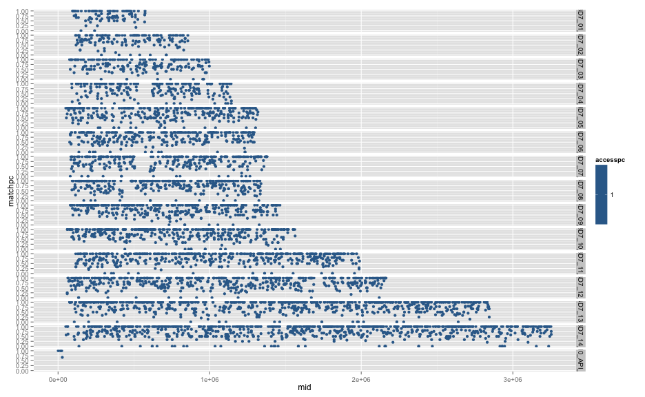
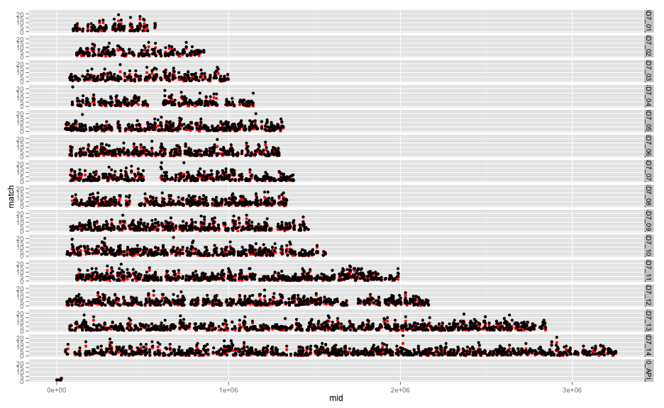

library(knitr)
library(ggplot2)

```r
opts_chunk$set(fig.width=13, fig.height=8)
```


```r
access <- read.table("DD2-2D4.align_cf.3D7_DD2.ACCESS.bed",stringsAsFactors = F)
```

```
## Warning in file(file, "rt"): cannot open file 'DD2-2D4.align_cf.
## 3D7_DD2.ACCESS.bed': No such file or directory
```

```
## Error in file(file, "rt"): cannot open the connection
```

```r
colnames(access) <- c("chrom","st","en","var","IS","TD","VT","VC","LD","N1","C1","L1","NM1","N2","C2","L2","MN2")
```

```
## Error in colnames(access) <- c("chrom", "st", "en", "var", "IS", "TD", : object 'access' not found
```

```r
access$Imatch <- (access$IS == (access$L2-access$L1))
```

```
## Error in eval(expr, envir, enclos): object 'access' not found
```

```r
sum(access$VC==1)
```

```
## Error in eval(expr, envir, enclos): object 'access' not found
```

```r
sum(access$VC==1 & access$Imatch)
```

```
## Error in eval(expr, envir, enclos): object 'access' not found
```

```r
sum(access$VC==1 & access$Imatch) / sum(access$VC==1)
```

```
## Error in eval(expr, envir, enclos): object 'access' not found
```


```r
inaccess <- read.table("DD2-2D4.align_cf.3D7_DD2.INACCESS.bed",stringsAsFactors = F)
```

```
## Warning in file(file, "rt"): cannot open file 'DD2-2D4.align_cf.
## 3D7_DD2.INACCESS.bed': No such file or directory
```

```
## Error in file(file, "rt"): cannot open the connection
```

```r
colnames(inaccess) <- c("chrom","st","en","var","IS","TD","VT","VC","LD","N1","C1","L1","NM1","N2","C2","L2","MN2")
```

```
## Error in colnames(inaccess) <- c("chrom", "st", "en", "var", "IS", "TD", : object 'inaccess' not found
```

```r
inaccess$Imatch <- (inaccess$IS == (inaccess$L2-inaccess$L1))
```

```
## Error in eval(expr, envir, enclos): object 'inaccess' not found
```

```r
sum(inaccess$VC==1)
```

```
## Error in eval(expr, envir, enclos): object 'inaccess' not found
```

```r
sum(inaccess$VC==1 & inaccess$Imatch)
```

```
## Error in eval(expr, envir, enclos): object 'inaccess' not found
```

```r
sum(inaccess$VC==1 & inaccess$Imatch) / sum(inaccess$VC==1)
```

```
## Error in eval(expr, envir, enclos): object 'inaccess' not found
```


```r
allvars <- read.table("DD2-2D4.align_cf.3D7_DD2.bed",stringsAsFactors = F)
```

```
## Warning in file(file, "rt"): cannot open file 'DD2-2D4.align_cf.
## 3D7_DD2.bed': No such file or directory
```

```
## Error in file(file, "rt"): cannot open the connection
```

```r
colnames(allvars) <- c("chrom","st","en","var","IS","TD","VT","VC","LD","N1","C1","L1","NM1","N2","C2","L2","MN2")
allvars$Imatch <- (allvars$IS == (allvars$L2-allvars$L1))
```

```
## Error in allvars$L2 - allvars$L1: non-numeric argument to binary operator
```

```r
sum(allvars$VC==1)
```

```
## [1] 22440
```

```r
sum(allvars$VC==1 & allvars$Imatch)
```

```
## Error in allvars$VC == 1 & allvars$Imatch: operations are possible only for numeric, logical or complex types
```

```r
sum(allvars$VC==1 & allvars$Imatch) / sum(allvars$VC==1)
```

```
## Error in allvars$VC == 1 & allvars$Imatch: operations are possible only for numeric, logical or complex types
```

```r
#sum(allvars$VC!=1 & allvars$Imatch) / sum(allvars$VC!=1)

allvars$accessible = allvars$var %in% access$var
```

```
## Error in match(x, table, nomatch = 0L): object 'access' not found
```

```r
allvars$noFVars = allvars$VC==1

#predicted/aligned length differences (noFlankVars:T vs hasFlankVars:F)
ggplot(subset(allvars,accessible),aes(x=IS,y=L2-L1,colour=Imatch)) + geom_point() + facet_grid(noFVars ~ .) + xlim(-100,100)
```

```
## Error in eval(expr, envir, enclos): object 'accessible' not found
```

```r
#predicted insert length distribution (no_flank_vars:T vs flank_vars:F)
ggplot(subset(allvars,accessible),aes(x=IS,fill=Imatch)) + geom_bar() + facet_grid(noFVars ~ .,scale="free_y") + xlim(-100,100)
```

```
## Error in eval(expr, envir, enclos): object 'accessible' not found
```

```r
#insert calling better than del, both unmatched > 20bp
ggplot(subset(allvars,Imatch & noFVars),aes(x=IS,fill=accessible)) + geom_bar()
```

```
## Error in eval(expr, envir, enclos): object 'Imatch' not found
```

```r
ggplot(subset(allvars,noFVars & accessible),aes(x=IS,fill=Imatch)) + geom_bar(position="fill") + xlim(-50,50)
```

```
## Error in eval(expr, envir, enclos): object 'accessible' not found
```

```r
ggplot(subset(allvars,noFVars & accessible),aes(x=IS,fill=Imatch)) + geom_bar() + xlim(-50,50)
```

```
## Error in eval(expr, envir, enclos): object 'accessible' not found
```

```r
#errors predominantly INDELs > 20bp
ggplot(access,aes(x=IS,colour=Imatch)) + geom_density() + xlim(-100,100)
```

```
## Error in ggplot(access, aes(x = IS, colour = Imatch)): object 'access' not found
```

```r
#ggplot(subset(allvars,VC==1),aes(x=TD,y=IS-(L2-L1),colour=Imatch)) + geom_point() + facet_grid(accessible ~ .)
```


```r
#no clear chr effects of accessibility
ggplot(subset(allvars,noFVars & accessible),aes(x=chrom,fill=Imatch)) + geom_bar()
```

```
## Error in eval(expr, envir, enclos): object 'accessible' not found
```

```r
ggplot(subset(allvars,noFVars & accessible),aes(x=chrom,fill=Imatch)) + geom_bar(position="fill")
```

```
## Error in eval(expr, envir, enclos): object 'accessible' not found
```


```r
allvars$mid <- allvars$en-(allvars$en-allvars$st)/2
allvars$block = round(allvars$mid/5000)

blockcf <- data.frame("chrom"=aggregate(allvars$chrom,list(paste(allvars$chrom,allvars$block)),FUN=unique)[[2]],
            "mid"=aggregate(allvars$mid,list(paste(allvars$chrom,allvars$block)),FUN=mean)[[2]],
            "block"=aggregate(allvars$block,list(paste(allvars$chrom,allvars$block)),FUN=unique)[[2]],
            "access"=aggregate(allvars$accessible,list(paste(allvars$chrom,allvars$block)),FUN=sum)[[2]],
            "match"=aggregate(allvars$Imatch,list(paste(allvars$chrom,allvars$block)),FUN=sum)[[2]],
            "total"=aggregate(allvars$Imatch,list(paste(allvars$chrom,allvars$block)),FUN=length)[[2]])
```

```
## Error in aggregate.data.frame(as.data.frame(x), ...): no rows to aggregate
```

```r
blockcf$matchpc = blockcf$match/blockcf$total
blockcf$accesspc = blockcf$access/blockcf$total
blockcf <- subset(blockcf,accesspc==1)

head(blockcf)
```

```
##          chrom      mid block method dust access match total matchpc
## 1  Pf3D7_01_v3 510051.6   102  DISCO   -1      5     4     5     0.8
## 10 Pf3D7_01_v3 571571.8   114  DISCO   -1      5     4     5     0.8
## 11 Pf3D7_01_v3 573891.4   115  DISCO   -1      7     7     7     1.0
## 12 Pf3D7_01_v3  96986.0    19  DISCO   -1      2     2     2     1.0
## 13 Pf3D7_01_v3  97825.0    20  DISCO   -1      1     1     1     1.0
## 15 Pf3D7_01_v3 108569.8    22  DISCO   -1      4     4     4     1.0
##    accesspc
## 1         1
## 10        1
## 11        1
## 12        1
## 13        1
## 15        1
```

```r
ggplot(blockcf,aes(x=mid,y=matchpc,colour=accesspc)) + geom_point() + facet_grid(chrom ~ .)
```

 

```r
#ggplot(blockcf,aes(x=mid,y=match)) + geom_line(colour="red") + geom_line(aes(y=total)) + facet_grid(chrom ~ .)
ggplot(blockcf,aes(x=mid,y=match)) + geom_point(colour="red") + geom_point(aes(y=total)) + facet_grid(chrom ~ .)
```

 
