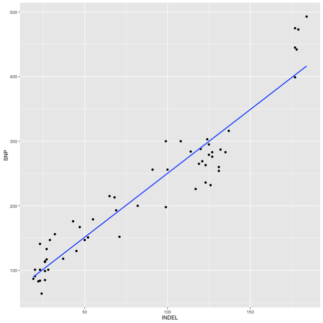

#seqtrack tutorial  

```r
library("phyloTop")
library("phylobase")
library("ape")
library("phytools")
library(knitr)
library(igraph)
library("RColorBrewer")

opts_chunk$set(fig.width=9, fig.height=9)
opts_chunk$set(dev=c('png','postscript'))
```


```r
#thies <- read.nexus("sum_ALL.target.2.nexus")
tree <- read.newick("sum_ALL.target.newick")


tree$tip.label<- gsub("'","",tree$tip.label)


is.rooted(tree)
```

```
## [1] TRUE
```

```r
red <- c("Th061.13", "Th095.13", "Th068.12")
blue <- c("Th166.12", "Th245.13", "Th211.13", "Th246.13", "Th092.13")
green <- c("Th230.12","Th196.12","Th106.09","Th074.13","Th106.11","Th117.11","Th134.11","Th086.07","Th162.12","Th132.11")
  
  
tree
```

```
## 
## Phylogenetic tree with 18 tips and 17 internal nodes.
## 
## Tip labels:
## 	Th166.12, Th245.13, Th211.13, Th246.13, Th092.13, Th086.07, ...
## 
## Rooted; includes branch lengths.
```

```r
splitTop(tree,1)
```

```
## node34 node20 
##      3     15
```

```r
splitTop(tree,2)
```

```
## Th068.12   node35   node21   node25 
##        1        2        5       10
```

```r
redtree <- extract.clade(tree,node=34)
bluetree <- extract.clade(tree,node=21)
greentree <- extract.clade(tree,node=25)


# subtree <- greentree
# sackin.phylo(subtree)
# widths(subtree)
# avgLadder(subtree)
# ILnumber(subtree)
# colless.phylo(subtree)
# ladderSizes(subtree)
# ladderShow(subtree)

phyloTop(list(bluetree,greentree,redtree))
```

```
##   avgLadder cherries colless.phylo ILnumber maxHeight pitchforks
## 1         3        1     1.0000000        3         4          1
## 2         2        3     0.4722222        4         6          2
## 3         0        1     1.0000000        1         2          1
##   sackin.phylo   stairs1   stairs2
## 1            9 0.2500000 0.4375000
## 2           31 0.5555556 0.1111111
## 3            2 0.5000000 0.7500000
```


```r
cophyloplot(Itree,Stree,cbind(Stree$tip.label,Stree$tip.label))
```


```r
Stree <- read.nexus("Thies_SNP.green.nexus")
Itree <- read.nexus("Thies_INDEL.green.nexus")
dist.topo(Stree,Itree)
```

```
## [1] 6
```

```r
Imat <- as.dist(t(read.table("Thies_all_manual.PASS.Cls.miss0.5.LMRG.HAP.INDEL.recode.vcf.dist.tab.txt",sep="\t")))
Smat <- as.dist(t(read.table("Thies_all_manual.PASS.Cls.miss0.5.LMRG.HAP.SNP.recode.vcf.dist.tab.txt",sep="\t")))

dists <- data.frame("SNP"=as.numeric(Smat),"INDEL"=as.numeric(Imat))
dists <- dists[dists$SNP < 5000,]
# R^2 = 
cor(dists$SNP,dists$INDEL)^2
```

```
## [1] 0.9062327
```

```r
ggplot(dists,aes(x=INDEL,y=SNP)) + geom_point() + geom_smooth(method = glm,se = F)
```


