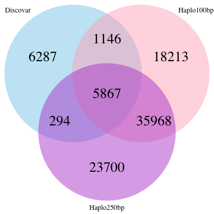

```r
library(ggplot2)
library(VennDiagram)

opts_chunk$set(fig.width=9, fig.height=9)
opts_chunk$set(dev=c('png'))
```

INDEL counts, disco/haplo100/haplo250

```r
counts <- read.table("vennCounts.txt",col.names=c("type","cat","count"),colClasses = c("character","character","integer"))
icnt <- counts$count[counts$type=="INDEL"]
names(icnt) <- counts$cat[counts$type=="INDEL"]

a1 = icnt['100']+icnt['110']+icnt['111']+icnt['101']
a2 = icnt['010']+icnt['110']+icnt['111']+icnt['011']
a3 = icnt['001']+icnt['011']+icnt['111']+icnt['101']

#draw.triple.venn(area1 = icnt['100'], area2 = icnt['010'], area3 = icnt['001'], 
draw.triple.venn(area1 = a1, area2 = a2, area3 = a3, 
                 n12 = icnt['110']+icnt['111'], n23 = icnt['011']+icnt['111'], n13 = icnt['101']+icnt['111'], 
                 n123 = icnt['111'], category = c("Discovar", "Haplo100bp", "Haplo250bp"), lty = "blank", 
                 fill = c("skyblue", "pink1", "mediumorchid"),euler.d=T,cex=3)
```



```
## (polygon[GRID.polygon.171], polygon[GRID.polygon.172], polygon[GRID.polygon.173], polygon[GRID.polygon.174], polygon[GRID.polygon.175], polygon[GRID.polygon.176], text[GRID.text.177], text[GRID.text.178], text[GRID.text.179], text[GRID.text.180], text[GRID.text.181], text[GRID.text.182], text[GRID.text.183], text[GRID.text.184], text[GRID.text.185], text[GRID.text.186])
```

SNP counts, disco/haplo100/haplo250

```r
scnt <- counts$count[counts$type=="SNP"]
names(scnt) <- counts$cat[counts$type=="SNP"]

a1 = scnt['100']+scnt['110']+scnt['111']+scnt['101']
a2 = scnt['010']+scnt['110']+scnt['111']+scnt['011']
a3 = scnt['001']+scnt['011']+scnt['111']+scnt['101']

#draw.triple.venn(area1 = scnt['100'], area2 = scnt['010'], area3 = scnt['001'], 
draw.triple.venn(area1 = a1, area2 = a2, area3 = a3, 
                 n12 = scnt['110']+scnt['111'], n23 = scnt['011']+scnt['111'], n13 = scnt['101']+scnt['111'], 
                 n123 = scnt['111'], category = c("Discovar", "Haplo100bp", "Haplo250bp"), lty = "blank", 
                 fill = c("skyblue", "pink1", "mediumorchid"))
```


```
## (polygon[GRID.polygon.187], polygon[GRID.polygon.188], polygon[GRID.polygon.189], polygon[GRID.polygon.190], polygon[GRID.polygon.191], polygon[GRID.polygon.192], text[GRID.text.193], text[GRID.text.194], text[GRID.text.195], text[GRID.text.196], text[GRID.text.197], text[GRID.text.198], text[GRID.text.199], text[GRID.text.200], text[GRID.text.201], text[GRID.text.202])
```
