library(knitr)
library(ggplot2)
library(reshape2)

```r
opts_chunk$set(fig.width=13, fig.height=8)
```


```r
all <- read.table("green_ALL_er.txt",col.names=c("file","chrom","start","end","varcount","subrate"))
all$length=all$end-all$start
all$set="ALL"
snp <- read.table("green_SNPs_er.txt",col.names=c("file","chrom","start","end","varcount","subrate"))
snp$length=snp $end-snp$start
snp$set="SNP"
indel <- read.table("green_INDELs_er.txt",col.names=c("file","chrom","start","end","varcount","subrate"))
indel$length=indel $end-indel$start
indel$set="INDEL"

outg <- read.table("green_OUT_er.txt",col.names=c("file","chrom","start","end","varcount","subrate"))
outg$length=outg$end-outg$start
outg$set="OUT"


subrates <- rbind(all,snp,indel,outg)
```


```r
ggplot(all,aes(x=varcount,y=subrate)) + geom_point()
```

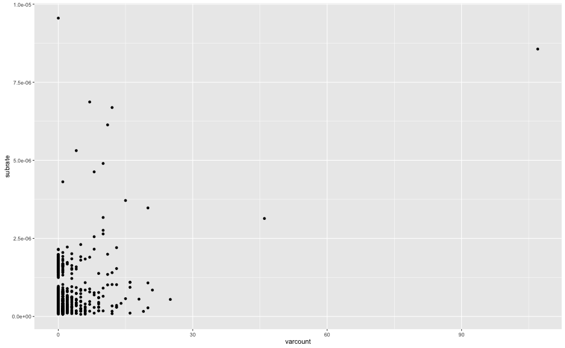

```r
ggplot(subrates,aes(x=length,y=varcount,group=set,colour=set)) + geom_point()
```

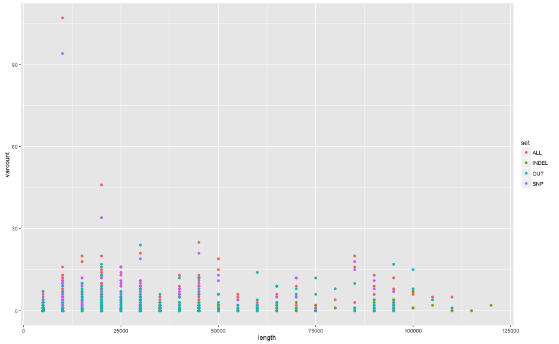

```r
ggplot(subrates,aes(x=length,y=subrate,group=set,colour=set)) + geom_point()+facet_grid(.~empty)+ylim(0,1e-05) + scale_x_log10()
```

```
## Error in layout_base(data, cols, drop = drop): At least one layer must contain all variables used for facetting
```

```r
ggplot(subrates,aes(x=varcount/length*1e6,y=subrate,group=set,colour=set)) + geom_point()
```

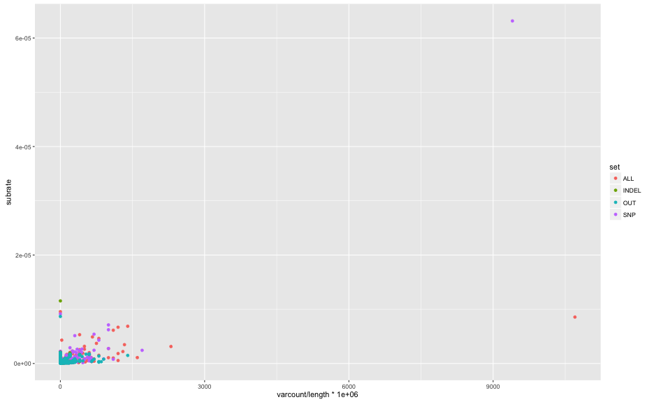

```r
ggplot(subrates,aes(x=varcount/length*1e6,y=subrate,group=set,colour=set)) + geom_point(alpha=0.5) + xlim(0,1.5e3) + ylim(0,1e-5)
```

```
## Warning: Removed 6 rows containing missing values (geom_point).
```

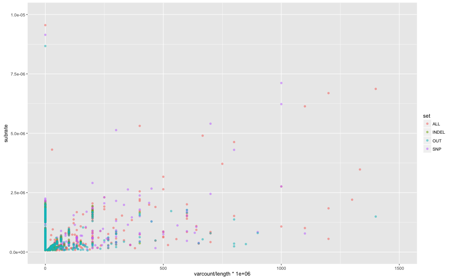

```r
ggplot(subrates,aes(x=varcount/length*1e6,y=subrate,group=set,colour=set)) + geom_point() + xlim(0,1.5e3) + ylim(0,1e-5) +facet_grid(set~.)
```

```
## Warning: Removed 6 rows containing missing values (geom_point).
```

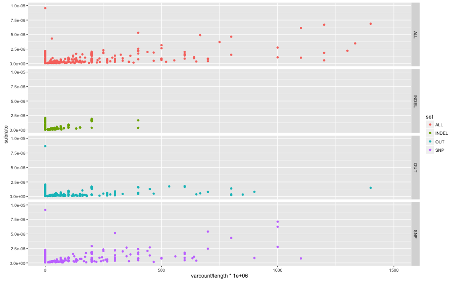


```r
ggplot(subrates,aes(x=length,y=subrate,group=set,colour=set)) + geom_point()
```

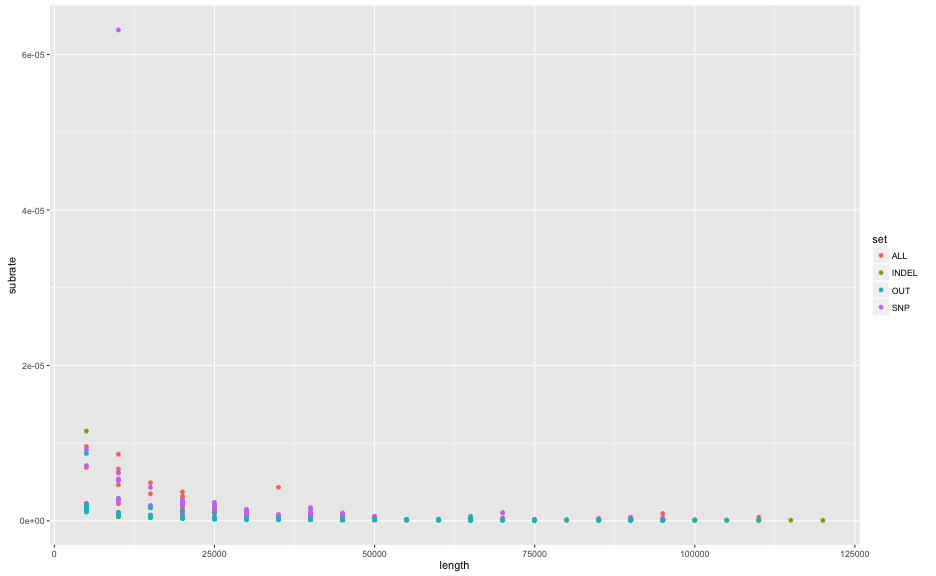

```r
ggplot(subrates,aes(x=length,y=subrate,group=set,colour=set)) + geom_point(alpha=0.5)+facet_grid(set~.)+ylim(0,1e-5)
```

```
## Warning: Removed 2 rows containing missing values (geom_point).
```

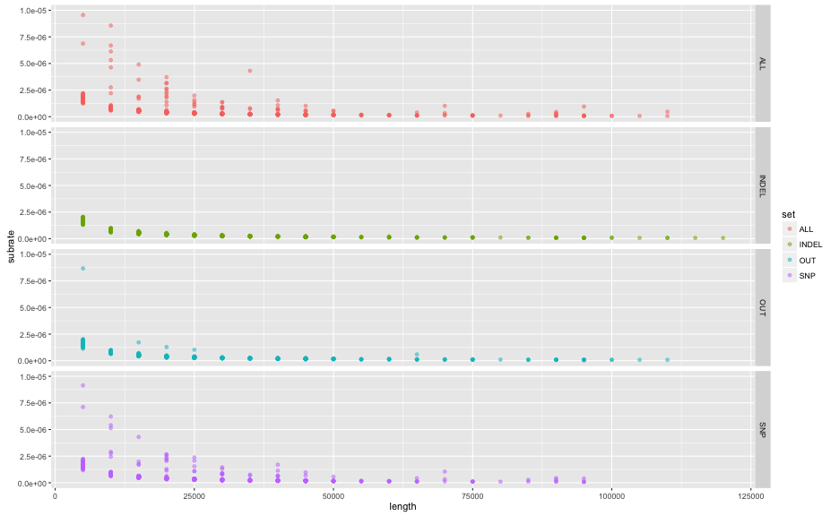


```r
subrates$empty=subrates$varcount==0
ggplot(subrates,aes(x=set,y=subrate,group=set,colour=set)) + geom_violin()
```

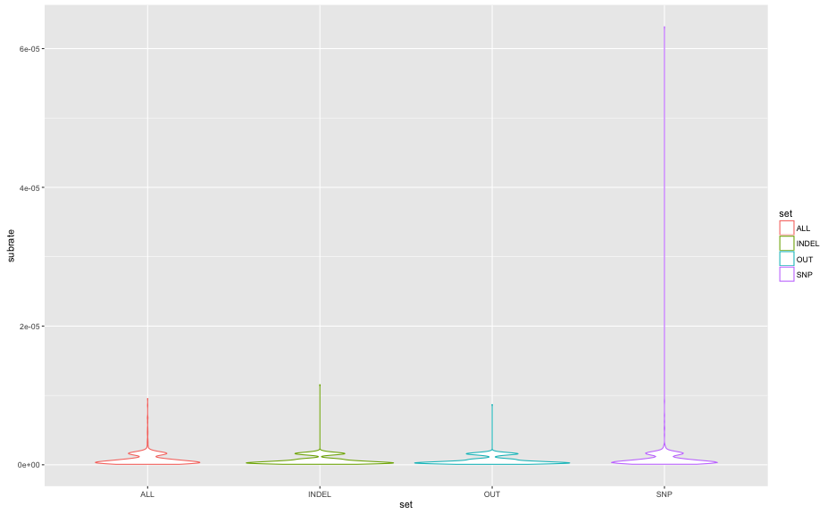

```r
ggplot(subrates,aes(x=set,y=subrate,group=set,colour=set)) + geom_violin()+facet_grid(.~empty)+ylim(0,1e-05)
```

```
## Warning: Removed 2 rows containing non-finite values (stat_ydensity).
```

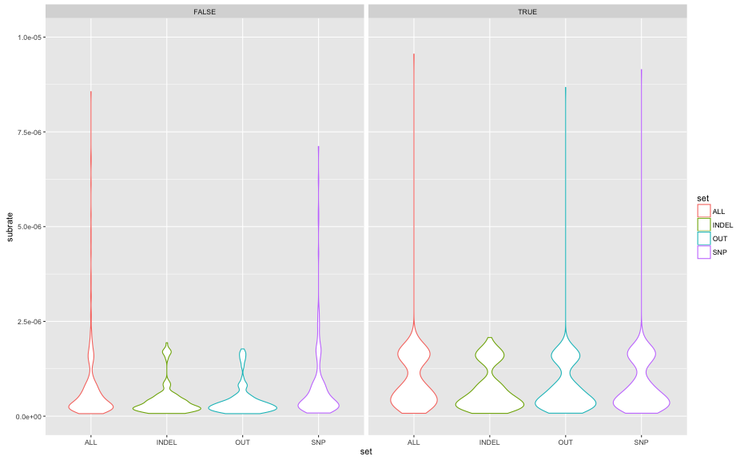

```r
ggplot(subrates,aes(x=set,y=subrate,group=set,colour=set)) + geom_boxplot()+facet_grid(.~empty)+ylim(0,1e-05)
```

```
## Warning: Removed 2 rows containing non-finite values (stat_boxplot).
```

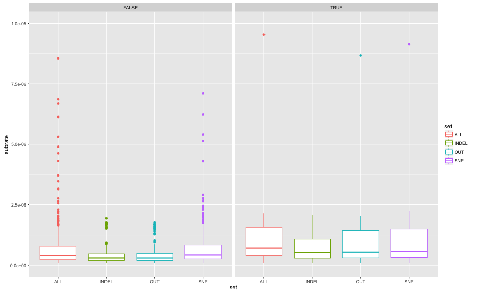


```r
temp<-read.table("clade29.residuals.txt",header=T)

#ggplot(temp,aes(x=date,y=distance,label=tip,colour=residual)) + geom_text(size=6)
ggplot(temp,aes(x=date,y=distance,label=tip,colour=residual)) + geom_text(size=6) + geom_smooth(method = "lm", se = FALSE) #+ ylim(0,500) #+ xlim(2000,2014)
```

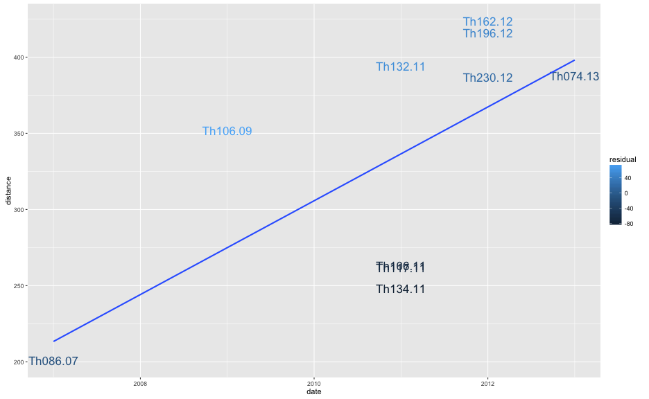


```r
opts_chunk$set(fig.width=13, fig.height=8,dev=c('png','postscript'))
```


```r
sppsubs <- read.table("subrate_relaxed_otherspp.txt",sep="\t",header=T)
colnames(sppsubs)[3:4] <- c("gsize","subrate")
sppsubs$Group <- factor(sppsubs$Group,levels=c("eukaryote","Bacteria","dsDNA virus","ssDNA virus","RNA virus"),ordered = T)

gsizes <- seq(0,25e6,1e3)
rates <- data.frame("gsize"=gsizes,"years"=1/gsizes,"months"=12/gsizes,"weeks"=52/gsizes)
ratesM <- melt(rates,id.vars = "gsize",value.name ="subrate")
ratesM <- ratesM[ratesM$subrate<=0.005,]
ggplot(sppsubs,aes(x=gsize,y=subrate,colour=Group)) + geom_point(size=4) + geom_line(data=ratesM,aes(group=variable),colour="grey") + scale_y_log10() + scale_x_log10()
```

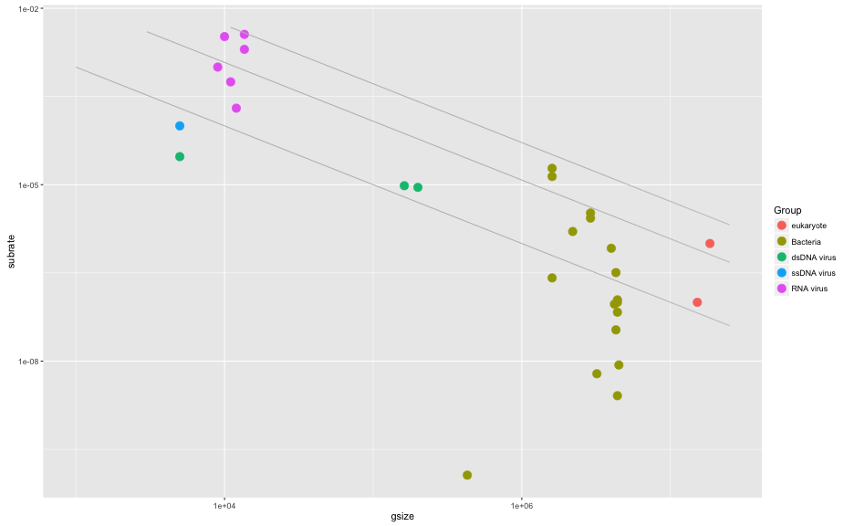

```r
#cheat sheet
ggplot(sppsubs,aes(x=gsize,y=subrate,colour=Group)) + geom_label(aes(label=Pathogen)) + geom_line(data=ratesM,aes(group=variable),colour="grey") + scale_y_log10() + scale_x_log10()
```

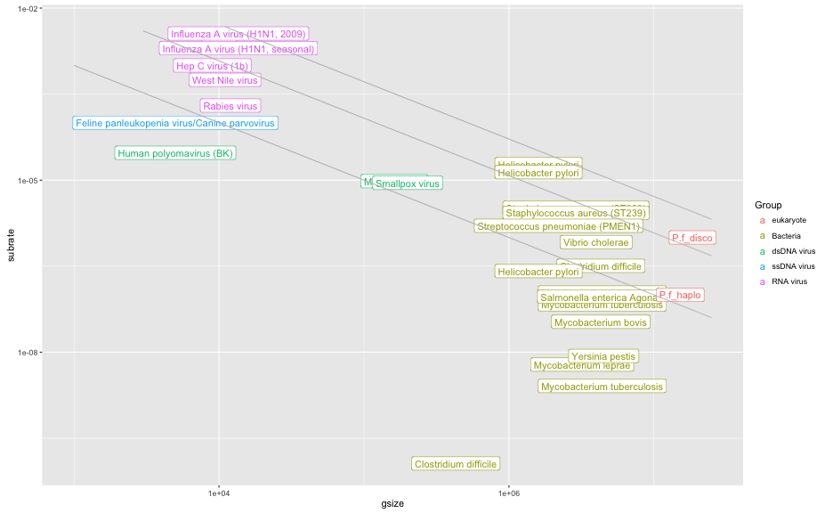

```r
#ggplot(sppsubs,aes(x=gsize,y=subrate,colour=Group)) + geom_point(size=4) + geom_line(data=ratesM,aes(colour=variable)) + xlim(0,0.5e6) + ylim(0,4e-03)

ggplot(sppsubs,aes(x=gsize,y=subrate,group=Group)) + geom_point(aes(colour=Group),size=4) + geom_line(data=ratesM,aes(group=variable),colour="grey") + scale_y_sqrt() + scale_x_sqrt()
```

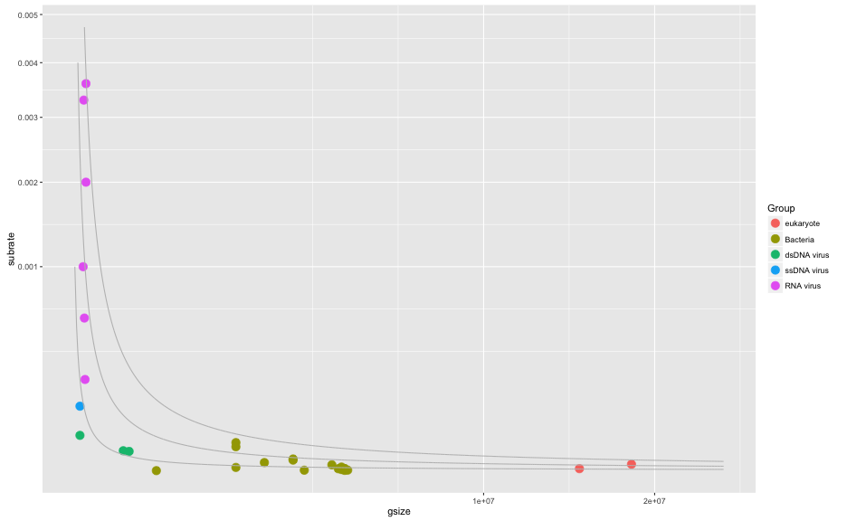

```r
#cf RNA viruses, 1.3*10-3 subs per year
```


```r
opts_chunk$set(fig.width=13, fig.height=8,dev=c('png','postscript','pdf'))
```


```r
sppsubs <- read.table("subrate_relaxed_otherspp2.txt",sep="\t",header=T)
colnames(sppsubs)[3:4] <- c("gsize","subrate")
sppsubs$Group <- factor(sppsubs$Group,levels=c("eukaryote","Bacteria","dsDNA virus","ssDNA virus","RNA virus"),ordered = T)

gsizes <- seq(0,1e8,1e3)
rates <- data.frame("gsize"=gsizes,"years"=1/gsizes,"months"=12/gsizes,"weeks"=52/gsizes)
ratesM <- melt(rates,id.vars = "gsize",value.name ="subrate")
#ratesM <- ratesM[ratesM$subrate<=0.005,]
ratesM <- ratesM[ratesM$gsize>0,]
floors <- data.frame("gsize"=c(rep(max(ratesM$gsize),3),rep(min(ratesM$gsize),3)),
      "variable"=unique(as.character(ratesM$variable)),
      "subrate"=rep(0,6))

ratesM <- rbind(ratesM,floors)
ratesM$variable <- factor(ratesM$variable,levels=c("weeks","months","years"),ordered=T)

fcol <- c("#AAAAAA","#CCCCCC","#EEEEEE")
names(fcol) = c("years","months","weeks")

ggplot(sppsubs,aes(x=gsize,y=subrate),) +  
  geom_polygon(data=ratesM,aes(group=variable,fill=variable)) +
  scale_fill_manual(values = fcol) + 
  geom_label(aes(label=Pathogen,colour=Group),nudge_x = 0.2) + 
  geom_point(aes(label=Pathogen,colour=Group),size=3) + 
  scale_y_log10() + scale_x_log10(limits=c(1e3,1e8),breaks=c(1e4,1e5,1e6,1e7,1e8)) +
  xlab("Genome Size (bp)")+ylab("mutation rate (subs / site / year)")+
  theme(panel.background = element_rect(fill = F))
```

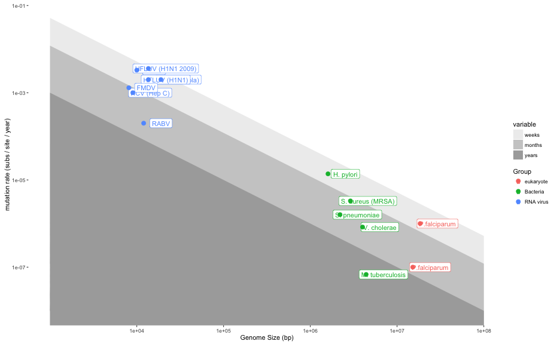
