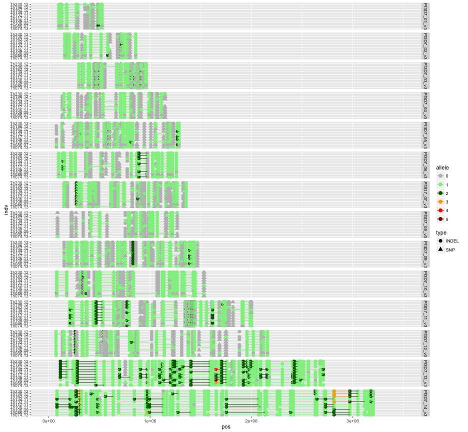
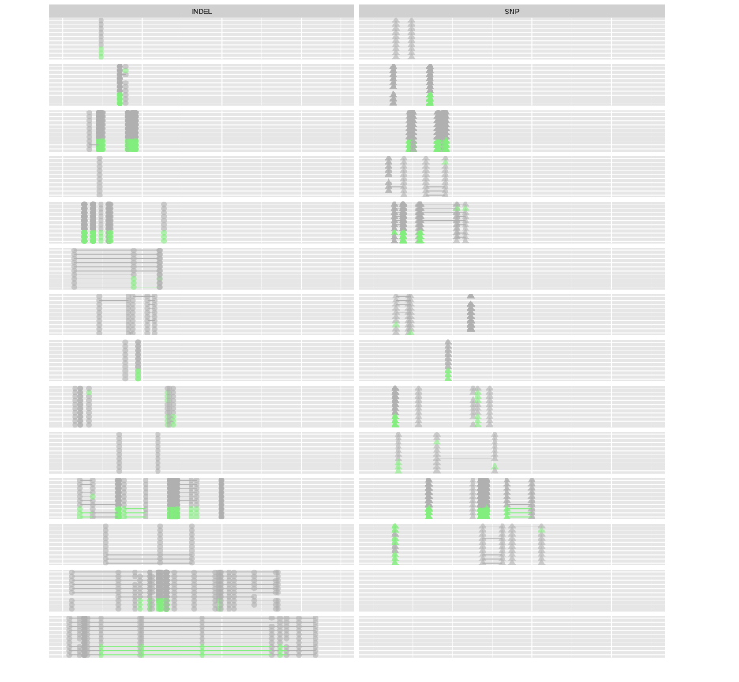
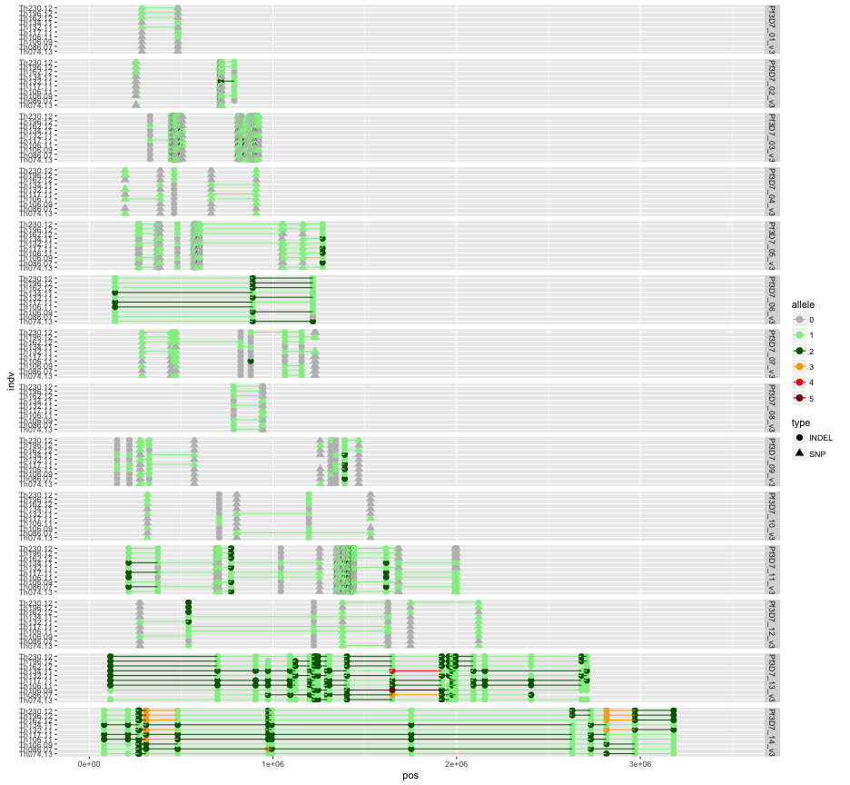
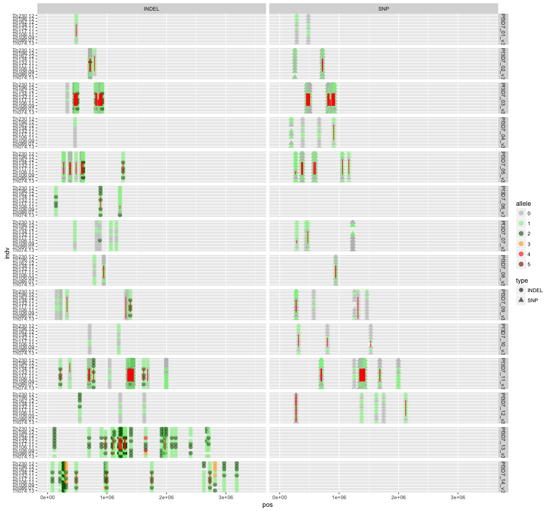
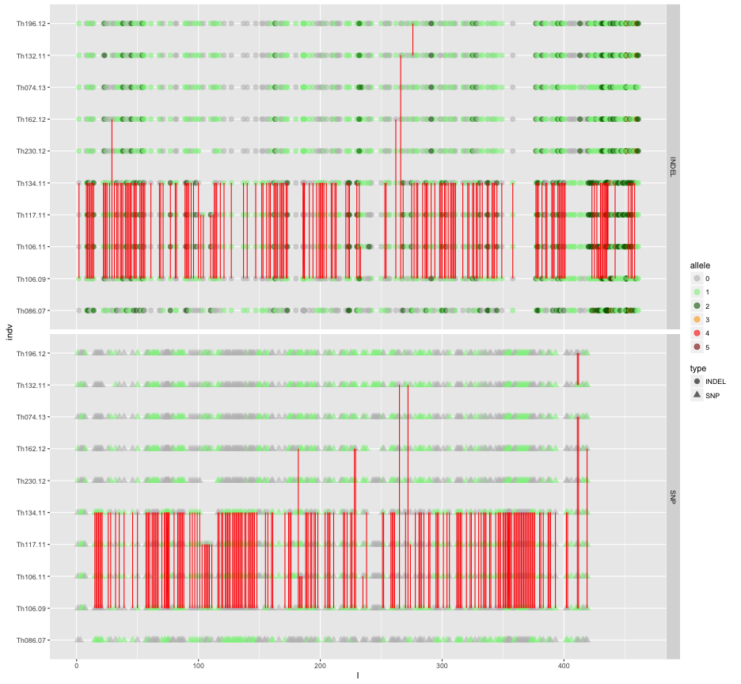
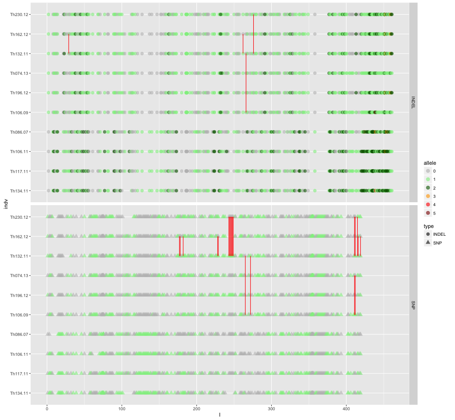

library(ggplot2)
library(reshape2)
library(knitr)
library(igraph)


```r
opts_chunk$set(fig.width=13, fig.height=12)
```


```r
getGenoTab <- function(filename) {
  genotab <- read.table(filename,sep="\t",header=T,stringsAsFactors=F,na.strings=c('.','. '))
#  genotab <- unique(genotab)
  genotab$I <- 1:length(genotab$chr)
  #remove ref calls
  #genotab <- genotab[rowSums(genotab[,5:dim(genotab)[2]],na.rm=T)!=0,]
  
  #colnames(genotab)[1:2]<-c("chr","pos")
  genotab.m <- melt(genotab,id.vars =c("I","chr","pos","type","subtype","alleles"),variable.name ="indv")
  genotab.m$value <- as.factor(genotab.m$value)
  #sort levels
  genotab.m$indv <- factor(genotab.m$indv,levels=sort(levels(genotab.m$indv)))
  
  genotab.m <- genotab.m[!is.na(genotab.m$value),]
  genotab.m$value <- as.numeric(as.character(genotab.m$value))
  
  hNo=0
  vlast=0
  genotab.m$haplo=0
  for (i in c(1:dim(genotab.m)[[1]])) {
    if (genotab.m[i,"value"]==0) {haplo=0}
    else if (genotab.m[i,"value"]>=1) {
      if (vlast==0) {hNo <- hNo+1}
        genotab.m[i,"haplo"]<-hNo  
      }
    vlast=genotab.m[i,"value"]
  }
  genotab.m$value <- factor(genotab.m$value)
  genotab.m$haplo <- factor(genotab.m$haplo)
  genotab.m
}
```


```r
networkorder <- c("Th134.11","Th117.11","Th106.11","Th086.07","Th106.09","Th196.12","Th074.13","Th132.11","Th162.12","Th230.12")

clade3F <- "clade29.alleles.tab.txt"
genotab3 <- getGenoTab(clade3F)
genotab3$indv <- factor(genotab3$indv,levels = networkorder,ordered=T)

colnames(genotab3)[[8]]<-"allele"

clade3NSF <- "clade29.alleles.NOSNGL.tab.txt"
genotab3NS <- getGenoTab(clade3NSF)
genotab3NS$indv <- factor(genotab3NS$indv,levels = networkorder,ordered=T)
colnames(genotab3NS)[[8]]<-"allele"


clade3HPSF <- "clade29.SNP.graphml.HPLSY.txt"
genotab3HPS <- getGenoTab(clade3HPSF)
genotab3HPS$indv <- factor(genotab3HPS$indv,levels = networkorder,ordered=T)

colnames(genotab3HPS)[[8]]<-"HP_SNP"

clade3HPIF <- "clade29.INDEL.graphml.HPLSY.txt"
genotab3HPI <- getGenoTab(clade3HPIF)
genotab3HPI$indv <- factor(genotab3HPI$indv,levels = networkorder,ordered=T)

colnames(genotab3HPI)[[8]]<-"HP_INDEL"

genotab3HPS <- genotab3HPS[,c(2:3,7:8)]
genotab3HPI <- genotab3HPI[,c(2:3,7:8)]
dim(merge(genotab3HPS,genotab3HPI,by=c("chr","pos","indv"),all=T))
```

```
## [1] 13690     5
```

```r
#dim(merge(genotab3,merge(genotab3HPS,genotab3HPI,by=c("chr","pos","indv"),all=T)))
genotab <- merge(genotab3,merge(genotab3HPS,genotab3HPI,by=c("chr","pos","indv"),all=T))
genotabNS <- merge(genotab3NS,merge(genotab3HPS,genotab3HPI,by=c("chr","pos","indv"),all=T))
dim(genotab)
```

```
## [1] 13392    11
```

```r
dim(genotabNS)
```

```
## [1] 4777   11
```

```r
dim(genotab3HPS)
```

```
## [1] 13570     4
```

```r
dim(genotab3HPI)
```

```
## [1] 13570     4
```


```r
cols=c("grey","light green","dark green","orange","red","dark red")
names(cols)<-c(0,1,2,3,4,5)
colsc <- scale_color_manual(values = cols)
```


```r
#Clade3

#all vars
ggplot(genotab,aes(x=pos,y=indv,colour=allele,group=haplo,shape=type)) + geom_point(size=3) + 
  geom_line(data=subset(genotab,allele!=0)) + facet_grid(chr ~ .) + xlim(0,3.5e6) +colsc
```



```r
#SNP net homoplasies only
ggplot(genotab,aes(x=pos,y=indv,colour=HP_SNP,group=haplo,shape=type)) + geom_point(alpha=0.6,size=3) + 
  geom_line(data=subset(genotab,allele!=0)) + facet_grid(chr ~ type) + xlim(0,3.5e6) +colsc
```


```r
#INDEL net homoplasies only
ggplot(genotab,aes(x=pos,y=indv,colour=HP_INDEL,group=haplo,shape=type)) + geom_point(alpha=0.6,size=3) + 
  geom_line(data=subset(genotab,allele!=0)) + facet_grid(chr ~ type) + xlim(0,3.5e6) +colsc
```


```r
#Clade3 no singletons

#all vars
ggplot(genotabNS,aes(x=pos,y=indv,colour=allele,group=haplo,shape=type)) + geom_point(size=3) + 
  geom_line(data=subset(genotabNS,allele!=0)) + facet_grid(chr ~ .) + xlim(0,3.5e6) +colsc
```


```r
#SNP net homoplasies only
ggplot(genotabNS,aes(x=pos,y=indv,colour=HP_SNP,group=haplo,shape=type)) + geom_point(alpha=0.6,size=3) + 
  geom_line(data=subset(genotabNS,allele!=0)) + facet_grid(chr ~ type) + xlim(0,3.5e6) +colsc
```

```
## geom_path: Each group consists of only one observation. Do you need to
## adjust the group aesthetic?
## geom_path: Each group consists of only one observation. Do you need to
## adjust the group aesthetic?
## geom_path: Each group consists of only one observation. Do you need to
## adjust the group aesthetic?
## geom_path: Each group consists of only one observation. Do you need to
## adjust the group aesthetic?
## geom_path: Each group consists of only one observation. Do you need to
## adjust the group aesthetic?
```



```r
#INDEL net homoplasies only
ggplot(genotabNS,aes(x=pos,y=indv,colour=HP_INDEL,group=haplo,shape=type)) + geom_point(alpha=0.6,size=3) + 
  geom_line(data=subset(genotabNS,allele!=0)) + facet_grid(chr ~ type) + xlim(0,3.5e6) +colsc
```

```
## geom_path: Each group consists of only one observation. Do you need to
## adjust the group aesthetic?
## geom_path: Each group consists of only one observation. Do you need to
## adjust the group aesthetic?
## geom_path: Each group consists of only one observation. Do you need to
## adjust the group aesthetic?
## geom_path: Each group consists of only one observation. Do you need to
## adjust the group aesthetic?
## geom_path: Each group consists of only one observation. Do you need to
## adjust the group aesthetic?
```


```r
#Clade3 NO SINGLETONS INDEXED

#SNP net homoplasies
ggplot(genotabNS,aes(x=I,y=indv,colour=HP_SNP,group=pos,shape=type)) + geom_line(data=subset(genotabNS,HP_SNP == 1),colour="red") + 
  geom_point(alpha=0.6,size=3) + facet_grid(type ~ .)  +colsc
```



```r
#INDEL net homoplasies
ggplot(genotabNS,aes(x=I,y=indv,colour=HP_INDEL,group=pos,shape=type)) + geom_line(data=subset(genotabNS,HP_INDEL == 1),colour="red") + 
  geom_point(alpha=0.6,size=3) + facet_grid(type ~ .)  +colsc
```




```r
#SNP net homoplasies
snpnet <- read.graph("clade29.SNP.graphml.HPLSY.xml",format="graphml")
plot(snpnet,edge.color="black",edge.label=E(snpnet)$homoplasy_count,edge.label.cex=2)
```



```r
#INDEL net homoplasies
indelnet <- read.graph("clade29.INDEL.graphml.HPLSY.xml",format="graphml")
plot(indelnet,edge.color="black",edge.label=E(indelnet)$homoplasy_count,edge.label.cex=2)
```


