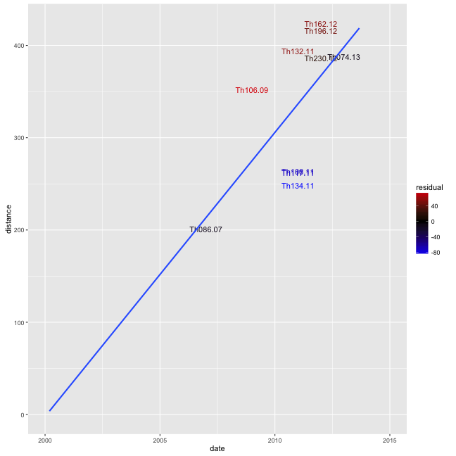
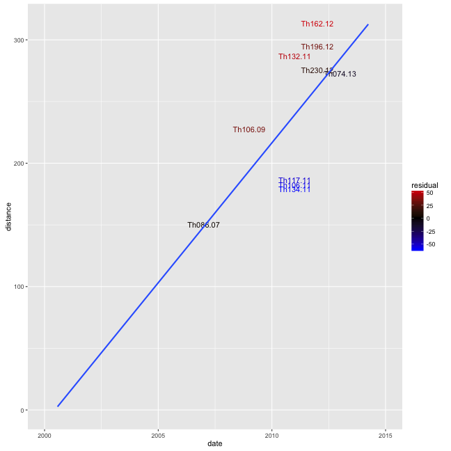
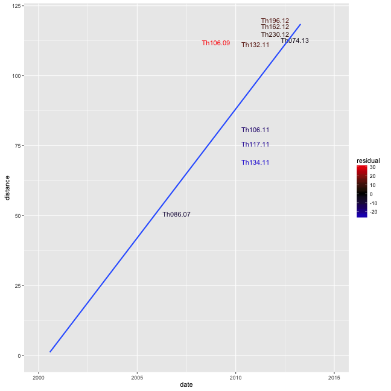
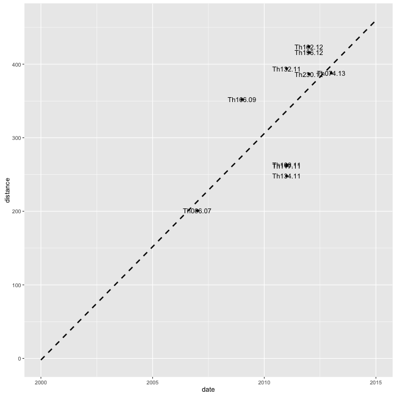
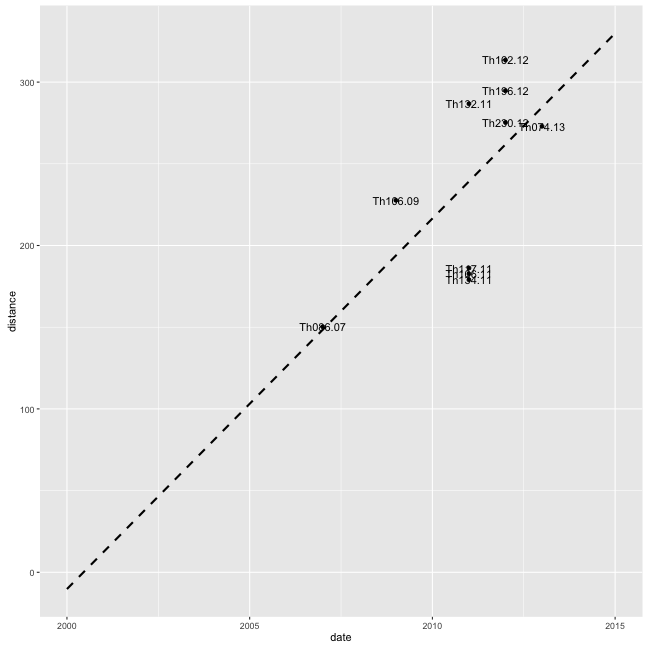
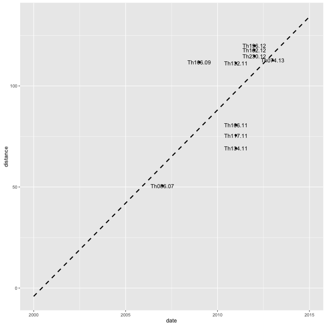

```r
library(knitr)
library(igraph)
library("RColorBrewer")
library(ggplot2)
opts_chunk$set(fig.width=9, fig.height=9)
opts_chunk$set(dev=c('png','postscript'))
```


```r
#thies <- read.nexus("sum_ALL.target.2.nexus")
cols <- scale_color_gradient2(low="blue",mid="black",high="red")


all <- read.table("Thies_ALL.green.txt",header=T)
ggplot(all,aes(x=date,y=distance,label=tip,color=residual)) + geom_text() + geom_smooth(method="lm",se=F,fullrange=T) + cols + xlim(2000,2015) + ylim(0,max(all$distance))
```

```
## Warning: Removed 8 rows containing missing values (geom_smooth).
```



```r
snp <- read.table("Thies_SNP.green.txt",header=T)
ggplot(snp,aes(x=date,y=distance,label=tip,color=residual)) + geom_text() + geom_smooth(method="lm",se=F,fullrange=T) + cols + xlim(2000,2015) + ylim(0,max(snp$distance))
```

```
## Warning: Removed 7 rows containing missing values (geom_smooth).
```



```r
indel <- read.table("Thies_INDEL.green.txt",header=T)
ggplot(indel,aes(x=date,y=distance,label=tip,color=residual)) + geom_text() + geom_smooth(method="lm",se=F,fullrange=T) + cols+ xlim(2000,2015) + ylim(0,max(indel$distance))
```

```
## Warning: Removed 12 rows containing missing values (geom_smooth).
```



```r
#correlation indices
c(cor(all$distance,all$date),
  cor(snp$distance,snp$date),
  cor(indel$distance,indel$date))
```

```
## [1] 0.6532455 0.6687466 0.6399621
```

```r
#without 2011 clade
d = !all$tip %in% c("Th134.11","Th106.11","Th117.11")
c(cor(all$distance[d],all$date[d]),
  cor(snp$distance[d],snp$date[d]),
  cor(indel$distance[d],indel$date[d]))
```

```
## [1] 0.8878269 0.9038840 0.8298373
```

```r
#2011 clade and root only
d = all$tip %in% c("Th086.07","Th134.11","Th106.11","Th117.11")
c(cor(all$distance[d],all$date[d]),
  cor(snp$distance[d],snp$date[d]),
  cor(indel$distance[d],indel$date[d]))
```

```
## [1] 0.9722879 0.9840784 0.9330368
```


```r
ggplot(all,aes(x=date,y=distance,label=tip)) + geom_point() + geom_text() + geom_smooth(method="lm",se=F,fullrange=T,colour="black",linetype=2) + xlim(2000,2015)
```



```r
#ggplot(all,aes(x=date,y=distance,label=tip)) + geom_text() + geom_smooth(data=subset(all,date!=2007),method="lm",se=F) + xlim(2006,2013) #+ ylim(0,max(indel$distance))

ggplot(snp,aes(x=date,y=distance,label=tip)) + geom_point() + geom_text() + geom_smooth(method="lm",se=F,fullrange=T,colour="black",linetype=2) + xlim(2000,2015)
```



```r
#ggplot(snp,aes(x=date,y=distance,label=tip)) + geom_text() + geom_smooth(method="lm",se=F) + xlim(2006,2013) + ylim(0,max(snp$distance))
ggplot(indel,aes(x=date,y=distance,label=tip)) + geom_point() + geom_text() + geom_smooth(method="lm",se=F,fullrange=T,colour="black",linetype=2) + xlim(2000,2015)
```



```r
#ggplot(indel,aes(x=date,y=distance,label=tip)) + geom_text() + geom_smooth(method="lm",se=F) + xlim(2006,2013) #+ ylim(0,max(indel$distance))

#ggplot(indel,aes(x=date,y=distance,label=tip)) + geom_text() + geom_smooth(data=subset(indel,date!=2007),method="lm",se=F) + xlim(2006,2013) #+ ylim(0,max(indel$distance))
```
