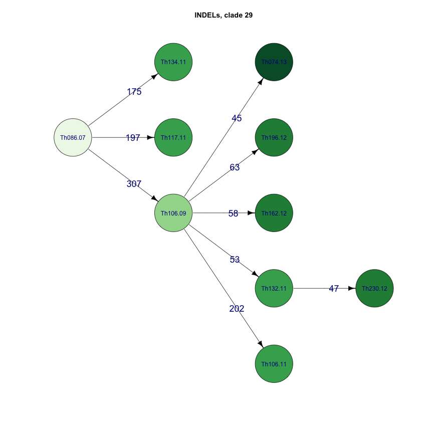
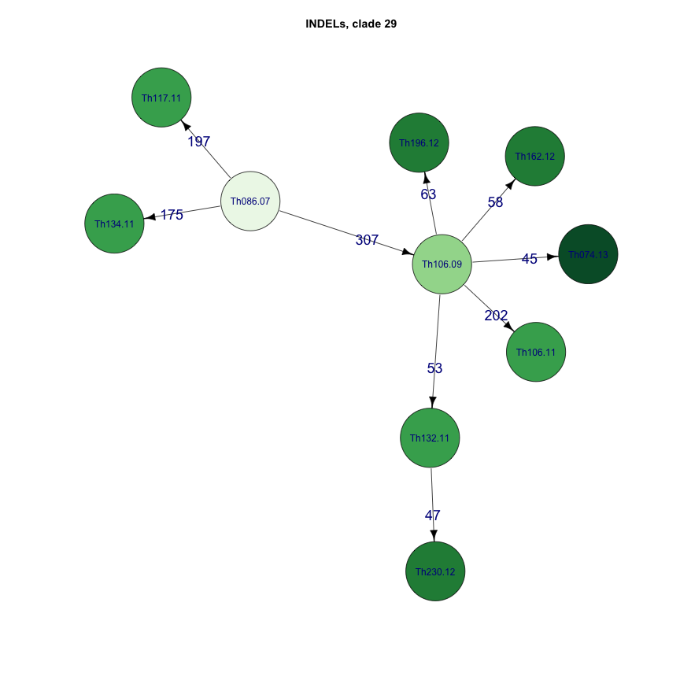
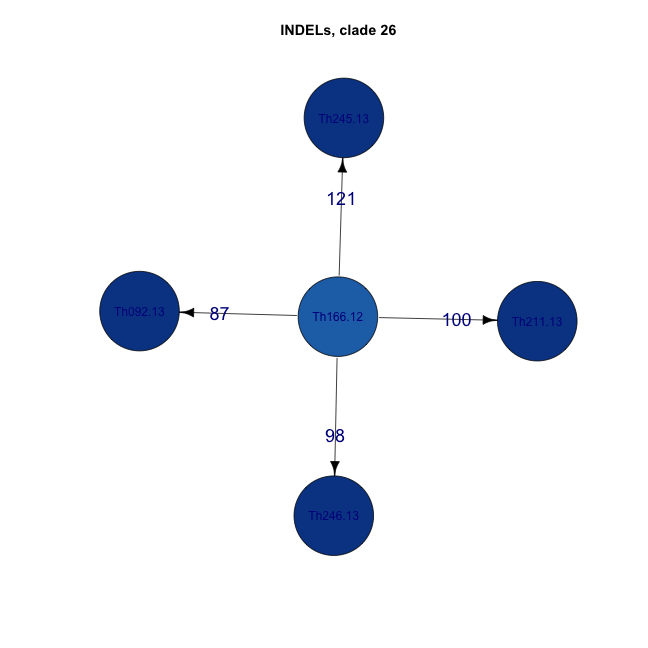
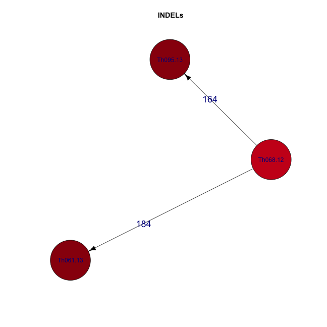

#seqtrack tutorial  

```r
library(ape)
library(adegenet)
library(knitr)
library(igraph)

library(RColorBrewer)
opts_chunk$set(fig.width=9, fig.height=9)
opts_chunk$set(dev=c('png'))


sym <- function(M) {
  M[lower.tri(M)] = t(M)[lower.tri(M)]
  M
}
```


```r
Imat <- as.dist(t(read.table("Thies_all_manual.PASS.Cls.miss0.5.LMRG.HAP.INDEL.recode.vcf.dist.tab.txt",sep="\t")))
Smat <- as.dist(t(read.table("Thies_all_manual.PASS.Cls.miss0.5.LMRG.HAP.SNP.recode.vcf.dist.tab.txt",sep="\t")))

dists <- data.frame("SNP"=as.numeric(Smat),"INDEL"=as.numeric(Imat))
dists <- dists[dists$SNP < 5000,]

SIratio <- mean(dists$SNP)/mean(dists$INDEL)
SIratio2 <- mean(dists$SNP/dists$INDEL)

D <- Imat + round(Smat / SIratio2)
#D <- Smat
```


```r
clust <- gengraph(D,ngrp=3)
#plot(clust$g, main="gengraph clusters")
distmat <- as.matrix(D)
names <- colnames(distmat)
```


```r
meta <- read.table("daniels.thies.CA.txt",sep="\t",header=T)
rownames(meta) <- meta$name
meta <- meta[names,]
coll <- as.Date(paste("1","jan",meta$year,sep=""),"%d%b%Y")
names(coll)<-meta$name

weeks <- as.integer(difftime(coll, min(coll), unit="weeks"))

name1 <- names[clust$clust$membership==1]
name2 <- names[clust$clust$membership==2]
name3 <- names[clust$clust$membership==3]
year1 <- meta$year[clust$clust$membership==1]
year2 <- meta$year[clust$clust$membership==2]
year3 <- meta$year[clust$clust$membership==3]
coll1 <- coll[name1]
coll2 <- coll[name2]
coll3 <- coll[name3]
```


```r
dist1 <- distmat[name1,name1]
dist2 <- distmat[name2,name2]
dist3 <- distmat[name3,name3]


#res1 <- seqTrack(distmat, x.names=name1, x.dates=coll1)
#res$clust <- clust$clust$membership[rownames(res)]

res1 <- seqTrack(dist1, x.names=name1, x.dates=coll1)
res2 <- seqTrack(dist2, x.names=name2, x.dates=coll2)
res3 <- seqTrack(dist3, x.names=name3, x.dates=coll3)
```


```r
opts_chunk$set(fig.width=12, fig.height=12)
opts_chunk$set(dev=c('png','postscript'))
```

#INDEL plots only

```r
cols <- brewer.pal(7, "Greens")

ts=1 #textsize
igGREEN <- as.igraph(res1)
treeGREEN <- layout_as_tree(igGREEN,flip.y = F)[,c(2,1)]
V(igGREEN)$name <- name1
V(igGREEN)$color <- cols[year1-min(year1)+1]
V(igGREEN)$label.cex <- ts
V(igGREEN)$year <- year1

plot(igGREEN,layout=treeGREEN,main="INDELs, clade 29",vertex.size=25,
     edge.color="black",edge.label.cex=1.5,edge.label.family="Arial",vertex.label.family="Arial")
```



```r
plot(igGREEN,main="INDELs, clade 29",vertex.size=25,
     edge.color="black",edge.label.cex=1.5,edge.label.family="Arial",vertex.label.family="Arial")
```




```r
write.graph(igGREEN,paste("clade29.seqtrack.SIscaled.dot"),format="dot")
write.graph(igGREEN,paste("clade29.seqtrack.SIscaled.xml"),format="graphml")
```


```r
opts_chunk$set(fig.width=9, fig.height=9)
opts_chunk$set(dev=c('png','postscript'))
```

#INDEL plots only

```r
cols <- brewer.pal(7, "Blues")
igBLUE <- as.igraph(res2)
treeBLUE <- layout_as_tree(igBLUE,flip.y = F)[,c(2,1)]
V(igBLUE)$name <- name2
V(igBLUE)$color <- cols[year2-min(year1)+1]
V(igBLUE)$label.cex <- ts
plot(igBLUE,layout=treeBLUE,main="INDELs, clade 26",vertex.size=40,
     edge.color="black",edge.label.cex=1.5,edge.label.family="Arial",vertex.label.family="Arial")
```


```r
plot(igBLUE,main="INDELs, clade 26",vertex.size=40,
     edge.color="black",edge.label.cex=1.5,edge.label.family="Arial",vertex.label.family="Arial")
```



```r
cols <- brewer.pal(7, "Reds")
igRED <- as.igraph(res3)
treeRED <- layout_as_tree(igRED,flip.y = F)[,c(2,1)]
V(igRED)$name <- name3
V(igRED)$color <- cols[year3-min(year1)+1]
V(igRED)$label.cex <- ts
plot(igRED,layout=treeRED,main="INDELs",vertex.size=40,
     edge.color="black",edge.label.cex=1.5,edge.label.family="Arial",vertex.label.family="Arial")
```


```r
plot(igRED,main="INDELs",vertex.size=40,
     edge.color="black",edge.label.cex=1.5,edge.label.family="Arial",vertex.label.family="Arial")
```


