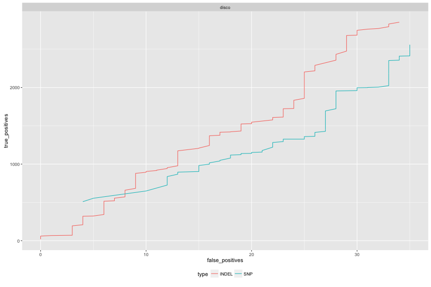
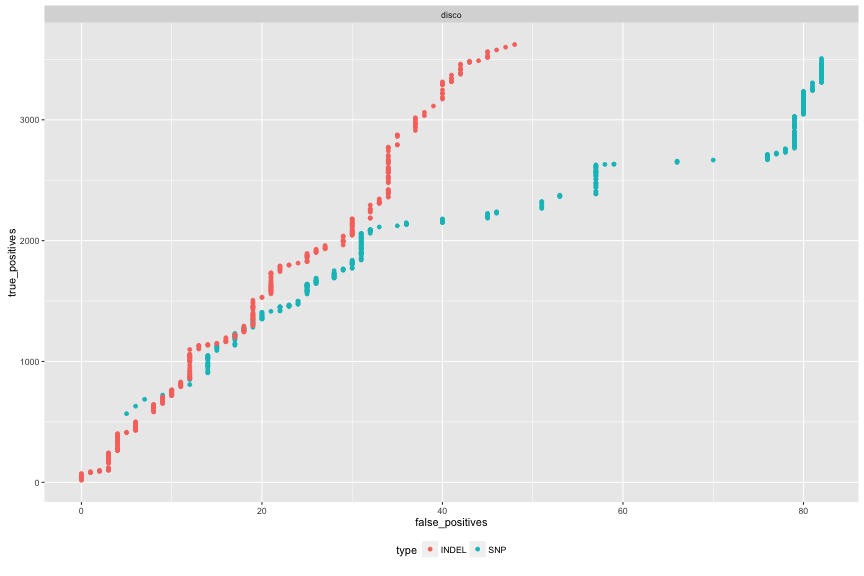
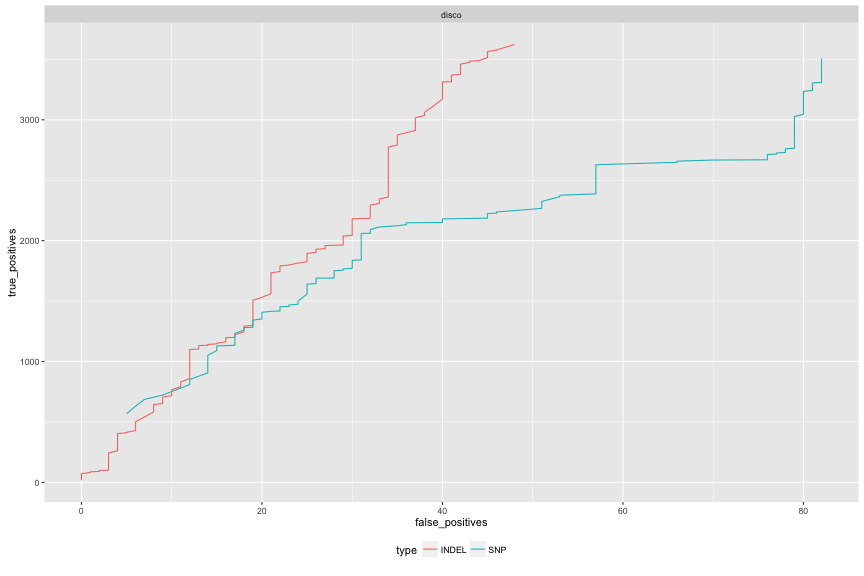
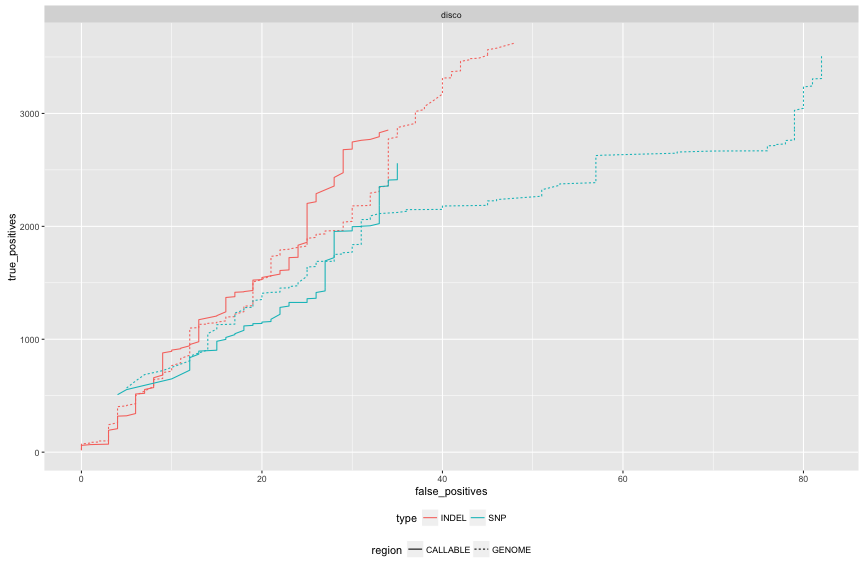
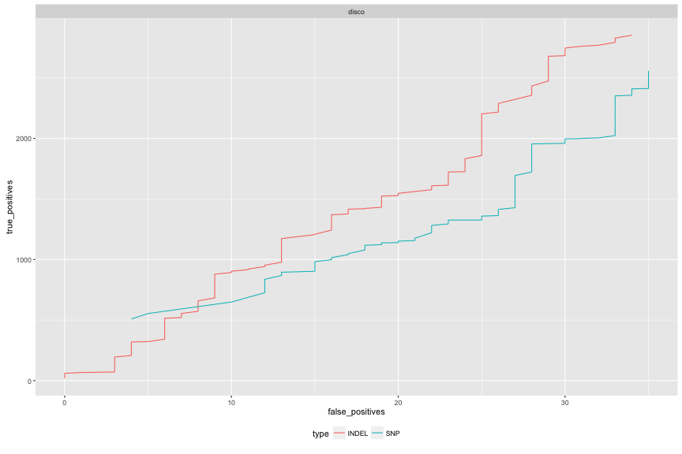

library(ggplot2)
library(hexbin)
library(reshape2)
library(knitr)

library(gridExtra)
library(grid)
library(ggplot2)
library(lattice)

```r
opts_chunk$set(fig.width=12, fig.height=8,dev='png',warning=F)
```


```r
discoFilt <- read.table("3D7DD2.REFCALL.PASS.DD2CONC.PFX.LMRG.HAP.Dd2-2D4_FILT_EVAL/weighted_roc.tsv.gz",header=F,skip = 3,stringsAsFactors =F,sep="\t",col.names=c("score","true_positives","false_positives","false_negatives","precision","sensitivity","f_measure"))
discoFilt$caller="disco"
discoFilt$region="GENOME"

discoFiltSNPs <- read.table("3D7DD2.REFCALL.PASS.DD2CONC.PFX.LMRG.HAP.Dd2-2D4_FILT_EVAL/snp_roc.tsv.gz",header=F,skip = 3,stringsAsFactors =F,sep="\t",col.names = c("score","true_positives","false_positives"))
discoFiltINDELs <- read.table("3D7DD2.REFCALL.PASS.DD2CONC.PFX.LMRG.HAP.Dd2-2D4_FILT_EVAL/non_snp_roc.tsv.gz",header=F,skip = 3,stringsAsFactors =F,sep="\t",col.names = c("score","true_positives","false_positives"))
discoFiltSNPs$type="SNP"
discoFiltINDELs$type="INDEL"
discoFiltType <- rbind(discoFiltSNPs,discoFiltINDELs)
discoFiltType$caller="disco"
discoFiltType$region="GENOME"
posns <- intersect(discoFiltSNPs$score,discoFiltINDELs$score)
discoFiltType <- subset(discoFiltType,score %in% posns)


discoCALLFilt <- read.table("3D7DD2.REFCALL.PASS.DD2CONC.PFX.LMRG.HAP.CALLBOTH.Dd2-2D4_FILT_EVAL/weighted_roc.tsv.gz",header=F,skip = 3,stringsAsFactors =F,sep="\t",col.names=c("score","true_positives","false_positives","false_negatives","precision","sensitivity","f_measure"))
discoCALLFilt$caller="disco"
discoCALLFilt$region="CALLABLE"

discoCALLFiltSNPs <- read.table("3D7DD2.REFCALL.PASS.DD2CONC.PFX.LMRG.HAP.CALLBOTH.Dd2-2D4_FILT_EVAL/snp_roc.tsv.gz",header=F,skip = 3,stringsAsFactors =F,sep="\t",col.names = c("score","true_positives","false_positives"))
discoCALLFiltINDELs <- read.table("3D7DD2.REFCALL.PASS.DD2CONC.PFX.LMRG.HAP.CALLBOTH.Dd2-2D4_FILT_EVAL/non_snp_roc.tsv.gz",header=F,skip = 3,stringsAsFactors =F,sep="\t",col.names = c("score","true_positives","false_positives"))
discoCALLFiltSNPs$type="SNP"
discoCALLFiltINDELs$type="INDEL"
discoCALLFiltType <- rbind(discoCALLFiltSNPs,discoCALLFiltINDELs)
discoCALLFiltType$caller="disco"
discoCALLFiltType$region="CALLABLE"
posns <- intersect(discoCALLFiltSNPs$score,discoCALLFiltINDELs$score)
discoCALLFiltType <- subset(discoCALLFiltType,score %in% posns)


head(discoFilt); head(discoCALLFilt)
```

```
##     score true_positives false_positives false_negatives precision
## 1 5539.62              1               0           19976         1
## 2 4964.62              2               0           19975         1
## 3 4904.62              3               0           19974         1
## 4 4788.50              4               0           19973         1
## 5 4701.25              5               0           19972         1
## 6 4553.38              6               0           19971         1
##   sensitivity f_measure caller region
## 1       1e-04     1e-04  disco GENOME
## 2       1e-04     2e-04  disco GENOME
## 3       2e-04     3e-04  disco GENOME
## 4       2e-04     4e-04  disco GENOME
## 5       3e-04     5e-04  disco GENOME
## 6       3e-04     6e-04  disco GENOME
```

```
##     score true_positives false_positives false_negatives precision
## 1 4964.62              1               0           11864         1
## 2 4553.38              2               0           11863         1
## 3 3912.62              3               0           11862         1
## 4 3860.75              4               0           11861         1
## 5 3721.12              5               0           11860         1
## 6 3685.62              6               0           11859         1
##   sensitivity f_measure caller   region
## 1       1e-04     2e-04  disco CALLABLE
## 2       2e-04     3e-04  disco CALLABLE
## 3       3e-04     5e-04  disco CALLABLE
## 4       3e-04     7e-04  disco CALLABLE
## 5       4e-04     8e-04  disco CALLABLE
## 6       5e-04     1e-03  disco CALLABLE
```

```r
head(discoFiltType); head(discoCALLFiltType)
```

```
##       score true_positives false_positives type caller region
## 543 2858.50            568               5  SNP  disco GENOME
## 602 2810.88            630               6  SNP  disco GENOME
## 655 2767.62            687               7  SNP  disco GENOME
## 685 2743.00            722               9  SNP  disco GENOME
## 761 2694.00            809              12  SNP  disco GENOME
## 796 2671.25            850              12  SNP  disco GENOME
```

```
##       score true_positives false_positives type caller   region
## 489 2810.88            509               4  SNP  disco CALLABLE
## 532 2767.62            554               5  SNP  disco CALLABLE
## 619 2694.00            649              10  SNP  disco CALLABLE
## 681 2627.25            726              12  SNP  disco CALLABLE
## 690 2617.00            735              12  SNP  disco CALLABLE
## 703 2608.12            749              12  SNP  disco CALLABLE
```

```r
# discoFilt <- read.table("disco_3D7_0901_weighted_roc.tsv.gz",header=F,skip = 3,stringsAsFactors =F,sep="\t")
# colnames(discoFilt) <-c("score","true_positives","false_positives","false_negatives","precision","sensitivity","f_measure")
# discoFilt$sample="0901"
# discoFilt$caller="disco"
# discoFilt$filter=T

rocCf <- rbind(discoCALLFiltType,discoFiltType)
```


```r
g_legend<-function(a.gplot){
  tmp <- ggplot_gtable(ggplot_build(a.gplot))
  leg <- which(sapply(tmp$grobs, function(x) x$name) == "guide-box")
  legend <- tmp$grobs[[leg]]
  return(legend)}
```


```r
#ROC PLOT
ggplot(discoCALLFiltType,aes(x=false_positives,y=true_positives,colour=type)) + 
  geom_line() + facet_grid(. ~ caller) + theme(legend.position="bottom")
```



```r
ggplot(discoFiltType,aes(x=false_positives,y=true_positives,colour=type)) + 
  geom_point() + facet_grid(. ~ caller) + theme(legend.position="bottom")
```



```r
ggplot(discoFiltType,aes(x=false_positives,y=true_positives,colour=type)) + 
  geom_line() + facet_grid(. ~ caller) + theme(legend.position="bottom")
```



```r
ggplot(rocCf,aes(x=false_positives,y=true_positives,colour=type,linetype=region)) + 
  geom_line() + facet_grid(. ~ caller) + theme(legend.position="bottom")
```



```r
#PRECISON_RECALL PLOT
#ggplot(subset(roctab,filter),aes(x=sensitivity,y=precision,colour=sample)) + 
#  geom_point() + facet_grid(. ~ caller) + theme(legend.position="bottom")
##PRECISON_RECALL PLOT
#ggplot(subset(roctab,filter),aes(x=score,y=precision,colour=sample)) + 
#  geom_point() + facet_grid(. ~ caller) + theme(legend.position="bottom") + xlim(0,5e3)

#combined roc plot
ggplot(roctab,aes(x=false_positives,y=true_positives,colour=sample,linetype=filter)) + 
  geom_line() + facet_grid(filter ~ caller) + theme(legend.position="bottom") + ylim(0,20e3)
```

```
## Error in ggplot(roctab, aes(x = false_positives, y = true_positives, colour = sample, : object 'roctab' not found
```


```r
callboth <- read.table("Thies_all_manual.PASS.Cls.miss0.5.LMRG.HAP.CALLBOTH.vcf.dist.tab.txt",sep="\t")
callboth$from=rownames(callboth)
callboth <- melt(callboth,variable.name = "to",value.name="both")
```

```
## Using from as id variables
```

```r
callDisco <- read.table("Thies_all_manual.PASS.Cls.miss0.5.LMRG.HAP.CALLDISCOONLY.vcf.dist.tab.txt",sep="\t")
callDisco$from=rownames(callDisco)
callDisco <- melt(callDisco,variable.name = "to",value.name="disco")
```

```
## Using from as id variables
```

```r
callsnp <- read.table("Thies_all_manual.PASS.Cls.miss0.5.LMRG.HAP.SNP.recode.vcf.dist.tab.txt",sep="\t")
callsnp $from=rownames(callsnp )
callsnp  <- melt(callsnp ,variable.name = "to",value.name="snp")
```

```
## Using from as id variables
```

```r
callindel <- read.table("Thies_all_manual.PASS.Cls.miss0.5.LMRG.HAP.INDEL.recode.vcf.dist.tab.txt",sep="\t")
callindel $from=rownames(callindel )
callindel  <- melt(callindel ,variable.name = "to",value.name="indel")
```

```
## Using from as id variables
```

```r
callCf <- merge(merge(callboth,callDisco),merge(callsnp,callindel))
callCf <- callCf[!is.na(callCf$snp),]
callCf <- callCf[callCf$from != callCf$to,]

callCf <- callCf[callCf$snp <= 1000,]
```


```r
cor(callCf$snp,callCf$indel)
```

```
## [1] 0.9519626
```

```r
cor(callCf$both,callCf$disco)
```

```
## [1] 0.9062925
```

```r
ggplot(callCf,aes(x=snp,y=indel)) + geom_point()
```



```r
ggplot(callCf,aes(x=both,y=disco)) + geom_point()
```


