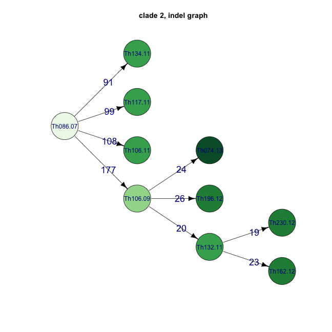
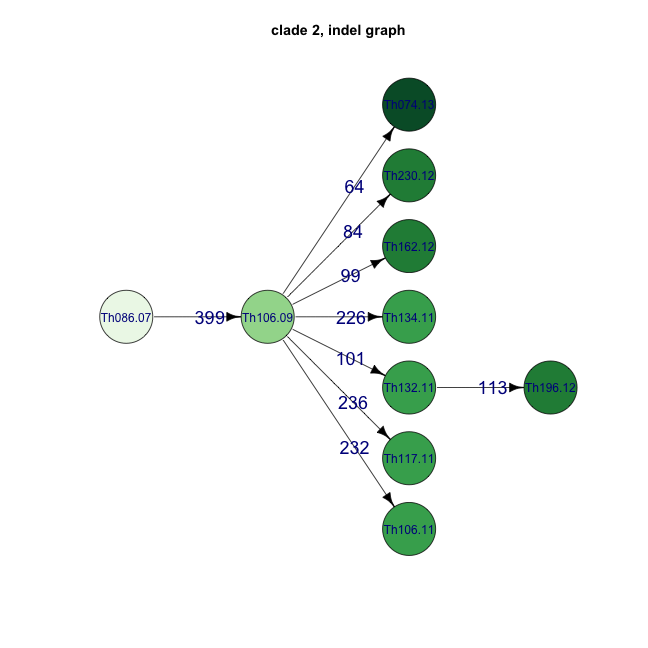
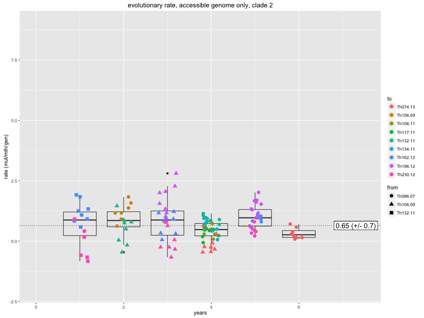
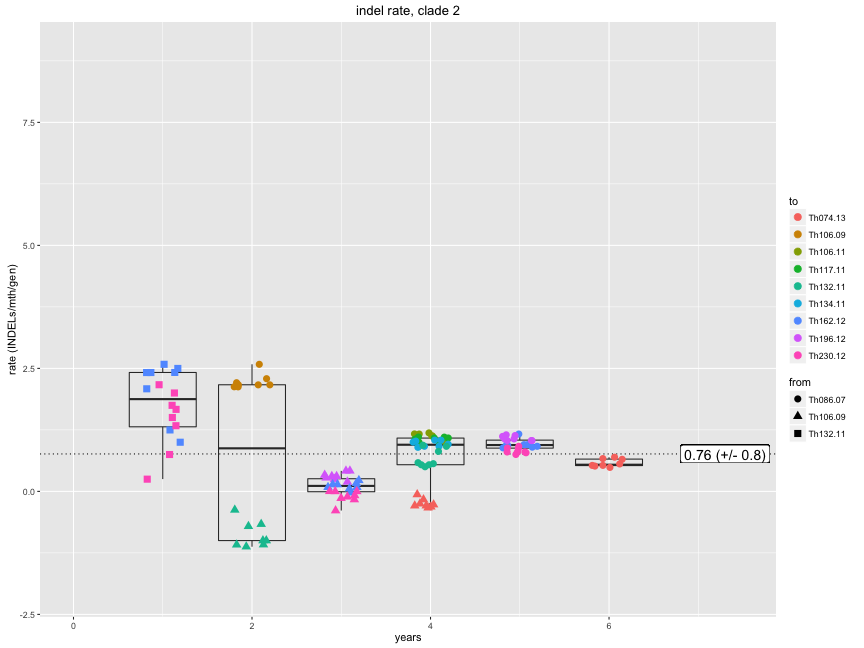
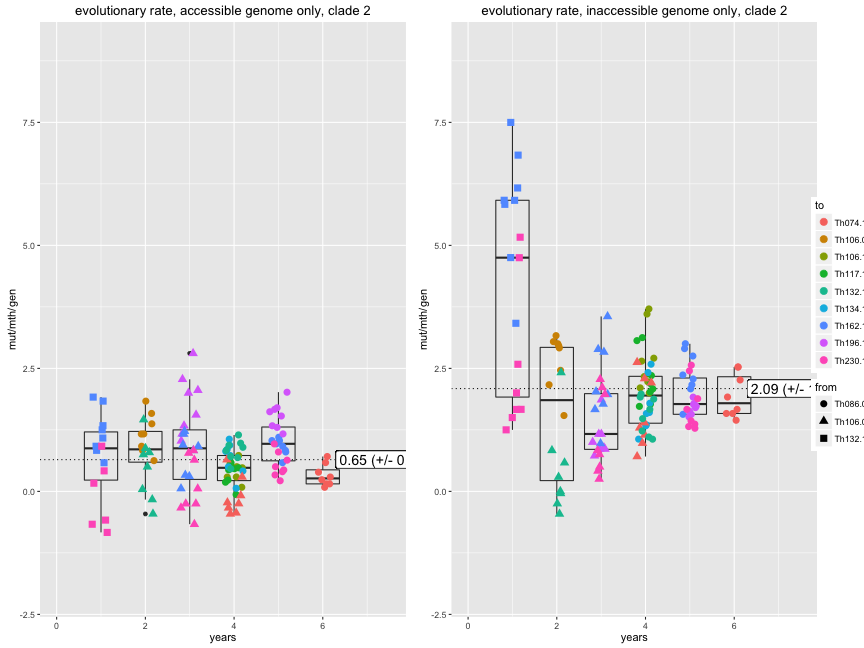

```r
library(ape)
library(adegenet)
library(knitr)
library(igraph)
library(RColorBrewer)

opts_chunk$set(fig.width=9, fig.height=9)
opts_chunk$set(dev=c('png'))
```


```r
sym <- function(M) {
  M[lower.tri(M)] = t(M)[lower.tri(M)]
  M
}

makeNet <- function(distance_matrix_file, meta_file, ngroups=3) {
  mat <- read.table(distance_matrix_file,sep="\t")
  D <- as.dist(sym(mat))
  clust <- gengraph(D,ngrp=ngroups)
  names <- colnames(mat)
  mat <- as.matrix(mat)
  meta <- read.table("daniels.thies.CA.txt",sep="\t",header=T)
  rownames(meta) <- meta$name
  meta <- meta[names,]
  coll <- as.Date(paste("1","jan",meta$year,sep=""),"%d%b%Y")
  names(coll)<-meta$name

  name1 <- names[clust$clust$membership==1]
  name2 <- names[clust$clust$membership==2]
  name3 <- names[clust$clust$membership==3]
  year1 <- meta$year[clust$clust$membership==1]
  year2 <- meta$year[clust$clust$membership==2]
  year3 <- meta$year[clust$clust$membership==3]
  coll1 <- coll[name1]
  coll2 <- coll[name2]
  coll3 <- coll[name3]
  dist1 <- mat[name1,name1]
  dist2 <- mat[name2,name2]
  dist3 <- mat[name3,name3]
  
  res1 <- seqTrack(dist1, x.names=name1, x.dates=coll1)
  res2 <- seqTrack(dist2, x.names=name2, x.dates=coll2)
  res3 <- seqTrack(dist3, x.names=name3, x.dates=coll3)

  res1$year <- year1
  res2$year <- year2
  res3$year <- year3
  res1$name <- name1
  res2$name <- name2
  res3$name <- name3
  
  list(res1,res2,res3)
}
```


```r
indelNets <- makeNet("Thies_all_manual.PASS.Cls.miss0.5.LMRG.HAP.INDEL.recode.vcf.dist.tab.txt")
snpNets <- makeNet("Thies_all_manual.PASS.Cls.miss0.5.LMRG.HAP.SNP.recode.vcf.dist.tab.txt")
```


```r
printGraph <- function(graph,colours,title) {
  cols <- brewer.pal((max(graph$year)-min(graph$year))+1, colours)

  ts=1 #textsize
  ig <- as.igraph(graph)
  tree <- layout_as_tree(ig,flip.y = F)[,c(2,1)]
  V(ig)$name <- graph$name
  V(ig)$color <- cols[graph$year-min(graph$year)+1]
  V(ig)$label.cex <- ts
 #frame()
  plot(ig,layout=tree,main=title,vertex.size=25,
     edge.color="black",edge.label.cex=1.5,edge.label.family="Arial",vertex.label.family="Arial")

}

printGraph(indelNets[[2]],"Reds","clade 1, indel graph")
```


```r
printGraph(indelNets[[1]],"Greens","clade 2, indel graph")
```



```r
printGraph(indelNets[[3]],"Blues","clade 3, indel graph")
```


```r
printGraph(snpNets[[2]],"Reds","clade 1, indel graph")
```


```r
printGraph(snpNets[[1]],"Greens","clade 2, indel graph")
```



```r
printGraph(snpNets[[3]],"Blues","clade 3, indel graph")
```


```r
opts_chunk$set(fig.width=12, fig.height=9)
opts_chunk$set(dev=c('png'))
```


```r
  net <- indelNets[[1]]

indDists <- read.table("Thies_all_manual.PASS.Cls.miss0.5.LMRG.HAP.INDEL.recode.vcf.dist.tab.txt",sep="\t")
snpDists <- read.table("Thies_all_manual.PASS.Cls.miss0.5.LMRG.HAP.SNP.recode.vcf.dist.tab.txt",sep="\t")

netAll <- net
getAnces <- function(net, leaf, ids=character()) {
    id = ids[1]
    ances = netAll[id,"ances"]
    date = netAll[id,"date"]
    ances.date = netAll[id,"ances.date"]
    #write(paste(leaf,id,ances,sep="\t"),stderr())
    if (!is.na(ances)) {
      if (id != leaf) {
        leaf.date = net[leaf,"date"]
        leaf.year = net[leaf,"year"]
        leaf.name = net[leaf,"name"]
        nextI = dim(net)[[1]]+1
#        write(paste("  adding",nextI,":",leaf,ances,sep=" "),stderr())
        net[nextI,1:2] <- c(leaf, ances)
        net[nextI,6] <- leaf.year
        net[nextI,7] <- leaf.name
        }
      net <- getAnces(net,leaf,c(ances))
    }
    if (length(ids) > 1){
       ids <- ids[ids != id]
#       write(paste("proceeding:",ids[1],sep=" "),stderr())
       net <- getAnces(net,ids[1],ids)
  }
net
}

getEvolRates <- function(net,mat,ng) {
  netAll <- getAnces(net, net$id[1],net$id)
  
  D <- as.dist(sym(mat))
  names <- colnames(mat)
  mat <- as.matrix(sym(mat))
  outgroups <- setdiff(names,net$name)
  
  outtab <- data.frame(from=character(),
                 to=character(),
                 out=character(),
                 time=integer(),
                 distance=numeric(),
                 rate=numeric(),
                 stringsAsFactors=FALSE)
  
  for (i in c(1:dim(netAll)[[1]])) {
    if(!is.na(netAll$ances[i])) {
      sample = netAll$name[i]
      ances = netAll$name[netAll$ances[i]]
      dists = c()
      
      time <- as.integer(netAll$year[i] - netAll$year[netAll$ances[i]])
      
      for (o in outgroups) {
        dist <- mat[sample,o]-mat[ances,o]
        dists <- c(dists, dist)
        outtab[dim(outtab)[1]+1,1:3]=c(ances,sample,o)
        outtab[dim(outtab)[1],4:6]=c(time,dist,round(dist/time,2))        
      }
      dists <- round(dists/time)
      #paste(dists,collapse = ","),
#      write(paste(ances,sample,time,round(mean(dists),2),round(sd(dists),2),sep="\t"),stdout())
#      write(paste(ances,sample,outgroups,time,dists,sep="\t"),stdout())
    }
  }
  outtab$pair <- paste(outtab$from,outtab$to)
  outtab
}

netAll <- getAnces(net, 1,1:10)

ir1 <- getEvolRates(indelNets[[1]],indDists)
sr1 <- getEvolRates(indelNets[[1]],snpDists)  
isr1 <- getEvolRates(indelNets[[1]],indDists+snpDists)  

# ggplot(ir1,aes(x=time,y=rate)) + geom_point()
# ggplot(sr1,aes(x=time,y=rate)) + geom_point()
# ggplot(isr1,aes(x=time,y=rate)) + geom_point()
# 
# ggplot(ir1,aes(x=time,y=rate,group=pair,colour=to)) + geom_violin(draw_quantiles = T) + geom_point(position=position_jitter(width=0.2))
# ggplot(sr1,aes(x=time,y=rate,group=pair,colour=to)) + geom_violin(draw_quantiles = T) + geom_point(position=position_jitter(width=0.2))
# ggplot(isr1,aes(x=time,y=rate,group=pair,colour=to)) + geom_violin(draw_quantiles = T) + geom_point(position=position_jitter(width=0.2))

ggplot(ir1,aes(x=time,y=rate/12)) + 
  geom_boxplot(aes(group=time),fill=NA) + geom_hline(aes(yintercept=mean(rate/12)),linetype=3) + 
  geom_point(aes(colour=to,shape=from),position=position_jitter(width=0.5),size=3)+
  geom_label(aes(label=paste(round(mean(rate/12),2)," (+/- ",round(sd(rate/12),1),")",sep=""),y=mean(rate/12),x=7.3),size=5)+
  ggtitle("indel rate, clade 2") + ylab("rate (INDELs/mth/gen)") + xlab("years")  + ylim(-2,9) + xlim(0,7.5)
```



```r
ggplot(sr1,aes(x=time,y=rate/12)) + 
  geom_boxplot(aes(group=time),fill=NA) + geom_hline(aes(yintercept=mean(rate/12)),linetype=3) + 
  geom_point(aes(colour=to,shape=from),position=position_jitter(width=0.5),size=3)+
  geom_label(aes(label=paste(round(mean(rate/12),2)," (+/- ",round(sd(rate/12),1),")",sep=""),y=mean(rate/12),x=7.3),size=5)+
  ggtitle("substitution rate, clade 2") + ylab("rate (SNPs/mth/gen)") + xlab("years") + ylim(-2,9) + xlim(0,7.5)
```



```r
ggplot(isr1,aes(x=time,y=rate/12)) + 
  geom_boxplot(aes(group=time),fill=NA) + geom_hline(aes(yintercept=mean(rate/12)),linetype=3) + 
  geom_point(aes(colour=to,shape=from),position=position_jitter(width=0.5),size=3) +
  geom_label(aes(label=paste(round(mean(rate/12),2)," (+/- ",round(sd(rate/12),1),")",sep=""),y=mean(rate/12),x=7.3),size=5)+
  ggtitle("evolutionary rate, clade 2") + ylab("rate (mut/mth/gen)") + xlab("years")  + ylim(-2,9) + xlim(0,7.5)
```


```r
irate <- round(mean(ir1$rate),3)
srate <- round(mean(sr1$rate),3)
israte <- round(mean(isr1$rate),3)
```


```r
sppsubs <- read.table("subrate_relaxed_otherspp2.txt",sep="\t",header=T,stringsAsFactors = F)
colnames(sppsubs)[3:4] <- c("gsize","subrate")
sppsubs$Group <- factor(sppsubs$Group,levels=c("eukaryote","Bacteria","dsDNA virus","ssDNA virus","RNA virus"),ordered = T)

pfgsize<-18446000
# sppsubs <- rbind(sppsubs,
#       c("P.falciparum","eukaryote",pfgsize,signif(israte/pfgsize,2),israte,"among",8,"ours")
#       )

sppsubs$vartype<-"SNP"
sppsubs <- rbind(sppsubs,
      c("P.falciparum (snp)","eukaryote",pfgsize,signif(srate/pfgsize,2),srate,"among",8,"ours","SNP"),
      c("P.falciparum (ind)","eukaryote",pfgsize,signif(irate/pfgsize,2),irate,"among",8,"ours","INDEL"),
      c("P.falciparum (all)","eukaryote",pfgsize,signif(israte/pfgsize,2),israte,"among",8,"ours","SNP+INDEL")
      )

sppsubs$subrate <- as.numeric(sppsubs$subrate)
sppsubs$gsize <- as.numeric(sppsubs$gsize)
sppsubs$vartype <- factor(sppsubs$vartype,levels=c("SNP","INDEL","SNP+INDEL"),ordered=T)

gsizes <- seq(0,1e8,1e3)
rates <- data.frame("gsize"=gsizes,"years"=1/gsizes,"months"=12/gsizes,"weeks"=52/gsizes)
ratesM <- melt(rates,id.vars = "gsize",value.name ="subrate")
#ratesM <- ratesM[ratesM$subrate<=0.005,]
ratesM <- ratesM[ratesM$gsize>0,]
floors <- data.frame("gsize"=c(rep(max(ratesM$gsize),3),rep(min(ratesM$gsize),3)),
      "variable"=unique(as.character(ratesM$variable)),
      "subrate"=rep(0,6))

ratesM <- rbind(ratesM,floors)
ratesM$variable <- factor(ratesM$variable,levels=c("weeks","months","years"),ordered=T)

fcol <- c("#AAAAAA","#CCCCCC","#EEEEEE")
names(fcol) = c("years","months","weeks")

ggplot(sppsubs,aes(x=gsize,y=subrate),) +  
  geom_polygon(data=ratesM,aes(group=variable,fill=variable)) +
  scale_fill_manual(values = fcol) + 
  geom_label(aes(label=Pathogen,colour=Group),nudge_x = 0.2) + 
  geom_point(aes(label=Pathogen,colour=Group,shape=vartype),size=3) + 
  scale_y_log10() + scale_x_log10(limits=c(1e3,1e8),breaks=c(1e4,1e5,1e6,1e7,1e8)) +
  xlab("Genome Size (bp)")+ylab("mutation rate (muts / site / year)")+
  theme(panel.background = element_rect(fill = F))
```



