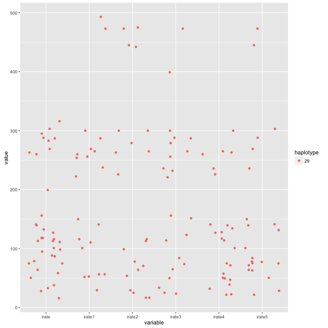
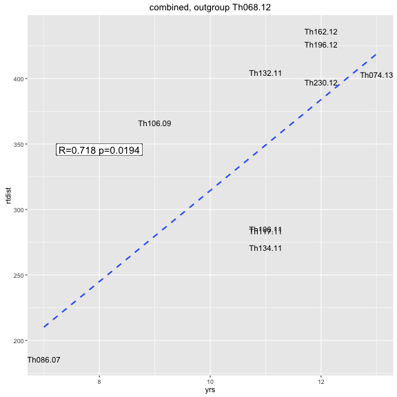
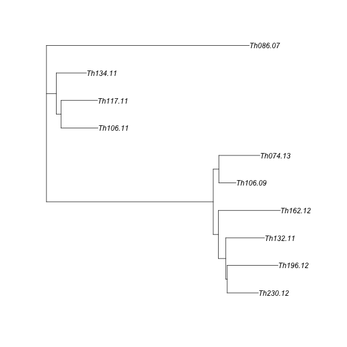
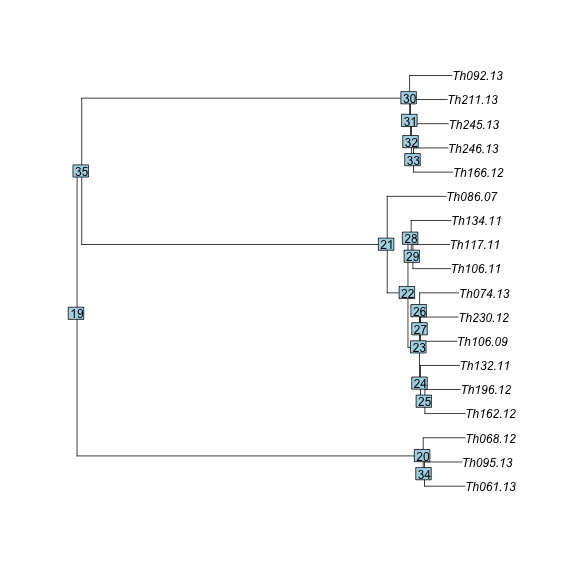
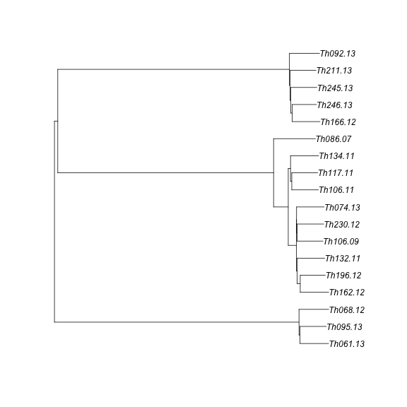
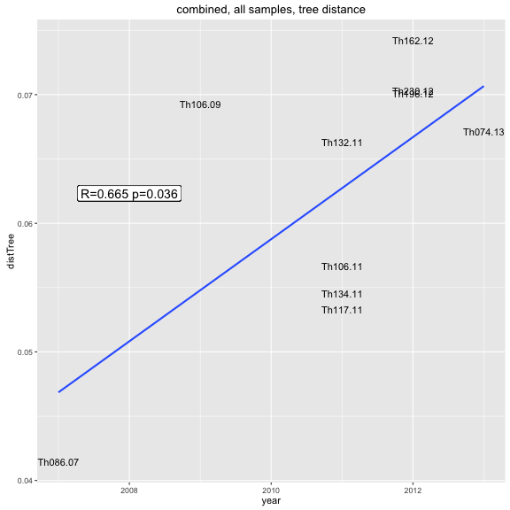
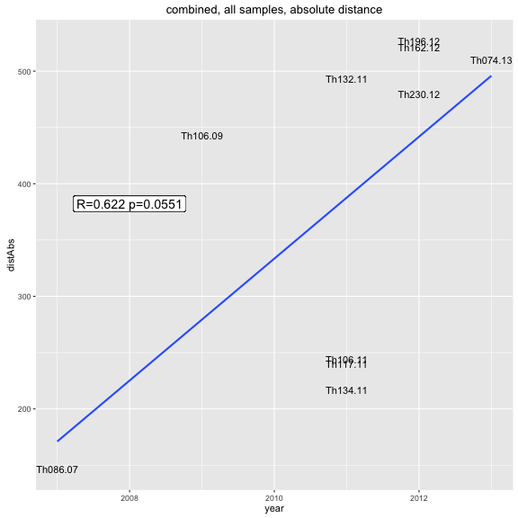

```r
library(ape)
library(adegenet)
library(phangorn)
library(knitr)
library(igraph)
library(RColorBrewer)
library(ggplot2)
library(reshape2)
opts_chunk$set(fig.width=9, fig.height=9)
opts_chunk$set(dev=c('png','postscript'))
```


```r
sym <- function(M) {
  M[lower.tri(M)] = t(M)[lower.tri(M)]
  M
}

makeDist <- function(distance_matrix_file, meta_file, ngroups=3) {
  mat <- read.table(distance_matrix_file,sep="\t")
  D <- as.dist(sym(mat))
  clust <- gengraph(D,ngrp=ngroups)
  names <- colnames(mat)
  mat <- as.matrix(mat)
  
  name1 <- names[clust$clust$membership==1]
  name2 <- names[clust$clust$membership==2]
  name3 <- names[clust$clust$membership==3]
  dist1 <- mat[name1,name1]
  dist2 <- mat[name2,name2]
  dist3 <- mat[name3,name3]
    
  list(dist1,dist2,dist3)
}
```


```r
meta<-read.table("daniels.thies.CA.txt",sep="\t",header=T)
indelDists <- read.table("Thies_all_manual.PASS.Cls.miss0.5.LMRG.HAP.INDEL.recode.vcf.dist.tab.txt",header=T,sep="\t")
snpDists <- read.table("Thies_all_manual.PASS.Cls.miss0.5.LMRG.HAP.SNP.recode.vcf.dist.tab.txt",header=T,sep="\t")
combDists <- indelDists+snpDists
meta <- subset(meta,name %in% names(indelDists))
rownames(meta) <- meta$name
```


```r
rates <- data.frame(
                 from=character(), 
                 to=character(), 
                 haplotype=numeric(),
                 interval=numeric(),
                 SNP=numeric(),
                 INDEL=numeric(),
                 stringsAsFactors=FALSE) 
n=0
names <- colnames(snpDists)
for (i in c(1:length(meta$name))) {
  for (j in c(i:length(meta$name))) {
    iname <-names[i]; jname <- names[j] 
    if (meta[iname,"haplotype.number"]==meta[jname,"haplotype.number"]) {
      n<-n+1
      interval <- abs(meta[jname,"year"]-meta[iname,"year"])
      
      #write(paste(meta$name[i],meta$name[j],interval,indelDists[i,j],snpDists[i,j]),stderr())  
      rates[n,1:3] <- c(as.character(iname),
                     as.character(jname),
                     meta[iname,"haplotype.number"])
      rates[n,4:6] <- c(interval,
                        indelDists[iname,jname],snpDists[iname,jname])
      }
  }
}

rates <- subset(rates,haplotype=="29")

rates$irate <- rates$INDEL/rates$interval
rates$irate1 <- rates$INDEL/sample(rates$interval)
rates$irate2 <- rates$INDEL/sample(rates$interval)
rates$irate3 <- rates$INDEL/sample(rates$interval)
rates$irate4 <- rates$INDEL/sample(rates$interval)
rates$irate5 <- rates$INDEL/sample(rates$interval)
rates <- melt(rates,id.vars=c("from","to","interval","haplotype","SNP","INDEL"))

rates <- subset(rates,value > 0 & is.finite(value))
ggplot(subset(rates,interval > 0),aes(y=value,x=variable,colour=haplotype)) + geom_jitter()
```




```r
opts_chunk$set(fig.width=12, fig.height=9)
opts_chunk$set(dev=c('png'))
```


```r
  net <- indelNets[[1]]
```

```
## Error in eval(expr, envir, enclos): object 'indelNets' not found
```

```r
indDists <- read.table("Thies_all_manual.PASS.Cls.miss0.5.LMRG.HAP.INDEL.recode.vcf.dist.tab.txt",sep="\t")
snpDists <- read.table("Thies_all_manual.PASS.Cls.miss0.5.LMRG.HAP.SNP.recode.vcf.dist.tab.txt",sep="\t")
coreDists <- read.table("Thies_all_manual.PASS.Cls.miss0.5.LMRG.HAP.CALLBOTH.vcf.dist.tab.txt",sep="\t")

netAll <- net
```

```
## Error in eval(expr, envir, enclos): object 'net' not found
```

```r
getAnces <- function(net, leaf, ids=character()) {
    id = ids[1]
    ances = netAll[id,"ances"]
    date = netAll[id,"date"]
    ances.date = netAll[id,"ances.date"]
    #write(paste(leaf,id,ances,sep="\t"),stderr())
    if (!is.na(ances)) {
      if (id != leaf) {
        leaf.date = net[leaf,"date"]
        leaf.year = net[leaf,"year"]
        leaf.name = net[leaf,"name"]
        nextI = dim(net)[[1]]+1
#        write(paste("  adding",nextI,":",leaf,ances,sep=" "),stderr())
        net[nextI,1:2] <- c(leaf, ances)
        net[nextI,6] <- leaf.year
        net[nextI,7] <- leaf.name
        }
      net <- getAnces(net,leaf,c(ances))
    }
    if (length(ids) > 1){
       ids <- ids[ids != id]
#       write(paste("proceeding:",ids[1],sep=" "),stderr())
       net <- getAnces(net,ids[1],ids)
  }
net
}

getEvolRates <- function(net,mat,ng) {
  netAll <- getAnces(net, net$id[1],net$id)
  
  D <- as.dist(sym(mat))
  names <- colnames(mat)
  mat <- as.matrix(sym(mat))
  outgroups <- setdiff(names,net$name)
  
  outtab <- data.frame(from=character(),
                 to=character(),
                 out=character(),
                 time=integer(),
                 distance=numeric(),
                 rate=numeric(),
                 stringsAsFactors=FALSE)
  
  for (i in c(1:dim(netAll)[[1]])) {
    if(!is.na(netAll$ances[i])) {
      sample = netAll$name[i]
      ances = netAll$name[netAll$ances[i]]
      dists = c()
      
      time <- as.integer(netAll$year[i] - netAll$year[netAll$ances[i]])
      
      for (o in outgroups) {
        dist <- mat[sample,o]-mat[ances,o]
        dists <- c(dists, dist)
        outtab[dim(outtab)[1]+1,1:3]=c(ances,sample,o)
        outtab[dim(outtab)[1],4:6]=c(time,dist,round(dist/time,2))        
      }
      dists <- round(dists/time)
      #paste(dists,collapse = ","),
#      write(paste(ances,sample,time,round(mean(dists),2),round(sd(dists),2),sep="\t"),stdout())
#      write(paste(ances,sample,outgroups,time,dists,sep="\t"),stdout())
    }
  }
  outtab$pair <- paste(outtab$from,outtab$to)
  outtab
}

netAll <- getAnces(net, 1,1:10)
```

```
## Error in getAnces(net, 1, 1:10): object 'netAll' not found
```

```r
g_legend<-function(a.gplot){
  tmp <- ggplot_gtable(ggplot_build(a.gplot))
  leg <- which(sapply(tmp$grobs, function(x) x$name) == "guide-box")
  legend <- tmp$grobs[[leg]]
  return(legend)}
```


```r
opts_chunk$set(fig.width=22, fig.height=8)
opts_chunk$set(dev=c('png','postscript'))
```


```r
corer1 <- getEvolRates(indelNets[[1]],coreDists)  
```

```
## Error in getAnces(net, net$id[1], net$id): object 'indelNets' not found
```

```r
inaccr1 <- getEvolRates(indelNets[[1]],(indDists+snpDists)-coreDists)  
```

```
## Error in getAnces(net, net$id[1], net$id): object 'indelNets' not found
```

```r
#CORE GENOME
cplot <- ggplot(corer1,aes(x=time,y=rate/12)) + 
  geom_boxplot(aes(group=time),fill=NA) + geom_hline(aes(yintercept=mean(rate/12)),linetype=3) + 
  geom_point(aes(colour=to,shape=from),position=position_jitter(width=0.5),size=3)+
  geom_label(aes(label=paste(round(mean(rate/12),2)," (+/- ",round(sd(rate/12),1),")",sep=""),y=mean(rate/12),x=7.3),size=5)+
  ggtitle("evolutionary rate, accessible genome only, clade 2") + ylab("mut/mth/gen") + xlab("years")  + ylim(-2,9) + xlim(0,7.5) +
  theme(legend.position="none")
```

```
## Error in ggplot(corer1, aes(x = time, y = rate/12)): object 'corer1' not found
```

```r
#INACCESSIBLE GENOME
iaplot <- ggplot(inaccr1,aes(x=time,y=rate/12)) + 
  geom_boxplot(aes(group=time),fill=NA) + geom_hline(aes(yintercept=mean(rate/12)),linetype=3) + 
  geom_point(aes(colour=to,shape=from),position=position_jitter(width=0.5),size=3)+
  geom_label(aes(label=paste(round(mean(rate/12),2)," (+/- ",round(sd(rate/12),1),")",sep=""),y=mean(rate/12),x=7.3),size=5)+
  ggtitle("evolutionary rate, inaccessible genome only, clade 2") + ylab("mut/mth/gen") + xlab("years")  + ylim(-2,9) + xlim(0,7.5)
```

```
## Error in ggplot(inaccr1, aes(x = time, y = rate/12)): object 'inaccr1' not found
```

```r
legend <- g_legend(iaplot)
```

```
## Error in plot_clone(plot): object 'iaplot' not found
```

```r
grid.arrange(cplot, iaplot + theme(legend.position="none"),legend, nrow=1,widths=c(10,10,1),heights=c(1))
```

```
## Error in eval(expr, envir, enclos): could not find function "grid.arrange"
```

```r
corerate <- round(mean(corer1$rate),3)
```

```
## Error in mean(corer1$rate): object 'corer1' not found
```

```r
inaccrate <- round(mean(inaccr1$rate),3)
```

```
## Error in mean(inaccr1$rate): object 'inaccr1' not found
```


```r
ir1 <- getEvolRates(indelNets[[1]],indDists)
```

```
## Error in getAnces(net, net$id[1], net$id): object 'indelNets' not found
```

```r
sr1 <- getEvolRates(indelNets[[1]],snpDists)  
```

```
## Error in getAnces(net, net$id[1], net$id): object 'indelNets' not found
```

```r
isr1 <- getEvolRates(indelNets[[1]],indDists+snpDists)  
```

```
## Error in getAnces(net, net$id[1], net$id): object 'indelNets' not found
```

```r
#INDELs ONLY
iplot <- ggplot(ir1,aes(x=time,y=rate/12)) + 
  geom_boxplot(aes(group=time),fill=NA) + geom_hline(aes(yintercept=mean(rate/12)),linetype=3) + 
  geom_point(aes(colour=to,shape=from),position=position_jitter(width=0.5),size=3)+
  geom_label(aes(label=paste(round(mean(rate/12),2)," (+/- ",round(sd(rate/12),1),")",sep=""),y=mean(rate/12),x=7.3),size=5)+
  ggtitle("indel rate, clade 2") + ylab("INDELs/mth/gen") + xlab("years")  + ylim(-2,9) + xlim(0,7.5) +
  theme(legend.position="none")
```

```
## Error in ggplot(ir1, aes(x = time, y = rate/12)): object 'ir1' not found
```

```r
#SNPs ONLY
splot <- ggplot(sr1,aes(x=time,y=rate/12)) + 
  geom_boxplot(aes(group=time),fill=NA) + geom_hline(aes(yintercept=mean(rate/12)),linetype=3) + 
  geom_point(aes(colour=to,shape=from),position=position_jitter(width=0.5),size=3)+
  geom_label(aes(label=paste(round(mean(rate/12),2)," (+/- ",round(sd(rate/12),1),")",sep=""),y=mean(rate/12),x=7.3),size=5)+
  ggtitle("substitution rate, clade 2") + ylab("SNPs/mth/gen") + xlab("years") + ylim(-2,9) + xlim(0,7.5)
```

```
## Error in ggplot(sr1, aes(x = time, y = rate/12)): object 'sr1' not found
```

```r
legend <- g_legend(splot)
```

```
## Error in plot_clone(plot): object 'splot' not found
```

```r
grid.arrange(iplot, splot + theme(legend.position="none"),legend, nrow=1,widths=c(10,10,1),heights=c(1))
```

```
## Error in eval(expr, envir, enclos): could not find function "grid.arrange"
```


GATK rates

```r
inaccDistsGATK <- read.table("thies_300100_haplo.CALLDISCO.RENAME.dist.tab.txt",sep="\t")
coreDistsGATK <- read.table("thies_300100_haplo.CALLBOTH.RENAME.dist.tab.txt",sep="\t")
corerateGATK <- getEvolRates(indelNets[[1]],coreDistsGATK)
```

```
## Error in getAnces(net, net$id[1], net$id): object 'indelNets' not found
```

```r
inaccrateGATK <- getEvolRates(indelNets[[1]],inaccDistsGATK)
```

```
## Error in getAnces(net, net$id[1], net$id): object 'indelNets' not found
```

```r
gatkcplot <- ggplot(corerateGATK,aes(x=time,y=rate/12)) + 
  geom_boxplot(aes(group=time),fill=NA) + geom_hline(aes(yintercept=mean(rate/12)),linetype=3) + 
  geom_point(aes(colour=to,shape=from),position=position_jitter(width=0.5),size=3)+
  geom_label(aes(label=paste(round(mean(rate/12),2)," (+/- ",round(sd(rate/12),1),")",sep=""),y=mean(rate/12),x=7.3),size=5)+
  ggtitle("evolutionary rate, accessible genome only, GATK calls, clade 2") + ylab("rate (mut/mth/gen)") + xlab("years")  + ylim(-50,100) + xlim(0,7.5)+
  theme(legend.position="none")
```

```
## Error in ggplot(corerateGATK, aes(x = time, y = rate/12)): object 'corerateGATK' not found
```

```r
gatkiaplot <- ggplot(inaccrateGATK,aes(x=time,y=rate/12)) + 
  geom_boxplot(aes(group=time),fill=NA) + geom_hline(aes(yintercept=mean(rate/12)),linetype=3) + 
  geom_point(aes(colour=to,shape=from),position=position_jitter(width=0.5),size=3)+ 
  geom_label(aes(label=paste(round(mean(rate/12),2)," (+/- ",round(sd(rate/12),1),")",sep=""),y=mean(rate/12),x=7.3),size=5)+
  ggtitle("evolutionary rate, inaccessible genome, GATK calls, clade 2") + ylab("rate (mut/mth/gen)") + xlab("years")  + ylim(-50,100) + xlim(0,7.5)
```

```
## Error in ggplot(inaccrateGATK, aes(x = time, y = rate/12)): object 'inaccrateGATK' not found
```

```r
legend <- g_legend(gatkiaplot)
```

```
## Error in plot_clone(plot): object 'gatkiaplot' not found
```

```r
grid.arrange(gatkcplot, gatkiaplot + theme(legend.position="none"),legend, nrow=1,widths=c(10,10,1),heights=c(1))
```

```
## Error in eval(expr, envir, enclos): could not find function "grid.arrange"
```


```r
opts_chunk$set(fig.width=12, fig.height=8)
opts_chunk$set(dev=c('png','postscript'))
```

```r
#SNPs + INDELs
ggplot(isr1,aes(x=time,y=rate/12)) + 
  geom_boxplot(aes(group=time),fill=NA) + geom_hline(aes(yintercept=mean(rate/12)),linetype=3) + 
  geom_point(aes(colour=to,shape=from),position=position_jitter(width=0.5),size=3) +
  geom_label(aes(label=paste(round(mean(rate/12),2)," (+/- ",round(sd(rate/12),1),")",sep=""),y=mean(rate/12),x=7.3),size=5)+
  ggtitle("evolutionary rate, clade 2") + ylab("mut/mth/gen") + xlab("years")  + ylim(-2,9) + xlim(0,7.5)
```

```
## Error in ggplot(isr1, aes(x = time, y = rate/12)): object 'isr1' not found
```

```r
irate <- round(mean(ir1$rate),3)
```

```
## Error in mean(ir1$rate): object 'ir1' not found
```

```r
srate <- round(mean(sr1$rate),3)
```

```
## Error in mean(sr1$rate): object 'sr1' not found
```

```r
israte <- round(mean(isr1$rate),3)
```

```
## Error in mean(isr1$rate): object 'isr1' not found
```


```r
sppsubs <- read.table("subrate_relaxed_otherspp2.txt",sep="\t",header=T,stringsAsFactors = F)
colnames(sppsubs)[4:6] <- c("gsize","subrate","subrate_genome")
sppsubs$Group <- factor(sppsubs$Group,levels=c("RNA virus","dsDNA virus","ssDNA virus","Bacteria","Eukaryote"),ordered = T)

pfmingsize <- 15180000
pfgsize<-18446000
pfiagsize <- 18446000-15180000

# sppsubs <- rbind(sppsubs,
#       c("P.falciparum","eukaryote",pfgsize,signif(israte/pfgsize,2),israte,"among",8,"ours")
#       )

sppsubs$vartype<-"SNP"
sppsubs$region<-"all"
sppsubs <- rbind(sppsubs,
      c("P.falciparum","P.falciparum (snp)","Eukaryote",pfgsize,signif(srate/pfgsize,2),srate,"among",8,"ours","SNP","all"),
      c("P.falciparum","P.falciparum (ind)","Eukaryote",pfgsize,signif(irate/pfgsize,2),irate,"among",8,"ours","INDEL","all"),
      c("P.falciparum","P.falciparum (all)","Eukaryote",pfgsize,signif(israte/pfgsize,2),israte,"among",8,"ours","SNP+INDEL","all"),
      c("P.falciparum","P.falciparum (core)","Eukaryote",pfmingsize,signif(corerate/pfmingsize,2),corerate,"among",8,"ours","SNP+INDEL","accessible"),
      c("P.falciparum","P.falciparum (inacc)","Eukaryote",pfgsize - pfmingsize,signif(inaccrate/pfiagsize,2),inaccrate,"among",8,"ours","SNP+INDEL","inaccessible")
      )
```

```
## Error in rbind(sppsubs, c("P.falciparum", "P.falciparum (snp)", "Eukaryote", : object 'srate' not found
```

```r
sppsubs$subrate <- as.numeric(sppsubs$subrate)
sppsubs$subrate_genome <- as.numeric(sppsubs$subrate_genome)
sppsubs$gsize <- as.numeric(sppsubs$gsize)
sppsubs$vartype <- factor(sppsubs$vartype,levels=c("SNP","INDEL","SNP+INDEL"),ordered=T)
#sppsubs$Label <- factor(sppsubs$Label,levels=sppsubs$Label[order(sppsubs$Group,sppsubs$subrate_genome)],ordered=T)


pathOrder <- c("HCV","EBOV", "FMDV",   "HIV-M","HFLUV", "RABV",  
 "H. pylori", "S. aureus", "S. pneumoniae", "V. cholerae", "M. tuberculosis", 
"P.falciparum")

sppsubs$Pathogen <- factor(sppsubs$Pathogen,levels=pathOrder,ordered=T)

gsizes <- seq(0,1e8,1e3)
rates <- data.frame("gsize"=gsizes,"years"=1/gsizes,"months"=12/gsizes,"weeks"=52/gsizes)
ratesM <- melt(rates,id.vars = "gsize",value.name ="subrate")
#ratesM <- ratesM[ratesM$subrate<=0.005,]
ratesM <- ratesM[ratesM$gsize>0,]
floors <- data.frame("gsize"=c(rep(max(ratesM$gsize),3),rep(min(ratesM$gsize),3)),
      "variable"=unique(as.character(ratesM$variable)),
      "subrate"=rep(0,6))

ratesM <- rbind(ratesM,floors)
ratesM$variable <- factor(ratesM$variable,levels=c("weeks","months","years"),ordered=T)

fcol <- c("#AAAAAA","#CCCCCC","#EEEEEE")
names(fcol) = c("years","months","weeks")

dotsubs <- c("H. pylori", "M. tuberculosis", "S. aureus (MRSA)", "S. pneumoniae", 
"V. cholerae", "HCV (Hep C)", "EBOV (Ebola)", "HIV-M", # "HFLUV (H1N1 2009)", 
"HFLUV (H1N1)", "RABV", "FMDV",    "P.falciparum (snp)", # "P.falciparum (ind)", 
"P.falciparum (all)", "P.falciparum (core)")

ggplot(subset(sppsubs, Label %in% dotsubs),aes(x=gsize,y=subrate),) +  
  geom_polygon(data=ratesM,aes(group=variable,fill=variable)) +
  scale_fill_manual(values = fcol) + 
  geom_label(aes(label=Label,colour=Group),nudge_x = 0.2) + 
  geom_point(aes(label=Pathogen,colour=Group,shape=vartype),size=5) + 
  scale_y_log10() + scale_x_log10(limits=c(1e3,1e8),breaks=c(1e4,1e5,1e6,1e7,1e8)) +
  xlab("Genome Size (bp)")+ylab("mutation rate (muts / site / year)")+
  theme(panel.background = element_rect(fill = F))
```


```r
#dput(sppsubs$Label)

yearRate <- 1/(sppsubs$subrate*sppsubs$gsize)
monthRate <- 1/(sppsubs$subrate*sppsubs$gsize/12)
weekRate <- 1/(sppsubs$subrate*sppsubs$gsize/52)

period <- rep("yrs",length(yearRate))
newmut <- round(yearRate,1)
period[yearRate < 1] <- "mths"
newmut[yearRate < 1] <- round(monthRate,1)[yearRate < 1]
period[monthRate < 1] <- "wks"
newmut[monthRate < 1] <- round(weekRate,1)[monthRate < 1]
sppsubs$newmut <- paste(newmut,period,sep=" ")

barSamps <- c("M. tuberculosis", "S. aureus (MRSA)","H. pylori",  
"EBOV (Ebola)", "HIV-M", 
"HFLUV (H1N1)", "P.falciparum (inacc)",
"P.falciparum (core)")
labelSamps <- c("M. tuberculosis", "S. aureus (MRSA)","H. pylori", 
"EBOV (Ebola)", "HIV-M", 
"HFLUV (H1N1)", "P.falciparum (all)")
midLabelSamps <- c("P.falciparum (inacc)",
"P.falciparum (core)")

ggplot(subset(sppsubs,Label %in% barSamps),aes(x=Pathogen,y=subrate * gsize),) +  
  geom_bar(aes(fill=Group,alpha=region),stat = "identity",size=3) +
  geom_label(data=subset(sppsubs,Label %in% labelSamps),aes(label=newmut))+
  geom_label(data=subset(sppsubs,Label %in% midLabelSamps),aes(label=newmut, y=(subrate * gsize)/2))+
#  scale_alpha_manual(values=c("SNP"=0.9,"INDEL"=0.6,"SNP+INDEL"=1))+
  scale_alpha_manual(values=c("all"=1,"accessible"=1,"inaccessible"=0.8))+
  ylab("mutation rate (muts / genome / year)")+
  theme(panel.background = element_rect(fill = F),axis.text.x = element_text(angle = 90, hjust = 1))
```


```r
write.table(sppsubs,stdout(),sep="\t",quote=F)
```

```
## Pathogen	Label	Group	gsize	subrate	subrate_genome	Host.scale	Date.range..yrs.	Source	vartype	region	newmut
## 1	H. pylori	H. pylori	Bacteria	1600000	1.38e-05	22	among	15	[S5]	SNP	all	2.4 wks
## 2	M. tuberculosis	M. tuberculosis	Bacteria	4400000	6.8e-08	0.3	among	10	[S9]	SNP	all	3.3 yrs
## 3	S. aureus	S. aureus (MRSA)	Bacteria	2900000	3.3e-06	9.57	among	25	[S13]	SNP	all	1.3 mths
## 4	S. pneumoniae	S. pneumoniae	Bacteria	2200000	1.6e-06	3.52	among	25	[S15]	SNP	all	3.4 mths
## 5	V. cholerae	V. cholerae	Bacteria	4e+06	8.3e-07	3.32	among	60	[S16]	SNP	all	3.6 mths
## 6	HCV	HCV (Hep C)	RNA virus	9000	0.001	9	among	35	[S20]	SNP	all	1.3 mths
## 7	EBOV	EBOV (Ebola)	RNA virus	19000	0.002	9	among	35	[S20]	SNP	all	1.4 wks
## 8	HIV-M	HIV-M	RNA virus	10000	0.0033	33	among	50	[S21]	SNP	all	1.6 wks
## 9	HFLUV	HFLUV (H1N1 2009)	RNA virus	13600	0.0036	48.96	among	1	[S22]	SNP	all	1.1 wks
## 10	HFLUV	HFLUV (H1N1)	RNA virus	13600	0.002	27.2	among	60	[S23]	SNP	all	1.9 wks
## 11	RABV	RABV	RNA virus	12000	2e-04	2.4	among	22	[S24], Biek, unpubl.	SNP	all	5 mths
## 12	FMDV	FMDV	RNA virus	8100	0.0013	9	among	35	[S20]	SNP	all	1.1 mths
```


```r
opts_chunk$set(fig.width=8, fig.height=8)
opts_chunk$set(dev=c('png'))
```


```r
cl1 <- c("Th086.07", "Th106.09", "Th106.11", "Th117.11", "Th132.11", "Th134.11", "Th162.12", "Th196.12", "Th230.12", "Th074.13")
cl1yrs <- as.numeric(gsub(".*\\.","",cl1))
og1<-"Th166.12"
oc1 <- c("Th166.12", "Th092.13", "Th211.13", "Th245.13", "Th246.13")
og2<-"Th068.12"
oc2 <- c("Th068.12", "Th061.13", "Th095.13")
cog1 <- c(cl1,og1)
cog2 <- c(cl1,og2)
```


```r
njtree1 <- nj(as.dist(sym(snpDists[cog1,cog1])))
njtree1 <- root(njtree1,og1)
njtree1 <- drop.tip(njtree1,og1)
plot(njtree1)
```


```r
rtdist1 <- diag(vcv.phylo(njtree1)[cl1,cl1])
TDtab1 <- data.frame("sample"=cl1,"yrs"=cl1yrs,"rtdist"=rtdist1)
ct1 <- cor.test(TDtab1$yrs,TDtab1$rtdist)
ct1
```

```
## 
## 	Pearson's product-moment correlation
## 
## data:  TDtab1$yrs and TDtab1$rtdist
## t = 1.92, df = 8, p-value = 0.09111
## alternative hypothesis: true correlation is not equal to 0
## 95 percent confidence interval:
##  -0.1051659  0.8800608
## sample estimates:
##       cor 
## 0.5616502
```

```r
ggplot(TDtab1,aes(x=yrs,y=rtdist,label=sample)) + geom_text(size=4) + geom_smooth(method = lm,se=F,linetype=2) + 
  geom_label(x=8,y=mean(TDtab1$rtdist),label=paste("R=",round(ct1$estimate,3)," p=",round(ct1$p.value,4),sep=""),size=5) +
  ggtitle(paste("snp, outgroup",og1))
```


```r
njtree2 <- nj(as.dist(sym(combDists[cog2,cog2])))
njtree2 <- root(njtree2,og2)
njtree2 <- drop.tip(njtree2,og2)
plot(njtree2)
```


```r
rtdist2 <- diag(vcv.phylo(njtree2)[cl1,cl1])
TDtab2 <- data.frame("sample"=cl1,"yrs"=cl1yrs,"rtdist"=rtdist2)
ct2 <- cor.test(TDtab2$yrs,TDtab2$rtdist)
ct2
```

```
## 
## 	Pearson's product-moment correlation
## 
## data:  TDtab2$yrs and TDtab2$rtdist
## t = 2.9157, df = 8, p-value = 0.01942
## alternative hypothesis: true correlation is not equal to 0
## 95 percent confidence interval:
##  0.1608163 0.9280044
## sample estimates:
##       cor 
## 0.7177658
```

```r
ggplot(TDtab2,aes(x=yrs,y=rtdist,label=sample)) + geom_text(size=4) + geom_smooth(method = lm,se=F,linetype=2)+
  geom_label(x=8,y=mean(TDtab2$rtdist),label=paste("R=",round(ct2$estimate,3)," p=",round(ct2$p.value,4),sep=""),size=5) +
  ggtitle(paste("snp, outgroup",og2))
```


```r
njtree1 <- nj(as.dist(sym(indelDists[cog1,cog1])))
njtree1 <- root(njtree1,og1)
njtree1 <- drop.tip(njtree1,og1)
plot(njtree1)
```


```r
rtdist1 <- diag(vcv.phylo(njtree1)[cl1,cl1])
TDtab1 <- data.frame("sample"=cl1,"yrs"=cl1yrs,"rtdist"=rtdist1)
ct1 <- cor.test(TDtab1$yrs,TDtab1$rtdist)
ct1
```

```
## 
## 	Pearson's product-moment correlation
## 
## data:  TDtab1$yrs and TDtab1$rtdist
## t = 2.3113, df = 8, p-value = 0.04959
## alternative hypothesis: true correlation is not equal to 0
## 95 percent confidence interval:
##  0.005221895 0.902737083
## sample estimates:
##       cor 
## 0.6327678
```

```r
ggplot(TDtab1,aes(x=yrs,y=rtdist,label=sample)) + geom_text(size=4) + geom_smooth(method = lm,se=F,linetype=2) + 
  geom_label(x=8,y=mean(TDtab1$rtdist),label=paste("R=",round(ct1$estimate,3)," p=",round(ct1$p.value,4),sep=""),size=5) +
  ggtitle(paste("indel, outgroup",og1))
```


```r
njtree2 <- nj(as.dist(sym(indelDists[cog2,cog2])))
njtree2 <- root(njtree2,og2)
njtree2 <- drop.tip(njtree2,og2)
plot(njtree2)
```


```r
rtdist2 <- diag(vcv.phylo(njtree2)[cl1,cl1])
TDtab2 <- data.frame("sample"=cl1,"yrs"=cl1yrs,"rtdist"=rtdist2)
ct2 <- cor.test(TDtab2$yrs,TDtab2$rtdist)
ct2
```

```
## 
## 	Pearson's product-moment correlation
## 
## data:  TDtab2$yrs and TDtab2$rtdist
## t = 2.3967, df = 8, p-value = 0.0434
## alternative hypothesis: true correlation is not equal to 0
## 95 percent confidence interval:
##  0.02842698 0.90694405
## sample estimates:
##       cor 
## 0.6464823
```

```r
ggplot(TDtab2,aes(x=yrs,y=rtdist,label=sample)) + geom_text(size=4) + geom_smooth(method = lm,se=F,linetype=2)+
  geom_label(x=8,y=mean(TDtab2$rtdist),label=paste("R=",round(ct2$estimate,4)," p=",round(ct2$p.value,4),sep=""),size=5) +
  ggtitle(paste("indel, outgroup",og2))
```


```r
njtree1 <- nj(as.dist(sym(combDists[cog1,cog1])))
njtree1 <- root(njtree1,og1)
plot(njtree1)
```


```r
njtree1 <- drop.tip(njtree1,og1)
plot(njtree1)
```


```r
rtdist1 <- diag(vcv.phylo(njtree1)[cl1,cl1])
TDtab1 <- data.frame("sample"=cl1,"yrs"=cl1yrs,"rtdist"=rtdist1)
ct1 <- cor.test(TDtab1$yrs,TDtab1$rtdist)
ct1
```

```
## 
## 	Pearson's product-moment correlation
## 
## data:  TDtab1$yrs and TDtab1$rtdist
## t = 2.0361, df = 8, p-value = 0.07614
## alternative hypothesis: true correlation is not equal to 0
## 95 percent confidence interval:
##  -0.07180906  0.88742205
## sample estimates:
##       cor 
## 0.5842321
```

```r
ggplot(TDtab1,aes(x=yrs,y=rtdist,label=sample)) + geom_text(size=4) + geom_smooth(method = lm,se=F,linetype=2) + 
  geom_label(x=8,y=mean(TDtab1$rtdist),label=paste("R=",round(ct1$estimate,3)," p=",round(ct1$p.value,4),sep=""),size=5) +
  ggtitle(paste("combined, outgroup",og1))
```


```r
njtree2 <- nj(as.dist(sym(combDists[cog2,cog2])))
njtree2 <- root(njtree2,og2)
plot(njtree2)
```


```r
njtree2 <- drop.tip(njtree2,og2)
plot(njtree2)
```


```r
rtdist2 <- diag(vcv.phylo(njtree2)[cl1,cl1])
TDtab2 <- data.frame("sample"=cl1,"yrs"=cl1yrs,"rtdist"=rtdist2)
ct2 <- cor.test(TDtab2$yrs,TDtab2$rtdist)
ct2
```

```
## 
## 	Pearson's product-moment correlation
## 
## data:  TDtab2$yrs and TDtab2$rtdist
## t = 2.9157, df = 8, p-value = 0.01942
## alternative hypothesis: true correlation is not equal to 0
## 95 percent confidence interval:
##  0.1608163 0.9280044
## sample estimates:
##       cor 
## 0.7177658
```

```r
ggplot(TDtab2,aes(x=yrs,y=rtdist,label=sample)) + geom_text(size=4) + geom_smooth(method = lm,se=F,linetype=2)+
  geom_label(x=8,y=mean(TDtab2$rtdist),label=paste("R=",round(ct2$estimate,3)," p=",round(ct2$p.value,4),sep=""),size=5) +
  ggtitle(paste("combined, outgroup",og2))
```




```r
njtree1 <- nj(as.dist(sym(combDists[cl1,cl1])))
njtree1 <- root(njtree1,"Th086.07")
plot(njtree1)
```



```r
rtdist1 <- diag(vcv.phylo(njtree1)[cl1,cl1])
TDtab1 <- data.frame("sample"=cl1,"yrs"=cl1yrs,"rtdist"=rtdist1)
ct1 <- cor.test(TDtab1$yrs,TDtab1$rtdist)
ct1
```

```
## 
## 	Pearson's product-moment correlation
## 
## data:  TDtab1$yrs and TDtab1$rtdist
## t = 0.17448, df = 8, p-value = 0.8658
## alternative hypothesis: true correlation is not equal to 0
## 95 percent confidence interval:
##  -0.5909649  0.6654020
## sample estimates:
##        cor 
## 0.06157126
```

```r
ggplot(TDtab1,aes(x=yrs,y=rtdist,label=sample)) + geom_text(size=4) + geom_smooth(method = lm,se=F,linetype=2) + 
  geom_label(x=8,y=mean(TDtab1$rtdist),label=paste("R=",round(ct1$estimate,3)," p=",round(ct1$p.value,4),sep=""),size=5) +
  ggtitle("combined, clade1 only")
```


```r
njtree1 <- nj(as.dist(sym(combDists)))
njtree1 <- midpoint(njtree1)
plot(njtree1)
```


```r
njtree1 <- drop.tip(njtree1,c(oc1,oc2))
plot(njtree1)
```


```r
rtdist1 <- diag(vcv.phylo(njtree1)[cl1,cl1])
TDtab1 <- data.frame("sample"=cl1,"yrs"=cl1yrs,"rtdist"=rtdist1)
ct1 <- cor.test(TDtab1$yrs,TDtab1$rtdist)
ct1
```

```
## 
## 	Pearson's product-moment correlation
## 
## data:  TDtab1$yrs and TDtab1$rtdist
## t = 2.4403, df = 8, p-value = 0.04055
## alternative hypothesis: true correlation is not equal to 0
## 95 percent confidence interval:
##  0.04012092 0.90899971
## sample estimates:
##       cor 
## 0.6532455
```

```r
ggplot(TDtab1,aes(x=yrs,y=rtdist,label=sample)) + geom_text(size=4) + geom_smooth(method = lm,se=F,linetype=2) + 
  geom_label(x=8,y=mean(TDtab1$rtdist),label=paste("R=",round(ct1$estimate,3)," p=",round(ct1$p.value,4),sep=""),size=5) +
  ggtitle("combined, all samples, midpoint root")
```


MRCA

```r
cl1 = c("Th196.12", "Th230.12", "Th132.11","Th162.12", "Th074.13", "Th106.09", "Th134.11", "Th117.11", "Th106.11","Th086.07")

#alleleTab <- read.table("ThiesDiscoDiscord.CL1.alleles.tab",colClasses="character",header=T,na.strings = c("."))
#alleleTab <- read.table("ThiesDiscoDiscord.alleles.tab",colClasses="character",header=T,na.strings = c("."))
#genos <- t(data.matrix(alleleTab[3:dim(alleleTab)[2]]))

#alleleTab <- read.table("Thies_all_manual.PASS.Cls.miss0.5.LMRG.HAP.miss-1.alleles.tab.gz",colClasses="character",header=T,na.strings = c("."))
#genos <- t(data.matrix(alleleTab[6:dim(alleleTab)[2]]))

# alleleTab <- read.table("Thies_all_manual.PASS.Cls.miss0.5.LMRG.HAP_012/Thies_all_manual.PASS.Cls.miss0.5.LMRG.HAP.biallelic.012",na.strings = c("."))
# alleleInd <- read.table("Thies_all_manual.PASS.Cls.miss0.5.LMRG.HAP_012/Thies_all_manual.PASS.Cls.miss0.5.LMRG.HAP.biallelic.012.indv",na.strings = c("."))
# rownames(alleleTab) <- alleleInd$V1
# genos <- t(data.matrix(alleleTab[2:dim(alleleTab)[2]]))
#inds <- row.names(genos)

ped <- read.table("Thies_all_manual.PASS.Cls.miss0.5.LMRG.HAP.incTriallelic.ped.gz",colClasses="character",na.strings = "0")
#ped <- read.table("Thies_all_manual.PASS.Cls.miss0.5.LMRG.HAP.incTriallelic.ped.gz",colClasses="character")
inds <- ped[,1]
ped <- ped[,seq(7,dim(ped)[[2]],2)]

genos <- apply(ped,2,function(x) {as.numeric(factor(x))})
genos[is.na(genos)] <- 0
rownames(genos)=inds

genosDat <- as.phyDat(genos, type="USER", levels = c(0:max(genos,na.rm=T),drop_null = F))
#genosDat <- as.phyDat(genos, type="USER", levels = c(0:5))

distmatH <- dist.hamming(genosDat)

discotree <- midpoint(nj(distmatH))
#discotree <- midpoint(njs(as.dist(sym(combDists))))

plot(discotree)
nodelabels()
```



```r
#PARSIMONY ancestral state
ances.par <- ancestral.pars(discotree,genosDat)
#ML ancestral state 
fit = pml(discotree, genosDat)
ances.pml <- ancestral.pml(fit,type = "ml")
cl1mrca <- mrca.phylo(discotree,which(discotree$tip.label %in% cl1))
cl1mrca
```

```
## [1] 21
```

```r
#cl1mrca<-35
MLalleleMat <- ances.pml[[cl1mrca]]
maxLikelihoods <- apply(ances.pml[[cl1mrca]],1,FUN=max)
#MLallele <- matrix(as.numeric(MLallele),nrow = dim(MLallele)[1],dim(MLallele)[2])
MLallele <- rep(0,dim(MLalleleMat)[1])
for (i in c(0:dim(MLalleleMat)[2])) {
  MLallele[MLalleleMat[,i]==maxLikelihoods] <- i
}

genosDat$MRCA <- MLallele
distfromMRCA <- dist.hamming(genosDat)
genosM <- as.character(genosDat)

# replace '0' with NA 
genosM[genosM==0]<-NA
genos[genos==0]<-NA

#manually make distance matrix
inds <- rownames(genosM)
distmatM <- matrix(nrow=length(inds),ncol=length(inds),dimnames = list(inds,inds))
distmatMabs <- matrix(nrow=length(inds),ncol=length(inds),dimnames = list(inds,inds))
distmat <- matrix(nrow=length(inds),ncol=length(inds),dimnames = list(inds,inds))
for (i in rownames(genos)){
    for (j in rownames(genos)){
        notnull <- intersect(which(!(is.na(genos[i,]))),which(!is.na(genos[j,])))
        distmat[i,j] <- sum(genos[i,notnull] != genos[j,notnull])

        notnull <- intersect(which(!(is.na(genosM[i,]))),which(!is.na(genosM[j,])))
        distmatM[i,j] <- sum(genosM[i,notnull] != genosM[j,notnull])/length(notnull)
        distmatMabs[i,j] <- sum(genosM[i,notnull] != genosM[j,notnull])

    }
    notnull <- intersect(which(!(is.na(genosM[i,]))),which(!is.na(genosM["MRCA",])))
    distmatM[i,"MRCA"] <- sum(genosM[i,notnull] != genosM["MRCA",notnull])/length(notnull)
    distmatM["MRCA",i] <- sum(genosM[i,notnull] != genosM["MRCA",notnull])/length(notnull)
    distmatMabs[i,"MRCA"] <- sum(genosM[i,notnull] != genosM["MRCA",notnull])
    distmatMabs["MRCA",i] <- sum(genosM[i,notnull] != genosM["MRCA",notnull])
}

distmat["Th106.09","Th074.13"]
```

```
## [1] 88
```

```r
distmatM["Th106.09","Th074.13"]
```

```
## [1] 0.003047619
```

```r
#distmat <- matrix(nrow=length(inds),ncol=length(inds),dimnames = list(inds,inds))
#for (i in rownames(genos)){
#     for (j in rownames(genos)){
#     filled = intersect(which(genos[i,] != 0), which(genos[j,] !=0))
#     write(paste("calculating",i,"v",j),stderr())
#     write(length(filled),stderr())
# 
# #    distmat[i,j] = sum(genos[i,]!=genos[j,])
#     if(length(filled) > 0) {
#         distmat[i,j] = sum(genos[i,filled]!=genos[j,filled])
#       }else {
#         distmat[i,j]=-1
#       }
#     }
# }

MRCAdist <- data.frame("name"=cl1,"year"=meta[cl1,"year"],"distTree"=as.matrix(distfromMRCA)["MRCA",cl1],"distRel"=distmatM["MRCA",cl1],"distAbs"=distmatMabs["MRCA",cl1])

MRCAdist 
```

```
##              name year   distTree     distRel distAbs
## Th196.12 Th196.12 2012 0.07006410 0.018066507     527
## Th230.12 Th230.12 2012 0.07028734 0.016467682     480
## Th132.11 Th132.11 2011 0.06630099 0.016916003     493
## Th162.12 Th162.12 2012 0.07424180 0.017927190     521
## Th074.13 Th074.13 2013 0.06713015 0.017423388     510
## Th106.09 Th106.09 2009 0.06923494 0.015259025     443
## Th134.11 Th134.11 2011 0.05456517 0.007426674     217
## Th117.11 Th117.11 2011 0.05332143 0.008183306     240
## Th106.11 Th106.11 2011 0.05670185 0.008363898     244
## Th086.07 Th086.07 2007 0.04148994 0.005029940     147
```

```r
plot(discotree)
```



```r
tdcor <- cor.test(MRCAdist$year,MRCAdist$dist)
```

```
## Error in cor.test.default(MRCAdist$year, MRCAdist$dist): 'x' and 'y' must have the same length
```

```r
cor.test(MRCAdist$year,MRCAdist$dist)
```

```
## Error in cor.test.default(MRCAdist$year, MRCAdist$dist): 'x' and 'y' must have the same length
```

```r
ggplot(MRCAdist,aes(x=year,y=distTree,label=name)) + geom_text() + geom_smooth(method="lm",se=F)+
      geom_label(x=2008,y=mean(MRCAdist$dist),label=paste("R=",round(tdcor$estimate,3)," p=",round(tdcor$p.value,4),sep=""),size=5) + 
      ggtitle("combined, all samples, tree distance")
```

```
## Warning in mean.default(MRCAdist$dist): argument is not numeric or logical:
## returning NA
```

```
## Warning: Removed 10 rows containing missing values (geom_label).
```



```r
ggplot(MRCAdist,aes(x=year,y=distRel,label=name)) + geom_text() + geom_smooth(method="lm",se=F)+
      geom_label(x=2008,y=mean(MRCAdist$dist2),label=paste("R=",round(tdcor$estimate,3)," p=",round(tdcor$p.value,4),sep=""),size=5) + 
      ggtitle("combined, all samples, prop distance")
```

```
## Warning in mean.default(MRCAdist$dist2): argument is not numeric or
## logical: returning NA

## Warning in mean.default(MRCAdist$dist2): Removed 10 rows containing missing
## values (geom_label).
```


```r
ggplot(MRCAdist,aes(x=year,y=distAbs,label=name)) + geom_text() + geom_smooth(method="lm",se=F)+
      geom_label(x=2008,y=mean(MRCAdist$distAbs),label=paste("R=",round(tdcor$estimate,3)," p=",round(tdcor$p.value,4),sep=""),size=5) + 
      ggtitle("combined, all samples, absolute distance")
```




```r
# 
# ped1 <- read.table("Thies_all_manual.PASS.Cls.miss0.5.LMRG.HAP.incTriallelic.ped.gz",colClasses="character",na.strings = "0")
# inds <- ped1[,1]
# ped1 <- ped1[,seq(7,dim(ped1)[[2]],2)]
# 
# ped1 <- apply(ped1,2,function(x) {as.numeric(factor(x))})
# rownames(ped1)=inds
# 
# 
# ped2 <- read.table("Thies_all_manual.PASS.Cls.miss0.5.LMRG.HAP.incTriallelic.ped.gz",colClasses="character")
# inds <- ped2[,1]
# ped2 <- ped2[,seq(7,dim(ped2)[[2]],2)]
# rownames(ped2)=inds
# 
# # distmat = matrix(nrow=length(inds),ncol=length(inds))
# # colnames(distmat) = inds
# # rownames(distmat) = inds
# # 
# # write("calculating distance matrix",stderr())
# # for (i in rownames(ped2)){
# #     for (j in rownames(ped2)){
# #     filled = intersect(which(ped2[i,] != 0), which(ped2[j,] !=0))
# #     write(paste("calculating",i,"v",j),stderr())
# #     write(length(filled),stderr())
# # 
# # #    distmat[i,j] = sum(ped2[i,]!=ped2[j,])
# #     if(length(filled) > 0) {
# #         distmat[i,j] = sum(ped2[i,filled]!=ped2[j,filled])
# #       }else {
# #         distmat[i,j]=-1
# #       }
# #     }
# # }
# 
# 
# write("calculating distance matrix",stderr())
# i<-"Th106.09"
# j<-"Th074.13"
# 
# ped1[,1:10]
# ped2[,1:10]
# 
# filled = intersect(which(ped2[i,] != 0), which(ped2[j,] !=0))
# sum(ped2[i,filled]!=ped2[j,filled])
# 
# notnull <- intersect(which(!(is.na(ped1[i,]))),which(!is.na(ped1[j,])))
# sum(ped1[i,notnull] != ped1[j,notnull])
# 
# 
# distmat
```
