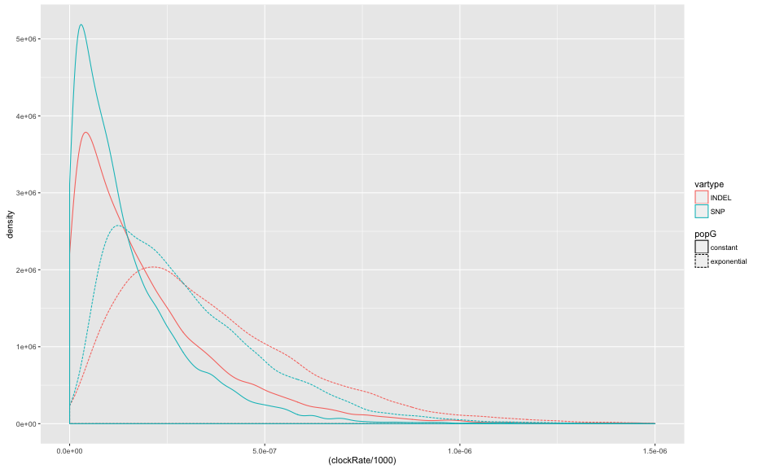
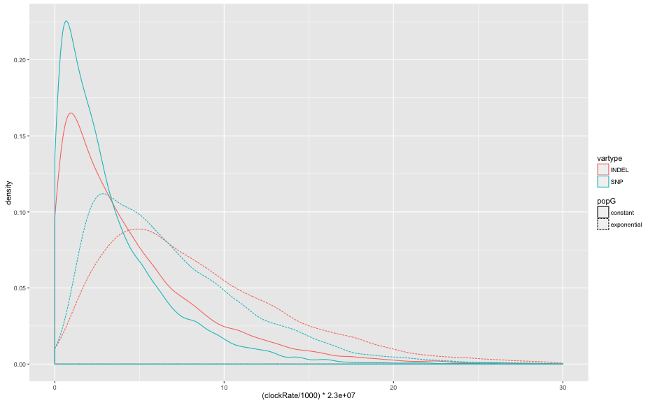
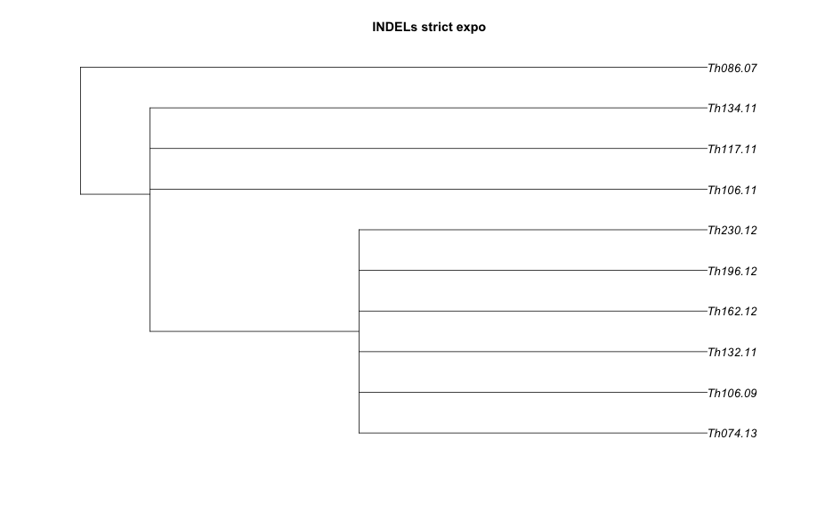
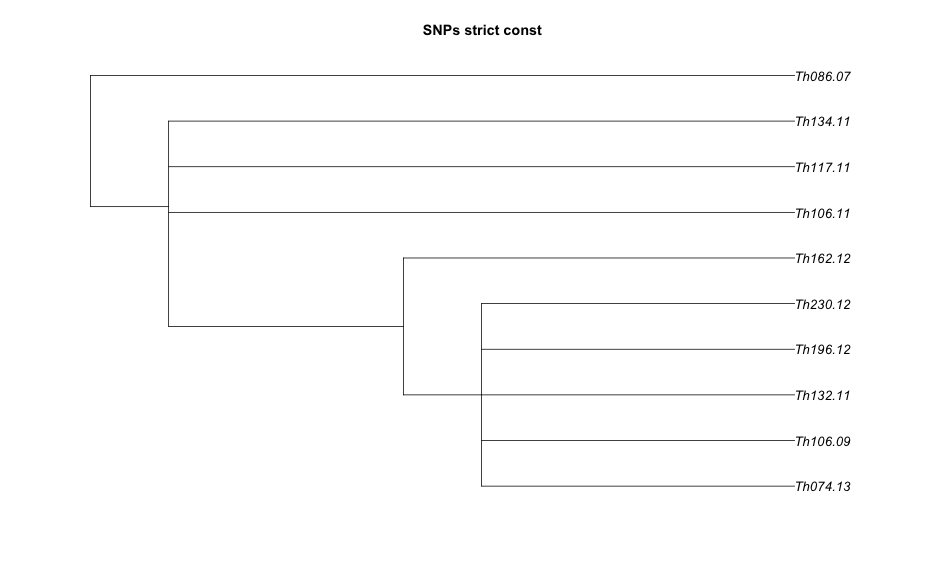
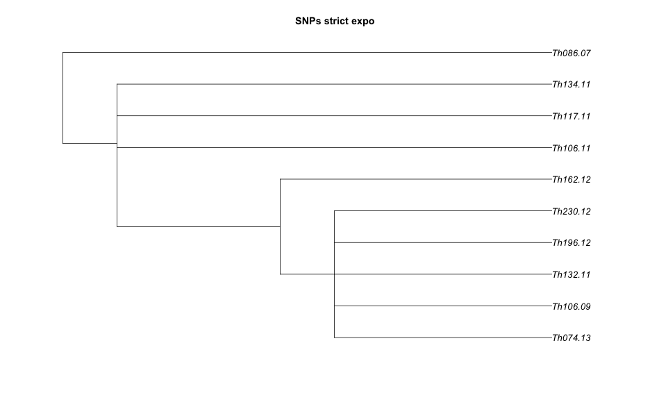

library(knitr)
library(ggplot2)
library(reshape2)
library(ape)

```r
opts_chunk$set(fig.width=13, fig.height=8)
```


```r
indelConst <- read.table("ThiesDiscoINDELs.2.3k.CL1.strict.const.log",header=T)
indelConst$popG="constant"
indelConst$vartype="INDEL"
indelExpo <- read.table("ThiesDiscoINDELs.2.3k.CL1.strict.expo.log",header=T)
indelExpo$popG="exponential"
indelExpo$vartype="INDEL"
snpConst <- read.table("ThiesDiscoSNPs.CL1.2.3k.strict.const.log",header=T)
snpConst$popG="constant"
snpConst$vartype="SNP"
snpExpo <- read.table("ThiesDiscoSNPs.CL1.2.3k.strict.expo.log",header=T)
snpExpo$popG="exponential"
snpExpo$vartype="SNP"

cols <- intersect(colnames(snpExpo),colnames(snpConst))
subrates <- rbind(indelConst[,cols],indelExpo[,cols],snpConst[,cols],snpExpo[,cols])
```


```r
ggplot(subrates,aes(x=(clockRate/1e3),colour=vartype,linetype=popG)) + geom_density() + xlim(0,1.5e-06)
```

```
## Warning: Removed 40 rows containing non-finite values (stat_density).
```



```r
ggplot(subrates,aes(x=(clockRate/1e3)*23e6,colour=vartype,linetype=popG)) + geom_density() + xlim(0,30)
```

```
## Warning: Removed 87 rows containing non-finite values (stat_density).
```




```r
tree <- consensus(read.nexus("ThiesDiscoINDELs.2.3k.CL1.strict.const.trees"),p=0.5)
plot(tree,show.node.label = T,show.tip.label = T,main="INDELs strict const",cex = 1.1) 
```


```r
tree <- consensus(read.nexus("ThiesDiscoINDELs.2.3k.CL1.strict.expo.trees"),p=0.5)
plot(tree,show.node.label = T,show.tip.label = T,main="INDELs strict expo",cex = 1.1) 
```



```r
tree <- consensus(read.nexus("ThiesDiscoSNPs.CL1.2.3k.strict.const.trees"),p=0.5)
plot(tree,show.node.label = T,show.tip.label = T,main="SNPs strict const",cex = 1.1) 
```



```r
tree <- consensus(read.nexus("ThiesDiscoSNPs.CL1.2.3k.strict.expo.trees"),p=0.5)
plot(tree,show.node.label = T,show.tip.label = T,main="SNPs strict expo",cex = 1.1) 
```




