```r
library(ape)
library(adegenet)
library(phangorn)
library(knitr)
library(igraph)
library(RColorBrewer)
library(ggplot2)
library(reshape2)
library(outbreaker)
opts_chunk$set(fig.width=9, fig.height=9)
opts_chunk$set(dev=c('png'))
```


MRCA

```r
cl1 = c("Th196.12", "Th230.12", "Th132.11","Th162.12", "Th074.13", "Th106.09", "Th134.11", "Th117.11", "Th106.11","Th086.07")

ped <- read.table("Thies_all_manual.PASS.Cls.miss0.5.LMRG.HAP.ped",colClasses="character",na.strings = "0")
inds <- ped[,1]
ped <- ped[,seq(7,dim(ped)[[2]],2)]

genos <- apply(ped,2,function(x) {as.numeric(factor(x))})
genos[is.na(genos)] <- 0
rownames(genos)=inds

genosDat <- as.phyDat(genos, type="USER", levels = c(0:max(genos,na.rm=T),drop_null = F))
#genosDat <- as.phyDat(genos, type="USER", levels = c(0:5))

distmatH <- dist.hamming(genosDat)

discotree <- midpoint(nj(distmatH))
#discotree <- midpoint(njs(as.dist(sym(combDists))))

plot(discotree)
nodelabels()
```

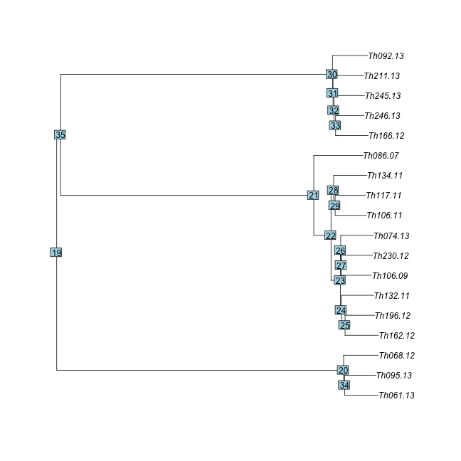

```r
#PARSIMONY ancestral state
ances.par <- ancestral.pars(discotree,genosDat)
#ML ancestral state 
fit = pml(discotree, genosDat)
ances.pml <- ancestral.pml(fit,type = "ml")
cl1mrca <- mrca.phylo(discotree,which(discotree$tip.label %in% cl1))
cl1mrca
```

```
## [1] 21
```

```r
#cl1mrca<-35
MLalleleMat <- ances.pml[[cl1mrca]]
maxLikelihoods <- apply(ances.pml[[cl1mrca]],1,FUN=max)
#MLallele <- matrix(as.numeric(MLallele),nrow = dim(MLallele)[1],dim(MLallele)[2])
MLallele <- rep(0,dim(MLalleleMat)[1])
for (i in c(0:dim(MLalleleMat)[2])) {
  MLallele[MLalleleMat[,i]==maxLikelihoods] <- i
}

genosDat$MRCA <- MLallele
genosM <- as.character(genosDat)
genosM[genosM==0]<-NA
```

discovar NJtree + MRCA

```r
genos <- apply(genosM,2,function(x) {as.numeric(factor(x))})
row.names(genos)<-row.names(genosM)
genosDat <- as.phyDat(genos[c(cl1,"MRCA"),], type="USER", levels = c(0:max(genos,na.rm=T),drop_null = F))
distmatH <- dist.hamming(genosDat)

discotree <- root(nj(distmatH),"MRCA")
```


```r
meta<-read.table("daniels.thies.CA.txt",sep="\t",header=T)
meta <- subset(meta,name %in% cl1)
rownames(meta) <- meta$name
cl1M <- c(as.character(meta$name),"MRCA")

for (MRCAyr in 2000:2008) {
  #MRCAyr <- MRCAyr+1
  cl1Y <- c(meta[as.character(meta$name),'year'],MRCAyr)
  cl1Ypos <- as.Date(paste("1","jan",cl1Y,sep=""),"%d%b%Y")
  names(cl1Ypos)<-cl1M
  
  cl1Mth <- (cl1Y-MRCAyr)*12
  names(cl1Mth)<-cl1M
  
  cl1N <- c(as.character(meta$name),"MRCA")
  
  
  
  # seqTrack(x = distmatM, x.names=cl1M, x.dates=cl1Ypos)
  distmatM <- as.matrix(distmatH)[cl1M,cl1M]
  strk <- seqTrack(distmatM, x.names=cl1M, x.dates=cl1Ypos)
  
  
  #cl1ob <- outbreaker(genosM[cl1M,],dates = cl1Y,w.dens = c(0.9,0.1,0.1,0.1,0.1,0.1),n.iter=1e4,init.tree = "random")
  
  genoSeg <- apply(genosM[cl1M,],2,FUN=function(x) {length(unique(na.omit(x)))>1})
  genoMAC <- apply(genosM[cl1M,],2,FUN=function(x) {min(table(na.omit(x)))})
  genoMAC[!genoSeg]<-0
  genoPars <- genoMAC>1
  
  itree <- strk$ances
  #itree[is.na(itree)]<-0
  sdec12mth <- c(0,seq(1,0.1,length.out = 11))
  expdec12mth <- c(0,1/10^seq(0,12))
  
  cl1ob <- outbreaker(genosM[cl1M,genoSeg],dates = cl1Mth,w.dens=expdec12mth,n.iter=5e4,init.tree = strk$ances)
  
  #transGraph(cl1ob, labels = cl1N,curved.edges = F,annot="support",main=paste("MRCA=",MRCAyr))
  plot(get.tTree(cl1ob),vertex.label=cl1N,main=paste("MRCA=",MRCAyr))
  plotOutbreak(cl1ob,xlim=c(0,(2015-MRCAyr)*12))
}
```

```
## Warning in min(table(na.omit(x))): no non-missing arguments to min;
## returning Inf

## Warning in min(table(na.omit(x))): no non-missing arguments to min;
## returning Inf

## Warning in min(table(na.omit(x))): no non-missing arguments to min;
## returning Inf

## Warning in min(table(na.omit(x))): no non-missing arguments to min;
## returning Inf

## Warning in min(table(na.omit(x))): no non-missing arguments to min;
## returning Inf

## Warning in min(table(na.omit(x))): no non-missing arguments to min;
## returning Inf

## Warning in min(table(na.omit(x))): no non-missing arguments to min;
## returning Inf

## Warning in min(table(na.omit(x))): no non-missing arguments to min;
## returning Inf

## Warning in min(table(na.omit(x))): no non-missing arguments to min;
## returning Inf

## Warning in min(table(na.omit(x))): no non-missing arguments to min;
## returning Inf

## Warning in min(table(na.omit(x))): no non-missing arguments to min;
## returning Inf

## Warning in min(table(na.omit(x))): no non-missing arguments to min;
## returning Inf

## Warning in min(table(na.omit(x))): no non-missing arguments to min;
## returning Inf

## Warning in min(table(na.omit(x))): no non-missing arguments to min;
## returning Inf

## Warning in min(table(na.omit(x))): no non-missing arguments to min;
## returning Inf

## Warning in min(table(na.omit(x))): no non-missing arguments to min;
## returning Inf

## Warning in min(table(na.omit(x))): no non-missing arguments to min;
## returning Inf

## Warning in min(table(na.omit(x))): no non-missing arguments to min;
## returning Inf

## Warning in min(table(na.omit(x))): no non-missing arguments to min;
## returning Inf

## Warning in min(table(na.omit(x))): no non-missing arguments to min;
## returning Inf

## Warning in min(table(na.omit(x))): no non-missing arguments to min;
## returning Inf

## Warning in min(table(na.omit(x))): no non-missing arguments to min;
## returning Inf

## Warning in min(table(na.omit(x))): no non-missing arguments to min;
## returning Inf

## Warning in min(table(na.omit(x))): no non-missing arguments to min;
## returning Inf

## Warning in min(table(na.omit(x))): no non-missing arguments to min;
## returning Inf

## Warning in min(table(na.omit(x))): no non-missing arguments to min;
## returning Inf

## Warning in min(table(na.omit(x))): no non-missing arguments to min;
## returning Inf

## Warning in min(table(na.omit(x))): no non-missing arguments to min;
## returning Inf

## Warning in min(table(na.omit(x))): no non-missing arguments to min;
## returning Inf

## Warning in min(table(na.omit(x))): no non-missing arguments to min;
## returning Inf

## Warning in min(table(na.omit(x))): no non-missing arguments to min;
## returning Inf

## Warning in min(table(na.omit(x))): no non-missing arguments to min;
## returning Inf

## Warning in min(table(na.omit(x))): no non-missing arguments to min;
## returning Inf

## Warning in min(table(na.omit(x))): no non-missing arguments to min;
## returning Inf
```

```
## 
## Average influence: 1068.380433
## 
## Individual influences:
## Vector of 11 doubles: 852.552 688.264 1323.831 995.255 956.881 1345.417 1031.230 875.336 2798.489 884.930 0.000 
## 
## Threshold (x5) for outlier classification: influence > 5341.90216
## 
## Computations finished.
```

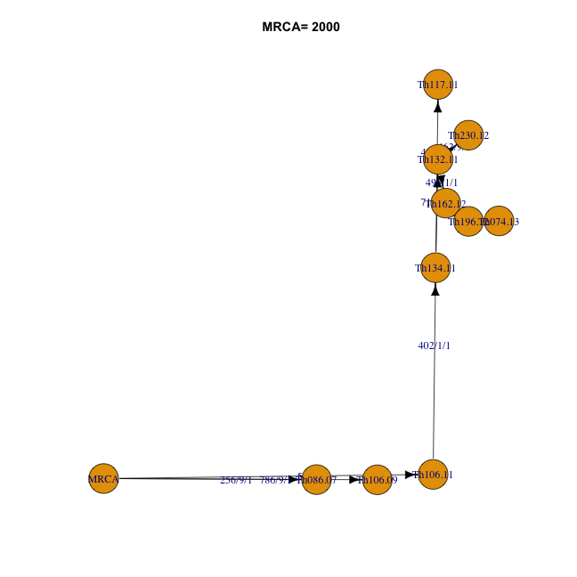

```
## Warning in min(table(na.omit(x))): no non-missing arguments to min;
## returning Inf

## Warning in min(table(na.omit(x))): no non-missing arguments to min;
## returning Inf

## Warning in min(table(na.omit(x))): no non-missing arguments to min;
## returning Inf

## Warning in min(table(na.omit(x))): no non-missing arguments to min;
## returning Inf

## Warning in min(table(na.omit(x))): no non-missing arguments to min;
## returning Inf

## Warning in min(table(na.omit(x))): no non-missing arguments to min;
## returning Inf

## Warning in min(table(na.omit(x))): no non-missing arguments to min;
## returning Inf

## Warning in min(table(na.omit(x))): no non-missing arguments to min;
## returning Inf

## Warning in min(table(na.omit(x))): no non-missing arguments to min;
## returning Inf

## Warning in min(table(na.omit(x))): no non-missing arguments to min;
## returning Inf

## Warning in min(table(na.omit(x))): no non-missing arguments to min;
## returning Inf

## Warning in min(table(na.omit(x))): no non-missing arguments to min;
## returning Inf

## Warning in min(table(na.omit(x))): no non-missing arguments to min;
## returning Inf

## Warning in min(table(na.omit(x))): no non-missing arguments to min;
## returning Inf

## Warning in min(table(na.omit(x))): no non-missing arguments to min;
## returning Inf

## Warning in min(table(na.omit(x))): no non-missing arguments to min;
## returning Inf

## Warning in min(table(na.omit(x))): no non-missing arguments to min;
## returning Inf

## Warning in min(table(na.omit(x))): no non-missing arguments to min;
## returning Inf

## Warning in min(table(na.omit(x))): no non-missing arguments to min;
## returning Inf

## Warning in min(table(na.omit(x))): no non-missing arguments to min;
## returning Inf

## Warning in min(table(na.omit(x))): no non-missing arguments to min;
## returning Inf

## Warning in min(table(na.omit(x))): no non-missing arguments to min;
## returning Inf

## Warning in min(table(na.omit(x))): no non-missing arguments to min;
## returning Inf

## Warning in min(table(na.omit(x))): no non-missing arguments to min;
## returning Inf

## Warning in min(table(na.omit(x))): no non-missing arguments to min;
## returning Inf

## Warning in min(table(na.omit(x))): no non-missing arguments to min;
## returning Inf

## Warning in min(table(na.omit(x))): no non-missing arguments to min;
## returning Inf

## Warning in min(table(na.omit(x))): no non-missing arguments to min;
## returning Inf

## Warning in min(table(na.omit(x))): no non-missing arguments to min;
## returning Inf

## Warning in min(table(na.omit(x))): no non-missing arguments to min;
## returning Inf

## Warning in min(table(na.omit(x))): no non-missing arguments to min;
## returning Inf

## Warning in min(table(na.omit(x))): no non-missing arguments to min;
## returning Inf

## Warning in min(table(na.omit(x))): no non-missing arguments to min;
## returning Inf

## Warning in min(table(na.omit(x))): no non-missing arguments to min;
## returning Inf
```

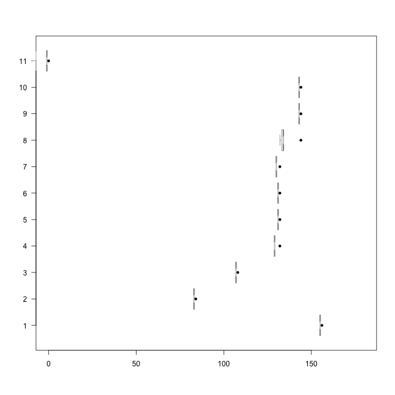

```
## 
## Average influence: 1022.191249
## 
## Individual influences:
## Vector of 11 doubles: 858.191 682.823 1361.255 1010.518 969.556 2319.660 1048.920 882.512 1217.915 892.753 0.000 
## 
## Threshold (x5) for outlier classification: influence > 5110.95625
## 
## Computations finished.
```

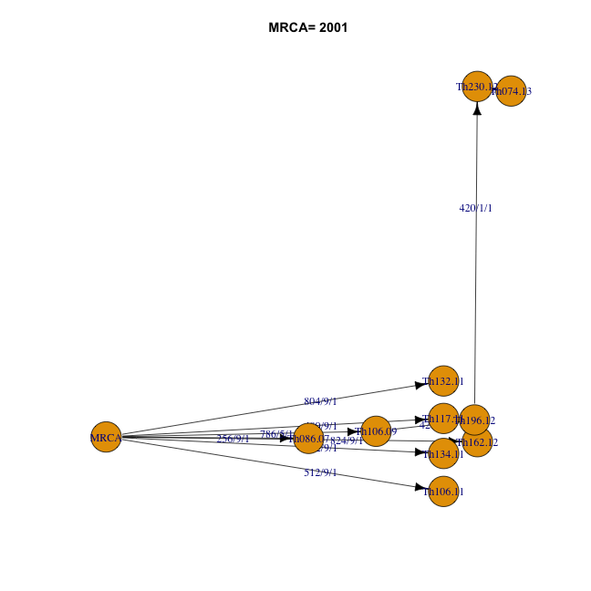

```
## Warning in min(table(na.omit(x))): no non-missing arguments to min;
## returning Inf

## Warning in min(table(na.omit(x))): no non-missing arguments to min;
## returning Inf

## Warning in min(table(na.omit(x))): no non-missing arguments to min;
## returning Inf

## Warning in min(table(na.omit(x))): no non-missing arguments to min;
## returning Inf

## Warning in min(table(na.omit(x))): no non-missing arguments to min;
## returning Inf

## Warning in min(table(na.omit(x))): no non-missing arguments to min;
## returning Inf

## Warning in min(table(na.omit(x))): no non-missing arguments to min;
## returning Inf

## Warning in min(table(na.omit(x))): no non-missing arguments to min;
## returning Inf

## Warning in min(table(na.omit(x))): no non-missing arguments to min;
## returning Inf

## Warning in min(table(na.omit(x))): no non-missing arguments to min;
## returning Inf

## Warning in min(table(na.omit(x))): no non-missing arguments to min;
## returning Inf

## Warning in min(table(na.omit(x))): no non-missing arguments to min;
## returning Inf

## Warning in min(table(na.omit(x))): no non-missing arguments to min;
## returning Inf

## Warning in min(table(na.omit(x))): no non-missing arguments to min;
## returning Inf

## Warning in min(table(na.omit(x))): no non-missing arguments to min;
## returning Inf

## Warning in min(table(na.omit(x))): no non-missing arguments to min;
## returning Inf

## Warning in min(table(na.omit(x))): no non-missing arguments to min;
## returning Inf

## Warning in min(table(na.omit(x))): no non-missing arguments to min;
## returning Inf

## Warning in min(table(na.omit(x))): no non-missing arguments to min;
## returning Inf

## Warning in min(table(na.omit(x))): no non-missing arguments to min;
## returning Inf

## Warning in min(table(na.omit(x))): no non-missing arguments to min;
## returning Inf

## Warning in min(table(na.omit(x))): no non-missing arguments to min;
## returning Inf

## Warning in min(table(na.omit(x))): no non-missing arguments to min;
## returning Inf

## Warning in min(table(na.omit(x))): no non-missing arguments to min;
## returning Inf

## Warning in min(table(na.omit(x))): no non-missing arguments to min;
## returning Inf

## Warning in min(table(na.omit(x))): no non-missing arguments to min;
## returning Inf

## Warning in min(table(na.omit(x))): no non-missing arguments to min;
## returning Inf

## Warning in min(table(na.omit(x))): no non-missing arguments to min;
## returning Inf

## Warning in min(table(na.omit(x))): no non-missing arguments to min;
## returning Inf

## Warning in min(table(na.omit(x))): no non-missing arguments to min;
## returning Inf

## Warning in min(table(na.omit(x))): no non-missing arguments to min;
## returning Inf

## Warning in min(table(na.omit(x))): no non-missing arguments to min;
## returning Inf

## Warning in min(table(na.omit(x))): no non-missing arguments to min;
## returning Inf

## Warning in min(table(na.omit(x))): no non-missing arguments to min;
## returning Inf
```

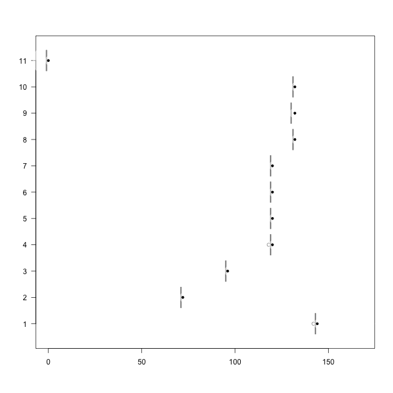

```
## 
## Average influence: 906.772819
## 
## Individual influences:
## Vector of 11 doubles: 1016.941 926.510 1019.575 971.462 965.843 1022.736 976.730 1026.248 1027.301 1021.155 0.000 
## 
## Threshold (x5) for outlier classification: influence > 4533.86409
## 
## Computations finished.
```

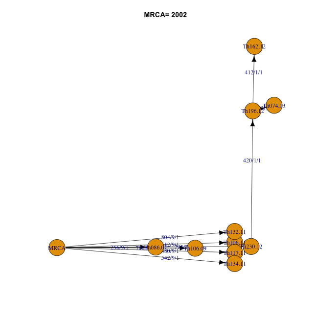

```
## Warning in min(table(na.omit(x))): no non-missing arguments to min;
## returning Inf

## Warning in min(table(na.omit(x))): no non-missing arguments to min;
## returning Inf

## Warning in min(table(na.omit(x))): no non-missing arguments to min;
## returning Inf

## Warning in min(table(na.omit(x))): no non-missing arguments to min;
## returning Inf

## Warning in min(table(na.omit(x))): no non-missing arguments to min;
## returning Inf

## Warning in min(table(na.omit(x))): no non-missing arguments to min;
## returning Inf

## Warning in min(table(na.omit(x))): no non-missing arguments to min;
## returning Inf

## Warning in min(table(na.omit(x))): no non-missing arguments to min;
## returning Inf

## Warning in min(table(na.omit(x))): no non-missing arguments to min;
## returning Inf

## Warning in min(table(na.omit(x))): no non-missing arguments to min;
## returning Inf

## Warning in min(table(na.omit(x))): no non-missing arguments to min;
## returning Inf

## Warning in min(table(na.omit(x))): no non-missing arguments to min;
## returning Inf

## Warning in min(table(na.omit(x))): no non-missing arguments to min;
## returning Inf

## Warning in min(table(na.omit(x))): no non-missing arguments to min;
## returning Inf

## Warning in min(table(na.omit(x))): no non-missing arguments to min;
## returning Inf

## Warning in min(table(na.omit(x))): no non-missing arguments to min;
## returning Inf

## Warning in min(table(na.omit(x))): no non-missing arguments to min;
## returning Inf

## Warning in min(table(na.omit(x))): no non-missing arguments to min;
## returning Inf

## Warning in min(table(na.omit(x))): no non-missing arguments to min;
## returning Inf

## Warning in min(table(na.omit(x))): no non-missing arguments to min;
## returning Inf

## Warning in min(table(na.omit(x))): no non-missing arguments to min;
## returning Inf

## Warning in min(table(na.omit(x))): no non-missing arguments to min;
## returning Inf

## Warning in min(table(na.omit(x))): no non-missing arguments to min;
## returning Inf

## Warning in min(table(na.omit(x))): no non-missing arguments to min;
## returning Inf

## Warning in min(table(na.omit(x))): no non-missing arguments to min;
## returning Inf

## Warning in min(table(na.omit(x))): no non-missing arguments to min;
## returning Inf

## Warning in min(table(na.omit(x))): no non-missing arguments to min;
## returning Inf

## Warning in min(table(na.omit(x))): no non-missing arguments to min;
## returning Inf

## Warning in min(table(na.omit(x))): no non-missing arguments to min;
## returning Inf

## Warning in min(table(na.omit(x))): no non-missing arguments to min;
## returning Inf

## Warning in min(table(na.omit(x))): no non-missing arguments to min;
## returning Inf

## Warning in min(table(na.omit(x))): no non-missing arguments to min;
## returning Inf

## Warning in min(table(na.omit(x))): no non-missing arguments to min;
## returning Inf

## Warning in min(table(na.omit(x))): no non-missing arguments to min;
## returning Inf
```

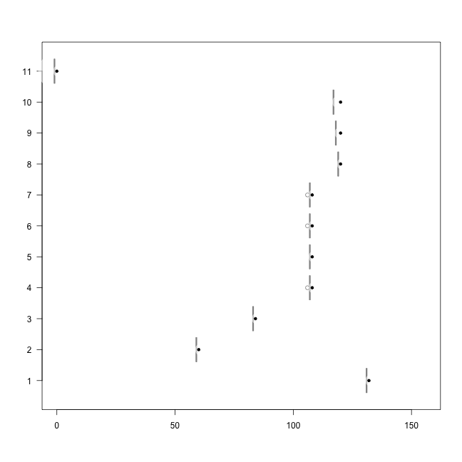

```
## 
## Average influence: 996.243123
## 
## Individual influences:
## Vector of 11 doubles: 1151.297 852.644 1179.498 1010.521 990.786 1224.346 1029.022 1189.389 1163.109 1168.064 0.000 
## 
## Threshold (x5) for outlier classification: influence > 4981.21562
## 
## Computations finished.
```

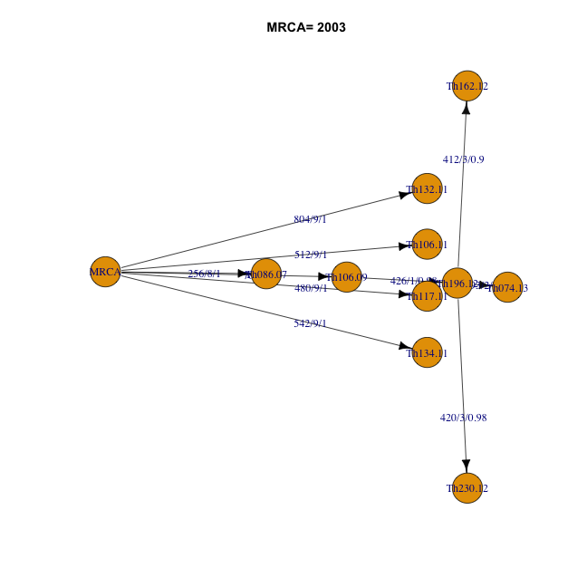

```
## Warning in min(table(na.omit(x))): no non-missing arguments to min;
## returning Inf

## Warning in min(table(na.omit(x))): no non-missing arguments to min;
## returning Inf

## Warning in min(table(na.omit(x))): no non-missing arguments to min;
## returning Inf

## Warning in min(table(na.omit(x))): no non-missing arguments to min;
## returning Inf

## Warning in min(table(na.omit(x))): no non-missing arguments to min;
## returning Inf

## Warning in min(table(na.omit(x))): no non-missing arguments to min;
## returning Inf

## Warning in min(table(na.omit(x))): no non-missing arguments to min;
## returning Inf

## Warning in min(table(na.omit(x))): no non-missing arguments to min;
## returning Inf

## Warning in min(table(na.omit(x))): no non-missing arguments to min;
## returning Inf

## Warning in min(table(na.omit(x))): no non-missing arguments to min;
## returning Inf

## Warning in min(table(na.omit(x))): no non-missing arguments to min;
## returning Inf

## Warning in min(table(na.omit(x))): no non-missing arguments to min;
## returning Inf

## Warning in min(table(na.omit(x))): no non-missing arguments to min;
## returning Inf

## Warning in min(table(na.omit(x))): no non-missing arguments to min;
## returning Inf

## Warning in min(table(na.omit(x))): no non-missing arguments to min;
## returning Inf

## Warning in min(table(na.omit(x))): no non-missing arguments to min;
## returning Inf

## Warning in min(table(na.omit(x))): no non-missing arguments to min;
## returning Inf

## Warning in min(table(na.omit(x))): no non-missing arguments to min;
## returning Inf

## Warning in min(table(na.omit(x))): no non-missing arguments to min;
## returning Inf

## Warning in min(table(na.omit(x))): no non-missing arguments to min;
## returning Inf

## Warning in min(table(na.omit(x))): no non-missing arguments to min;
## returning Inf

## Warning in min(table(na.omit(x))): no non-missing arguments to min;
## returning Inf

## Warning in min(table(na.omit(x))): no non-missing arguments to min;
## returning Inf

## Warning in min(table(na.omit(x))): no non-missing arguments to min;
## returning Inf

## Warning in min(table(na.omit(x))): no non-missing arguments to min;
## returning Inf

## Warning in min(table(na.omit(x))): no non-missing arguments to min;
## returning Inf

## Warning in min(table(na.omit(x))): no non-missing arguments to min;
## returning Inf

## Warning in min(table(na.omit(x))): no non-missing arguments to min;
## returning Inf

## Warning in min(table(na.omit(x))): no non-missing arguments to min;
## returning Inf

## Warning in min(table(na.omit(x))): no non-missing arguments to min;
## returning Inf

## Warning in min(table(na.omit(x))): no non-missing arguments to min;
## returning Inf

## Warning in min(table(na.omit(x))): no non-missing arguments to min;
## returning Inf

## Warning in min(table(na.omit(x))): no non-missing arguments to min;
## returning Inf

## Warning in min(table(na.omit(x))): no non-missing arguments to min;
## returning Inf
```

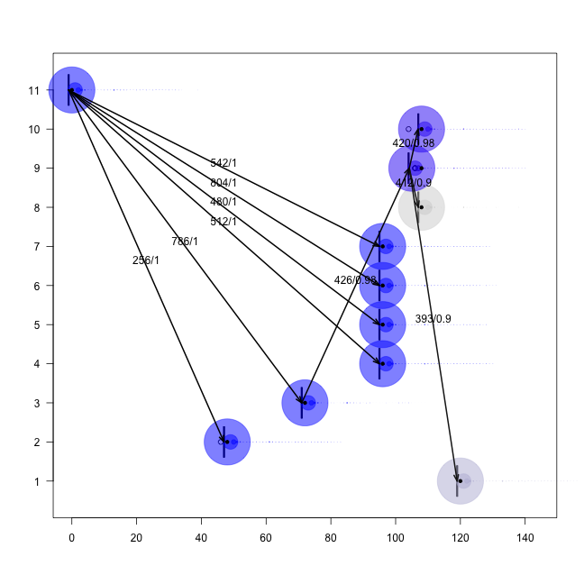

```
## 
## Average influence: 1160.751000
## 
## Individual influences:
## Vector of 11 doubles: 1393.879 676.597 1536.711 1092.048 1040.117 1473.152 1140.734 1539.428 1456.347 1419.248 0.000 
## 
## Threshold (x5) for outlier classification: influence > 5803.75500
## 
## Computations finished.
```

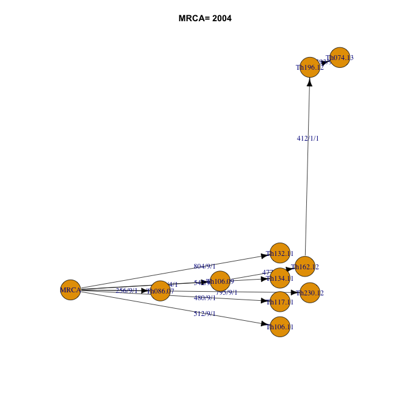

```
## Warning in min(table(na.omit(x))): no non-missing arguments to min;
## returning Inf

## Warning in min(table(na.omit(x))): no non-missing arguments to min;
## returning Inf

## Warning in min(table(na.omit(x))): no non-missing arguments to min;
## returning Inf

## Warning in min(table(na.omit(x))): no non-missing arguments to min;
## returning Inf

## Warning in min(table(na.omit(x))): no non-missing arguments to min;
## returning Inf

## Warning in min(table(na.omit(x))): no non-missing arguments to min;
## returning Inf

## Warning in min(table(na.omit(x))): no non-missing arguments to min;
## returning Inf

## Warning in min(table(na.omit(x))): no non-missing arguments to min;
## returning Inf

## Warning in min(table(na.omit(x))): no non-missing arguments to min;
## returning Inf

## Warning in min(table(na.omit(x))): no non-missing arguments to min;
## returning Inf

## Warning in min(table(na.omit(x))): no non-missing arguments to min;
## returning Inf

## Warning in min(table(na.omit(x))): no non-missing arguments to min;
## returning Inf

## Warning in min(table(na.omit(x))): no non-missing arguments to min;
## returning Inf

## Warning in min(table(na.omit(x))): no non-missing arguments to min;
## returning Inf

## Warning in min(table(na.omit(x))): no non-missing arguments to min;
## returning Inf

## Warning in min(table(na.omit(x))): no non-missing arguments to min;
## returning Inf

## Warning in min(table(na.omit(x))): no non-missing arguments to min;
## returning Inf

## Warning in min(table(na.omit(x))): no non-missing arguments to min;
## returning Inf

## Warning in min(table(na.omit(x))): no non-missing arguments to min;
## returning Inf

## Warning in min(table(na.omit(x))): no non-missing arguments to min;
## returning Inf

## Warning in min(table(na.omit(x))): no non-missing arguments to min;
## returning Inf

## Warning in min(table(na.omit(x))): no non-missing arguments to min;
## returning Inf

## Warning in min(table(na.omit(x))): no non-missing arguments to min;
## returning Inf

## Warning in min(table(na.omit(x))): no non-missing arguments to min;
## returning Inf

## Warning in min(table(na.omit(x))): no non-missing arguments to min;
## returning Inf

## Warning in min(table(na.omit(x))): no non-missing arguments to min;
## returning Inf

## Warning in min(table(na.omit(x))): no non-missing arguments to min;
## returning Inf

## Warning in min(table(na.omit(x))): no non-missing arguments to min;
## returning Inf

## Warning in min(table(na.omit(x))): no non-missing arguments to min;
## returning Inf

## Warning in min(table(na.omit(x))): no non-missing arguments to min;
## returning Inf

## Warning in min(table(na.omit(x))): no non-missing arguments to min;
## returning Inf

## Warning in min(table(na.omit(x))): no non-missing arguments to min;
## returning Inf

## Warning in min(table(na.omit(x))): no non-missing arguments to min;
## returning Inf

## Warning in min(table(na.omit(x))): no non-missing arguments to min;
## returning Inf
```

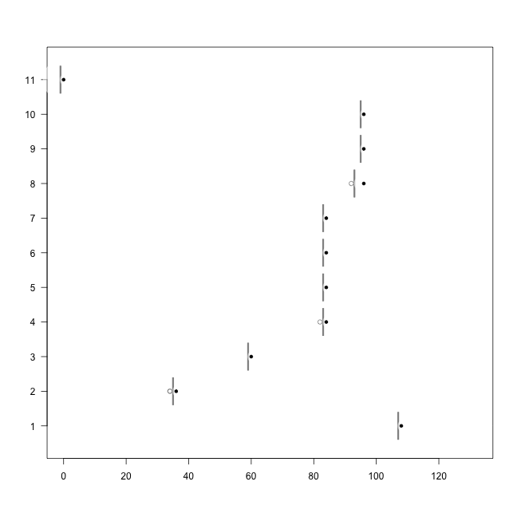

```
## 
## Average influence: 1165.862403
## 
## Individual influences:
## Vector of 11 doubles: 1401.230 676.503 1548.201 1097.550 1044.919 1465.374 1146.891 1550.899 1467.018 1425.900 0.000 
## 
## Threshold (x5) for outlier classification: influence > 5829.31202
## 
## Computations finished.
```

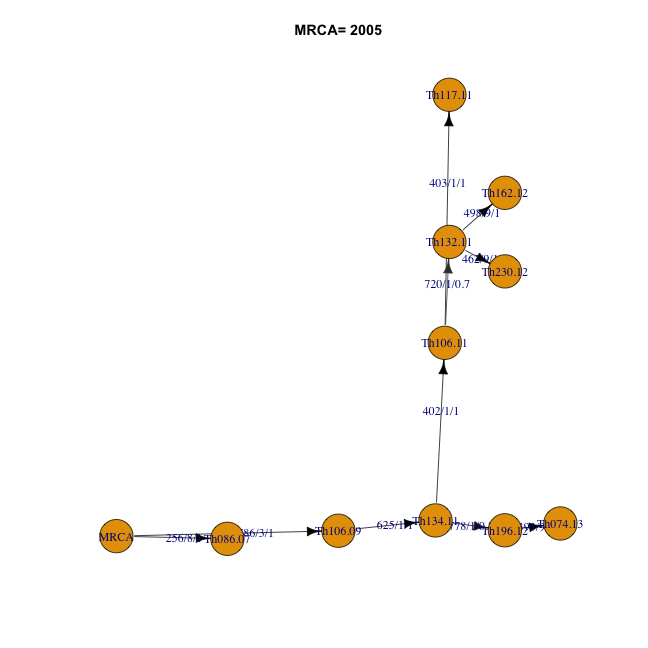

```
## Warning in min(table(na.omit(x))): no non-missing arguments to min;
## returning Inf

## Warning in min(table(na.omit(x))): no non-missing arguments to min;
## returning Inf

## Warning in min(table(na.omit(x))): no non-missing arguments to min;
## returning Inf

## Warning in min(table(na.omit(x))): no non-missing arguments to min;
## returning Inf

## Warning in min(table(na.omit(x))): no non-missing arguments to min;
## returning Inf

## Warning in min(table(na.omit(x))): no non-missing arguments to min;
## returning Inf

## Warning in min(table(na.omit(x))): no non-missing arguments to min;
## returning Inf

## Warning in min(table(na.omit(x))): no non-missing arguments to min;
## returning Inf

## Warning in min(table(na.omit(x))): no non-missing arguments to min;
## returning Inf

## Warning in min(table(na.omit(x))): no non-missing arguments to min;
## returning Inf

## Warning in min(table(na.omit(x))): no non-missing arguments to min;
## returning Inf

## Warning in min(table(na.omit(x))): no non-missing arguments to min;
## returning Inf

## Warning in min(table(na.omit(x))): no non-missing arguments to min;
## returning Inf

## Warning in min(table(na.omit(x))): no non-missing arguments to min;
## returning Inf

## Warning in min(table(na.omit(x))): no non-missing arguments to min;
## returning Inf

## Warning in min(table(na.omit(x))): no non-missing arguments to min;
## returning Inf

## Warning in min(table(na.omit(x))): no non-missing arguments to min;
## returning Inf

## Warning in min(table(na.omit(x))): no non-missing arguments to min;
## returning Inf

## Warning in min(table(na.omit(x))): no non-missing arguments to min;
## returning Inf

## Warning in min(table(na.omit(x))): no non-missing arguments to min;
## returning Inf

## Warning in min(table(na.omit(x))): no non-missing arguments to min;
## returning Inf

## Warning in min(table(na.omit(x))): no non-missing arguments to min;
## returning Inf

## Warning in min(table(na.omit(x))): no non-missing arguments to min;
## returning Inf

## Warning in min(table(na.omit(x))): no non-missing arguments to min;
## returning Inf

## Warning in min(table(na.omit(x))): no non-missing arguments to min;
## returning Inf

## Warning in min(table(na.omit(x))): no non-missing arguments to min;
## returning Inf

## Warning in min(table(na.omit(x))): no non-missing arguments to min;
## returning Inf

## Warning in min(table(na.omit(x))): no non-missing arguments to min;
## returning Inf

## Warning in min(table(na.omit(x))): no non-missing arguments to min;
## returning Inf

## Warning in min(table(na.omit(x))): no non-missing arguments to min;
## returning Inf

## Warning in min(table(na.omit(x))): no non-missing arguments to min;
## returning Inf

## Warning in min(table(na.omit(x))): no non-missing arguments to min;
## returning Inf

## Warning in min(table(na.omit(x))): no non-missing arguments to min;
## returning Inf

## Warning in min(table(na.omit(x))): no non-missing arguments to min;
## returning Inf
```

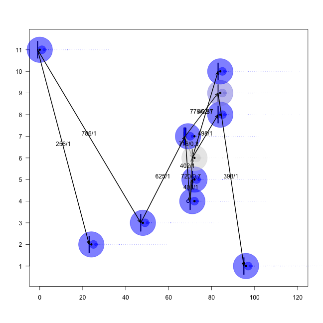

```
## 
## Average influence: 906.774605
## 
## Individual influences:
## Vector of 11 doubles: 1017.056 926.102 1019.705 971.314 965.662 1022.884 976.612 1026.416 1027.476 1021.294 0.000 
## 
## Threshold (x5) for outlier classification: influence > 4533.87303
## 
## Computations finished.
```

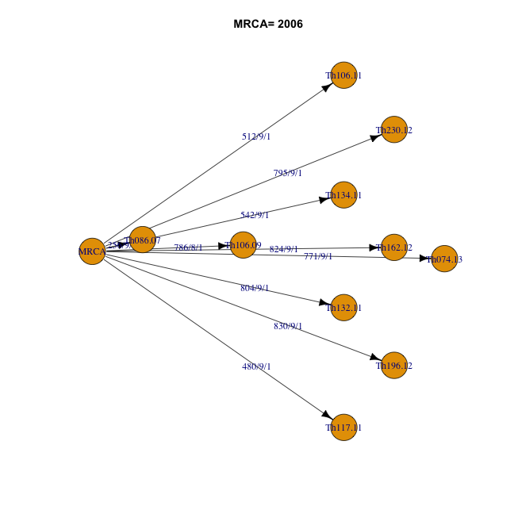

```
## Warning in min(table(na.omit(x))): no non-missing arguments to min;
## returning Inf

## Warning in min(table(na.omit(x))): no non-missing arguments to min;
## returning Inf

## Warning in min(table(na.omit(x))): no non-missing arguments to min;
## returning Inf

## Warning in min(table(na.omit(x))): no non-missing arguments to min;
## returning Inf

## Warning in min(table(na.omit(x))): no non-missing arguments to min;
## returning Inf

## Warning in min(table(na.omit(x))): no non-missing arguments to min;
## returning Inf

## Warning in min(table(na.omit(x))): no non-missing arguments to min;
## returning Inf

## Warning in min(table(na.omit(x))): no non-missing arguments to min;
## returning Inf

## Warning in min(table(na.omit(x))): no non-missing arguments to min;
## returning Inf

## Warning in min(table(na.omit(x))): no non-missing arguments to min;
## returning Inf

## Warning in min(table(na.omit(x))): no non-missing arguments to min;
## returning Inf

## Warning in min(table(na.omit(x))): no non-missing arguments to min;
## returning Inf

## Warning in min(table(na.omit(x))): no non-missing arguments to min;
## returning Inf

## Warning in min(table(na.omit(x))): no non-missing arguments to min;
## returning Inf

## Warning in min(table(na.omit(x))): no non-missing arguments to min;
## returning Inf

## Warning in min(table(na.omit(x))): no non-missing arguments to min;
## returning Inf

## Warning in min(table(na.omit(x))): no non-missing arguments to min;
## returning Inf

## Warning in min(table(na.omit(x))): no non-missing arguments to min;
## returning Inf

## Warning in min(table(na.omit(x))): no non-missing arguments to min;
## returning Inf

## Warning in min(table(na.omit(x))): no non-missing arguments to min;
## returning Inf

## Warning in min(table(na.omit(x))): no non-missing arguments to min;
## returning Inf

## Warning in min(table(na.omit(x))): no non-missing arguments to min;
## returning Inf

## Warning in min(table(na.omit(x))): no non-missing arguments to min;
## returning Inf

## Warning in min(table(na.omit(x))): no non-missing arguments to min;
## returning Inf

## Warning in min(table(na.omit(x))): no non-missing arguments to min;
## returning Inf

## Warning in min(table(na.omit(x))): no non-missing arguments to min;
## returning Inf

## Warning in min(table(na.omit(x))): no non-missing arguments to min;
## returning Inf

## Warning in min(table(na.omit(x))): no non-missing arguments to min;
## returning Inf

## Warning in min(table(na.omit(x))): no non-missing arguments to min;
## returning Inf

## Warning in min(table(na.omit(x))): no non-missing arguments to min;
## returning Inf

## Warning in min(table(na.omit(x))): no non-missing arguments to min;
## returning Inf

## Warning in min(table(na.omit(x))): no non-missing arguments to min;
## returning Inf

## Warning in min(table(na.omit(x))): no non-missing arguments to min;
## returning Inf

## Warning in min(table(na.omit(x))): no non-missing arguments to min;
## returning Inf
```

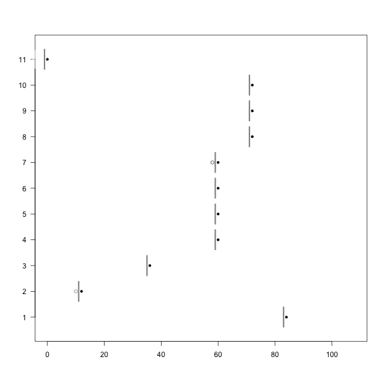

```
## 
## Average influence: 967.892373
## 
## Individual influences:
## Vector of 11 doubles: 1206.210 0.000 1357.049 1008.683 967.998 1255.795 1046.826 1321.908 1257.066 1225.281 0.000 
## 
## Threshold (x5) for outlier classification: influence > 4839.46187
## 
## Computations finished.
```

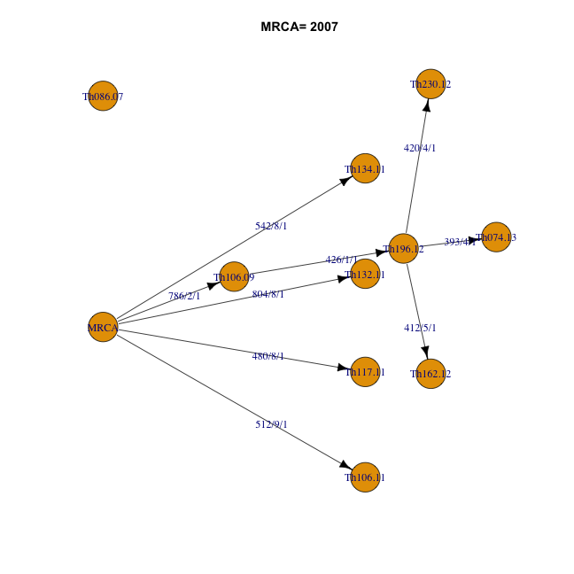

```
## Warning in min(table(na.omit(x))): no non-missing arguments to min;
## returning Inf

## Warning in min(table(na.omit(x))): no non-missing arguments to min;
## returning Inf

## Warning in min(table(na.omit(x))): no non-missing arguments to min;
## returning Inf

## Warning in min(table(na.omit(x))): no non-missing arguments to min;
## returning Inf

## Warning in min(table(na.omit(x))): no non-missing arguments to min;
## returning Inf

## Warning in min(table(na.omit(x))): no non-missing arguments to min;
## returning Inf

## Warning in min(table(na.omit(x))): no non-missing arguments to min;
## returning Inf

## Warning in min(table(na.omit(x))): no non-missing arguments to min;
## returning Inf

## Warning in min(table(na.omit(x))): no non-missing arguments to min;
## returning Inf

## Warning in min(table(na.omit(x))): no non-missing arguments to min;
## returning Inf

## Warning in min(table(na.omit(x))): no non-missing arguments to min;
## returning Inf

## Warning in min(table(na.omit(x))): no non-missing arguments to min;
## returning Inf

## Warning in min(table(na.omit(x))): no non-missing arguments to min;
## returning Inf

## Warning in min(table(na.omit(x))): no non-missing arguments to min;
## returning Inf

## Warning in min(table(na.omit(x))): no non-missing arguments to min;
## returning Inf

## Warning in min(table(na.omit(x))): no non-missing arguments to min;
## returning Inf

## Warning in min(table(na.omit(x))): no non-missing arguments to min;
## returning Inf

## Warning in min(table(na.omit(x))): no non-missing arguments to min;
## returning Inf

## Warning in min(table(na.omit(x))): no non-missing arguments to min;
## returning Inf

## Warning in min(table(na.omit(x))): no non-missing arguments to min;
## returning Inf

## Warning in min(table(na.omit(x))): no non-missing arguments to min;
## returning Inf

## Warning in min(table(na.omit(x))): no non-missing arguments to min;
## returning Inf

## Warning in min(table(na.omit(x))): no non-missing arguments to min;
## returning Inf

## Warning in min(table(na.omit(x))): no non-missing arguments to min;
## returning Inf

## Warning in min(table(na.omit(x))): no non-missing arguments to min;
## returning Inf

## Warning in min(table(na.omit(x))): no non-missing arguments to min;
## returning Inf

## Warning in min(table(na.omit(x))): no non-missing arguments to min;
## returning Inf

## Warning in min(table(na.omit(x))): no non-missing arguments to min;
## returning Inf

## Warning in min(table(na.omit(x))): no non-missing arguments to min;
## returning Inf

## Warning in min(table(na.omit(x))): no non-missing arguments to min;
## returning Inf

## Warning in min(table(na.omit(x))): no non-missing arguments to min;
## returning Inf

## Warning in min(table(na.omit(x))): no non-missing arguments to min;
## returning Inf

## Warning in min(table(na.omit(x))): no non-missing arguments to min;
## returning Inf

## Warning in min(table(na.omit(x))): no non-missing arguments to min;
## returning Inf
```

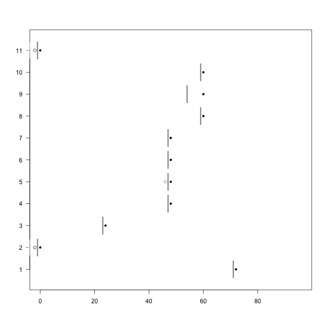

```
## 
## Average influence: 1495.028390
## 
## Individual influences:
## Vector of 11 doubles: 1373.815 0.000 2517.480 1855.846 1778.574 1645.764 1928.287 1574.237 1441.427 1587.811 742.071 
## 
## Threshold (x5) for outlier classification: influence > 7475.14195
## 
## Computations finished.
```

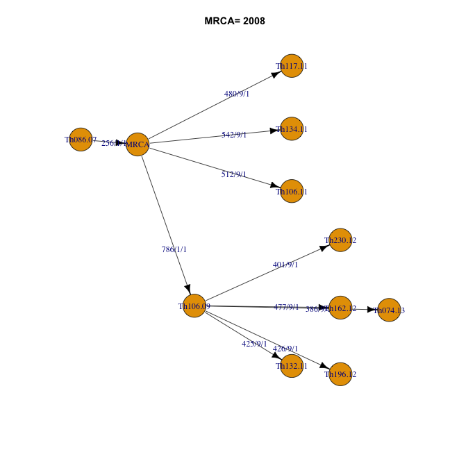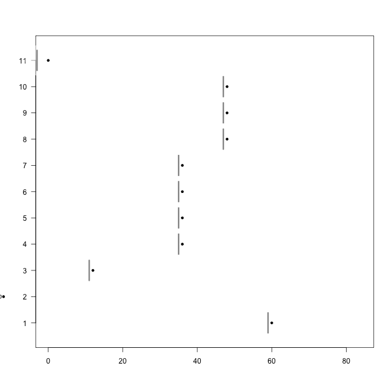

```r
#plotChains(cl1ob )
# 
# 
# 
# barplot(cl1ob$w)
# 
# data(fakeOutbreak)
# fakeOutbreak$collecDates
```

