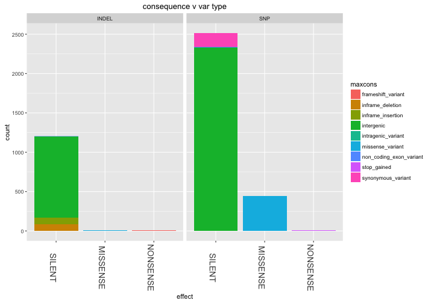
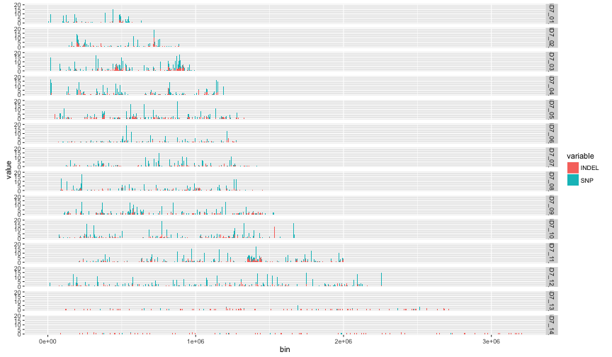

library(ggplot2)
library(knitr)
library(reshape2)
library(hexbin)

```r
opts_chunk$set(fig.width=12, fig.height=7)

# matchlevels <- c("",     "NUCMER","DISCO","HAPLO","NUCMER,DISCO","NUCMER,HAPLO","DISCO,HAPLO","NUCMER,DISCO,HAPLO")
# colours <-     c("black","green", "red",  "blue", "yellow",      "cyan",        "magenta",     "white")
# names(colours) <- matchlevels
```


```r
#vartypes <- read.table("pfx_v_3D7DD2fullrun_miss0callable.PASS.DD2CONC.R3.varClass.txt",stringsAsFactors = F,sep='\t',header=T)
vartypes <- read.table("Thies_all_manual.PASS.Cls.miss0.5.LMRG.HAP.DISCORDS.VARCLASS.varClass.txt",stringsAsFactors = F,sep='\t',header=T)
#3D7 only:
# vartypes$refsAbsent = vartypes$FDKRefAbsent
# vartypes$anyDiscord = vartypes$X2D4Discord | vartypes$FDKDiscord | vartypes$FDK2D4Incons
# vartypes$anyDiscord <- as.numeric(vartypes$anyDiscord)
vartypes$abslen = abs(vartypes$varlen)

vartypes$STR = 0
vartypes$STR[vartypes$STRtype != ""] <- 1

vartypes$coding[vartypes$coding=="intergenic"] <- 0
vartypes$coding[vartypes$coding=="coding"] <- 1
#head(vartypes$coding,50)
vartypes$coding <- as.numeric(vartypes$coding)
#head(vartypes$coding,50)


#set max call length to read length (only one above this)
#vartypes <- subset(vartypes,abslen < 500)
vartypes$maxcons = vartypes$consequence
vartypes$maxcons[vartypes$consequence==""] <- "intergenic"
vartypes$maxcons <- unlist(lapply(vartypes$maxcons,FUN=function(x) {unlist(strsplit(x,split ='&'))[[1]]}))

vartypes$effect="NONE"
vartypes$effect[vartypes$maxcons %in% c("inframe_insertion","inframe_deletion","synonymous_variant","intergenic","intragenic_variant","non_coding_exon_variant")] <- "SILENT"
vartypes$effect[vartypes$maxcons %in% c("missense_variant","disruptive_inframe_insertion","disruptive_inframe_deletion","splice_region_variant")] <- "MISSENSE"
vartypes$effect[vartypes$maxcons %in% c("frameshift_variant","stop_lost","start_lost","stop_gained","exon_loss_variant")] <- "NONSENSE"
vartypes$effect <- factor(vartypes$effect,levels =c("SILENT","MISSENSE","NONSENSE"))
                           

indels <- subset(vartypes,vartype=="INDEL")
snps <- subset(vartypes,vartype=="SNP")
```


```r
# #subset(vartypes,anyDiscord)
# #summary(indels[,c("STR","DUST","coding","anyDiscord","effect")])
# colMeans(indels[,c("STR","DUST","coding","anyDiscord")])
# #no appreciable drop in discordance with STRs
# colMeans(subset(indels,STR==1)[,c("STR","DUST","coding","anyDiscord")])
# colMeans(subset(indels,STRtype=="STR")[,c("STR","DUST","coding","anyDiscord")])
# colMeans(subset(indels,STRtype=="polyA")[,c("STR","DUST","coding","anyDiscord")])
# colMeans(subset(indels,STRtype=="TArich")[,c("STR","DUST","coding","anyDiscord")])
# #large increase in discordance with TA-repeats
# colMeans(subset(indels,STRtype=="TArep")[,c("STR","DUST","coding","anyDiscord")])
# 
# colMeans(subset(snps,STR==1)[,c("STR","DUST","coding","anyDiscord")])
# colMeans(subset(snps,STRtype=="STR")[,c("STR","DUST","coding","anyDiscord")])
# colMeans(subset(snps,STRtype=="polyA")[,c("STR","DUST","coding","anyDiscord")])
# colMeans(subset(snps,STRtype=="TArich")[,c("STR","DUST","coding","anyDiscord")])
# colMeans(subset(snps,STRtype=="TArep")[,c("STR","DUST","coding","anyDiscord")])
```

#INDEL SIZE DISTRIBUTION

```r
table(vartypes[,c("vartype","STR")])
```

```
##        STR
## vartype    0    1
##   INDEL  753  472
##   SNP   1777 1193
```

```r
table(vartypes[,c("vartype","STRtype")])
```

```
##        STRtype
## vartype      polyA  STR TArep TArich
##   INDEL  753    35  432     2      3
##   SNP   1777    87 1093     4      9
```

```r
#RELATIVELY SMALL NUMBER OF CODING SNPs ARE polyA REPEATS (possible difficulties in calling really long TA repeats?)
table(indels[,c("maxcons","STR")])
```

```
##                               STR
## maxcons                          0   1
##   disruptive_inframe_deletion   30  29
##   disruptive_inframe_insertion  22  16
##   frameshift_variant             9   3
##   inframe_deletion              13  15
##   inframe_insertion             31  16
##   intergenic                   639 386
##   missense_variant               5   7
##   non_coding_exon_variant        4   0
```

```r
table(snps[,c("maxcons","STR")])
```

```
##                          STR
## maxcons                      0    1
##   intergenic              1389  942
##   intragenic_variant         0    1
##   missense_variant         258  187
##   non_coding_exon_variant   10    0
##   stop_gained                6    6
##   synonymous_variant       114   57
```

```r
#RELATIVELY SMALL NUMBER OF CODING SNPs ARE polyA REPEATS (possible difficulties in calling really long TA repeats?)
table(vartypes[,c("maxcons","vartype")])
```

```
##                               vartype
## maxcons                        INDEL  SNP
##   disruptive_inframe_deletion     59    0
##   disruptive_inframe_insertion    38    0
##   frameshift_variant              12    0
##   inframe_deletion                28    0
##   inframe_insertion               47    0
##   intergenic                    1025 2331
##   intragenic_variant               0    1
##   missense_variant                12  445
##   non_coding_exon_variant          4   10
##   stop_gained                      0   12
##   synonymous_variant               0  171
```

```r
table(vartypes[,c("coding","vartype")])
```

```
##       vartype
## coding INDEL  SNP
##      0  1025 2331
##      1   200  639
```

```r
#MODE INDELS V SHORT
sum(indels$varlen <= 1) / dim(indels)[[1]]
```

```
## [1] 0.4897959
```

```r
sum(indels$varlen <= 5) / dim(indels)[[1]]
```

```
## [1] 0.6383673
```


```r
#most indels intergenic or neutral
ggplot(vartypes,aes(x=effect,fill=maxcons,group=maxcons)) + 
  ggtitle(paste("consequence v var type")) +
  geom_bar() + facet_grid(. ~ vartype, scale="free_y") + 
  theme(axis.text.x=element_text(angle=-90,size=14))
```



make blocks

```r
b<-5000

  Pmax <- ceiling(max(vartypes$pos)/b)*b
  bins <- seq(0,Pmax,by = b)
  labs <- seq(b,Pmax,by = b)
  
  vartypes$posbin <- cut(vartypes$pos,breaks=bins,labels=labs,include.lowest = T)
  vartypes$bin <- paste(vartypes$chr,vartypes$posbin)

snpCounts <- aggregate(vartypes$vartype,by=list(vartypes$bin),FUN=table)
snpCounts <- cbind(t(as.data.frame(strsplit(snpCounts$Group.1,split = "\ "))),as.data.frame(snpCounts$x))
colnames(snpCounts)[1:2] <- c("chr","bin")
snpCounts$bin <- as.numeric(as.character(snpCounts$bin))
snpCountsM <- melt(snpCounts,id.vars = c("chr","bin"))
ggplot(snpCountsM,aes(x=bin,y=value,fill=variable)) + geom_bar(stat="identity") + facet_grid(chr ~ .) + ylim(0,20)
```

```
## Warning: Removed 6 rows containing missing values (position_stack).
```



