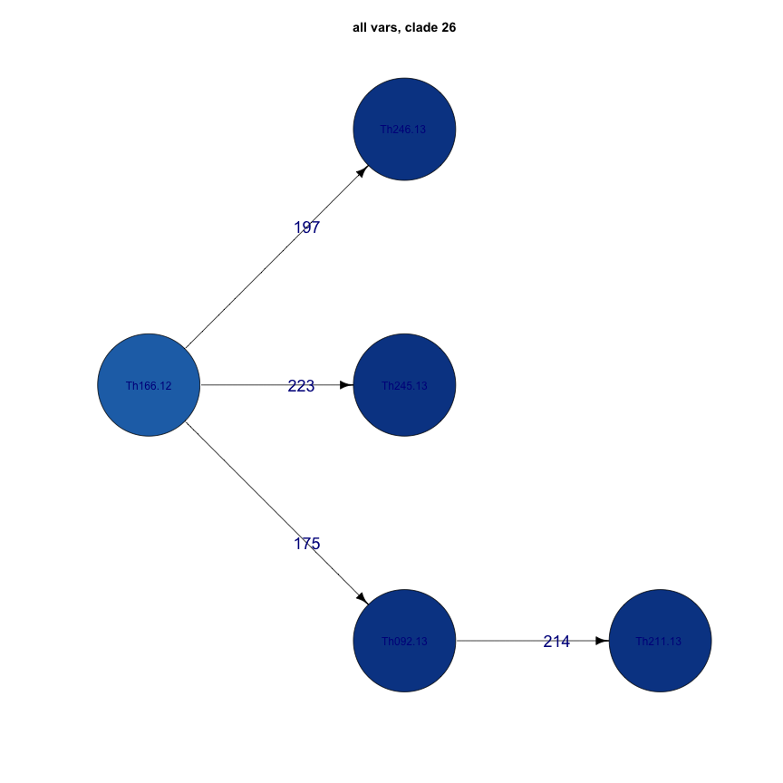
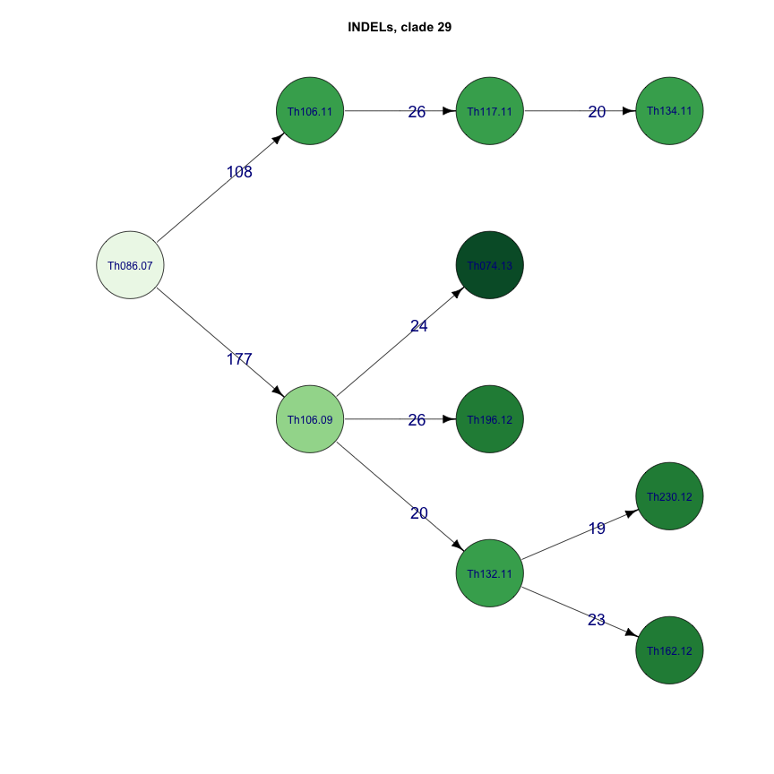
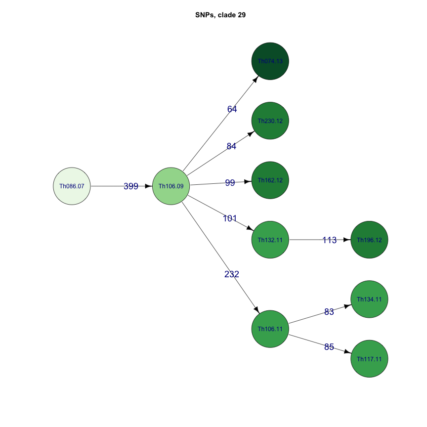
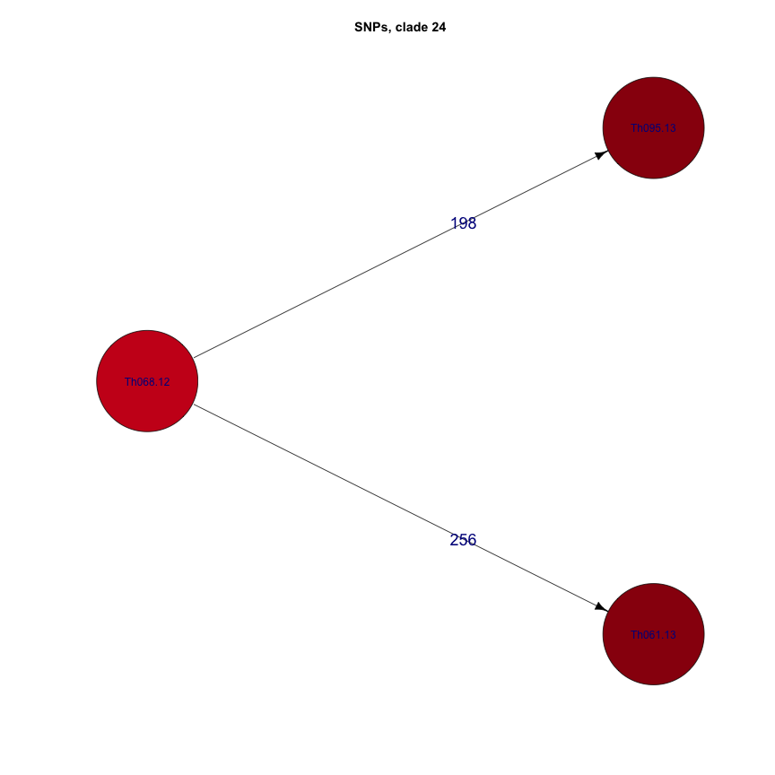
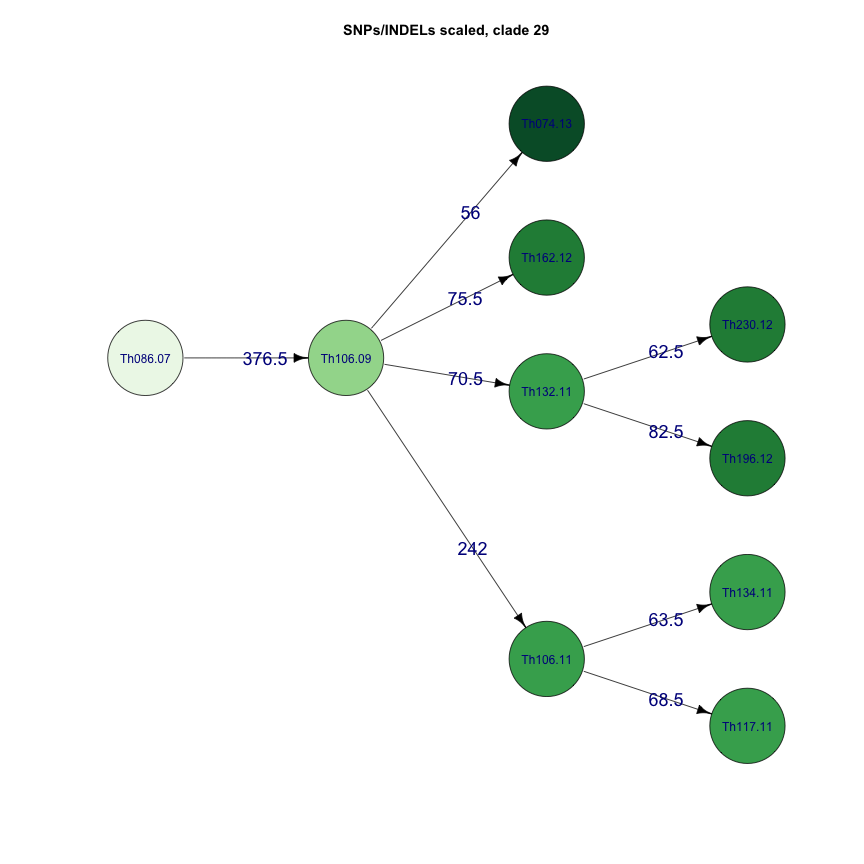
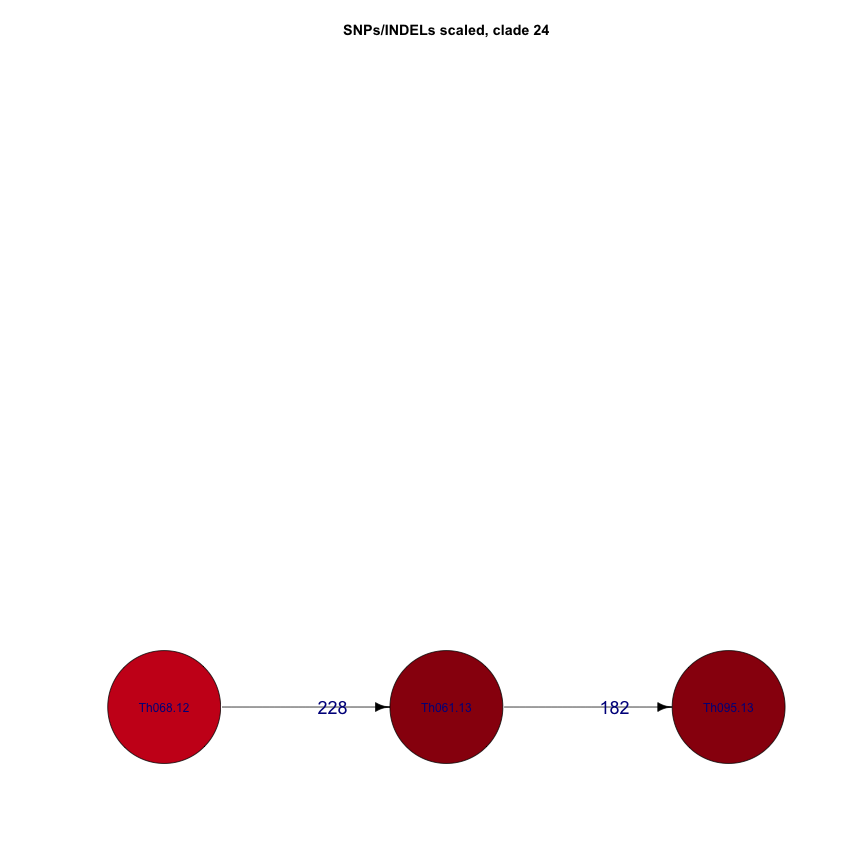

#seqtrack tutorial  

```r
library(ape)
library(adegenet)
library(knitr)
library(igraph)
library(RColorBrewer)
opts_chunk$set(fig.width=9, fig.height=9)
opts_chunk$set(dev=c('png'))


sym <- function(M) {
  M[lower.tri(M)] = t(M)[lower.tri(M)]
  M
}
```


```r
#meta <- read.table("daniels.thies.CA.txt",sep="\t",header=T)
meta <- read.table("Thies_metadata_1701.txt",sep="\t",header=T)
colnames(meta)[1]<-"name"
meta <- meta[!is.na(meta$Age),]

rownames(meta) <- meta$name
meta <- meta[names,]
coll <- as.Date(as.character(meta$Date),"%d/%m/%Y",origin = "2000-01-01")
#coll <- as.Date(paste("1","jan",meta$year,sep=""),"%d%b%Y")
names(coll)<-meta$name
meta$year <- as.numeric(format(coll,'%Y'))+2000

as.integer(difftime(coll, min(coll), unit="years"))
```

```
## Error in match.arg(units): 'arg' should be one of "auto", "secs", "mins", "hours", "days", "weeks"
```

```r
name1 <- as.character(meta$name[meta$Haplotype.Number==29])
name2 <- as.character(meta$name[meta$Haplotype.Number==26])
name3 <- as.character(meta$name[meta$Haplotype.Number==24])
year1 <- meta[name1,"year"]
year2 <- meta[name2,"year"]
year3 <- meta[name3,"year"]
coll1 <- coll[name1]
coll2 <- coll[name2]
coll3 <- coll[name3]
```


```r
#read in distance matrix
mat <- read.table("Thies_all_manual.PASS.Cls.miss0.5.LMRG.HAP.vcf.dist.tab.txt",sep="\t")
distmat <- as.matrix(as.dist(sym(mat)))
#make into clusters
names <- colnames(distmat)

dist1 <- distmat[name1,name1]
dist2 <- distmat[name2,name2]
```

```
## Error in distmat[name2, name2]: subscript out of bounds
```

```r
dist3 <- distmat[name3,name3]


#res1 <- seqTrack(distmat, x.names=name1, x.dates=coll1)
#res$clust <- clust$clust$membership[rownames(res)]

res1 <- seqTrack(dist1, x.names=name1, x.dates=coll1)
res2 <- seqTrack(dist2, x.names=name2, x.dates=coll2)
res3 <- seqTrack(dist3, x.names=name3, x.dates=coll3)
```


```r
#read in distance matrix
mat <- read.table("Thies_all_manual.PASS.Cls.miss0.5.LMRG.HAP.INDEL.recode.vcf.dist.tab.txt",sep="\t")
distmat <- as.matrix(as.dist(sym(mat)))
#make into clusters
names <- colnames(distmat)

dist1 <- distmat[name1,name1]
dist2 <- distmat[name2,name2]
```

```
## Error in distmat[name2, name2]: subscript out of bounds
```

```r
dist3 <- distmat[name3,name3]


#res1 <- seqTrack(distmat, x.names=name1, x.dates=coll1)
#res$clust <- clust$clust$membership[rownames(res)]

res1I <- seqTrack(dist1, x.names=name1, x.dates=coll1)
res2I <- seqTrack(dist2, x.names=name2, x.dates=coll2)
res3I <- seqTrack(dist3, x.names=name3, x.dates=coll3)
```


```r
#read in distance matrix
mat <- read.table("Thies_all_manual.PASS.Cls.miss0.5.LMRG.HAP.SNP.recode.vcf.dist.tab.txt",sep="\t")
distmatS <- as.matrix(as.dist(sym(mat)))

mat <- read.table("Thies_all_manual.PASS.Cls.miss0.5.LMRG.HAP.INDEL.recode.vcf.dist.tab.txt",sep="\t")
distmatI <- as.matrix(as.dist(sym(mat)))

distmat <- (distmatS/2)+distmatI
#make into clusters
names <- colnames(distmat)

dist1 <- distmat[name1,name1]
dist2 <- distmat[name2,name2]
```

```
## Error in distmat[name2, name2]: subscript out of bounds
```

```r
dist3 <- distmat[name3,name3]


#res1 <- seqTrack(distmat, x.names=name1, x.dates=coll1)
#res$clust <- clust$clust$membership[rownames(res)]

res1SI <- seqTrack(dist1, x.names=name1, x.dates=coll1)
res2SI <- seqTrack(dist2, x.names=name2, x.dates=coll2)
res3SI <- seqTrack(dist3, x.names=name3, x.dates=coll3)
```


```r
opts_chunk$set(fig.width=12, fig.height=12)
opts_chunk$set(dev=c('png','postscript'))
```

#all vars plots

```r
cols <- brewer.pal(7, "Greens")

ts=1 #textsize
igGREEN <- as.igraph(res1)
treeGREEN <- layout_as_tree(igGREEN,flip.y = F)[,c(2,1)]
V(igGREEN)$name <- name1
V(igGREEN)$color <- cols[year1-min(year1)+1]
V(igGREEN)$label.cex <- ts
plot(igGREEN,layout=treeGREEN,main="all vars, clade 29",vertex.size=25,
     edge.color="black",edge.label.cex=1.5,edge.label.family="Arial",vertex.label.family="Arial")
```


```r
# plot(igGREEN,main="INDELs, clade 29",vertex.size=25,
#      edge.color="black",edge.label.cex=1.5,edge.label.family="Arial",vertex.label.family="Arial")

cols <- brewer.pal(7, "Blues")
igBLUE <- as.igraph(res2)
treeBLUE <- layout_as_tree(igBLUE,flip.y = F)[,c(2,1)]
V(igBLUE)$name <- name2
V(igBLUE)$color <- cols[year2-min(year1)+1]
V(igBLUE)$label.cex <- ts
plot(igBLUE,layout=treeBLUE,main="all vars, clade 26",vertex.size=40,
     edge.color="black",edge.label.cex=1.5,edge.label.family="Arial",vertex.label.family="Arial")
```



```r
cols <- brewer.pal(7, "Reds")
igRED <- as.igraph(res3)
treeRED <- layout_as_tree(igRED,flip.y = F)[,c(2,1)]
V(igRED)$name <- name3
V(igRED)$color <- cols[year3-min(year1)+1]
V(igRED)$label.cex <- ts
plot(igRED,layout=treeRED,main="all vars, clade 24",vertex.size=40,
     edge.color="black",edge.label.cex=1.5,edge.label.family="Arial",vertex.label.family="Arial")
```


#INDEL plots

```r
cols <- brewer.pal(7, "Greens")

ts=1 #textsize
igGREEN <- as.igraph(res1I)
treeGREEN <- layout_as_tree(igGREEN,flip.y = F)[,c(2,1)]
V(igGREEN)$name <- name1
V(igGREEN)$color <- cols[year1-min(year1)+1]
V(igGREEN)$label.cex <- ts
plot(igGREEN,layout=treeGREEN,main="INDELs, clade 29",vertex.size=25,
     edge.color="black",edge.label.cex=1.5,edge.label.family="Arial",vertex.label.family="Arial")
```



```r
# plot(igGREEN,main="INDELs, clade 29",vertex.size=25,
#      edge.color="black",edge.label.cex=1.5,edge.label.family="Arial",vertex.label.family="Arial")

cols <- brewer.pal(7, "Blues")
igBLUE <- as.igraph(res2I)
treeBLUE <- layout_as_tree(igBLUE,flip.y = F)[,c(2,1)]
V(igBLUE)$name <- name2
V(igBLUE)$color <- cols[year2-min(year1)+1]
V(igBLUE)$label.cex <- ts
plot(igBLUE,layout=treeBLUE,main="INDELs, clade 26",vertex.size=40,
     edge.color="black",edge.label.cex=1.5,edge.label.family="Arial",vertex.label.family="Arial")
```


```r
cols <- brewer.pal(7, "Reds")
igRED <- as.igraph(res3I)
treeRED <- layout_as_tree(igRED,flip.y = F)[,c(2,1)]
V(igRED)$name <- name3
V(igRED)$color <- cols[year3-min(year1)+1]
V(igRED)$label.cex <- ts
plot(igRED,layout=treeRED,main="INDELs, clade 24",vertex.size=40,
     edge.color="black",edge.label.cex=1.5,edge.label.family="Arial",vertex.label.family="Arial")
```


#SNP plots

```r
cols <- brewer.pal(7, "Greens")

ts=1 #textsize
igGREEN <- as.igraph(res1S)
treeGREEN <- layout_as_tree(igGREEN,flip.y = F)[,c(2,1)]
V(igGREEN)$name <- name1
V(igGREEN)$color <- cols[year1-min(year1)+1]
V(igGREEN)$label.cex <- ts
plot(igGREEN,layout=treeGREEN,main="SNPs, clade 29",vertex.size=25,
     edge.color="black",edge.label.cex=1.5,edge.label.family="Arial",vertex.label.family="Arial")
```



```r
# plot(igGREEN,main="INDELs, clade 29",vertex.size=25,
#      edge.color="black",edge.label.cex=1.5,edge.label.family="Arial",vertex.label.family="Arial")

cols <- brewer.pal(7, "Blues")
igBLUE <- as.igraph(res2S)
treeBLUE <- layout_as_tree(igBLUE,flip.y = F)[,c(2,1)]
V(igBLUE)$name <- name2
V(igBLUE)$color <- cols[year2-min(year1)+1]
V(igBLUE)$label.cex <- ts
plot(igBLUE,layout=treeBLUE,main="SNPs, clade 26",vertex.size=40,
     edge.color="black",edge.label.cex=1.5,edge.label.family="Arial",vertex.label.family="Arial")
```


```r
cols <- brewer.pal(7, "Reds")
igRED <- as.igraph(res3S)
treeRED <- layout_as_tree(igRED,flip.y = F)[,c(2,1)]
V(igRED)$name <- name3
V(igRED)$color <- cols[year3-min(year1)+1]
V(igRED)$label.cex <- ts
plot(igRED,layout=treeRED,main="SNPs, clade 24",vertex.size=40,
     edge.color="black",edge.label.cex=1.5,edge.label.family="Arial",vertex.label.family="Arial")
```



#SNP/INDEL scaled plots

```r
cols <- brewer.pal(7, "Greens")

ts=1 #textsize
igGREEN <- as.igraph(res1SI)
treeGREEN <- layout_as_tree(igGREEN,flip.y = F)[,c(2,1)]
V(igGREEN)$name <- name1
V(igGREEN)$color <- cols[year1-min(year1)+1]
V(igGREEN)$label.cex <- ts
plot(igGREEN,layout=treeGREEN,main="SNPs/INDELs scaled, clade 29",vertex.size=25,
     edge.color="black",edge.label.cex=1.5,edge.label.family="Arial",vertex.label.family="Arial")
```



```r
# plot(igGREEN,main="INDELs, clade 29",vertex.size=25,
#      edge.color="black",edge.label.cex=1.5,edge.label.family="Arial",vertex.label.family="Arial")

cols <- brewer.pal(7, "Blues")
igBLUE <- as.igraph(res2SI)
treeBLUE <- layout_as_tree(igBLUE,flip.y = F)[,c(2,1)]
V(igBLUE)$name <- name2
V(igBLUE)$color <- cols[year2-min(year1)+1]
V(igBLUE)$label.cex <- ts
plot(igBLUE,layout=treeBLUE,main="SNPs/INDELs scaled, clade 26",vertex.size=40,
     edge.color="black",edge.label.cex=1.5,edge.label.family="Arial",vertex.label.family="Arial")
```


```r
cols <- brewer.pal(7, "Reds")
igRED <- as.igraph(res3SI)
treeRED <- layout_as_tree(igRED,flip.y = F)[,c(2,1)]
V(igRED)$name <- name3
V(igRED)$color <- cols[year3-min(year1)+1]
V(igRED)$label.cex <- ts
plot(igRED,layout=treeRED,main="SNPs/INDELs scaled, clade 24",vertex.size=40,
     edge.color="black",edge.label.cex=1.5,edge.label.family="Arial",vertex.label.family="Arial")
```




