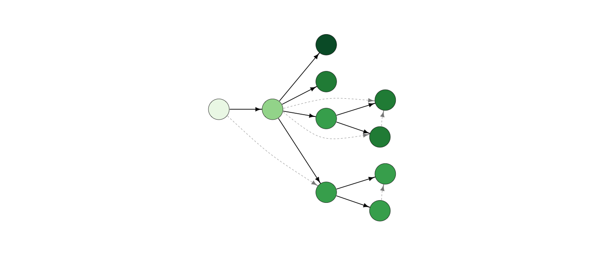

```r
library(ape)
library(adegenet)
library(knitr)
library(igraph)
library(RColorBrewer)
library(gridExtra)
opts_chunk$set(fig.width=9, fig.height=9)
opts_chunk$set(dev=c('png','postscript'))
```


```r
sym <- function(M) {
  M[lower.tri(M)] = t(M)[lower.tri(M)]
  M
}

makeNetSingle <- function(distance_matrix, meta) {
  if (class(distance_matrix)=="dist") {
    D = distance_matrix
    mat <- as.matrix(D)
  } else {
    mat <- read.table(distance_matrix,sep="\t")
    D <- as.dist(sym(mat))
    }
  
  names <- colnames(mat)
  mat <- as.matrix(mat)

  #limit meta to only these files
  rownames(meta) <- meta$name
  meta <- meta[names,]
  
  coll <- as.Date(as.character(meta$Date),"%d/%m/%Y",origin = "2000-01-01")
  #coll <- as.Date(paste("1","jan",meta$year,sep=""),"%d%b%Y")
  names(coll)<-meta$name
  meta$year <- as.numeric(format(coll,'%Y'))+2000

  
#   meta <- read.table("daniels.thies.CA.txt",sep="\t",header=T)
#   rownames(meta) <- meta$name
#   meta <- meta[names,]
#   coll <- as.Date(paste("1","jan",meta$year,sep=""),"%d%b%Y")
#   names(coll)<-meta$name

  year <- meta$year
  
  res <- seqTrack(mat, x.names=names, x.dates=coll)

  res$year <- year
  res$name <- names
  res
}
```


```r
# ifile <- "Thies_all_manual.PASS.Cls.miss0.5.LMRG.HAP.INDEL.recode.vcf.dist.tab.txt"
# sfile <- "Thies_all_manual.PASS.Cls.miss0.5.LMRG.HAP.SNP.recode.vcf.dist.tab.txt"
# corefile <- "Thies_all_manual.PASS.Cls.miss0.5.LMRG.HAP.CALLBOTH.vcf.dist.tab.txt"
# distmatS <- as.dist(sym(read.table(sfile,sep="\t")))
# distmatI <- as.dist(sym(read.table(ifile,sep="\t")))
# distmatIS <- distmatS+distmatI
# distmatCore <- as.dist(sym(read.table(corefile,sep="\t")))

# indelNets <- makeNet(distmatI)
# snpNets <- makeNet(distmatS)

# varNets <- makeNet(distmatIS)
```


```r
printGraph <- function(graph,colours,title) {
  cols <- brewer.pal((max(graph$year)-min(graph$year))+1, colours)

  ts=1 #textsize
  ig <- as.igraph(graph)
  tree <- layout_as_tree(ig,flip.y = F)[,c(2,1)]
  V(ig)$name <- graph$name
  V(ig)$color <- cols[graph$year-min(graph$year)+1]
  V(ig)$label.cex <- ts
 #frame()
  plot(ig,layout=tree,main=title,vertex.size=25,
     edge.color="black",edge.label.cex=1.5,edge.label.family="Arial",vertex.label.family="Arial")

}
```


```r
opts_chunk$set(fig.width=12, fig.height=9)
opts_chunk$set(dev=c('png'))
```


```r
net <- varNets[[1]]

indDists <- as.matrix(distmatI)
snpDists <- as.matrix(distmatS)
coreDists <- as.matrix(distmatCore)
net$direct<-T
netAll <- net
getAnces <- function(net, leaf, ids=character()) {
    id = ids[1]
    ances = netAll[id,"ances"]
    date = netAll[id,"date"]
    ances.date = netAll[id,"ances.date"]
#    if(is.na(steps)) {steps = netAll[id,"steps"]} else {write(steps,stderr())}
    #write(paste(leaf,id,ances,sep="\t"),stderr())
    if (!is.na(ances)) {
      if (id != leaf) {
        leaf.date = net[leaf,"date"]
        leaf.year = net[leaf,"year"]
        leaf.name = net[leaf,"name"]
        nextI = dim(net)[[1]]+1
#        write(paste("  adding",nextI,":",leaf,ances,sep=" "),stderr())
        net[nextI,1:2] <- c(leaf, ances)
        net[nextI,4] <- leaf.date
        net[nextI,5] <- ances.date
      
        net[nextI,6] <- leaf.year
        net[nextI,7] <- leaf.name
        net[nextI,8] <- F
        }
      net <- getAnces(net,leaf,c(ances))
    }
    if (length(ids) > 1){
       ids <- ids[ids != id]
#       write(paste("proceeding:",ids[1],sep=" "),stderr())
       net <- getAnces(net,ids[1],ids)
#       steps <- steps+1
#       net <- getAnces(net,ids[1],ids,steps)
  }
net
}
getAnces(net,net$id[1],net$id)
```

```
##          id ances weight       date ances.date year     name direct
## Th086.07  1    NA     NA 0007-10-11       <NA> 2007 Th086.07   TRUE
## Th106.09  2     1    576 0009-10-26 0007-10-11 2009 Th106.09   TRUE
## Th106.11  3     2    358 0011-10-27 0009-10-26 2011 Th106.11   TRUE
## Th117.11  4     3    111 0011-11-02 0011-10-27 2011 Th117.11   TRUE
## Th132.11  5     2    121 0011-11-11 0009-10-26 2011 Th132.11   TRUE
## Th134.11  6     3    105 0011-11-14 0011-10-27 2011 Th134.11   TRUE
## Th162.12  7     2    125 0012-10-10 0009-10-26 2012 Th162.12   TRUE
## Th196.12  8     5    139 0012-10-25 0011-11-11 2012 Th196.12   TRUE
## Th230.12  9     5    106 0012-11-09 0011-11-11 2012 Th230.12   TRUE
## Th074.13 10     2     88 0013-09-23 0009-10-26 2013 Th074.13   TRUE
## 11        3     1     NA 0011-10-27 0007-10-11 2011 Th106.11  FALSE
## 12        4     2     NA 0011-11-02 0009-10-26 2011 Th117.11  FALSE
## 13        4     1     NA 0011-11-02 0007-10-11 2011 Th117.11  FALSE
## 14        5     1     NA 0011-11-11 0007-10-11 2011 Th132.11  FALSE
## 15        6     2     NA 0011-11-14 0009-10-26 2011 Th134.11  FALSE
## 16        6     1     NA 0011-11-14 0007-10-11 2011 Th134.11  FALSE
## 17        7     1     NA 0012-10-10 0007-10-11 2012 Th162.12  FALSE
## 18        8     2     NA 0012-10-25 0009-10-26 2012 Th196.12  FALSE
## 19        8     1     NA 0012-10-25 0007-10-11 2012 Th196.12  FALSE
## 20        9     2     NA 0012-11-09 0009-10-26 2012 Th230.12  FALSE
## 21        9     1     NA 0012-11-09 0007-10-11 2012 Th230.12  FALSE
## 22       10     1     NA 0013-09-23 0007-10-11 2013 Th074.13  FALSE
```

```r
getEvolRates <- function(net,mat,ng) {
  netAll <- getAnces(net, net$id[1],net$id)
  
  D <- as.dist(sym(mat))
  names <- colnames(mat)
  mat <- as.matrix(sym(mat))
  outgroups <- setdiff(names,net$name)
  
  outtab <- data.frame(from=character(),
                 to=character(),
                 out=character(),
                 time=integer(),
                 years=integer(),
                 distance=numeric(),
                 rate=numeric(),
             #    direct=logical(),
                 stringsAsFactors=FALSE)
  
  for (i in c(1:dim(netAll)[[1]])) {
    if(!is.na(netAll$ances[i])) {
      sample = netAll$name[i]
      ances = netAll$name[netAll$ances[i]]
      #isdirect <- netAll$direct[i]
      dists = c()
      
      #time elapsed in years
      #time <- as.integer(netAll$year[i] - netAll$year[netAll$ances[i]])
      years <- as.integer(netAll$year[i] - netAll$year[netAll$ances[i]])
      
      #time elapsed in months
      time <- round(as.integer(netAll$date[i]-netAll$ances.date[i])*12/365,2)
      
      for (o in outgroups) {
        dist <- mat[sample,o]-mat[ances,o]
        dists <- c(dists, dist)
        outtab[dim(outtab)[1]+1,1:3]=c(ances,sample,o)
        outtab[dim(outtab)[1],4:7]=c(time,years,dist,round(dist/time,2))  
        #outtab[dim(outtab)[1],8]=isdirect
      }
      dists <- round(dists/time)
      #paste(dists,collapse = ","),
      #write(paste(ances,sample,netAll$date[i],netAll$ances.date[i],time,round(mean(dists),2),round(sd(dists),2),sep="\t"),stdout())
#      write(paste(ances,sample,outgroups,time,dists,sep="\t"),stdout())
    }
  }
  outtab$pair <- paste(outtab$from,outtab$to)
  outtab
}
test <- getEvolRates(varNets[[1]],indDists)


g_legend<-function(a.gplot){
  tmp <- ggplot_gtable(ggplot_build(a.gplot))
  leg <- which(sapply(tmp$grobs, function(x) x$name) == "guide-box")
  legend <- tmp$grobs[[leg]]
  return(legend)}
```


```r
opts_chunk$set(fig.width=18, fig.height=8)
opts_chunk$set(dev=c('png','postscript'))
```


```r
ped <- "Thies_all_manual.PASS.Cls.miss0.5.LMRG.HAP.DISCORDS.vcf.gz_NJnex/Thies_all_manual.PASS.Cls.miss0.5.LMRG.HAP.DISCORDS.gz.ped"
genos <- read.table(ped,colClasses="character")
inds <- genos[,1]
genos <- genos[,seq(7,dim(genos)[[2]],2)]
rownames(genos)=inds


  meta <- read.table("Thies_metadata_1701.txt",sep="\t",header=T)
  colnames(meta)[1]<-"name"
  meta <- meta[!is.na(meta$Age),]


  #tab<-"./Thies_all_manual.PASS.Cls.miss0.5.LMRG.HAP.alleles.tab"
  fileroot<-"ThiesDiscoAlleles_ped"
  
  #read in ped file and get hamming distances:
  #alleleTab <- read.table(tab,colClasses="character",header=T,na.strings = c("."))
  
  c1 <- c("Th086.07","Th106.09","Th106.11","Th117.11","Th132.11","Th134.11","Th162.12","Th196.12","Th230.12","Th074.13")
  #genos <- t(data.matrix(alleleTab[3:dim(alleleTab)[2]]))


  genos <- genos[c1,]
  inds <- c1


#  inds<-row.names(genos)
#   DNdistmat = matrix(nrow=length(c1),ncol=length(c1))
#   colnames(DNdistmat) = c1
#   rownames(DNdistmat) = c1
# 
#   outs <- inds[(!inds %in% c1)]
#   write("calculating de novo distance matrix",stderr())
# 
#   for (i in c1){
#       for (j in c1){
#         for (o in outs){
#             if(length(filled) > 0) {
#             meta[meta$name==i,"Date"] > meta[meta$name==j,"Date"]
#             distmat[i,j] = 
#         }else {
#           distmat[i,j]=-1
#         }
#       }
#   }
# 
  


  distmat = matrix(nrow=length(inds),ncol=length(inds))
  colnames(distmat) = inds
  rownames(distmat) = inds

  write("calculating distance matrix",stderr())
  for (i in inds){
      for (j in inds){
      filled = intersect(which(genos[i,] != 0), which(genos[j,] !=0))
      write(paste("calculating",i,"v",j),stderr())
      write(length(filled),stderr())
  
  #    distmat[i,j] = sum(genos[i,]!=genos[j,])
      if(length(filled) > 0) {
          distmat[i,j] = sum(genos[i,filled]!=genos[j,filled])
        }else {
          distmat[i,j]=-1
        }
      }
  }

  

  distmat <- as.dist(distmat)
  net <- makeNetSingle(distmat,meta)
  #printGraph(net,"Greens",tab)
  
distmatAllVars <- distmat
netAllVars <- net
  #target:
  #targetDist <- as.dist(sym(read.table("Thies_all_manual.PASS.Cls.miss0.5.LMRG.HAP.vcf.dist.tab.txt",sep="\t")[c1,c1]))
  #printGraph(makeNetSingle(targetDist,meta),"Greens","test")
```


```r
genosStatic <- genos
outfolder <- "./bootstraps"
bstraps <- system("ls bootstraps/*",intern = T)
if (length(bstraps)>0) {write("using old bootstraps",stderr())
                     } else{
  write("bootstrapping (100)",stderr())
    for (boot in c(1:100)) {
    
        bootsample <- sample(c(1:dim(genos)[2]),replace = T)
        genos <- genosStatic[c1,bootsample]
        inds <- c1
      
        distmat = matrix(nrow=length(inds),ncol=length(inds))
        colnames(distmat) = inds
        rownames(distmat) = inds
      
        write("calculating distance matrix",stderr())
        for (i in inds){
            for (j in inds){
            filled = intersect(which(genos[i,] != 0), which(genos[j,] !=0))
            if(length(filled) > 0) {
                distmat[i,j] = sum(genos[i,filled]!=genos[j,filled])
              }else {
                distmat[i,j]=-1
              }
            }
        }
        distmat <- as.dist(distmat)
        net <- makeNetSingle(distmat,meta)
        #printGraph(net,"Greens",tab)
        
        outnet=paste(".",outfolder, paste(fileroot,"c29",boot,'seqtrack.net',sep='.'),sep="/")
        write.table(net,outnet,quote=F,row.names=F)
      
      }
}
```


```r
bstraps <- system("ls bootstraps/*",intern = T)

blinks <- matrix(rep(0,length(inds)**2),nrow = length(inds),ncol=length(inds),dimnames = list(inds,inds))

for (b in bstraps) {
  tab <- read.table(b,header=T)
  for (i in c(1:dim(tab)[[1]])) {
#    write(paste(i,tab$ances[[i]]),stderr())    
    if (!is.na(tab$ances[i])) {
     blinks[tab$id[i],tab$ances[i]] = blinks[tab$id[i],tab$ances[i]]+1
    }
  }
}
blinks
```

```
##          Th086.07 Th106.09 Th106.11 Th117.11 Th132.11 Th134.11 Th162.12
## Th086.07        0        0        0        0        0        0        0
## Th106.09      100        0        0        0        0        0        0
## Th106.11        3       97        0        0        0        0        0
## Th117.11        0        0      100        0        0        0        0
## Th132.11        0      100        0        0        0        0        0
## Th134.11        0        0       76       24        0        0        0
## Th162.12        0      100        0        0        0        0        0
## Th196.12        0       59        0        0       41        0        0
## Th230.12        0       50        0        0       48        0        0
## Th074.13        0      100        0        0        0        0        0
##          Th196.12 Th230.12 Th074.13
## Th086.07        0        0        0
## Th106.09        0        0        0
## Th106.11        0        0        0
## Th117.11        0        0        0
## Th132.11        0        0        0
## Th134.11        0        0        0
## Th162.12        0        0        0
## Th196.12        0        0        0
## Th230.12        2        0        0
## Th074.13        0        0        0
```


```r
meta <- read.table("Thies_metadata_1701.txt",sep="\t",header=T)
colnames(meta)[1]<-"name"
meta <- meta[meta$name %in% inds,]
row.names(meta) <- inds
meta$Date <- as.Date(as.character(meta$Date),"%d/%m/%Y",origin = "2000-01-01")

net <- netAllVars
net$type = "core"
net$boot = 0

for (t in inds) {
  for (f in inds) {
    fi = which(inds==f)
      #write(paste(t,f,blinks[t,f],net[t,"ances"],is.na(net[t,"ances"]),net[t,"ances"] == fi),stderr())
    if (blinks[t,f] > 0) {
      if ((!is.na(net[t,"ances"])) & net[t,"ances"] == fi) {net[t,"boot"] = blinks[t,f]}
      else {
        nextI = dim(net)[[1]]+1
#        write(paste("  adding",nextI,":",leaf,ances,sep=" "),stderr())
        #integers
        net[nextI,c("id","ances","weight","year","boot")] <- c(which(inds==t), which(inds==f),as.matrix(distmat)[t,f],net[t,"year"], blinks[t,f])
        net[nextI,4] <- meta[f,"Date"]
        net[nextI,5] <- net[t,"date"]
        net[nextI,7:8] <- c(t,"boot")
        }
      }
  }
}
net
```

```
##          id ances weight                date ances.date year     name type
## Th086.07  1    NA     NA 0007-10-11 00:00:00       <NA> 2007 Th086.07 core
## Th106.09  2     1    576 0009-10-26 00:00:00 0007-10-11 2009 Th106.09 core
## Th106.11  3     2    358 0011-10-27 00:00:00 0009-10-26 2011 Th106.11 core
## Th117.11  4     3    111 0011-11-02 00:00:00 0011-10-27 2011 Th117.11 core
## Th132.11  5     2    121 0011-11-11 00:00:00 0009-10-26 2011 Th132.11 core
## Th134.11  6     3    105 0011-11-14 00:00:00 0011-10-27 2011 Th134.11 core
## Th162.12  7     2    125 0012-10-10 00:00:00 0009-10-26 2012 Th162.12 core
## Th196.12  8     5    139 0012-10-25 00:00:00 0011-11-11 2012 Th196.12 core
## Th230.12  9     5    106 0012-11-09 00:00:00 0011-11-11 2012 Th230.12 core
## Th074.13 10     2     88 0013-09-23 00:00:00 0009-10-26 2013 Th074.13 core
## 11        3     1    408 0007-10-10 19:00:00 0011-10-27 2011 Th106.11 boot
## 12        6     4    111 0011-11-01 19:00:00 0011-11-14 2011 Th134.11 boot
## 13        8     2    140 0009-10-25 19:00:00 0012-10-25 2012 Th196.12 boot
## 14        9     2    107 0009-10-25 19:00:00 0012-11-09 2012 Th230.12 boot
## 15        9     8    124 0012-10-24 19:00:00 0012-11-09 2012 Th230.12 boot
##          boot
## Th086.07    0
## Th106.09  100
## Th106.11   97
## Th117.11  100
## Th132.11  100
## Th134.11   76
## Th162.12  100
## Th196.12   41
## Th230.12   48
## Th074.13  100
## 11          3
## 12         24
## 13         59
## 14         50
## 15          2
```

```r
#plot(as.igraph(net))  

cols <- brewer.pal((max(netAllVars$year)-min(netAllVars$year))+1, "Greens")

#get posns from allGraph:
ts=1.0 #textsize
igA <- as.igraph(netAllVars)
tree <- layout_as_tree(igA,flip.y = F)[,c(2,1)]

#manually push two further ahead
tree[inds %in% c("Th230.12","Th134.11"),1] <- 3.1 


ig <- as.igraph(net)
```

```
## Warning in vattrs[[name]][index] <- value: number of items to replace is
## not a multiple of replacement length
```

```r
V(ig)$name <- netAllVars$name
V(ig)$color <- cols[netAllVars$year-min(netAllVars$year)+1]
V(ig)$label.cex <- ts
#E(ig)$color <- factor(net$type,levels=c("core","boot"))[2:15]
E(ig)$lty <- as.numeric(factor(net$type,levels=c("core","boot"))[2:15])
 #frame()
E(ig)$label <- paste(net$weight,(net$boot/100),sep="/")[2:15]
E(ig)$color <- as.character(factor(net$type,levels=c("core","boot"),labels=c("black","#888888"))[2:15])
E(ig)$weight <- as.numeric(factor(net$type,levels=c("boot","core"))[2:15])*2
E(ig)$weight
```

```
##  [1] 4 4 4 4 4 4 4 4 4 2 2 2 2 2
```

```r
curves = rep(0,14)
#curves[net$type[2:15]=="boot"] <- -0.5
curves[c(10,11,12,13,14)] <- c(-0.1,0.1,-0.5,0.2,0.1)


plot.new()
```


```r
plot(ig,layout=tree,vertex.size=25,
     edge.curved=curves,edge.width=as.numeric(factor(net$type,levels=c("boot","core"))[2:15]),
     edge.label.cex=1,edge.label.family="helvetica",vertex.label.family="helvetica")
```

```
## Warning in text.default(lc.x, lc.y, labels = edge.labels, col =
## edge.label.color, : font family 'helvetica' not found in PostScript font
## database
```

```
## Warning in text.default(lc.x, lc.y, labels = edge.labels, col =
## edge.label.color, : font family 'helvetica' not found in PostScript font
## database

## Warning in text.default(lc.x, lc.y, labels = edge.labels, col =
## edge.label.color, : font family 'helvetica' not found in PostScript font
## database

## Warning in text.default(lc.x, lc.y, labels = edge.labels, col =
## edge.label.color, : font family 'helvetica' not found in PostScript font
## database

## Warning in text.default(lc.x, lc.y, labels = edge.labels, col =
## edge.label.color, : font family 'helvetica' not found in PostScript font
## database

## Warning in text.default(lc.x, lc.y, labels = edge.labels, col =
## edge.label.color, : font family 'helvetica' not found in PostScript font
## database

## Warning in text.default(lc.x, lc.y, labels = edge.labels, col =
## edge.label.color, : font family 'helvetica' not found in PostScript font
## database

## Warning in text.default(lc.x, lc.y, labels = edge.labels, col =
## edge.label.color, : font family 'helvetica' not found in PostScript font
## database

## Warning in text.default(lc.x, lc.y, labels = edge.labels, col =
## edge.label.color, : font family 'helvetica' not found in PostScript font
## database

## Warning in text.default(lc.x, lc.y, labels = edge.labels, col =
## edge.label.color, : font family 'helvetica' not found in PostScript font
## database

## Warning in text.default(lc.x, lc.y, labels = edge.labels, col =
## edge.label.color, : font family 'helvetica' not found in PostScript font
## database

## Warning in text.default(lc.x, lc.y, labels = edge.labels, col =
## edge.label.color, : font family 'helvetica' not found in PostScript font
## database

## Warning in text.default(lc.x, lc.y, labels = edge.labels, col =
## edge.label.color, : font family 'helvetica' not found in PostScript font
## database

## Warning in text.default(lc.x, lc.y, labels = edge.labels, col =
## edge.label.color, : font family 'helvetica' not found in PostScript font
## database

## Warning in text.default(lc.x, lc.y, labels = edge.labels, col =
## edge.label.color, : font family 'helvetica' not found in PostScript font
## database

## Warning in text.default(lc.x, lc.y, labels = edge.labels, col =
## edge.label.color, : font family 'helvetica' not found in PostScript font
## database

## Warning in text.default(lc.x, lc.y, labels = edge.labels, col =
## edge.label.color, : font family 'helvetica' not found in PostScript font
## database

## Warning in text.default(lc.x, lc.y, labels = edge.labels, col =
## edge.label.color, : font family 'helvetica' not found in PostScript font
## database

## Warning in text.default(lc.x, lc.y, labels = edge.labels, col =
## edge.label.color, : font family 'helvetica' not found in PostScript font
## database

## Warning in text.default(lc.x, lc.y, labels = edge.labels, col =
## edge.label.color, : font family 'helvetica' not found in PostScript font
## database

## Warning in text.default(lc.x, lc.y, labels = edge.labels, col =
## edge.label.color, : font family 'helvetica' not found in PostScript font
## database

## Warning in text.default(lc.x, lc.y, labels = edge.labels, col =
## edge.label.color, : font family 'helvetica' not found in PostScript font
## database

## Warning in text.default(lc.x, lc.y, labels = edge.labels, col =
## edge.label.color, : font family 'helvetica' not found in PostScript font
## database

## Warning in text.default(lc.x, lc.y, labels = edge.labels, col =
## edge.label.color, : font family 'helvetica' not found in PostScript font
## database

## Warning in text.default(lc.x, lc.y, labels = edge.labels, col =
## edge.label.color, : font family 'helvetica' not found in PostScript font
## database

## Warning in text.default(lc.x, lc.y, labels = edge.labels, col =
## edge.label.color, : font family 'helvetica' not found in PostScript font
## database

## Warning in text.default(lc.x, lc.y, labels = edge.labels, col =
## edge.label.color, : font family 'helvetica' not found in PostScript font
## database

## Warning in text.default(lc.x, lc.y, labels = edge.labels, col =
## edge.label.color, : font family 'helvetica' not found in PostScript font
## database

## Warning in text.default(lc.x, lc.y, labels = edge.labels, col =
## edge.label.color, : font family 'helvetica' not found in PostScript font
## database

## Warning in text.default(lc.x, lc.y, labels = edge.labels, col =
## edge.label.color, : font family 'helvetica' not found in PostScript font
## database

## Warning in text.default(lc.x, lc.y, labels = edge.labels, col =
## edge.label.color, : font family 'helvetica' not found in PostScript font
## database

## Warning in text.default(lc.x, lc.y, labels = edge.labels, col =
## edge.label.color, : font family 'helvetica' not found in PostScript font
## database

## Warning in text.default(lc.x, lc.y, labels = edge.labels, col =
## edge.label.color, : font family 'helvetica' not found in PostScript font
## database

## Warning in text.default(lc.x, lc.y, labels = edge.labels, col =
## edge.label.color, : font family 'helvetica' not found in PostScript font
## database

## Warning in text.default(lc.x, lc.y, labels = edge.labels, col =
## edge.label.color, : font family 'helvetica' not found in PostScript font
## database

## Warning in text.default(lc.x, lc.y, labels = edge.labels, col =
## edge.label.color, : font family 'helvetica' not found in PostScript font
## database

## Warning in text.default(lc.x, lc.y, labels = edge.labels, col =
## edge.label.color, : font family 'helvetica' not found in PostScript font
## database

## Warning in text.default(lc.x, lc.y, labels = edge.labels, col =
## edge.label.color, : font family 'helvetica' not found in PostScript font
## database

## Warning in text.default(lc.x, lc.y, labels = edge.labels, col =
## edge.label.color, : font family 'helvetica' not found in PostScript font
## database

## Warning in text.default(lc.x, lc.y, labels = edge.labels, col =
## edge.label.color, : font family 'helvetica' not found in PostScript font
## database

## Warning in text.default(lc.x, lc.y, labels = edge.labels, col =
## edge.label.color, : font family 'helvetica' not found in PostScript font
## database

## Warning in text.default(lc.x, lc.y, labels = edge.labels, col =
## edge.label.color, : font family 'helvetica' not found in PostScript font
## database

## Warning in text.default(lc.x, lc.y, labels = edge.labels, col =
## edge.label.color, : font family 'helvetica' not found in PostScript font
## database

## Warning in text.default(lc.x, lc.y, labels = edge.labels, col =
## edge.label.color, : font family 'helvetica' not found in PostScript font
## database

## Warning in text.default(lc.x, lc.y, labels = edge.labels, col =
## edge.label.color, : font family 'helvetica' not found in PostScript font
## database

## Warning in text.default(lc.x, lc.y, labels = edge.labels, col =
## edge.label.color, : font family 'helvetica' not found in PostScript font
## database

## Warning in text.default(lc.x, lc.y, labels = edge.labels, col =
## edge.label.color, : font family 'helvetica' not found in PostScript font
## database

## Warning in text.default(lc.x, lc.y, labels = edge.labels, col =
## edge.label.color, : font family 'helvetica' not found in PostScript font
## database

## Warning in text.default(lc.x, lc.y, labels = edge.labels, col =
## edge.label.color, : font family 'helvetica' not found in PostScript font
## database

## Warning in text.default(lc.x, lc.y, labels = edge.labels, col =
## edge.label.color, : font family 'helvetica' not found in PostScript font
## database

## Warning in text.default(lc.x, lc.y, labels = edge.labels, col =
## edge.label.color, : font family 'helvetica' not found in PostScript font
## database

## Warning in text.default(lc.x, lc.y, labels = edge.labels, col =
## edge.label.color, : font family 'helvetica' not found in PostScript font
## database

## Warning in text.default(lc.x, lc.y, labels = edge.labels, col =
## edge.label.color, : font family 'helvetica' not found in PostScript font
## database

## Warning in text.default(lc.x, lc.y, labels = edge.labels, col =
## edge.label.color, : font family 'helvetica' not found in PostScript font
## database

## Warning in text.default(lc.x, lc.y, labels = edge.labels, col =
## edge.label.color, : font family 'helvetica' not found in PostScript font
## database

## Warning in text.default(lc.x, lc.y, labels = edge.labels, col =
## edge.label.color, : font family 'helvetica' not found in PostScript font
## database

## Warning in text.default(lc.x, lc.y, labels = edge.labels, col =
## edge.label.color, : font family 'helvetica' not found in PostScript font
## database

## Warning in text.default(lc.x, lc.y, labels = edge.labels, col =
## edge.label.color, : font family 'helvetica' not found in PostScript font
## database

## Warning in text.default(lc.x, lc.y, labels = edge.labels, col =
## edge.label.color, : font family 'helvetica' not found in PostScript font
## database

## Warning in text.default(lc.x, lc.y, labels = edge.labels, col =
## edge.label.color, : font family 'helvetica' not found in PostScript font
## database

## Warning in text.default(lc.x, lc.y, labels = edge.labels, col =
## edge.label.color, : font family 'helvetica' not found in PostScript font
## database

## Warning in text.default(lc.x, lc.y, labels = edge.labels, col =
## edge.label.color, : font family 'helvetica' not found in PostScript font
## database

## Warning in text.default(lc.x, lc.y, labels = edge.labels, col =
## edge.label.color, : font family 'helvetica' not found in PostScript font
## database

## Warning in text.default(lc.x, lc.y, labels = edge.labels, col =
## edge.label.color, : font family 'helvetica' not found in PostScript font
## database

## Warning in text.default(lc.x, lc.y, labels = edge.labels, col =
## edge.label.color, : font family 'helvetica' not found in PostScript font
## database

## Warning in text.default(lc.x, lc.y, labels = edge.labels, col =
## edge.label.color, : font family 'helvetica' not found in PostScript font
## database

## Warning in text.default(lc.x, lc.y, labels = edge.labels, col =
## edge.label.color, : font family 'helvetica' not found in PostScript font
## database

## Warning in text.default(lc.x, lc.y, labels = edge.labels, col =
## edge.label.color, : font family 'helvetica' not found in PostScript font
## database

## Warning in text.default(lc.x, lc.y, labels = edge.labels, col =
## edge.label.color, : font family 'helvetica' not found in PostScript font
## database

## Warning in text.default(lc.x, lc.y, labels = edge.labels, col =
## edge.label.color, : font family 'helvetica' not found in PostScript font
## database

## Warning in text.default(lc.x, lc.y, labels = edge.labels, col =
## edge.label.color, : font family 'helvetica' not found in PostScript font
## database

## Warning in text.default(lc.x, lc.y, labels = edge.labels, col =
## edge.label.color, : font family 'helvetica' not found in PostScript font
## database

## Warning in text.default(lc.x, lc.y, labels = edge.labels, col =
## edge.label.color, : font family 'helvetica' not found in PostScript font
## database

## Warning in text.default(lc.x, lc.y, labels = edge.labels, col =
## edge.label.color, : font family 'helvetica' not found in PostScript font
## database

## Warning in text.default(lc.x, lc.y, labels = edge.labels, col =
## edge.label.color, : font family 'helvetica' not found in PostScript font
## database

## Warning in text.default(lc.x, lc.y, labels = edge.labels, col =
## edge.label.color, : font family 'helvetica' not found in PostScript font
## database

## Warning in text.default(lc.x, lc.y, labels = edge.labels, col =
## edge.label.color, : font family 'helvetica' not found in PostScript font
## database

## Warning in text.default(lc.x, lc.y, labels = edge.labels, col =
## edge.label.color, : font family 'helvetica' not found in PostScript font
## database

## Warning in text.default(lc.x, lc.y, labels = edge.labels, col =
## edge.label.color, : font family 'helvetica' not found in PostScript font
## database

## Warning in text.default(lc.x, lc.y, labels = edge.labels, col =
## edge.label.color, : font family 'helvetica' not found in PostScript font
## database

## Warning in text.default(lc.x, lc.y, labels = edge.labels, col =
## edge.label.color, : font family 'helvetica' not found in PostScript font
## database

## Warning in text.default(lc.x, lc.y, labels = edge.labels, col =
## edge.label.color, : font family 'helvetica' not found in PostScript font
## database

## Warning in text.default(lc.x, lc.y, labels = edge.labels, col =
## edge.label.color, : font family 'helvetica' not found in PostScript font
## database

## Warning in text.default(lc.x, lc.y, labels = edge.labels, col =
## edge.label.color, : font family 'helvetica' not found in PostScript font
## database

## Warning in text.default(lc.x, lc.y, labels = edge.labels, col =
## edge.label.color, : font family 'helvetica' not found in PostScript font
## database

## Warning in text.default(lc.x, lc.y, labels = edge.labels, col =
## edge.label.color, : font family 'helvetica' not found in PostScript font
## database

## Warning in text.default(lc.x, lc.y, labels = edge.labels, col =
## edge.label.color, : font family 'helvetica' not found in PostScript font
## database

## Warning in text.default(lc.x, lc.y, labels = edge.labels, col =
## edge.label.color, : font family 'helvetica' not found in PostScript font
## database

## Warning in text.default(lc.x, lc.y, labels = edge.labels, col =
## edge.label.color, : font family 'helvetica' not found in PostScript font
## database

## Warning in text.default(lc.x, lc.y, labels = edge.labels, col =
## edge.label.color, : font family 'helvetica' not found in PostScript font
## database

## Warning in text.default(lc.x, lc.y, labels = edge.labels, col =
## edge.label.color, : font family 'helvetica' not found in PostScript font
## database

## Warning in text.default(lc.x, lc.y, labels = edge.labels, col =
## edge.label.color, : font family 'helvetica' not found in PostScript font
## database

## Warning in text.default(lc.x, lc.y, labels = edge.labels, col =
## edge.label.color, : font family 'helvetica' not found in PostScript font
## database

## Warning in text.default(lc.x, lc.y, labels = edge.labels, col =
## edge.label.color, : font family 'helvetica' not found in PostScript font
## database

## Warning in text.default(lc.x, lc.y, labels = edge.labels, col =
## edge.label.color, : font family 'helvetica' not found in PostScript font
## database

## Warning in text.default(lc.x, lc.y, labels = edge.labels, col =
## edge.label.color, : font family 'helvetica' not found in PostScript font
## database

## Warning in text.default(lc.x, lc.y, labels = edge.labels, col =
## edge.label.color, : font family 'helvetica' not found in PostScript font
## database

## Warning in text.default(lc.x, lc.y, labels = edge.labels, col =
## edge.label.color, : font family 'helvetica' not found in PostScript font
## database

## Warning in text.default(lc.x, lc.y, labels = edge.labels, col =
## edge.label.color, : font family 'helvetica' not found in PostScript font
## database

## Warning in text.default(lc.x, lc.y, labels = edge.labels, col =
## edge.label.color, : font family 'helvetica' not found in PostScript font
## database

## Warning in text.default(lc.x, lc.y, labels = edge.labels, col =
## edge.label.color, : font family 'helvetica' not found in PostScript font
## database

## Warning in text.default(lc.x, lc.y, labels = edge.labels, col =
## edge.label.color, : font family 'helvetica' not found in PostScript font
## database

## Warning in text.default(lc.x, lc.y, labels = edge.labels, col =
## edge.label.color, : font family 'helvetica' not found in PostScript font
## database

## Warning in text.default(lc.x, lc.y, labels = edge.labels, col =
## edge.label.color, : font family 'helvetica' not found in PostScript font
## database

## Warning in text.default(lc.x, lc.y, labels = edge.labels, col =
## edge.label.color, : font family 'helvetica' not found in PostScript font
## database

## Warning in text.default(lc.x, lc.y, labels = edge.labels, col =
## edge.label.color, : font family 'helvetica' not found in PostScript font
## database

## Warning in text.default(lc.x, lc.y, labels = edge.labels, col =
## edge.label.color, : font family 'helvetica' not found in PostScript font
## database

## Warning in text.default(lc.x, lc.y, labels = edge.labels, col =
## edge.label.color, : font family 'helvetica' not found in PostScript font
## database

## Warning in text.default(lc.x, lc.y, labels = edge.labels, col =
## edge.label.color, : font family 'helvetica' not found in PostScript font
## database

## Warning in text.default(lc.x, lc.y, labels = edge.labels, col =
## edge.label.color, : font family 'helvetica' not found in PostScript font
## database
```

```
## Warning in text.default(x, y, labels = labels, col = label.color, family
## = label.family, : font family 'helvetica' not found in PostScript font
## database

## Warning in text.default(x, y, labels = labels, col = label.color, family
## = label.family, : font family 'helvetica' not found in PostScript font
## database

## Warning in text.default(x, y, labels = labels, col = label.color, family
## = label.family, : font family 'helvetica' not found in PostScript font
## database

## Warning in text.default(x, y, labels = labels, col = label.color, family
## = label.family, : font family 'helvetica' not found in PostScript font
## database

## Warning in text.default(x, y, labels = labels, col = label.color, family
## = label.family, : font family 'helvetica' not found in PostScript font
## database

## Warning in text.default(x, y, labels = labels, col = label.color, family
## = label.family, : font family 'helvetica' not found in PostScript font
## database

## Warning in text.default(x, y, labels = labels, col = label.color, family
## = label.family, : font family 'helvetica' not found in PostScript font
## database

## Warning in text.default(x, y, labels = labels, col = label.color, family
## = label.family, : font family 'helvetica' not found in PostScript font
## database

## Warning in text.default(x, y, labels = labels, col = label.color, family
## = label.family, : font family 'helvetica' not found in PostScript font
## database

## Warning in text.default(x, y, labels = labels, col = label.color, family
## = label.family, : font family 'helvetica' not found in PostScript font
## database

## Warning in text.default(x, y, labels = labels, col = label.color, family
## = label.family, : font family 'helvetica' not found in PostScript font
## database

## Warning in text.default(x, y, labels = labels, col = label.color, family
## = label.family, : font family 'helvetica' not found in PostScript font
## database

## Warning in text.default(x, y, labels = labels, col = label.color, family
## = label.family, : font family 'helvetica' not found in PostScript font
## database

## Warning in text.default(x, y, labels = labels, col = label.color, family
## = label.family, : font family 'helvetica' not found in PostScript font
## database

## Warning in text.default(x, y, labels = labels, col = label.color, family
## = label.family, : font family 'helvetica' not found in PostScript font
## database

## Warning in text.default(x, y, labels = labels, col = label.color, family
## = label.family, : font family 'helvetica' not found in PostScript font
## database

## Warning in text.default(x, y, labels = labels, col = label.color, family
## = label.family, : font family 'helvetica' not found in PostScript font
## database

## Warning in text.default(x, y, labels = labels, col = label.color, family
## = label.family, : font family 'helvetica' not found in PostScript font
## database

## Warning in text.default(x, y, labels = labels, col = label.color, family
## = label.family, : font family 'helvetica' not found in PostScript font
## database

## Warning in text.default(x, y, labels = labels, col = label.color, family
## = label.family, : font family 'helvetica' not found in PostScript font
## database

## Warning in text.default(x, y, labels = labels, col = label.color, family
## = label.family, : font family 'helvetica' not found in PostScript font
## database

## Warning in text.default(x, y, labels = labels, col = label.color, family
## = label.family, : font family 'helvetica' not found in PostScript font
## database

## Warning in text.default(x, y, labels = labels, col = label.color, family
## = label.family, : font family 'helvetica' not found in PostScript font
## database

## Warning in text.default(x, y, labels = labels, col = label.color, family
## = label.family, : font family 'helvetica' not found in PostScript font
## database

## Warning in text.default(x, y, labels = labels, col = label.color, family
## = label.family, : font family 'helvetica' not found in PostScript font
## database

## Warning in text.default(x, y, labels = labels, col = label.color, family
## = label.family, : font family 'helvetica' not found in PostScript font
## database

## Warning in text.default(x, y, labels = labels, col = label.color, family
## = label.family, : font family 'helvetica' not found in PostScript font
## database

## Warning in text.default(x, y, labels = labels, col = label.color, family
## = label.family, : font family 'helvetica' not found in PostScript font
## database

## Warning in text.default(x, y, labels = labels, col = label.color, family
## = label.family, : font family 'helvetica' not found in PostScript font
## database

## Warning in text.default(x, y, labels = labels, col = label.color, family
## = label.family, : font family 'helvetica' not found in PostScript font
## database

## Warning in text.default(x, y, labels = labels, col = label.color, family
## = label.family, : font family 'helvetica' not found in PostScript font
## database

## Warning in text.default(x, y, labels = labels, col = label.color, family
## = label.family, : font family 'helvetica' not found in PostScript font
## database

## Warning in text.default(x, y, labels = labels, col = label.color, family
## = label.family, : font family 'helvetica' not found in PostScript font
## database

## Warning in text.default(x, y, labels = labels, col = label.color, family
## = label.family, : font family 'helvetica' not found in PostScript font
## database

## Warning in text.default(x, y, labels = labels, col = label.color, family
## = label.family, : font family 'helvetica' not found in PostScript font
## database

## Warning in text.default(x, y, labels = labels, col = label.color, family
## = label.family, : font family 'helvetica' not found in PostScript font
## database

## Warning in text.default(x, y, labels = labels, col = label.color, family
## = label.family, : font family 'helvetica' not found in PostScript font
## database

## Warning in text.default(x, y, labels = labels, col = label.color, family
## = label.family, : font family 'helvetica' not found in PostScript font
## database

## Warning in text.default(x, y, labels = labels, col = label.color, family
## = label.family, : font family 'helvetica' not found in PostScript font
## database

## Warning in text.default(x, y, labels = labels, col = label.color, family
## = label.family, : font family 'helvetica' not found in PostScript font
## database

## Warning in text.default(x, y, labels = labels, col = label.color, family
## = label.family, : font family 'helvetica' not found in PostScript font
## database

## Warning in text.default(x, y, labels = labels, col = label.color, family
## = label.family, : font family 'helvetica' not found in PostScript font
## database

## Warning in text.default(x, y, labels = labels, col = label.color, family
## = label.family, : font family 'helvetica' not found in PostScript font
## database

## Warning in text.default(x, y, labels = labels, col = label.color, family
## = label.family, : font family 'helvetica' not found in PostScript font
## database

## Warning in text.default(x, y, labels = labels, col = label.color, family
## = label.family, : font family 'helvetica' not found in PostScript font
## database

## Warning in text.default(x, y, labels = labels, col = label.color, family
## = label.family, : font family 'helvetica' not found in PostScript font
## database

## Warning in text.default(x, y, labels = labels, col = label.color, family
## = label.family, : font family 'helvetica' not found in PostScript font
## database

## Warning in text.default(x, y, labels = labels, col = label.color, family
## = label.family, : font family 'helvetica' not found in PostScript font
## database

## Warning in text.default(x, y, labels = labels, col = label.color, family
## = label.family, : font family 'helvetica' not found in PostScript font
## database

## Warning in text.default(x, y, labels = labels, col = label.color, family
## = label.family, : font family 'helvetica' not found in PostScript font
## database

## Warning in text.default(x, y, labels = labels, col = label.color, family
## = label.family, : font family 'helvetica' not found in PostScript font
## database

## Warning in text.default(x, y, labels = labels, col = label.color, family
## = label.family, : font family 'helvetica' not found in PostScript font
## database

## Warning in text.default(x, y, labels = labels, col = label.color, family
## = label.family, : font family 'helvetica' not found in PostScript font
## database

## Warning in text.default(x, y, labels = labels, col = label.color, family
## = label.family, : font family 'helvetica' not found in PostScript font
## database

## Warning in text.default(x, y, labels = labels, col = label.color, family
## = label.family, : font family 'helvetica' not found in PostScript font
## database

## Warning in text.default(x, y, labels = labels, col = label.color, family
## = label.family, : font family 'helvetica' not found in PostScript font
## database

## Warning in text.default(x, y, labels = labels, col = label.color, family
## = label.family, : font family 'helvetica' not found in PostScript font
## database

## Warning in text.default(x, y, labels = labels, col = label.color, family
## = label.family, : font family 'helvetica' not found in PostScript font
## database

## Warning in text.default(x, y, labels = labels, col = label.color, family
## = label.family, : font family 'helvetica' not found in PostScript font
## database

## Warning in text.default(x, y, labels = labels, col = label.color, family
## = label.family, : font family 'helvetica' not found in PostScript font
## database

## Warning in text.default(x, y, labels = labels, col = label.color, family
## = label.family, : font family 'helvetica' not found in PostScript font
## database

## Warning in text.default(x, y, labels = labels, col = label.color, family
## = label.family, : font family 'helvetica' not found in PostScript font
## database

## Warning in text.default(x, y, labels = labels, col = label.color, family
## = label.family, : font family 'helvetica' not found in PostScript font
## database

## Warning in text.default(x, y, labels = labels, col = label.color, family
## = label.family, : font family 'helvetica' not found in PostScript font
## database

## Warning in text.default(x, y, labels = labels, col = label.color, family
## = label.family, : font family 'helvetica' not found in PostScript font
## database

## Warning in text.default(x, y, labels = labels, col = label.color, family
## = label.family, : font family 'helvetica' not found in PostScript font
## database

## Warning in text.default(x, y, labels = labels, col = label.color, family
## = label.family, : font family 'helvetica' not found in PostScript font
## database

## Warning in text.default(x, y, labels = labels, col = label.color, family
## = label.family, : font family 'helvetica' not found in PostScript font
## database

## Warning in text.default(x, y, labels = labels, col = label.color, family
## = label.family, : font family 'helvetica' not found in PostScript font
## database

## Warning in text.default(x, y, labels = labels, col = label.color, family
## = label.family, : font family 'helvetica' not found in PostScript font
## database

## Warning in text.default(x, y, labels = labels, col = label.color, family
## = label.family, : font family 'helvetica' not found in PostScript font
## database

## Warning in text.default(x, y, labels = labels, col = label.color, family
## = label.family, : font family 'helvetica' not found in PostScript font
## database

## Warning in text.default(x, y, labels = labels, col = label.color, family
## = label.family, : font family 'helvetica' not found in PostScript font
## database

## Warning in text.default(x, y, labels = labels, col = label.color, family
## = label.family, : font family 'helvetica' not found in PostScript font
## database

## Warning in text.default(x, y, labels = labels, col = label.color, family
## = label.family, : font family 'helvetica' not found in PostScript font
## database

## Warning in text.default(x, y, labels = labels, col = label.color, family
## = label.family, : font family 'helvetica' not found in PostScript font
## database

## Warning in text.default(x, y, labels = labels, col = label.color, family
## = label.family, : font family 'helvetica' not found in PostScript font
## database

## Warning in text.default(x, y, labels = labels, col = label.color, family
## = label.family, : font family 'helvetica' not found in PostScript font
## database

## Warning in text.default(x, y, labels = labels, col = label.color, family
## = label.family, : font family 'helvetica' not found in PostScript font
## database

## Warning in text.default(x, y, labels = labels, col = label.color, family
## = label.family, : font family 'helvetica' not found in PostScript font
## database

## Warning in text.default(x, y, labels = labels, col = label.color, family
## = label.family, : font family 'helvetica' not found in PostScript font
## database

## Warning in text.default(x, y, labels = labels, col = label.color, family
## = label.family, : font family 'helvetica' not found in PostScript font
## database

## Warning in text.default(x, y, labels = labels, col = label.color, family
## = label.family, : font family 'helvetica' not found in PostScript font
## database

## Warning in text.default(x, y, labels = labels, col = label.color, family
## = label.family, : font family 'helvetica' not found in PostScript font
## database

## Warning in text.default(x, y, labels = labels, col = label.color, family
## = label.family, : font family 'helvetica' not found in PostScript font
## database

## Warning in text.default(x, y, labels = labels, col = label.color, family
## = label.family, : font family 'helvetica' not found in PostScript font
## database

## Warning in text.default(x, y, labels = labels, col = label.color, family
## = label.family, : font family 'helvetica' not found in PostScript font
## database

## Warning in text.default(x, y, labels = labels, col = label.color, family
## = label.family, : font family 'helvetica' not found in PostScript font
## database

## Warning in text.default(x, y, labels = labels, col = label.color, family
## = label.family, : font family 'helvetica' not found in PostScript font
## database

## Warning in text.default(x, y, labels = labels, col = label.color, family
## = label.family, : font family 'helvetica' not found in PostScript font
## database
```



