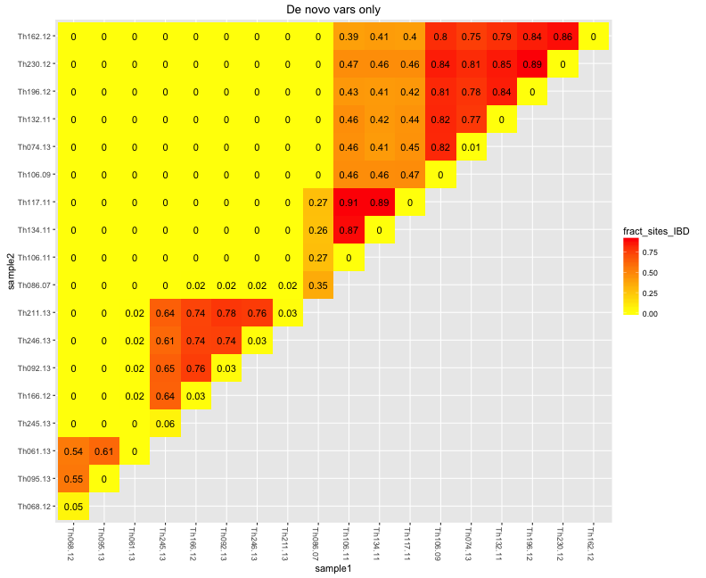
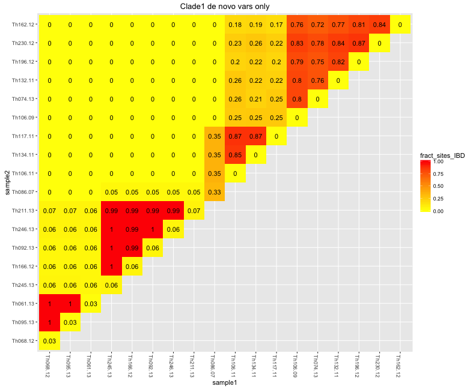
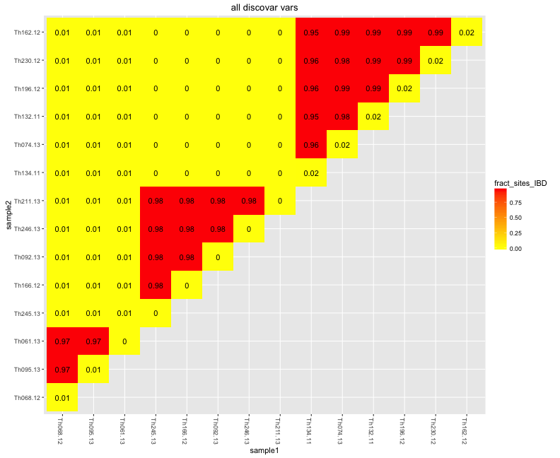
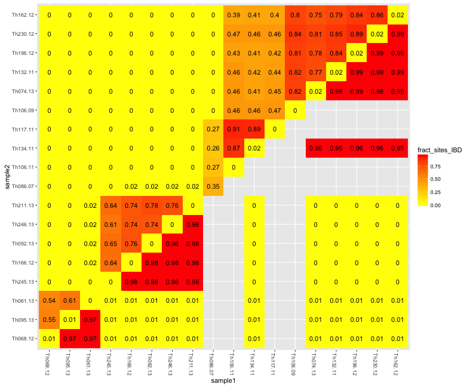

```r
library(knitr)
library(igraph)
library(RColorBrewer)
library(ggplot2)
library(reshape2)
opts_chunk$set(fig.width=11, fig.height=9)
opts_chunk$set(dev=c('png','postscript'))
```


```r
sym <- function(M) {
  M[lower.tri(M)] = t(M)[lower.tri(M)]
  M
}

makeDist <- function(distance_matrix_file, meta_file, ngroups=3) {
  mat <- read.table(distance_matrix_file,sep="\t")
  D <- as.dist(sym(mat))
  clust <- gengraph(D,ngrp=ngroups)
  names <- colnames(mat)
  mat <- as.matrix(mat)
  
  name1 <- names[clust$clust$membership==1]
  name2 <- names[clust$clust$membership==2]
  name3 <- names[clust$clust$membership==3]
  dist1 <- mat[name1,name1]
  dist2 <- mat[name2,name2]
  dist3 <- mat[name3,name3]
    
  list(dist1,dist2,dist3)
}
```


```r
meta<-read.table("daniels.thies.CA.txt",sep="\t",header=T)

meta <- subset(meta,name %in% levels(denovo$sample1))
rownames(meta) <- meta$name

nameorder <- as.character(meta$name[order(meta$haplotype.number,meta$year,meta$name)])
#dput(nameorder)
nameorder <- rev(c(
  "Th162.12", "Th230.12","Th196.12","Th132.11", "Th074.13", "Th106.09", "Th117.11", "Th134.11", "Th106.11","Th086.07",   
  "Th211.13","Th246.13", "Th092.13","Th166.12", "Th245.13", 
  "Th061.13", "Th095.13", "Th068.12"
))

denovo <- read.table("ThiesDiscoDiscord.IBD.hmm_fract.txt",header=T,sep="\t")
denovo$sample1 <- factor(denovo$sample1,levels=nameorder,ordered=T)
denovo$sample2 <- factor(denovo$sample2,levels=nameorder,ordered=T)
denovo$sample2[is.na(denovo$sample2)] <- denovo$sample1[is.na(denovo$sample2)]
rev <- denovo$sample1 > denovo$sample2
s1 <- denovo$sample1[rev]
s2 <- denovo$sample2[rev]
denovo$sample1[rev] <- s2
denovo$sample2[rev] <- s1

denovoCl1 <- read.table("ThiesDiscoDiscord.CL1.IBD.hmm_fract.txt",header=T,sep="\t")
denovoCl1$sample1 <- factor(denovoCl1$sample1,levels=nameorder,ordered=T)
denovoCl1$sample2 <- factor(denovoCl1$sample2,levels=nameorder,ordered=T)
denovoCl1$sample2[is.na(denovoCl1$sample2)] <- denovoCl1$sample1[is.na(denovoCl1$sample2)]
rev <- denovoCl1$sample1 > denovoCl1$sample2
s1 <- denovoCl1$sample1[rev]
s2 <- denovoCl1$sample2[rev]
denovoCl1$sample1[rev] <- s2
denovoCl1$sample2[rev] <- s1


standing <- read.table("Thies_all_manual.PASS.Cls.miss0.5.LMRG.HAP.IBD.hmm_fract.txt",header=T,sep="\t")
standing$sample2[is.na(standing$sample2)] <- standing$sample1[is.na(standing$sample2)]
standing$sample1 <- factor(standing$sample1,levels=nameorder,ordered=T)
standing$sample2 <- factor(standing$sample2,levels=nameorder,ordered=T)
standing <- standing[!is.na(standing$sample1),]
standing$sample2[is.na(standing$sample2)] <- standing$sample1[is.na(standing$sample2)]
rev <- standing$sample1 > standing$sample2
s1 <- standing$sample1[rev]
s2 <- standing$sample2[rev]
standing$sample1[rev] <- s2
standing$sample2[rev] <- s1
standing <- standing[!duplicated(standing),]
```


```r
ggplot(denovo,aes(x=sample1,y=sample2,fill=fract_sites_IBD,label=round(fract_sites_IBD,2))) + 
  geom_tile() + geom_text() + ggtitle("De novo vars only") +
  scale_fill_gradient(low="yellow",high="red") + theme(axis.text.x=element_text(angle=-90))
```



```r
ggplot(denovoCl1,aes(x=sample1,y=sample2,fill=fract_sites_IBD,label=round(fract_sites_IBD,2))) + 
  geom_tile() + geom_text() + ggtitle("Clade1 de novo vars only") +
  scale_fill_gradient(low="yellow",high="red") + theme(axis.text.x=element_text(angle=-90))
```



```r
ggplot(standing,aes(x=sample1,y=sample2,fill=fract_sites_IBD,label=round(fract_sites_IBD,2))) + 
  geom_tile() + geom_text() + ggtitle("all discovar vars") +
  scale_fill_gradient(low="yellow",high="red") + theme(axis.text.x=element_text(angle=-90))
```



```r
ggplot() + 
  geom_tile(data=denovo,aes(x=sample1,y=sample2,fill=fract_sites_IBD)) + geom_text(data=denovo,aes(x=sample1,y=sample2,label=round(fract_sites_IBD,2))) +
  geom_tile(data=standing,aes(x=sample2,y=sample1,fill=fract_sites_IBD)) + geom_text(data=standing,aes(x=sample2,y=sample1,label=round(fract_sites_IBD,2))) +
  scale_fill_gradient(low="yellow",high="red") + theme(axis.text.x=element_text(angle=-90))
```



