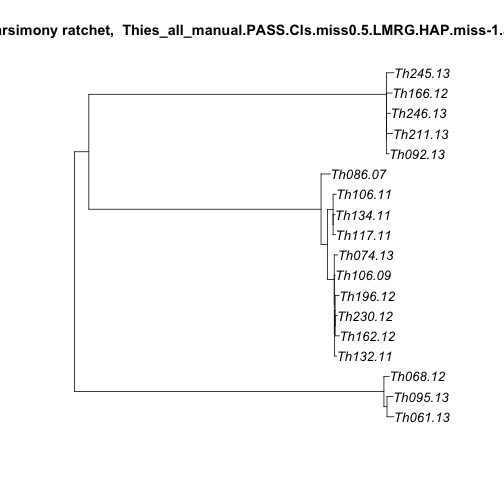

```r
library(ggplot2)
library(ape)
library(stringdist)
library(reshape2)
library(phangorn)

#fileroot <- commandArgs(TRUE)[1]
sym <- function(M) {
  M[lower.tri(M)] = t(M)[lower.tri(M)]
  M
}
```


```r
fileroot<-"Thies_all_manual.PASS.Cls.miss0.5.LMRG.HAP.miss-1.alleles"
outfolder <- "boot_allvars"


tab=paste(fileroot,'tab',sep='.')
outpng=paste(fileroot,'png',sep='.')
outnex=paste(fileroot,'nexus',sep='.')
outtab=paste(fileroot,'dist.tab.txt',sep='.')

#read in ped file and get hamming distances:
alleleTab <- read.table(tab,colClasses="character",header=T,na.strings = c("."))
```

```
## Warning in file(file, "rt"): cannot open file
## 'Thies_all_manual.PASS.Cls.miss0.5.LMRG.HAP.miss-1.alleles.tab': No such
## file or directory
```

```
## Error in file(file, "rt"): cannot open the connection
```

```r
genos <- t(data.matrix(alleleTab[6:dim(alleleTab)[2]]))
inds <- row.names(genos)
```


```r
genosDat <- as.phyDat(genos, type="USER", levels = c(0:max(genos,na.rm=T)))

distmat <- as.dist(sym(read.table("Thies_all_manual.PASS.Cls.miss0.5.LMRG.HAP.vcf.dist.tab.txt",sep="\t")))

#distmat <- dist.hamming(genosDat,exclude="pairwise")
treeNJ <- NJ(distmat)

#
#distmat2 <- matrix(nrow=length(inds),ncol=length(inds))
#colnames(distmat2) = inds
#rownames(distmat2) = inds
#write("calculating distance matrix",stderr())
#for (i in rownames(genos)){
#   for (j in rownames(genos)){
#      notnull <- !(is.na(genos[i,]) | is.na(genos[j,]))
#      
#      distmat2[i,j] <- sum(genos[i,notnull] != genos[j,notnull])
#  }
#}


#get parsinomy score
parsimony(treeNJ,genosDat)
```

```
## [1] 23299
```

```r
#get parsinomy tree
#treePars <- optim.parsimony(treeNJ,genosDat)
write("getting parsimony tree",stderr())
treeRatchet <- pratchet(genosDat)
```

```
## [1] "Best pscore so far: 23264"
## [1] "Best pscore so far: 23263"
## [1] "Best pscore so far: 23263"
## [1] "Best pscore so far: 23263"
## [1] "Best pscore so far: 23263"
## [1] "Best pscore so far: 23263"
## [1] "Best pscore so far: 23263"
## [1] "Best pscore so far: 23263"
## [1] "Best pscore so far: 23263"
## [1] "Best pscore so far: 23263"
## [1] "Best pscore so far: 23263"
```

```r
write(str(treeRatchet))
```

```
## List of 3
##  $ edge     : int [1:33, 1:2] 21 21 20 20 34 34 33 33 32 32 ...
##  $ Nnode    : int 16
##  $ tip.label: chr [1:18] "Th086.07" "Th106.09" "Th106.11" "Th117.11" ...
##  - attr(*, "class")= chr "phylo"
##  - attr(*, "pscore")= num 23263
##  - attr(*, "order")= chr "postorder"
```

```r
#re-add distances
#write.table(as.matrix(distmat),stderr())

write("re-adding distances",stderr())
write(paste("symmetric",isSymmetric(as.matrix(distmat))),stderr())
treeRatchet <- nnls.phylo(treeRatchet,distmat)

#write(treeRatchet,stderr())

write("midpoint root",stderr())
treeRatchet <- midpoint(treeRatchet)
#write(treeRatchet,stderr())

#parsimony(c(treePars,treeRatchet),genosDat)
#plot(treePars,"unrooted",main="parsimony: NNI swaps")


write("printing tree",stderr())
#png(filename=outpng,type="cairo-png")
plot.new()
plot(treeRatchet,show.node.label = T,show.tip.label = T,
     main=paste("parsimony ratchet, ",fileroot),type="phylogram",cex = 1.1)
```



```r
#dev.off()


write.nexus(treeRatchet,file=outnex)
```
