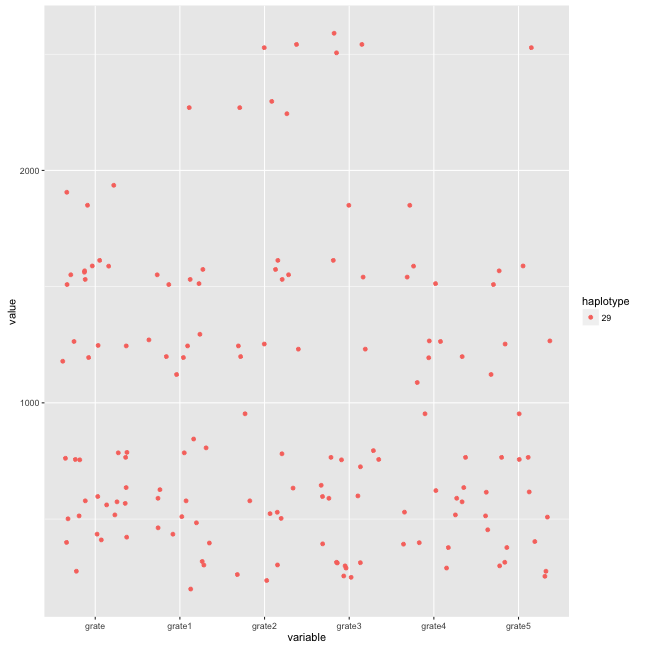
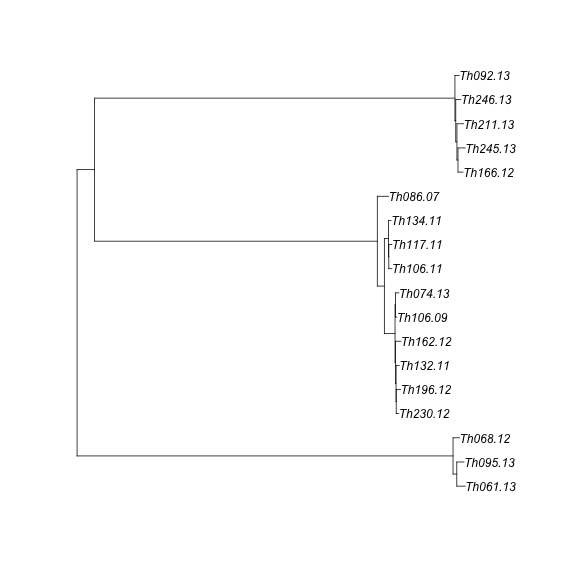
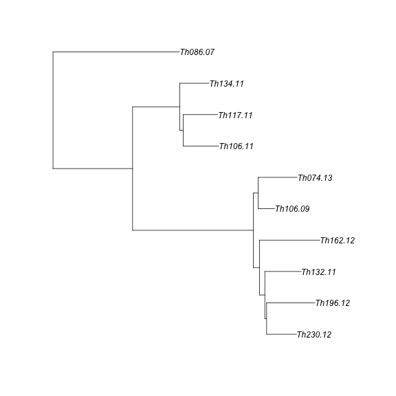
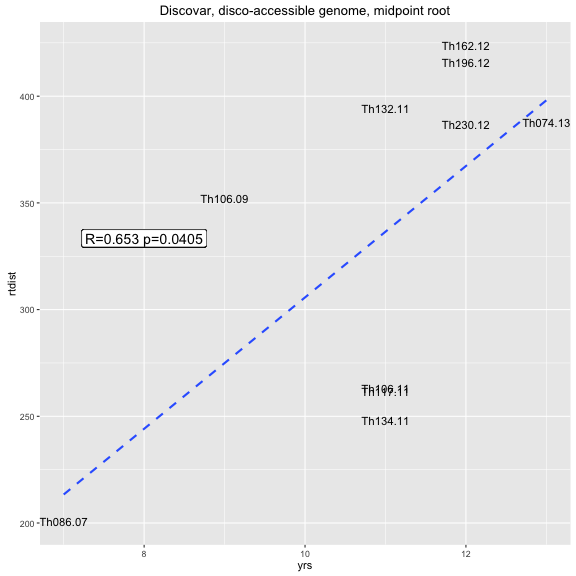
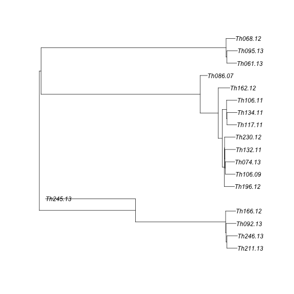
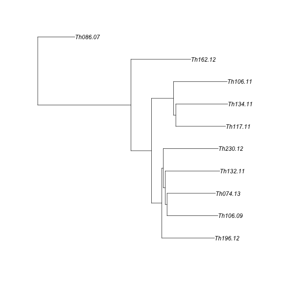
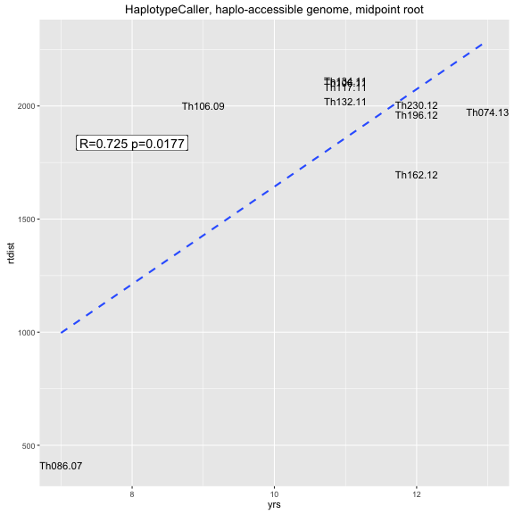
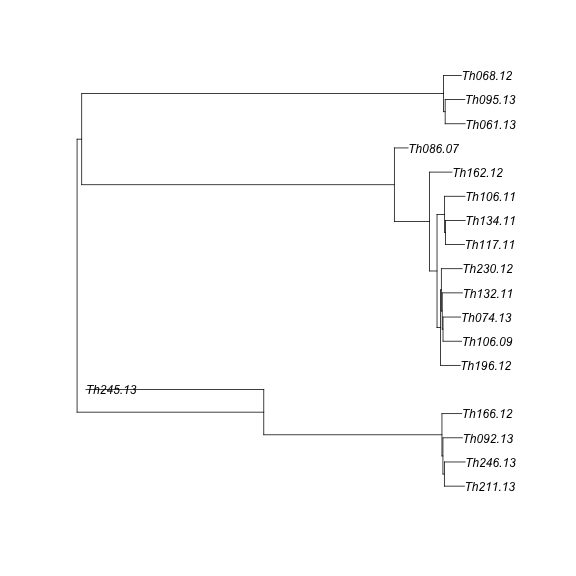
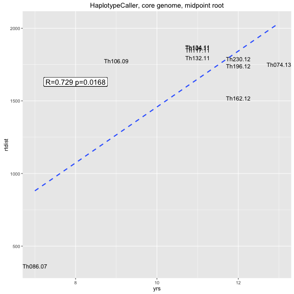

```r
library(ape)
library(adegenet)
library(phangorn)
library(knitr)
library(igraph)
library(RColorBrewer)
library(ggplot2)
library(reshape2)
opts_chunk$set(fig.width=9, fig.height=9)
opts_chunk$set(dev=c('png','postscript'))
```


```r
sym <- function(M) {
  M[lower.tri(M)] = t(M)[lower.tri(M)]
  M
}

makeDist <- function(distance_matrix_file, meta_file, ngroups=3) {
  mat <- read.table(distance_matrix_file,sep="\t")
  D <- as.dist(sym(mat))
  clust <- gengraph(D,ngrp=ngroups)
  names <- colnames(mat)
  mat <- as.matrix(mat)
  
  name1 <- names[clust$clust$membership==1]
  name2 <- names[clust$clust$membership==2]
  name3 <- names[clust$clust$membership==3]
  dist1 <- mat[name1,name1]
  dist2 <- mat[name2,name2]
  dist3 <- mat[name3,name3]
    
  list(dist1,dist2,dist3)
}
```


```r
meta<-read.table("daniels.thies.CA.txt",sep="\t",header=T)

indelDists <- read.table("Thies_all_manual.PASS.Cls.miss0.5.LMRG.HAP.INDEL.recode.vcf.dist.tab.txt",header=T,sep="\t")
snpDists <- read.table("Thies_all_manual.PASS.Cls.miss0.5.LMRG.HAP.SNP.recode.vcf.dist.tab.txt",header=T,sep="\t")
discoDists <- indelDists+snpDists

meta <- subset(meta,name %in% names(indelDists))
rownames(meta) <- meta$name

gatkDists <- read.table("thies_300100_haplo.CALLHAPLO.RENAME.dist.tab",header=T,sep="\t")

gatkDistsCore <- read.table("thies_300100_haplo.CALLBOTH.RENAME.dist.tab.txt",header=T,sep="\t")
```


```r
rates <- data.frame(
                 from=character(), 
                 to=character(), 
                 haplotype=numeric(),
                 interval=numeric(),
                 gatk=numeric(),
                 disco=numeric(),
                 stringsAsFactors=FALSE) 
n=0
names <- colnames(snpDists)
for (i in c(1:length(meta$name))) {
  for (j in c(i:length(meta$name))) {
    iname <-names[i]; jname <- names[j] 
    if (meta[iname,"haplotype.number"]==meta[jname,"haplotype.number"]) {
      n<-n+1
      interval <- abs(meta[jname,"year"]-meta[iname,"year"])
      
      #write(paste(meta$name[i],meta$name[j],interval,indelDists[i,j],snpDists[i,j]),stderr())  
      rates[n,1:3] <- c(as.character(iname),
                     as.character(jname),
                     meta[iname,"haplotype.number"])
      rates[n,4:6] <- c(interval,
                        gatkDists[iname,jname],discoDists[iname,jname])
      }
  }
}

rates <- subset(rates,haplotype=="29")

rates$grate <- rates$gatk/rates$interval
rates$grate1 <- rates$gatk/sample(rates$interval)
rates$grate2 <- rates$gatk/sample(rates$interval)
rates$grate3 <- rates$gatk/sample(rates$interval)
rates$grate4 <- rates$gatk/sample(rates$interval)
rates$grate5 <- rates$gatk/sample(rates$interval)
rates <- melt(rates,id.vars=c("from","to","interval","haplotype","gatk","disco"))

rates <- subset(rates,value > 0 & is.finite(value))
ggplot(subset(rates,interval > 0),aes(y=value,x=variable,colour=haplotype)) + geom_jitter()
```




```r
opts_chunk$set(fig.width=12, fig.height=9)
opts_chunk$set(dev=c('png'))
```


```r
#   net <- indelNets[[1]]
# 
# indDists <- read.table("Thies_all_manual.PASS.Cls.miss0.5.LMRG.HAP.INDEL.recode.vcf.dist.tab.txt",sep="\t")
# snpDists <- read.table("Thies_all_manual.PASS.Cls.miss0.5.LMRG.HAP.SNP.recode.vcf.dist.tab.txt",sep="\t")
# 
# discoDists <- indelDists+snpDists
# 
# gatkDists <- read.table("thies_300100_haplo.CALLHAPLO.RENAME.dist.tab",header=T,sep="\t")
# 
# 
netAll <- net
```

```
## Error in eval(expr, envir, enclos): object 'net' not found
```

```r
getAnces <- function(net, leaf, ids=character()) {
    id = ids[1]
    ances = netAll[id,"ances"]
    date = netAll[id,"date"]
    ances.date = netAll[id,"ances.date"]
    #write(paste(leaf,id,ances,sep="\t"),stderr())
    if (!is.na(ances)) {
      if (id != leaf) {
        leaf.date = net[leaf,"date"]
        leaf.year = net[leaf,"year"]
        leaf.name = net[leaf,"name"]
        nextI = dim(net)[[1]]+1
#        write(paste("  adding",nextI,":",leaf,ances,sep=" "),stderr())
        net[nextI,1:2] <- c(leaf, ances)
        net[nextI,6] <- leaf.year
        net[nextI,7] <- leaf.name
        }
      net <- getAnces(net,leaf,c(ances))
    }
    if (length(ids) > 1){
       ids <- ids[ids != id]
#       write(paste("proceeding:",ids[1],sep=" "),stderr())
       net <- getAnces(net,ids[1],ids)
  }
net
}

getEvolRates <- function(net,mat,ng) {
  netAll <- getAnces(net, net$id[1],net$id)
  
  D <- as.dist(sym(mat))
  names <- colnames(mat)
  mat <- as.matrix(sym(mat))
  outgroups <- setdiff(names,net$name)
  
  outtab <- data.frame(from=character(),
                 to=character(),
                 out=character(),
                 time=integer(),
                 distance=numeric(),
                 rate=numeric(),
                 stringsAsFactors=FALSE)
  
  for (i in c(1:dim(netAll)[[1]])) {
    if(!is.na(netAll$ances[i])) {
      sample = netAll$name[i]
      ances = netAll$name[netAll$ances[i]]
      dists = c()
      
      time <- as.integer(netAll$year[i] - netAll$year[netAll$ances[i]])
      
      for (o in outgroups) {
        dist <- mat[sample,o]-mat[ances,o]
        dists <- c(dists, dist)
        outtab[dim(outtab)[1]+1,1:3]=c(ances,sample,o)
        outtab[dim(outtab)[1],4:6]=c(time,dist,round(dist/time,2))        
      }
      dists <- round(dists/time)
      #paste(dists,collapse = ","),
#      write(paste(ances,sample,time,round(mean(dists),2),round(sd(dists),2),sep="\t"),stdout())
#      write(paste(ances,sample,outgroups,time,dists,sep="\t"),stdout())
    }
  }
  outtab$pair <- paste(outtab$from,outtab$to)
  outtab
}

netAll <- getAnces(net, 1,1:10)
```

```
## Error in getAnces(net, 1, 1:10): object 'netAll' not found
```

```r
g_legend<-function(a.gplot){
  tmp <- ggplot_gtable(ggplot_build(a.gplot))
  leg <- which(sapply(tmp$grobs, function(x) x$name) == "guide-box")
  legend <- tmp$grobs[[leg]]
  return(legend)}
```


```r
opts_chunk$set(fig.width=22, fig.height=8)
opts_chunk$set(dev=c('png','postscript'))
```


```r
corer1 <- getEvolRates(indelNets[[1]],coreDists)  
```

```
## Error in getAnces(net, net$id[1], net$id): object 'indelNets' not found
```

```r
inaccr1 <- getEvolRates(indelNets[[1]],(indDists+snpDists)-coreDists)  
```

```
## Error in getAnces(net, net$id[1], net$id): object 'indelNets' not found
```

```r
#CORE GENOME
cplot <- ggplot(corer1,aes(x=time,y=rate/12)) + 
  geom_boxplot(aes(group=time),fill=NA) + geom_hline(aes(yintercept=mean(rate/12)),linetype=3) + 
  geom_point(aes(colour=to,shape=from),position=position_jitter(width=0.5),size=3)+
  geom_label(aes(label=paste(round(mean(rate/12),2)," (+/- ",round(sd(rate/12),1),")",sep=""),y=mean(rate/12),x=7.3),size=5)+
  ggtitle("evolutionary rate, accessible genome only, clade 2") + ylab("mut/mth/gen") + xlab("years")  + ylim(-2,9) + xlim(0,7.5) +
  theme(legend.position="none")
```

```
## Error in ggplot(corer1, aes(x = time, y = rate/12)): object 'corer1' not found
```

```r
#INACCESSIBLE GENOME
iaplot <- ggplot(inaccr1,aes(x=time,y=rate/12)) + 
  geom_boxplot(aes(group=time),fill=NA) + geom_hline(aes(yintercept=mean(rate/12)),linetype=3) + 
  geom_point(aes(colour=to,shape=from),position=position_jitter(width=0.5),size=3)+
  geom_label(aes(label=paste(round(mean(rate/12),2)," (+/- ",round(sd(rate/12),1),")",sep=""),y=mean(rate/12),x=7.3),size=5)+
  ggtitle("evolutionary rate, inaccessible genome only, clade 2") + ylab("mut/mth/gen") + xlab("years")  + ylim(-2,9) + xlim(0,7.5)
```

```
## Error in ggplot(inaccr1, aes(x = time, y = rate/12)): object 'inaccr1' not found
```

```r
legend <- g_legend(iaplot)
```

```
## Error in plot_clone(plot): object 'iaplot' not found
```

```r
grid.arrange(cplot, iaplot + theme(legend.position="none"),legend, nrow=1,widths=c(10,10,1),heights=c(1))
```

```
## Error in eval(expr, envir, enclos): could not find function "grid.arrange"
```

```r
corerate <- round(mean(corer1$rate),3)
```

```
## Error in mean(corer1$rate): object 'corer1' not found
```

```r
inaccrate <- round(mean(inaccr1$rate),3)
```

```
## Error in mean(inaccr1$rate): object 'inaccr1' not found
```


```r
opts_chunk$set(fig.width=8, fig.height=8)
opts_chunk$set(dev=c('png'))
```


```r
cl1 <- c("Th086.07", "Th106.09", "Th106.11", "Th117.11", "Th132.11", "Th134.11", "Th162.12", "Th196.12", "Th230.12", "Th074.13")
cl1yrs <- as.numeric(gsub(".*\\.","",cl1))
og1<-"Th166.12"
oc1 <- c("Th166.12", "Th092.13", "Th211.13", "Th245.13", "Th246.13")
og2<-"Th068.12"
oc2 <- c("Th068.12", "Th061.13", "Th095.13")
cog1 <- c(cl1,og1)
cog2 <- c(cl1,og2)
```


```r
njtree1 <- nj(as.dist(sym(discoDists)))
njtree1 <- midpoint(njtree1)
plot(njtree1)
```



```r
njtree1 <- drop.tip(njtree1,c(oc1,oc2))
plot(njtree1)
```



```r
rtdist1 <- diag(vcv.phylo(njtree1)[cl1,cl1])
TDtab1 <- data.frame("sample"=cl1,"yrs"=cl1yrs,"rtdist"=rtdist1)
ct1 <- cor.test(TDtab1$yrs,TDtab1$rtdist)
ct1
```

```
## 
## 	Pearson's product-moment correlation
## 
## data:  TDtab1$yrs and TDtab1$rtdist
## t = 2.4403, df = 8, p-value = 0.04055
## alternative hypothesis: true correlation is not equal to 0
## 95 percent confidence interval:
##  0.04012092 0.90899971
## sample estimates:
##       cor 
## 0.6532455
```

```r
ggplot(TDtab1,aes(x=yrs,y=rtdist,label=sample)) + geom_text(size=4) + geom_smooth(method = lm,se=F,linetype=2) + 
  geom_label(x=8,y=mean(TDtab1$rtdist),label=paste("R=",round(ct1$estimate,3)," p=",round(ct1$p.value,4),sep=""),size=5) +
  ggtitle("Discovar, disco-accessible genome, midpoint root")
```




```r
njtreeGATK <- nj(as.dist(sym(gatkDists)))
njtreeGATK <- midpoint(njtreeGATK)
plot(njtreeGATK)
```



```r
njtreeGATK <- drop.tip(njtreeGATK,c(oc1,oc2))
plot(njtreeGATK)
```



```r
rtdistGATK <- diag(vcv.phylo(njtreeGATK)[cl1,cl1])
TDtabGATK <- data.frame("sample"=cl1,"yrs"=cl1yrs,"rtdist"=rtdistGATK)
ctGATK <- cor.test(TDtabGATK$yrs,TDtabGATK$rtdist)
ctGATK
```

```
## 
## 	Pearson's product-moment correlation
## 
## data:  TDtabGATK$yrs and TDtabGATK$rtdist
## t = 2.978, df = 8, p-value = 0.01765
## alternative hypothesis: true correlation is not equal to 0
## 95 percent confidence interval:
##  0.1756464 0.9300932
## sample estimates:
##       cor 
## 0.7250845
```

```r
ggplot(TDtabGATK,aes(x=yrs,y=rtdist,label=sample)) + geom_text(size=4) + geom_smooth(method = lm,se=F,linetype=2) + 
  geom_label(x=8,y=mean(TDtabGATK$rtdist),label=paste("R=",round(ctGATK$estimate,3)," p=",round(ctGATK$p.value,4),sep=""),size=5) +
  ggtitle("HaplotypeCaller, haplo-accessible genome, midpoint root")
```



```r
njtreeGATKCore <- nj(as.dist(sym(gatkDistsCore)))
njtreeGATKCore <- midpoint(njtreeGATKCore)
plot(njtreeGATKCore)
```



```r
njtreeGATKCore <- drop.tip(njtreeGATKCore,c(oc1,oc2))
plot(njtreeGATKCore)
```


```r
rtdistGATKCore <- diag(vcv.phylo(njtreeGATKCore)[cl1,cl1])
TDtabGATKCore <- data.frame("sample"=cl1,"yrs"=cl1yrs,"rtdist"=rtdistGATKCore)
ctGATKCore <- cor.test(TDtabGATKCore$yrs,TDtabGATKCore$rtdist)
ctGATKCore
```

```
## 
## 	Pearson's product-moment correlation
## 
## data:  TDtabGATKCore$yrs and TDtabGATKCore$rtdist
## t = 3.0108, df = 8, p-value = 0.01679
## alternative hypothesis: true correlation is not equal to 0
## 95 percent confidence interval:
##  0.1833476 0.9311590
## sample estimates:
##       cor 
## 0.7288366
```

```r
ggplot(TDtabGATKCore,aes(x=yrs,y=rtdist,label=sample)) + geom_text(size=4) + geom_smooth(method = lm,se=F,linetype=2) + 
  geom_label(x=8,y=mean(TDtabGATKCore$rtdist),label=paste("R=",round(ctGATKCore$estimate,3)," p=",round(ctGATKCore$p.value,4),sep=""),size=5) +
  ggtitle("HaplotypeCaller, core genome, midpoint root")
```


