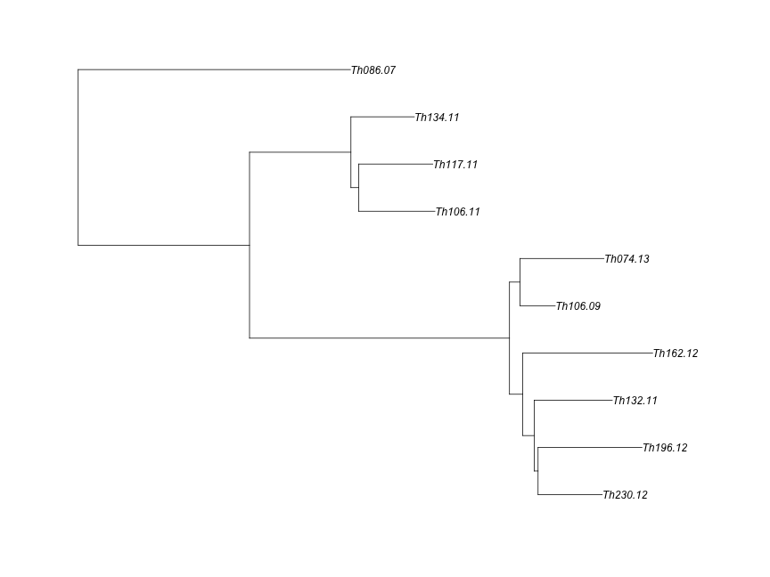

```r
library(ape)
library(adegenet)
library(phangorn)
library(knitr)
library(igraph)
library(RColorBrewer)
library(ggplot2)
library(reshape2)
opts_chunk$set(fig.width=9, fig.height=9)
opts_chunk$set(dev=c('png','postscript'))
```


```r
sym <- function(M) {
  M[lower.tri(M)] = t(M)[lower.tri(M)]
  M
}

makeDist <- function(distance_matrix_file, meta_file, ngroups=3) {
  mat <- read.table(distance_matrix_file,sep="\t")
  D <- as.dist(sym(mat))
  clust <- gengraph(D,ngrp=ngroups)
  names <- colnames(mat)
  mat <- as.matrix(mat)
  
  name1 <- names[clust$clust$membership==1]
  name2 <- names[clust$clust$membership==2]
  name3 <- names[clust$clust$membership==3]
  dist1 <- mat[name1,name1]
  dist2 <- mat[name2,name2]
  dist3 <- mat[name3,name3]
    
  list(dist1,dist2,dist3)
}
```


```r
meta <- read.table("Thies_metadata_1701.txt",sep="\t",header=T)
colnames(meta)[1]<-"name"
meta <- meta[!is.na(meta$Age),]

indelDists <- read.table("Thies_all_manual.PASS.Cls.miss0.5.LMRG.HAP.INDEL.recode.vcf.dist.tab.txt",header=T,sep="\t")
snpDists <- read.table("Thies_all_manual.PASS.Cls.miss0.5.LMRG.HAP.SNP.recode.vcf.dist.tab.txt",header=T,sep="\t")
discoDists <- indelDists+snpDists

meta <- subset(meta,name %in% names(indelDists))
rownames(meta) <- meta$name

gatkDists <- read.table("thies_300100_haplo.CALLHAPLO.RENAME.dist.tab",header=T,sep="\t")

gatkDistsCore <- read.table("thies_300100_haplo.CALLBOTH.RENAME.dist.tab.txt",header=T,sep="\t")
```


```r
opts_chunk$set(fig.width=12, fig.height=9)
opts_chunk$set(dev=c('png'))
```


```r
makeNetSingle <- function(distance_matrix, meta) {
  if (class(distance_matrix)=="dist") {
    D = distance_matrix
    mat <- as.matrix(D)
  } else {
    mat <- read.table(distance_matrix,sep="\t")
    D <- as.dist(sym(mat))
    }
  
  names <- colnames(mat)
  mat <- as.matrix(mat)

  #limit meta to only these files
  rownames(meta) <- meta$name
  meta <- meta[names,]
  
  coll <- as.Date(as.character(meta$Date),"%d/%m/%Y",origin = "2000-01-01")
  #coll <- as.Date(paste("1","jan",meta$year,sep=""),"%d%b%Y")
  names(coll)<-meta$name
  meta$year <- as.numeric(format(coll,'%Y'))+2000

  
#   meta <- read.table("daniels.thies.CA.txt",sep="\t",header=T)
#   rownames(meta) <- meta$name
#   meta <- meta[names,]
#   coll <- as.Date(paste("1","jan",meta$year,sep=""),"%d%b%Y")
#   names(coll)<-meta$name

  year <- meta$year
  
  res <- seqTrack(mat, x.names=names, x.dates=coll)

  res$year <- year
  res$name <- names
  res
}


printGraph <- function(graph,colours,title) {
  cols <- brewer.pal((max(graph$year)-min(graph$year))+1, colours)

  ts=1 #textsize
  ig <- as.igraph(graph)
  tree <- layout_as_tree(ig,flip.y = F)[,c(2,1)]
  V(ig)$name <- graph$name
  V(ig)$color <- cols[graph$year-min(graph$year)+1]
  V(ig)$label.cex <- ts
 #frame()
  plot(ig,layout=tree,main=title,vertex.size=25,
     edge.color="black",edge.label.cex=1.5,edge.label.family="Arial",vertex.label.family="Arial")

}


getAnces <- function(net, leaf, ids=character()) {
    id = ids[1]
    ances = netAll[id,"ances"]
    date = netAll[id,"date"]
    ances.date = netAll[id,"ances.date"]
    #write(paste(leaf,id,ances,sep="\t"),stderr())
    if (!is.na(ances)) {
      if (id != leaf) {
        leaf.date = net[leaf,"date"]
        leaf.year = net[leaf,"year"]
        leaf.name = net[leaf,"name"]
        nextI = dim(net)[[1]]+1
#        write(paste("  adding",nextI,":",leaf,ances,sep=" "),stderr())
        net[nextI,1:2] <- c(leaf, ances)
        net[nextI,6] <- leaf.year
        net[nextI,7] <- leaf.name
        }
      net <- getAnces(net,leaf,c(ances))
    }
    if (length(ids) > 1){
       ids <- ids[ids != id]
#       write(paste("proceeding:",ids[1],sep=" "),stderr())
       net <- getAnces(net,ids[1],ids)
  }
net
}

getEvolRates <- function(net,mat,ng) {
  netAll <- getAnces(net, net$id[1],net$id)
  
  D <- as.dist(sym(mat))
  names <- colnames(mat)
  mat <- as.matrix(sym(mat))
  outgroups <- setdiff(names,net$name)
  
  outtab <- data.frame(from=character(),
                 to=character(),
                 out=character(),
                 time=integer(),
                 distance=numeric(),
                 rate=numeric(),
                 stringsAsFactors=FALSE)
  
  for (i in c(1:dim(netAll)[[1]])) {
    if(!is.na(netAll$ances[i])) {
      sample = netAll$name[i]
      ances = netAll$name[netAll$ances[i]]
      dists = c()
      
      time <- as.integer(netAll$year[i] - netAll$year[netAll$ances[i]])
      
      for (o in outgroups) {
        dist <- mat[sample,o]-mat[ances,o]
        dists <- c(dists, dist)
        outtab[dim(outtab)[1]+1,1:3]=c(ances,sample,o)
        outtab[dim(outtab)[1],4:6]=c(time,dist,round(dist/time,2))        
      }
      dists <- round(dists/time)
      #paste(dists,collapse = ","),
#      write(paste(ances,sample,time,round(mean(dists),2),round(sd(dists),2),sep="\t"),stdout())
#      write(paste(ances,sample,outgroups,time,dists,sep="\t"),stdout())
    }
  }
  outtab$pair <- paste(outtab$from,outtab$to)
  outtab
}

#netAll <- getAnces(net, 1,1:10)


g_legend<-function(a.gplot){
  tmp <- ggplot_gtable(ggplot_build(a.gplot))
  leg <- which(sapply(tmp$grobs, function(x) x$name) == "guide-box")
  legend <- tmp$grobs[[leg]]
  return(legend)}
```


```r
cl1 <- c("Th086.07", "Th106.09", "Th106.11", "Th117.11", "Th132.11", "Th134.11", "Th162.12", "Th196.12", "Th230.12", "Th074.13")
cl1yrs <- as.numeric(gsub(".*\\.","",cl1))
og1<-"Th166.12"
oc1 <- c("Th166.12", "Th092.13", "Th211.13", "Th245.13", "Th246.13")
og2<-"Th068.12"
oc2 <- c("Th068.12", "Th061.13", "Th095.13")
cog1 <- c(cl1,og1)
cog2 <- c(cl1,og2)
```


```r
njtree1 <- nj(as.dist(sym(discoDists)))
njtree1 <- midpoint(njtree1)
plot(njtree1)
```


```r
njtree1 <- drop.tip(njtree1,c(oc1,oc2))
plot(njtree1)
```



```r
rtdist1 <- diag(vcv.phylo(njtree1)[cl1,cl1])
TDtab1 <- data.frame("sample"=cl1,"yrs"=cl1yrs,"rtdist"=rtdist1)
ct1 <- cor.test(TDtab1$yrs,TDtab1$rtdist)
ct1
```

```
## 
## 	Pearson's product-moment correlation
## 
## data:  TDtab1$yrs and TDtab1$rtdist
## t = 2.4403, df = 8, p-value = 0.04055
## alternative hypothesis: true correlation is not equal to 0
## 95 percent confidence interval:
##  0.04012092 0.90899971
## sample estimates:
##       cor 
## 0.6532455
```

```r
ggplot(TDtab1,aes(x=yrs,y=rtdist,label=sample)) + geom_text(size=4) + geom_smooth(method = lm,se=F,linetype=2) + 
  geom_label(x=8,y=mean(TDtab1$rtdist),label=paste("R=",round(ct1$estimate,3)," p=",round(ct1$p.value,4),sep=""),size=5) +
  ggtitle("Discovar, disco-accessible genome, midpoint root")
```


```r
# meta <- read.table("Thies_metadata_1701.txt",sep="\t",header=T)
# colnames(meta)[1]<-"name"
# meta <- meta[!is.na(meta$Age),]

netDisco <- makeNetSingle(as.dist(sym(discoDists[cl1,cl1])),meta)
printGraph(netDisco,"Greens",title = "Discovar - disco-accessible genome")
```


```r
njtreeGATK <- nj(as.dist(sym(gatkDists)))
njtreeGATK <- midpoint(njtreeGATK)
plot(njtreeGATK)
```


```r
njtreeGATK <- drop.tip(njtreeGATK,c(oc1,oc2))
plot(njtreeGATK)
```


```r
rtdistGATK <- diag(vcv.phylo(njtreeGATK)[cl1,cl1])
TDtabGATK <- data.frame("sample"=cl1,"yrs"=cl1yrs,"rtdist"=rtdistGATK)
ctGATK <- cor.test(TDtabGATK$yrs,TDtabGATK$rtdist)
ctGATK
```

```
## 
## 	Pearson's product-moment correlation
## 
## data:  TDtabGATK$yrs and TDtabGATK$rtdist
## t = 2.978, df = 8, p-value = 0.01765
## alternative hypothesis: true correlation is not equal to 0
## 95 percent confidence interval:
##  0.1756464 0.9300932
## sample estimates:
##       cor 
## 0.7250845
```

```r
ggplot(TDtabGATK,aes(x=yrs,y=rtdist,label=sample)) + geom_text(size=4) + geom_smooth(method = lm,se=F,linetype=2) + 
  geom_label(x=8,y=mean(TDtabGATK$rtdist),label=paste("R=",round(ctGATK$estimate,3)," p=",round(ctGATK$p.value,4),sep=""),size=5) +
  ggtitle("HaplotypeCaller, haplo-accessible genome, midpoint root")
```


```r
#cols <- brewer.pal((max(netGATK$year)-min(netGATK$year))+1, "Greens")

netGATK <- makeNetSingle(as.dist(sym(gatkDists[cl1,cl1])),meta)
printGraph(netGATK[],"Greens",title = "HaplotypeCaller - haplo-accessible genome")
```


```r
njtreeGATKCore <- nj(as.dist(sym(gatkDistsCore)))
njtreeGATKCore <- midpoint(njtreeGATKCore)
plot(njtreeGATKCore)
```


```r
njtreeGATKCore <- drop.tip(njtreeGATKCore,c(oc1,oc2))
plot(njtreeGATKCore)
```


```r
rtdistGATKCore <- diag(vcv.phylo(njtreeGATKCore)[cl1,cl1])
TDtabGATKCore <- data.frame("sample"=cl1,"yrs"=cl1yrs,"rtdist"=rtdistGATKCore)
ctGATKCore <- cor.test(TDtabGATKCore$yrs,TDtabGATKCore$rtdist)
ctGATKCore
```

```
## 
## 	Pearson's product-moment correlation
## 
## data:  TDtabGATKCore$yrs and TDtabGATKCore$rtdist
## t = 3.0108, df = 8, p-value = 0.01679
## alternative hypothesis: true correlation is not equal to 0
## 95 percent confidence interval:
##  0.1833476 0.9311590
## sample estimates:
##       cor 
## 0.7288366
```

```r
ggplot(TDtabGATKCore,aes(x=yrs,y=rtdist,label=sample)) + geom_text(size=4) + geom_smooth(method = lm,se=F,linetype=2) + 
  geom_label(x=8,y=mean(TDtabGATKCore$rtdist),label=paste("R=",round(ctGATKCore$estimate,3)," p=",round(ctGATKCore$p.value,4),sep=""),size=5) +
  ggtitle("HaplotypeCaller, core genome, midpoint root")
```


```r
netGATKCore <- makeNetSingle(as.dist(sym(gatkDistsCore[cl1,cl1])),meta)
printGraph(netGATKCore[],"Greens",title = "HaplotypeCaller - core genome")
```


```r
# meta <- read.table("Thies_metadata_1701.txt",sep="\t",header=T)
# colnames(meta)[1]<-"name"
# meta <- meta[meta$name %in% cl1,]
# row.names(meta) <- cl1
# meta$Date <- as.Date(as.character(meta$Date),"%d/%m/%Y",origin = "2000-01-01")

bootstrapNets <- function(genos,outfolder) {
  genosStatic <- genos
  #outfolder <- "./bootstraps"
  bstraps <- system(paste("ls ",outfolder,"*",sep=""),intern = T)
  if (length(bstraps)>0) {write("using old bootstraps",stderr())
  #if (1==2) {write("using old bootstraps",stderr())
                       } else{
    write("bootstrapping (100)",stderr())
      for (boot in c(1:100)) {
      
          bootsample <- sample(c(1:dim(genos)[1]),replace = T)
#          genos <- genosStatic[c1,bootsample]
#          inds <- c1
          genos <- genosStatic[bootsample,]
          inds <- colnames(genosStatic)
        
          distmat = matrix(nrow=length(inds),ncol=length(inds))
          colnames(distmat) = inds
          rownames(distmat) = inds
        
          write("calculating distance matrix",stderr())
          for (i in inds){
              for (j in inds){
#              filled = intersect(which(genos[,i] != 0), which(genos[,j] !=0))
              filled = intersect(which(!is.na(genos[,i])), which(!is.na(genos[,j])))
              if(length(filled) > 0) {
                  distmat[j,i] = sum(genos[filled,i]!=genos[filled,j])
                }else {
                  distmat[j,i]=-1
                }
              }
          }
          distmat <- as.dist(distmat)
          net <- makeNetSingle(distmat,meta)
          #printGraph(net,"Greens",tab)
          
          outnet=paste(".",outfolder, paste("bootstrap_c29",boot,'seqtrack.net',sep='.'),sep="/")
          write.table(net,outnet,quote=F,row.names=F)
        
        }
  }
}

sumBootstraps <- function(bootdir) {
  bstraps <- system(paste("ls ",bootdir,"/*",sep=""),intern = T)

  blinks <- matrix(rep(0,length(cl1)**2),nrow = length(cl1),ncol=length(cl1),dimnames = list(cl1,cl1))

  for (b in bstraps) {
    tab <- read.table(b,header=T)
    for (i in c(1:dim(tab)[[1]])) {
      if (!is.na(tab$ances[i])) {
      blinks[tab$id[i],tab$ances[i]] = blinks[tab$id[i],tab$ances[i]]+1
      }
    }
  }
blinks
}
```


```r
discoGenos <- read.table("ThiesDiscoDiscord.alleles.tab",header=T,na.strings = c("."))[,cl1]
bootstrapNets(discoGenos,"bootstraps_disco")
discosum <- sumBootstraps("bootstraps_disco")


haploGenosCore <- read.table("thies_300100_haplo.CALLBOTH.RENAME.alleles.tab",header=T,na.strings = c("."))[,cl1]
bootstrapNets(haploGenosCore,"bootstraps_haploCore")
haploCoresum <- sumBootstraps("bootstraps_haploCore")

haploGenosAccess <- read.table("thies_300100_haplo.CALLHAPLO.RENAME.alleles.tab",header=T,na.strings = c("."))[,cl1]
bootstrapNets(haploGenosAccess,"bootstraps_haploAccess")
haplosum <- sumBootstraps("bootstraps_haploAccess")
```


```r
addBootToNet <- function(net,boottab,distmat) {
  net$type = "core"
  net$boot = 0
  inds <- rownames(net)
  for (t in inds) {
    for (f in inds) {
      fi = which(inds==f)
        #write(paste(t,f,blinks[t,f],net[t,"ances"],is.na(net[t,"ances"]),net[t,"ances"] == fi),stderr())
      if (boottab[t,f] > 0) {
        if ((!is.na(net[t,"ances"])) & net[t,"ances"] == fi) {net[t,"boot"] = boottab[t,f]}
        else {
          nextI = dim(net)[[1]]+1
  #        write(paste("  adding",nextI,":",leaf,ances,sep=" "),stderr())
          #integers
          net[nextI,c("id","ances","weight","year","boot")] <- c(which(inds==t), which(inds==f),as.matrix(distmat)[t,f],net[t,"year"], boottab[t,f])
          net[nextI,4] <- meta[f,"Date"]
          net[nextI,5] <- net[t,"date"]
          net[nextI,7:8] <- c(t,"boot")
          }
        }
    }
  }
net
}

discobootnet <- addBootToNet(netDisco,discosum,discoDists)
gatkbootnet <- addBootToNet(netGATK,haplosum,gatkDists)
gatkbootcorenet <- addBootToNet(netGATKCore,haploCoresum,gatkDistsCore)
discobootnet
```

```
##          id ances weight       date ances.date year     name type boot
## Th086.07  1    NA     NA 0007-10-11       <NA> 2007 Th086.07 core    0
## Th106.09  2     1    576 0009-10-26 0007-10-11 2009 Th106.09 core  101
## Th106.11  3     2    358 0011-10-27 0009-10-26 2011 Th106.11 core   15
## Th117.11  4     3    111 0011-11-02 0011-10-27 2011 Th117.11 core  101
## Th132.11  5     2    121 0011-11-11 0009-10-26 2011 Th132.11 core  101
## Th134.11  6     3    105 0011-11-14 0011-10-27 2011 Th134.11 core   11
## Th162.12  7     2    125 0012-10-10 0009-10-26 2012 Th162.12 core   90
## Th196.12  8     5    139 0012-10-25 0011-11-11 2012 Th196.12 core   24
## Th230.12  9     5    106 0012-11-09 0011-11-11 2012 Th230.12 core   38
## Th074.13 10     2     88 0013-09-23 0009-10-26 2013 Th074.13 core  101
## 11        3     1     NA 0011-10-07 0011-10-27 2011 Th106.11 boot   86
## 12        6     4     NA 0002-11-11 0011-11-14 2011 Th134.11 boot   90
## 13        7     5     NA 0011-11-11 0012-10-10 2012 Th162.12 boot   11
## 14        8     2     NA 0026-10-09 0012-10-25 2012 Th196.12 boot   76
## 15        8     7     NA 0010-10-12 0012-10-25 2012 Th196.12 boot    1
## 16        9     2     NA 0026-10-09 0012-11-09 2012 Th230.12 boot   41
## 17        9     8     NA 0025-10-12 0012-11-09 2012 Th230.12 boot   22
```

```r
gatkbootnet
```

```
##          id ances weight       date ances.date year     name type boot
## Th086.07  1    NA     NA 0007-10-11       <NA> 2007 Th086.07 core    0
## Th106.09  2     1   2528 0009-10-26 0007-10-11 2009 Th106.09 core  100
## Th106.11  3     2   1570 0011-10-27 0009-10-26 2011 Th106.11 core  100
## Th117.11  4     3   1166 0011-11-02 0011-10-27 2011 Th117.11 core  100
## Th132.11  5     2   1194 0011-11-11 0009-10-26 2011 Th132.11 core  100
## Th134.11  6     4   1129 0011-11-14 0011-11-02 2011 Th134.11 core   97
## Th162.12  7     5   1509 0012-10-10 0011-11-11 2012 Th162.12 core   48
## Th196.12  8     2   1231 0012-10-25 0009-10-26 2012 Th196.12 core   32
## Th230.12  9     8   1197 0012-11-09 0012-10-25 2012 Th230.12 core   49
## Th074.13 10     2   1102 0013-09-23 0009-10-26 2013 Th074.13 core  100
## 11        6     3     NA 0027-10-11 0011-11-14 2011 Th134.11 boot    3
## 12        7     2     NA 0026-10-09 0012-10-10 2012 Th162.12 boot   52
## 13        8     5     NA 0011-11-11 0012-10-25 2012 Th196.12 boot   68
## 14        9     2     NA 0026-10-09 0012-11-09 2012 Th230.12 boot   51
```

```r
gatkbootcorenet
```

```
##          id ances weight       date ances.date year     name type boot
## Th086.07  1    NA     NA 0007-10-11       <NA> 2007 Th086.07 core    0
## Th106.09  2     1   2226 0009-10-26 0007-10-11 2009 Th106.09 core  100
## Th106.11  3     2   1386 0011-10-27 0009-10-26 2011 Th106.11 core  100
## Th117.11  4     3   1053 0011-11-02 0011-10-27 2011 Th117.11 core  100
## Th132.11  5     2   1055 0011-11-11 0009-10-26 2011 Th132.11 core  100
## Th134.11  6     4   1024 0011-11-14 0011-11-02 2011 Th134.11 core  100
## Th162.12  7     5   1346 0012-10-10 0011-11-11 2012 Th162.12 core   60
## Th196.12  8     2   1094 0012-10-25 0009-10-26 2012 Th196.12 core   32
## Th230.12  9     2   1072 0012-11-09 0009-10-26 2012 Th230.12 core   57
## Th074.13 10     2    959 0013-09-23 0009-10-26 2013 Th074.13 core   96
## 11        7     2     NA 0026-10-09 0012-10-10 2012 Th162.12 boot   40
## 12        8     5     NA 0011-11-11 0012-10-25 2012 Th196.12 boot   68
## 13        9     5     NA 0011-11-11 0012-11-09 2012 Th230.12 boot    3
## 14        9     8     NA 0025-10-12 0012-11-09 2012 Th230.12 boot   40
## 15       10     5     NA 0011-11-11 0013-09-23 2013 Th074.13 boot    4
```
